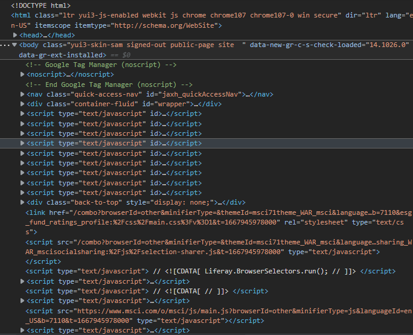

## What is ESG
ESG stands for environmental, social and governance. These are non-financial factors investors use to measure an investment or company's sustainability. Environmental factors look at the conservation of the natural world, social factors examine how a company treats people both inside and outside the company and governance factors consider how a company is run.
### ESG Investing
ESG investing is a form of sustainable investing that considers environmental, social and governance factors to judge an investment’s financial returns and its overall impact. An investment’s ESG score measures the sustainability of an investment in those specific categories.

Read more: [Environmental, Social and Governance (ESG) Investing and How to Get Started - NerdWallet](https://www.nerdwallet.com/article/investing/esg-investing#:~:text=ESG%20investing%20is%20a%20form,investment%20in%20those%20specific%20categories.)
## ESG Fund Ratings and Climate Search Tool
In this article, we leverage on [ESG Fund Ratings - MSCI](https://www.msci.com/our-solutions/esg-investing/esg-fund-ratings-climate-search-tool/).

Explore the Implied Temperature Rise and MSCI ESG Fund Ratings of more than 56,000 equity and fixed income funds.
### How does MSCI ESG Fund Ratings work
> MSCI ESG Fund Ratings are designed to provide greater transparency and understanding of ESG characteristics of fund and ETF components in investor portfolios. As the number of ESG funds proliferate, and ESG-oriented investment options and strategies are being adopted by wealth and fund managers, we strive to provide the tools and solutions to help investors better understand ESG risks.
## How to Scrape

### Modules
First we `import` the needed `modules`.
```python
import pandas as pd
from selenium import webdriver
from selenium.webdriver.edge.service import Service
from webdriver_manager.microsoft import EdgeChromiumDriverManager
from selenium.webdriver.common.by import By
from tqdm import tqdm
import requests, json
import time

driver = webdriver.Edge(service=Service(EdgeChromiumDriverManager().install()))
```
### Search Funds
We use `driver = webdriver.Edge(service=Service(EdgeChromiumDriverManager().install()))` here to deal with `DeprecationWarning: executable_path has been deprecated selenium python`[^deprecationwarning-executable-path-has-been-deprecated-selenium-python].

Then do iteration on whatever the ISIN list you provide and `requests.get()` the `html` using this secrete **API**.

`https://www.msci.com/our-solutions/esg-investing/esg-fund-ratings?p_p_id=esg_fund_ratings_profile&p_p_lifecycle=2&p_p_state=normal&p_p_mode=view&p_p_resource_id=searchFundRatingsProfiles&p_p_cacheability=cacheLevelPage&_esg_fund_ratings_profile_keywords={ISIN}`

Most important part comes with **using this API to *search the Fund* by ISIN**.
```python
url = requests.get(f'https://www.msci.com/our-solutions/esg-investing/esg-fund-ratings?p_p_id=esg_fund_ratings_profile&p_p_lifecycle=2&p_p_state=normal&p_p_mode=view&p_p_resource_id=searchFundRatingsProfiles&p_p_cacheability=cacheLevelPage&_esg_fund_ratings_profile_keywords={ISIN}')
params = url.text
# handle wrong ISIN
if params == '[]':
    continue
params = json.loads(params)[0] # changed from json.loads(params[1:-1]) for JSONDecodeError: Extra data: line 1 column 112 (char 111) when there are more than 1 record in api response
```
I use `params == '[]'` to handle empty response.[^realpython-com-urllib-request] [^post-requests-gives-me-an-empty-result] [^requests-python-module-in-qgis-return-nontype-or-empty-csv]

You might be thinking, why we need the `selenium` at the first place right? Here it comes, since the website has made it not easy to scrape with `js`, we need a `driver` to interact with the site to trigger the `js` and get the right Fund's `path` from the `params`(`requests.get().text`) we got above by another **API**.

`https://www.msci.com/our-solutions/esg-investing/esg-fund-ratings/funds/{params['encodedTitle']}/{params['url']}`
### Scraping
But, how do we actually interact with the Site? How to locate and insert a value (input text) in a text box to be exact?[^how-to-locate-and-insert-a-value-in-a-text-box-input-using-python-selenium] [^selenium-python-readthedocs-io]
We use the [above](#search-funds) method instead of `click()` element method[^click-element-method-selenium-python] in Selenium.
```python
driver.get(f"https://www.msci.com/our-solutions/esg-investing/esg-fund-ratings/funds/{params['encodedTitle']}/{params['url']}")

container = driver.find_elements(by=By.CLASS_NAME, value='ratingdata-container') # Instead of driver.find_element you should use driver.find_elements method to handle NoSuchElementException
while not container:
    time.sleep(1)
    container = driver.find_elements(by=By.CLASS_NAME, value='ratingdata-container')
container = container[0].find_elements(by=By.TAG_NAME, value='div')
rating = container[-1].get_attribute('class')
rating = rating.split('-')[-1]
```
Then write it back to your `list`. Esay, isn't it?

[^deprecationwarning-executable-path-has-been-deprecated-selenium-python]: [DeprecationWarning: executable_path has been deprecated selenium python - Stack Overflow](https://stackoverflow.com/questions/64717302/deprecationwarning-executable-path-has-been-deprecated-selenium-python)
[^how-to-locate-and-insert-a-value-in-a-text-box-input-using-python-selenium]: [How to locate and insert a value in a text box (input) using Python Selenium? - Stack Overflow](https://stackoverflow.com/questions/18557275/how-to-locate-and-insert-a-value-in-a-text-box-input-using-python-selenium)
[^selenium-python-readthedocs-io]: [Getting Started — Selenium Python Bindings 2 documentation (selenium-python.readthedocs.io)](https://selenium-python.readthedocs.io/getting-started.html)
[^click-element-method-selenium-python]: [click() element method - Selenium Python - GeeksforGeeks](https://www.geeksforgeeks.org/click-element-method-selenium-python/)
[^realpython-com-urllib-request]: [Python's urllib.request for HTTP Requests – Real Python](https://realpython.com/urllib-request/)
[^post-requests-gives-me-an-empty-result]: [python - POST requests gives me an empty result - Stack Overflow](https://stackoverflow.com/questions/71760400/post-requests-gives-me-an-empty-result)
[^requests-python-module-in-qgis-return-nontype-or-empty-csv]: [Requests Python module in QGIS return nontype or empty CSV - Geographic Information Systems Stack Exchange](https://gis.stackexchange.com/questions/430625/requests-python-module-in-qgis-return-nontype-or-empty-csv)