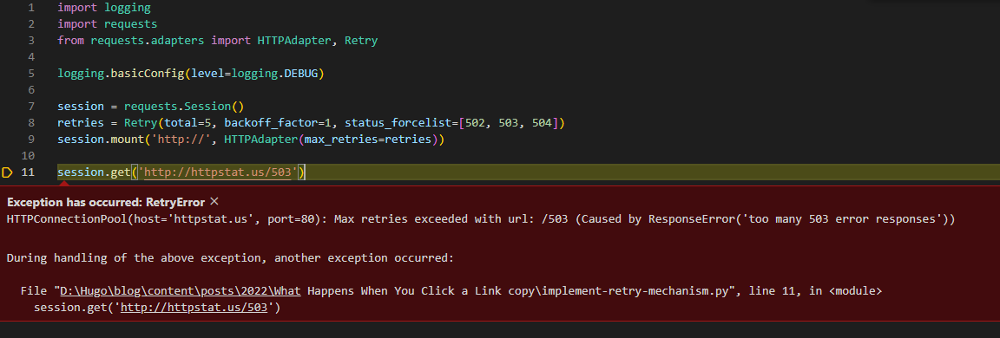

This is a follow-up to [What Happens When You Click a Link? URL/ HTTP/ Domain Name/ DNS/ IP Address - Hung, Chien-Hsiang | Blog (chienhsiang-hung.github.io)](https://chienhsiang-hung.github.io/blog/posts/2022/what-happens-when-you-click-a-link/).
## Requests Exceptions
```python
try:
  r = requests.get(url, params={'s': thing})
except: requests.ConnectionError, e:
  print(e)
```
This will  _not_  cover all of bases. It'll only catch connection-related errors, not ones that time out for instance.

Have a look at the Requests  [exception docs](https://requests.readthedocs.io/en/latest/user/quickstart/#errors-and-exceptions). In short:

> In the event of a network problem (e.g. DNS failure, refused connection, etc), Requests will raise a  **`ConnectionError`**  exception.
> 
> In the event of the rare invalid HTTP response, Requests will raise an  **`HTTPError`**  exception.
> 
> If a request times out, a  **`Timeout`**  exception is raised.
> 
> If a request exceeds the configured number of maximum redirections, a  **`TooManyRedirects`**  exception is raised.
> 
> All exceptions that Requests explicitly raises inherit from  **`requests.exceptions.RequestException`**.

What to do when you catch the exception is really up to the design of your script/program. Is it acceptable to exit? Can you go on and try again? If the error is catastrophic and you can't go on, then yes, you may abort your program by raising  [SystemExit](https://docs.python.org/3/library/exceptions.html#SystemExit)  (a nice way to both print an error and call  `sys.exit`).

You can either catch the base-class exception, which will handle all cases:
```python
try:
  r = requests.get(url, params={'s': thing})
except requests.exceptions.RequestException as e:
  raise SystemExit(e)
```
Or you can catch them separately and do different things:
```python
try:
  r = requests.get(url, params={'s': thing})
except requests.exceptions.Timeout:
  # Maybe set up for a retry, or continue in a retry loop
  # One posiible practice is to use Recursion
except requests.exceptions.TooManyRedirects:
  # Tell the user their URL was bad and try a different one
except requests.exceptions.RequestException as e:
  # catastrophic error. bail.
  raise SystemExit(e)
```
As [Christian](https://stackoverflow.com/users/456550/christian-long) pointed out:
> If you want http errors (e.g. 401 Unauthorized) to raise exceptions, you can call  [`Response.raise_for_status`](https://requests.readthedocs.io/en/latest/api/#requests.Response.raise_for_status). That will raise an  `HTTPError`, if the response was an http error.

An example:
```python
try:
  r = requests.get('http://www.google.com/nothere')
  r.raise_for_status()
except requests.exceptions.HTTPError as err:
  raise SystemExit(err)
```
Will print:
> 404 Client Error: Not Found for url: http://www.google.com/nothere

*More on [exception - Correct way to try/except using Python requests module? - Stack Overflow](https://stackoverflow.com/questions/16511337/correct-way-to-try-except-using-python-requests-module) by 
[Jonathon Reinhart](https://stackoverflow.com/users/119527/jonathon-reinhart)*
## Retry in Requests
I would like to add a retry mechanism to python request library, so scripts that are using it will retry for non fatal errors.

At this moment I do consider three kind of errors to be recoverable:

-   HTTP return codes 502, 503, 504
-   host not found (less important now)
-   request timeout

At the first stage I do want to retry specified 5xx requests every minute.

I want to be able to add this functionality transparently, without having to manually implement recovery for each HTTP call made from inside these scripts or libraries that are using python-requests.
### Implementation
This snippet of code will make all HTTP requests from the same session retry for a total of 5 times, sleeping between retries with an increasing backoff of 0s, 2s, 4s, 8s, 16s (the first retry is done immediately). It will retry on basic connectivity issues (including DNS lookup failures), and HTTP status codes of 502, 503 and 504.

<script src="https://gist.github.com/chienhsiang-hung/2b246264255b7c2d2b86302a3bb7ac31.js"></script>

> DEBUG:urllib3.connectionpool:Starting new HTTP connection (1): httpstat.us:80
DEBUG:urllib3.connectionpool:http://httpstat.us:80 "GET /503 HTTP/1.1" 503 23
DEBUG:urllib3.util.retry:Incremented Retry for (url='/503'): Retry(total=4, connect=None, read=None, redirect=None, status=None)
DEBUG:urllib3.connectionpool:Retry: /503
DEBUG:urllib3.connectionpool:http://httpstat.us:80 "GET /503 HTTP/1.1" 503 23
DEBUG:urllib3.util.retry:Incremented Retry for (url='/503'): Retry(total=3, connect=None, read=None, redirect=None, status=None)
DEBUG:urllib3.connectionpool:Retry: /503
DEBUG:urllib3.connectionpool:http://httpstat.us:80 "GET /503 HTTP/1.1" 503 23
DEBUG:urllib3.util.retry:Incremented Retry for (url='/503'): Retry(total=2, connect=None, read=None, redirect=None, status=None)
DEBUG:urllib3.connectionpool:Retry: /503
DEBUG:urllib3.connectionpool:http://httpstat.us:80 "GET /503 HTTP/1.1" 503 23
DEBUG:urllib3.util.retry:Incremented Retry for (url='/503'): Retry(total=1, connect=None, read=None, redirect=None, status=None)
DEBUG:urllib3.connectionpool:Retry: /503
DEBUG:urllib3.connectionpool:http://httpstat.us:80 "GET /503 HTTP/1.1" 503 23
DEBUG:urllib3.util.retry:Incremented Retry for (url='/503'): Retry(total=0, connect=None, read=None, redirect=None, status=None)
DEBUG:urllib3.connectionpool:Retry: /503
DEBUG:urllib3.connectionpool:http://httpstat.us:80 "GET /503 HTTP/1.1" 503 23

Requests Retry - `backoff factor` in
> retries = Retry(total=5, backoff_factor=1, status_forcelist=[502, 503, 504])

`backoff factor` of 1 for the retry delay (the formula for the delay is $backofffactor\cdot2^{retrynumber-1}$, except that the first retry is always immediate)

See [Retry class](https://urllib3.readthedocs.io/en/latest/reference/urllib3.util.html#urllib3.util.Retry) and [Handling Retries in Python Requests](https://majornetwork.net/2022/04/handling-retries-in-python-requests/) for details.

*Related: [http - How to implement retry mechanism into python requests library? - Stack Overflow](https://stackoverflow.com/questions/23267409/how-to-implement-retry-mechanism-into-python-requests-library) by [datashaman](https://stackoverflow.com/users/401467/datashaman)*