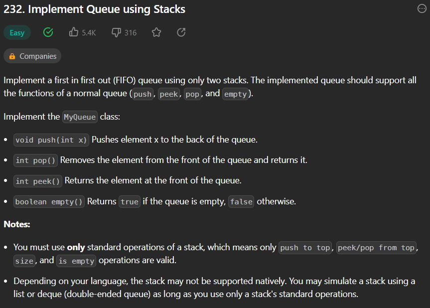

## What's Amortized Analysis
The motivation for amortized analysis is that looking at the worst-case run time can be too pessimistic. Instead, amortized analysis **averages the running times of operations in a sequence over that sequence**.[^Amortized_analysis]

## Example
### Implement Queue
#### Linked List
```python
class QNode:
    def __init__(self, v=0, _next=None):
        self.value = v
        self.next = _next


class MyQueue:
    def __init__(self):
        self.root = None
        self.tail = None

    def push(self, x: int) -> None:
        if not self.root:
            self.root = QNode(x)
            self.tail = self.root
        else:
            self.tail.next = QNode(x)
            self.tail = self.tail.next
        
    def pop(self) -> int:
        output = self.root.value
        self.root = self.root.next
        return output

    def peek(self) -> int:
        return self.root.value

    def empty(self) -> bool:
        return not self.root
```
Each operation takes exact O(1) time complexity to execute.

What if we are not allowed to use linked list but **2 stacks** instead. It would be impossible to achieve right? Though with Amortized Analysis, **amortized O(1)** is acceptable. We can still try to make some tricks.

#### Two Stacks - Amortized Analysis

Can you implement the queue such that each operation is **[amortized](#whats-amortized-analysis)**  `O(1)` time complexity? In other words, performing `n` operations will take overall `O(n)` time even if one of those operations may take longer.[^implement-queue-using-stacks]
```python
class MyQueue:

    def __init__(self):
        self.in_stack = []
        self.out_stack = []

    def push(self, x: int) -> None:
        self.in_stack.append(x)

    def pop(self) -> int:
        if not self.out_stack:
            while self.in_stack:
                self.out_stack.append(self.in_stack.pop())
        return self.out_stack.pop()
        
    def peek(self) -> int:
        if not self.out_stack:
            return self.in_stack[0]
        else:
            return self.out_stack[-1]
        
    def empty(self) -> bool:
        return not self.in_stack and not self.out_stack
```
We can see in this solution, for `push()`, `peak()`, `empty()`, they still take exact **O(1)** time but `pop()`.

> While in [Amortized Analysis](#whats-amortized-analysis), we **averages the running times of operations in a sequence over that sequence**.

If the output array already has some elements in it, then dequeue runs in constant time; otherwise, **dequeue takes $O(n)$** time to add all the elements onto the output array from the input array, where n is the current length of the input array. After copying n elements from input, we can perform n dequeue operations, each taking constant time, before the output array is empty again. Thus, **we can perform a sequence of n dequeue operations in only $O(n)$ time, which implies that the amortized time of each dequeue operation is $O(1)$**.[^Amortized_analysis]


[^Amortized_analysis]: [Amortized analysis - Wikipedia](https://en.wikipedia.org/wiki/Amortized_analysis)
[^implement-queue-using-stacks]: [Implement Queue using Stacks - LeetCode](https://leetcode.com/problems/implement-queue-using-stacks/)
