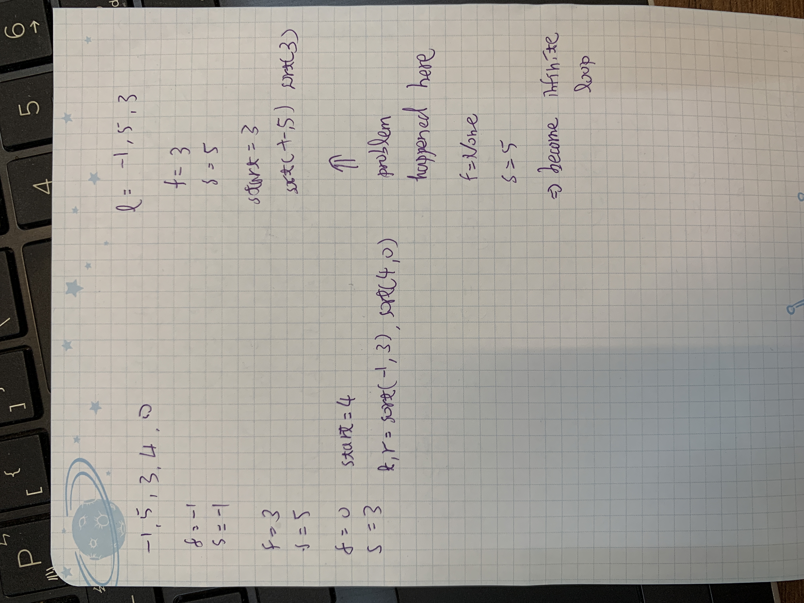

## Question
Given the  `head`  of a linked list, return  _the list after sorting it in  **ascending order**_.

**Example 1:**


> **Input:** head = [4,2,1,3]

> **Output:** [1,2,3,4]

**Example 2:**


> **Input:** head = [-1,5,3,4,0]
> 
> **Output:** [-1,0,3,4,5]

**Example 3:**

> **Input:** head = []
>
> **Output:** []

**Constraints:**

-   The number of nodes in the list is in the range  `[0, 5 * 104]`.
-   `-105 <= Node.val <= 105`

**Follow up:**  Can you sort the linked list in  `O(n logn)`  time and  `O(1)`  memory (i.e. constant space)?

## Solution
### Approach

### Complexity
-   Time complexity:O(nLogn)
### Code
```python
# Definition for singly-linked list.
# class ListNode:
#     def __init__(self, val=0, next=None):
#         self.val = val
#         self.next = next


### Simulation Process ###
# [4-> 2-> 1-> 3]

# 4, 4-> 1, 2-> None, 1
# l, r = sort(4->1), sort(3)

# sort(3)
# [3]

# sort(4->1)
# [4-> 2-> 1]

# 4, 4-> 1, 2
# l, r = sort(1->2), sort(None)
###########################
class Solution:
    def sortList(self, head: Optional[ListNode]) -> Optional[ListNode]:
        if not head or not head.next:
            return head
        
        # use two pointer to find the mid point for Merge Sort
        fast = slow = head
        while fast.next.next:
            fast = fast.next.next
            slow = slow.next
            if not fast.next:
                break
        start = slow.next
        slow.next = None
        l, r = self.sortList(head), self.sortList(start)

        return self.merge(l, r)
    
    def merge(self, l, r):
        if not l or not r:
            return l or r
        head = tmp = ListNode(0)
        while l and r:
            if l.val <= r.val:
                tmp.next = l
                l = l.next
            else:
                tmp.next = r
                r = r.next
            tmp = tmp.next
        if l:
            tmp.next = l
        if r:
            tmp.next = r
        return head.next
```