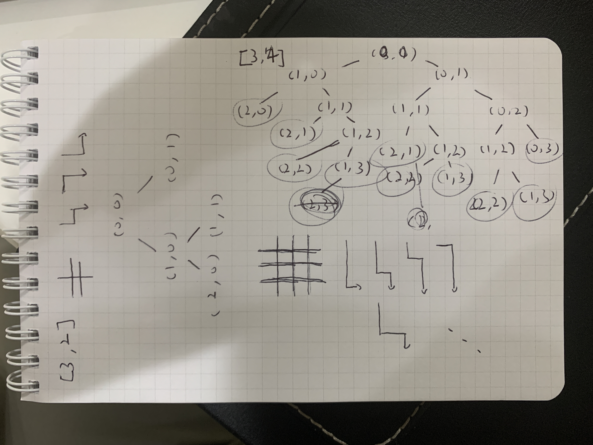

This is the follow-up for 
[the last tutorial](https://chienhsiang-hung.github.io/blog/posts/2022/leetcode-746.-min-cost-climbing-stairs-dynamic-programming-python-time-on-space-o1/). I will show you **how to cope with Dynamic Programming problems**.

## Advantages
Addresses problems with exponantial time complexity to Polynomial (sometimes even linear)

$O(c^n)$ -> $O(n^c)$ -> $O(n)$
### When to Use
When we don't want to recalculate things. We want to rely on existing solutions.

## Requirments
### Properties
1. Optimal Substructure

Use $X_1$ to solve $X_2$ to solve $X_3$ etc. to solve the entire problem.

2. Overlapping Subprolems

**Fibonacci**

$Fib(5) = Fib(4) + Fib(3)$

$Fib(4) = Fib(3) + Fib(2)$

...

Overlapping part: $Fib(3)$, $Fib(2)$, $Fib(1)$ *(Memoized/Cached Results)*

## Types of Problems
1. Combinatoric -> Ans: **How many...?**
2. Optimization -> Ans: **Minimum/Maximum** of steps/ways/paths...

$$1+2+3+4+5+...+R=\sum_{i=1}^n i$$

$n=1$, $F(1)=1$

$n=2$, $F(2)=F(1)+2=3$

$n=3$, $F(3)=F(2)+3=6$

...

$F(n)=F(n-1)+n$
### Go Implementation
```go
func nSum(n int) int {
	dp := make([]int, n+1)
	dp[0] = 0 // in case n==0
	for i:=1; i<=n; i++ {
		dp[i] = dp[i-1] + i
	}
	return dp[n]
}
```

## Framework for Solving DP Problems
1. Express our goal as an objective functions

> Example: **Climbing Stairs Problem**

$F(i)$ is the number of distinct ways to reach the i-th stair 
2. Identify **Base cases** (to solve bondary problems)

> $F(2)=2$ 
>
> $F(1)=1$  
>
> $F(0)=1$  
>
> $$F(n)=F(n-1)+F(n-2)$$

3. Recurrence relation
4. Order of computation
5. Location of the answer

> $F(n)$



## LeetCode Example
### Unique Paths 
[*Medium*]

There is a robot on an  `m x n`  grid. The robot is initially located at the  **top-left corner**  (i.e.,  `grid[0][0]`). The robot tries to move to the  **bottom-right corner**  (i.e.,  `grid[m - 1][n - 1]`). The robot can only move either down or right at any point in time.

Given the two integers  `m`  and  `n`, return  _the number of possible unique paths that the robot can take to reach the bottom-right corner_.

The test cases are generated so that the answer will be less than or equal to  `2 * 109`.

**Example 1:**


>**Input:** m = 3, n = 7
>
>**Output:** 28

**Example 2:**

> **Input:** m = 3, n = 2
>
> **Output:** 3

**Explanation:** From the top-left corner, there are a total of 3 ways to reach the bottom-right corner:
1. Right -> Down -> Down
2. Down -> Down -> Right
3. Down -> Right -> Down

**Constraints:**

-   `1 <= m, n <= 100`

#### Code
##### First Approach
```python
# f(m, n) is the distinct number of paths
# base cases:
#   f(1,1)=1
#   f(1,2)=f(2,1)=1
#   f(2,2)=f(2,1)+f(1,2)=2
#   f(2,3)=f(2,2)+f(1,3)=2+1=3

#   f(2,4)=f(1,4)+f(2,3)=1+3=4
#   f(3,3)=f(3,2)+f(2,3)=6
#   f(3,4)=f(2,4)+f(3,3)=4+6=10

#   f(m,n)=f(m-1,n)+f(m,n-1)

class Solution:
    def uniquePaths(self, m: int, n: int) -> int:
        if m==1 or n==1:
            return 1
        
        return self.uniquePaths(m-1, n) + self.uniquePaths(m, n-1)
# Time Limit Exceeded
# m = 23, n = 12
```
##### Second Approach (Optimized)
```python
# f(m, n) is the distinct number of paths
# base cases:
#   f(1,1)=1
#   f(1,2)=f(2,1)=1
#   f(2,2)=f(2,1)+f(1,2)=2
#   f(2,3)=f(2,2)+f(1,3)=2+1=3

#   f(2,4)=f(1,4)+f(2,3)=1+3=4
#   f(3,3)=f(3,2)+f(2,3)=6
#   f(3,4)=f(2,4)+f(3,3)=4+6=10

#   f(m,n)=f(m-1,n)+f(m,n-1)

class Solution:
    def uniquePaths(self, m: int, n: int) -> int:
        dp = []
        for i in range(m):
            dp.append([])
            for j in range(n):
                if i==0:
                    dp[i].append(1)
                elif j==0:
                    dp[i].append(1)
                
                else:
                    dp[i].append(dp[i][j-1]+dp[i-1][j])
        return dp[m-1][n-1]
```