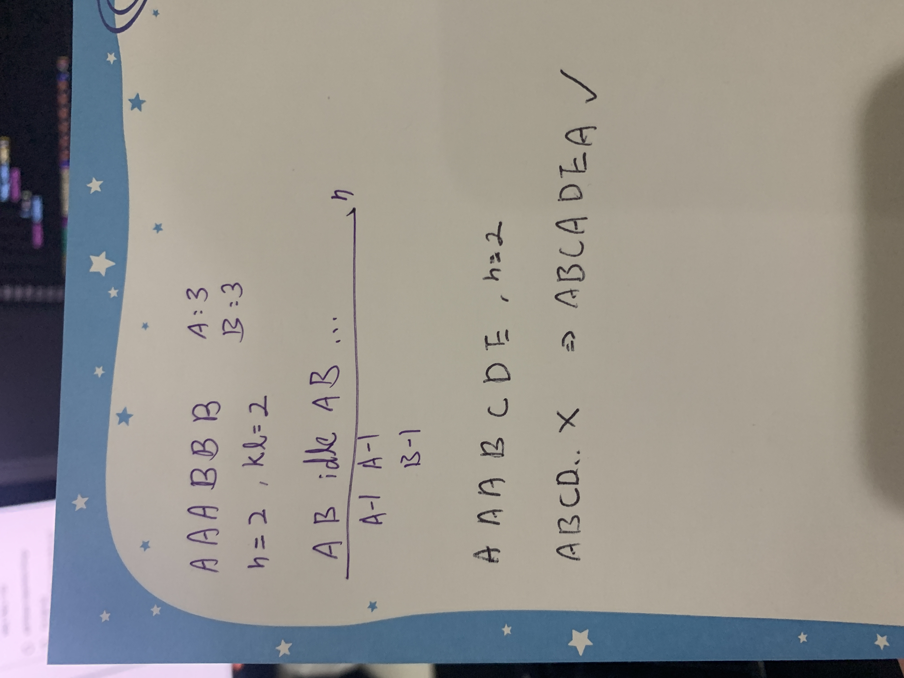

[Task Scheduler - LeetCode](https://leetcode.com/problems/task-scheduler/description/?envType=study-plan&id=level-2)
## Intuition

My first instinct was **Greedy** but fell in local optimum quite easy.
```python
from collections import defaultdict

class Solution:
    def leastInterval(self, tasks, n: int) -> int:
        if n == 0:
            return len(tasks)

        cd_chrs = defaultdict(int)
        
        output = 0
        i = 0
        while tasks:
            # when reach the end
            if i == len(tasks):
                i = 0
                output += 1 # add 'idle'
                for k in cd_chrs.keys():
                    cd_chrs[k] -= 1
                continue

            if cd_chrs[ tasks[i] ] == 0:
                cd_chrs[ tasks[i] ] = n +1
                tasks.pop(i)
                output += 1
                for k in cd_chrs.keys():
                    cd_chrs[k] -= 1
            else:
                i += 1
            
        return output
# Time Limit Exceeded
```
At first I thought it was because I didn't optimize the time complexity so...
```python
from collections import defaultdict

class Solution:
    def leastInterval(self, tasks, n: int) -> int:
        if n == 0:
            return len(tasks)

        cd_chrs = defaultdict(int)
        n_chrs = defaultdict(int)
        for _chr in tasks:
            n_chrs[_chr] += 1
        
        output = 0
        zero_size = 0
        while zero_size != len(n_chrs):
            matched = False
            for k in n_chrs.keys():
                if cd_chrs[k] == 0 and n_chrs[k]>0:
                    cd_chrs[k] = n+1
                    n_chrs[k] -= 1
                    if n_chrs[k] == 0:
                        zero_size += 1
                    # if n_chrs[k] == 0:
                    #     del n_chrs[k]
                    # Exception has occurred: RuntimeError
                    # dictionary changed size during iteration
                    output += 1
                    for kk, _ in cd_chrs.items():
                        if cd_chrs[kk] > 0:
                            cd_chrs[kk] -= 1
                        # otherwise                            
                        # defaultdict(<class 'int'>, {'A': -5165, 'B': -5165})
                        # defaultdict(<class 'int'>, {'A': -5165, 'B': -5165})
                    matched = True
            if not matched:
                output += 1 # add 'idle'
                for kk, _ in cd_chrs.items():
                    if cd_chrs[kk] > 0:
                        cd_chrs[kk] -= 1
            
        return output
```
## Approach
Then I tried to attempt it by illustrate the process but still stucked in the case like this `["A","A","A","B","B","B", "C","C","C", "D", "D", "E"]`.
```python
# {
#     'A': 3,
#     'B': 3,
#     'C': 3,
#     'D': 2,
#     'E': 1
# }
# n = 3

# [
#     ['A', 'B', 'C', 'D'],
#     ['A', 'B', 'C', 'D'],
#     ['A', 'B', 'C', 'E'],
# ]    
########################################
# {
#     'A': 3,
#     'B': 3,
#     'C': 3,
#     'D': 2,
#     'E': 2
# }
# n = 3

# [
#     ['A', 'B', 'C', 'D'],
#     ['A', 'B', 'C', 'D'],
#     ['A', 'B', 'C', 'E'],
#     ['E'],
# ]   
########################################
# {
#     'A': 3,
#     'B': 3,
#     'C': 3,
#     'D': 2,
#     'E': 1
# }
# n = 2

# [
#     ['A', 'B', 'C']
#     ['A', 'B', 'D']
#     ['A', 'B', 'C']
#     ['D', 'E', 'C']
# ]


from collections import defaultdict, deque
import heapq

class Solution:
    def leastInterval(self, tasks, n: int) -> int:
        if n == 0:
            return len(tasks)
        
        n_tsk = defaultdict(int)
        for tsk in tasks:
            n_tsk[tsk] -= 1
        heap_queu = [v for v in n_tsk.values()]
        # [-1, -3, -2]
        
        heapq.heapify(heap_queu)
        # [-3, -2, -1]

        output = 0
        while heap_queu:
            i = 0
            for _ in range(n+1):
                if not heap_queu:
                    return output

                if i == len(heap_queu):
                    output += 1
                    continue
                
                output += 1
                heap_queu[i] += 1
                if heap_queu[i] == 0:
                    heap_queu.pop(i)
                    continue
                i += 1
        return output
```
## Solution
### Simply Calculation
> The key is to find out how many idles do we need.

Then I adopted [g27as](https://leetcode.com/g27as/)'s [solution](https://leetcode.com/problems/task-scheduler/solutions/104500/java-o-n-time-o-1-space-1-pass-no-sorting-solution-with-detailed-explanation/?envType=study-plan&id=level-2&orderBy=most_votes), and convert it from **Java** to **Python**.
```python
# to find how many idle we need

# n=2
# max=3
# maxct=2

# A _ _ A _ _ A
# A B _ A B _ A B
# A B idle A B idle AB

# ["A","A","A","B","B","B", "C","C","C", "D", "D", "E"]
# n=2
# max=3
# maxct=3
# A _ _ A _ _ A
# A B _ A B _ A B   now we have only 2 
# A B C A B D A B c D E

# output = max(
#     (max-1) * (n+1) + 1*maxct + (others_n - slots),
#     len(tasks)
# )
# where
#     others_n = D D E = 3
#     slots = _ _ = 2

from collections import defaultdict
class Solution:
    def leastInterval(self, tasks: List[str], n: int) -> int:
        tasks_dict = defaultdict(int)
        for t in tasks:
            tasks_dict[t] += 1
   
        # find max
        _max = 0
        for v in tasks_dict.values():
            if v > _max:
                _max = v
        # find frequence of max
        _maxct = 0
        others_n = 0
        for v in tasks_dict.values():
            if v == _max:
                _maxct += 1
            else:
                others_n += 1
        
        return max(
            (_max-1) * (n+1) + _maxct + max(others_n - max((n+1 -_maxct)*_max, 0), 0),
            len(tasks)
        )
        # Will (others_n - max((n+1 -_maxct)*_max, 0)) be negative?
        #   When slots_n > others_n
```
There you go. **Time O(n) Space O(1)**