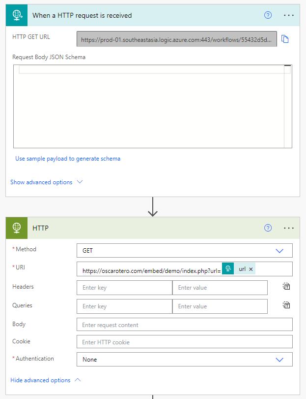
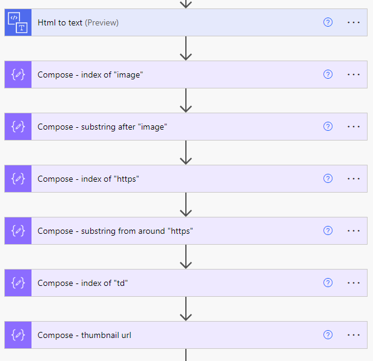
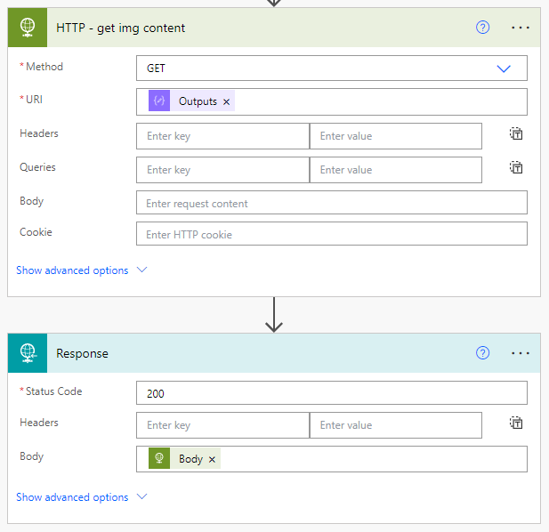

## Background
I'm developing a News Board in Powerapps. I utilize `RSS` Connector to retrieve Google News for the following effect.


### Temp Solution
At first I used a trick to create the thumbnails by searching on **Unsplash**'s Api for **news title related img** then put it into `HtmlText` Control.
```vb
""
```
The risk is *Unsplash terminated the api* and it did have happened. Don't worry. That's why we have this post today. In this post I will guide you step by step to create your own api via **Power Automate** to achieve it in a real way.

## Tutorial
First we need a `When a HTTP request is received` Trigger as a portal of the API in Power Automate and that's where we pass our parameter (here means news `primaryLink`) from PowerApps to Power Automate.

### Power Automate When a Http Request Is Received Query
Unable to get array of values sent as parameter in URL

[JohnAageAnderse](https://powerusers.microsoft.com/t5/user/viewprofilepage/user-id/15774):
> The URL query parameters that you provide to the Flow will end up in the "queries" property.
>
> Use the expression "triggerOutputs()?['queries']" to see your parameters.
>
> Your parameters "name[1]" and "name[2]" will end up as "triggerOutputs()?['queries']?['name[1]']" and "triggerOutputs()?['queries']?['name[1]']" respectively.

So in this example instead of using `triggerOutputs()?['header']`, `triggerBody()`, `triggerBody()?['url']`, `triggerOutputs()?['url']`, we need a `triggerOutputs()?['query']['url']` instead.

### Embed - Get Thumbnail of Url
Then we will take an advantage of (Kuto) [oscarotero](https://github.com/oscarotero)/**[Embed](https://github.com/oscarotero/Embed)** to Get Thumbnail of Url.
> https://oscarotero.com/embed/demo/index.php

We pass the News link to [Embed](https://github.com/oscarotero/Embed) then scrape the HTML in Power Automate to get the link of Thumbnail/Featured-image/Preview-image...


### Unable to Display
With the above setting after putting a `Response` at the last step in the flow and with
```vb
""
```
the pic is not showing anyway. That's because we nee to return the img content type not the img url. So we need a final step in the flow to be a second HTTP request the img url then trnasfer the img content direct to `Response`.

