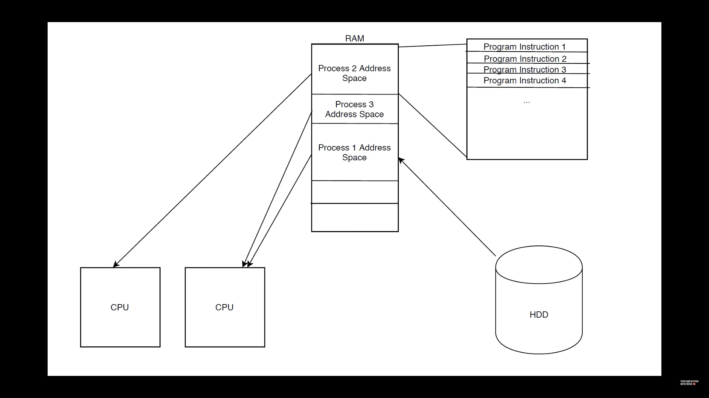
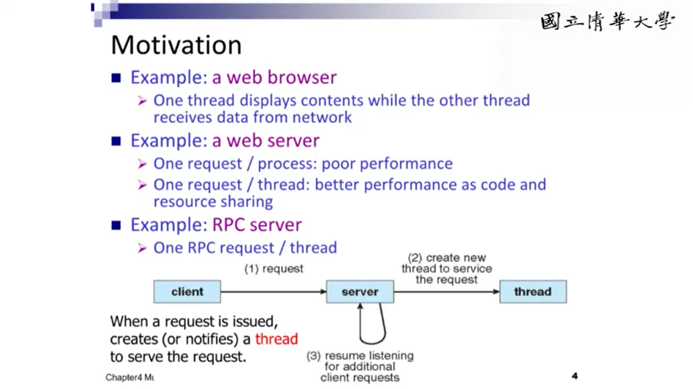

## What's OS (Operating System)
Assume that we have a program written in Java, Python, C, etc. sort of high-level language, that a PC wouldn't be able to execute. We need a compiler to translate those languages to 0, 1 binary codes for a PC to run.

When those programmes are being executed, they will consume some resources from the computer. How do we **allocate the resources**? Who will do this for the programs?

This is when an **Operating System (OS)** comes in. 
> The OS will help in loading that executable program and allocate the memory and the resources later to be used.
## Process vs Program
A process [is a running program](https://byjus.com/gate/process-in-operating-system-notes/#:~:text=A%20process%20is%20a%20running,is%20an%20'active'%20entity.) that serves as the foundation for all computation. The procedure is not the same as computer code, although it is very similar. 

> In contrast to the program, which is often regarded as some ‘passive’ entity, a process is an ‘active’ entity.

Hardware status, RAM, CPU, and other attributes are among the attributes held by the process.
### How a Process Work

When you start a programme, it's first loaded and given an address space in the main memory from your hard disk. After it's loaded in memory, it's then scheduled onto the available CPU. And the programme instruction then would be executed sequentially.
## Process vs Thread

<table><thead><tr><th>S.NO</th><th>Process</th><th>Thread</th></tr></thead><tbody><tr><th>1.</th><td>Process means any program is in execution.</td><td>Thread means a segment of a process.</td></tr><tr><th>2.</th><td>The process takes more time to terminate.</td><td>The thread takes <b>less time to terminate</b>.</td></tr><tr><th>3.</th><td>It takes more time for creation.</td><td>It takes <b>less time for creation</b>.</td></tr><tr><th>4.</th><td>It also takes more time for context switching.</td><td>It takes less time for context switching.</td></tr><tr><th>5.</th><td>The process is less efficient in terms of communication.</td><td>Thread is <b>more efficient in terms of communication</b>.</td></tr><tr><th>6.&nbsp;</th><td>Multiprogramming holds the concepts of multi-process.</td><td>We don&#8217;t need multi programs in action for multiple threads because <b>a single process consists of multiple threads</b>.</td></tr><tr><th>7.</th><td>The process is isolated.</td><td><b>Threads share memory.</b></td></tr><tr><th>8.</th><td>The process is called the heavyweight process.</td><td>A Thread is lightweight as each thread in a process shares code, data, and resources.</td></tr><tr><th>9.</th><td>Process switching uses an interface in an operating system.</td><td>Thread switching does not require calling an operating system and causes an interrupt to the kernel.</td></tr><tr><th>10.</th><td>If one process is blocked then it will not affect the execution of other processes&nbsp;</td><td>If a user-level thread is blocked, then all other user-level threads are blocked.&nbsp;</td></tr><tr><th>11.</th><td>The process has its own Process Control Block, Stack, and Address Space.</td><td>Thread has Parents&#8217; PCB, its own Thread Control Block, and Stack and common Address space.</td></tr><tr><th>12.</th><td>Changes to the parent process do not affect child processes.</td><td>Since all threads of the same process share address space and other resources so any changes to the main thread may affect the behavior of the other threads of the process.</td></tr><tr><th>13.</th><td><b>A system call is involved in it.</b></td><td><b>No system call is involved, it is created using APIs.</b></td></tr><tr><th>14.</th><td>The process does not share data with each other.</td><td>Threads share data with each other.</td></tr></tbody></table>

*Resource: [Difference between Process and Thread - GeeksforGeeks](https://www.geeksforgeeks.org/difference-between-process-and-thread/)*
### Process
Processes are basically the **programs that are dispatched from the ready state** and are **scheduled in the CPU for execution**. PCB([Process Control Block](https://www.geeksforgeeks.org/process-table-and-process-control-block-pcb/)) holds the concept of process. A process can create other processes which are known as Child Processes. The process **takes more time to terminate and it is isolated** means it does not share the memory with any other process.

The process can have the following  [states](https://www.geeksforgeeks.org/states-of-a-process-in-operating-systems/)  new, ready, running, waiting, terminated, and suspended.

### Thread
Thread is the **segment of a process** which means a process can have multiple threads and these multiple threads are contained within a process. A thread has three states: Running, Ready, and Blocked.

The thread **takes less time to terminate** as compared to the process but unlike the process, **threads do not isolate**.
## Multithreading
### Why is The Threads Useful
- **Multiprocessing**
- Requires no synchronization
- Operating System prevents processes from writing to another processes address space
- Address spaces large
- **Porcesses can take up much more memory than threads** (cost is always less or equal to process)
- **Resource sharing**

### Related
- [What is Multithreading? - YouTube](https://www.youtube.com/watch?v=0KAGazeMZ2o)
- [(17) 周志遠作業系統 Ch4: Multithreaded Programming (A): Thread Introduction - YouTube](https://www.youtube.com/watch?v=BrfGZHZdRTw)