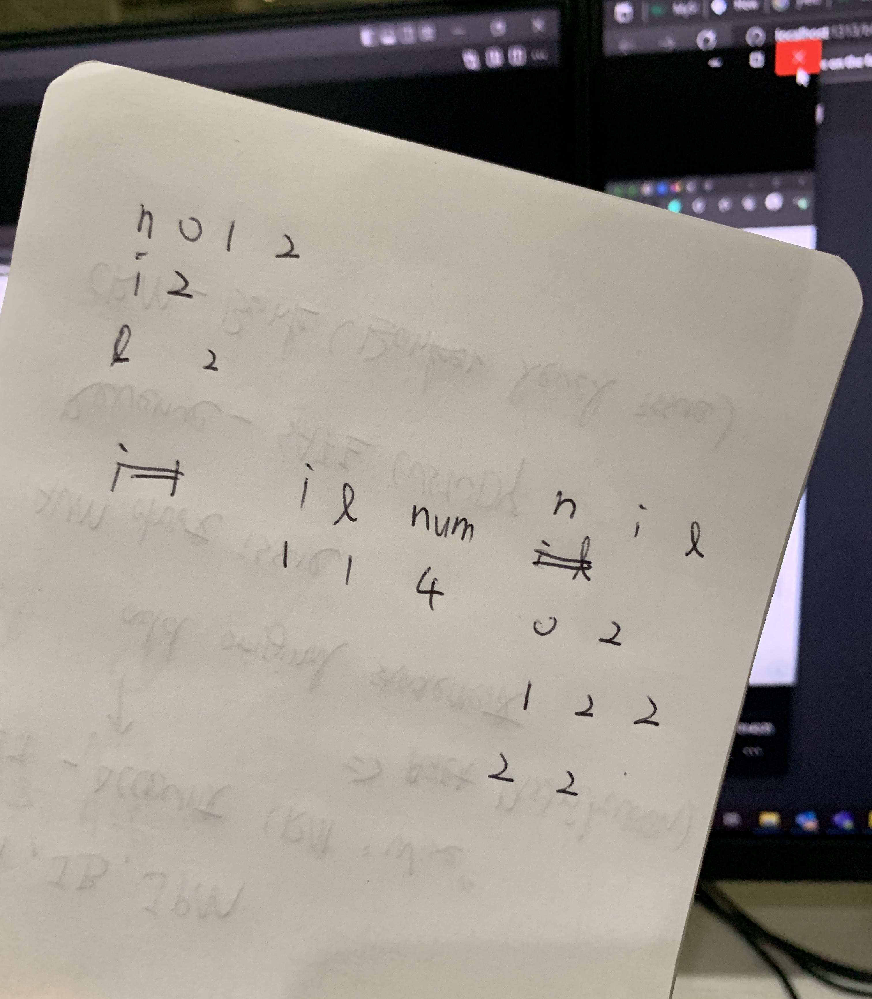

## Generator Performance
Generators are a great way to [optimize memory](https://realpython.com/introduction-to-python-generators/). An infinite sequence generator is an extreme example of this optimization.
### Yield
The yield statement **suspends a function’s execution** and sends a value back to the caller, but retains enough state to enable the function **to resume where it left off**.
> When the function resumes, it continues execution immediately after the last yield run.

This allows its code to [produce a series of values over time, rather than computing them at once and sending them back like a list](https://www.geeksforgeeks.org/use-yield-keyword-instead-return-keyword-python/) in which we **optimized memory usage**.

## One Line Generator
Iterate through a list and brace them in a `()`.
`(x for x in [1,2,3,4])`
```python
print('one line generator')
olg = (x for x in [1,2,3,4])
print(f'type(olg) = {type(olg)}')
print(f'olg = {olg}')

for x in olg:
    print(x)
```
**Output:**
> one line generator
> 
> type(olg) = <class 'generator'>
> 
> olg = <generator object <genexpr> at 0x0000029BBC2C4B30>
> 
> 1
> 
> 2
> 
> 3
> 
> 4

**Same as**
```python
olg = (x for x in [1,2,3,4])
print(next(olg))
print(next(olg))
print(next(olg))
print(next(olg))
```
**Output:**
> 1
> 
> 2
> 
> 3
> 
> 4

## Function
```python
# A Simple Python program to demonstrate working
# of yield

# A generator function that yields 1 for the first time,
# 2 second time and 3 third time


def simpleGeneratorFun():
	yield 1
	yield 2
	yield 3


# Driver code to check above generator function
for value in simpleGeneratorFun():
	print(value)
```
**Output:**
> 1
>
> 2
>
> 3
```python
def my_generator(n=0):
    while True:
        yield n
        n+1

for i, n in enumerate(my_generator(5)):
    print(n)
    if i == 10:
        break
```
> 5
>
> 5
>
> 5
>
> 5
>
> 5
>
> 5
>
> 5
>
> 5
>
> 5
>
> 5
## Appendix
### Generator of Generators
```python
def metagen():
    def innergen():
        yield 1
        yield 2
        yield 3

    for i in range(3):
        r = innergen()
        yield r

        for _ in r: pass
```
[https://stackoverflow.com/questions/19033401/python-generator-of-generators](https://stackoverflow.com/questions/19033401/python-generator-of-generators)
### Length of Generator
The easiest way is probably just `sum(1 for _ in gen)` where gen is your generator.
[https://stackoverflow.com/questions/393053/length-of-generator-output](https://stackoverflow.com/questions/393053/length-of-generator-output)
### Stepping Cycle Generator
[Data-Structures-and-Algorithms-in-Python/Stepping Cycle Generator.py at main · chienhsiang-hung/Data-Structures-and-Algorithms-in-Python (github.com)](https://github.com/chienhsiang-hung/Data-Structures-and-Algorithms-in-Python/blob/main/Arrays%20and%20Strings/Stepping%20Cycle%20Generator.py)
