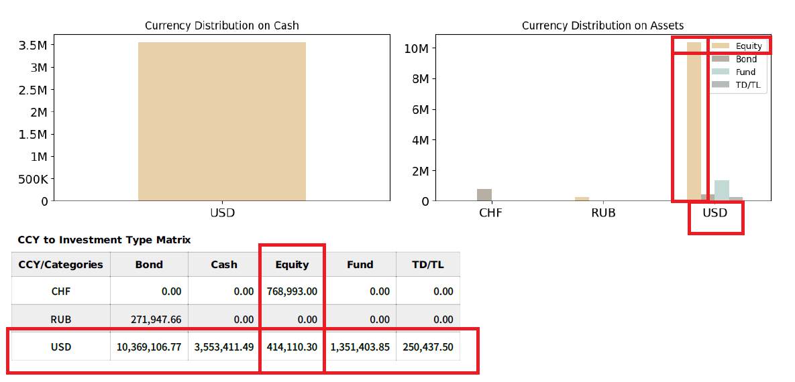
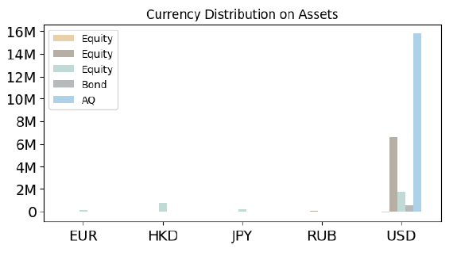
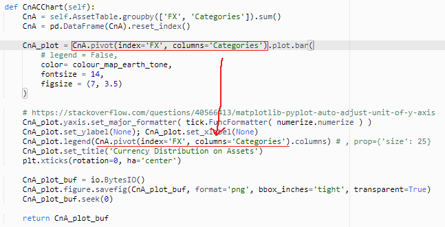
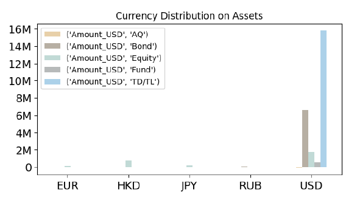
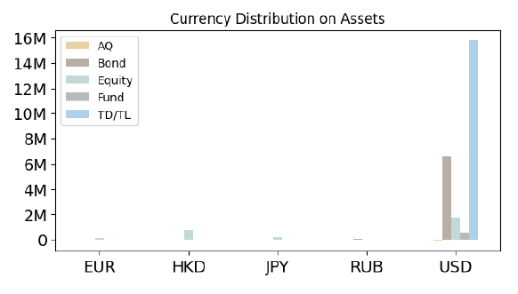

## Getting labels for legend after graphing pivot of dataframe in pandas
```python
    def CnACChart(self):
        CnA = self.AssetTable.groupby(['FX', 'Categories']).sum()
        CnA = pd.DataFrame(CnA).reset_index()

        CnA_plot = CnA.pivot(index='FX', columns='Categories').plot.bar(
            # legend = False,
            color= colour_map_earth_tone,
            fontsize = 14,
            figsize = (7, 3.5)
        )

        # https://stackoverflow.com/questions/40566413/matplotlib-pyplot-auto-adjust-unit-of-y-axis
        CnA_plot.yaxis.set_major_formatter( tick.FuncFormatter( numerize.numerize ) )
        CnA_plot.set_ylabel(None); CnA_plot.set_xlabel(None)
        CnA_plot.legend(CnA.Categories.unique()) # , prop={'size': 25}
        CnA_plot.set_title('Currency Distribution on Assets')
        plt.xticks(rotation=0, ha='center')

        CnA_plot_buf = io.BytesIO()
        CnA_plot.figure.savefig(CnA_plot_buf, format='png', bbox_inches='tight', transparent=True)
        CnA_plot_buf.seek(0)

        return CnA_plot_buf
```
The above `CnA_plot.legend(CnA.Categories.unique()) # , prop={'size': 25}`'s **CnA.Categories.unique()** caused the problem listed belowed.

And if you take the `.unique()` out. It will become like the pic below.

Duplicated **Equity**s will showed. It's clearly wrong. Let's try `CnA_plot.legend(CnA_plot.columns)` then.
## Pivot.Column
```python
    def CnACChart(self):
        CnA = self.AssetTable.groupby(['FX', 'Categories']).sum()
        CnA = pd.DataFrame(CnA).reset_index()

        CnA_plot = CnA.pivot(index='FX', columns='Categories').plot.bar(
            # legend = False,
            color= colour_map_earth_tone,
            fontsize = 14,
            figsize = (7, 3.5)
        )

        # https://stackoverflow.com/questions/40566413/matplotlib-pyplot-auto-adjust-unit-of-y-axis
        CnA_plot.yaxis.set_major_formatter( tick.FuncFormatter( numerize.numerize ) )
        CnA_plot.set_ylabel(None); CnA_plot.set_xlabel(None)
        CnA_plot.legend(CnA_plot.columns) # , prop={'size': 25}
        CnA_plot.set_title('Currency Distribution on Assets')
        plt.xticks(rotation=0, ha='center')

        CnA_plot_buf = io.BytesIO()
        CnA_plot.figure.savefig(CnA_plot_buf, format='png', bbox_inches='tight', transparent=True)
        CnA_plot_buf.seek(0)

        return CnA_plot_buf
```
Unfortunately, it ran into error:
```
[ERROR] AttributeError: 'AxesSubplot' object has no attribute 'columns'
Traceback (most recent call last):
  File "/var/task/lambda_function.py", line 370, in lambda_handler
    
  File "/var/task/util/CChart.py", line 224, in CnACChart
    CnA_plot.legend(CnA_plot.columns) # , prop={'size': 25}
```
Let's check our script again.

Instead of throwing `CnA_plot.columns` or `CnA.columns` carelessly, we can cee `CnA.pivot(index='FX', columns='Categories').columns` is rather the right `DataFrame` we need. So:
```python
    def CnACChart(self):
        CnA = self.AssetTable.groupby(['FX', 'Categories']).sum()
        CnA = pd.DataFrame(CnA).reset_index()

        CnA_plot = CnA.pivot(index='FX', columns='Categories').plot.bar(
            # legend = False,
            color= colour_map_earth_tone,
            fontsize = 14,
            figsize = (7, 3.5)
        )

        # https://stackoverflow.com/questions/40566413/matplotlib-pyplot-auto-adjust-unit-of-y-axis
        CnA_plot.yaxis.set_major_formatter( tick.FuncFormatter( numerize.numerize ) )
        CnA_plot.set_ylabel(None); CnA_plot.set_xlabel(None)
        CnA_plot.legend(CnA.pivot(index='FX', columns='Categories').columns) # , prop={'size': 25}
        CnA_plot.set_title('Currency Distribution on Assets')
        plt.xticks(rotation=0, ha='center')

        CnA_plot_buf = io.BytesIO()
        CnA_plot.figure.savefig(CnA_plot_buf, format='png', bbox_inches='tight', transparent=True)
        CnA_plot_buf.seek(0)

        return CnA_plot_buf
```
After change `CnA_plot.legend(CnA_plot.columns)` to `CnA_plot.legend(CnA.pivot(index='FX', columns='Categories').columns)`. We will have the result similar to what we want:

Then the last thing is just to extract the column name we need.
## Extract the Column Names
```python
CN = CnA.pivot(index='FX', columns='Categories').columns
CN = [name for amount, name in CN]
```
## Final Integration
```python
    def CnACChart(self):
        CnA = self.AssetTable.groupby(['FX', 'Categories']).sum()
        CnA = pd.DataFrame(CnA).reset_index()

        CnA_plot = CnA.pivot(index='FX', columns='Categories').plot.bar(
            # legend = False,
            color= colour_map_earth_tone,
            fontsize = 14,
            figsize = (7, 3.5)
        )

        # https://stackoverflow.com/questions/40566413/matplotlib-pyplot-auto-adjust-unit-of-y-axis
        CnA_plot.yaxis.set_major_formatter( tick.FuncFormatter( numerize.numerize ) )
        CnA_plot.set_ylabel(None); CnA_plot.set_xlabel(None)
        CN = CnA.pivot(index='FX', columns='Categories').columns
        CN = [name for amount, name in CN]
        CnA_plot.legend(CN) # , prop={'size': 25}
        CnA_plot.set_title('Currency Distribution on Assets')
        plt.xticks(rotation=0, ha='center')

        CnA_plot_buf = io.BytesIO()
        CnA_plot.figure.savefig(CnA_plot_buf, format='png', bbox_inches='tight', transparent=True)
        CnA_plot_buf.seek(0)

        return CnA_plot_buf
```
