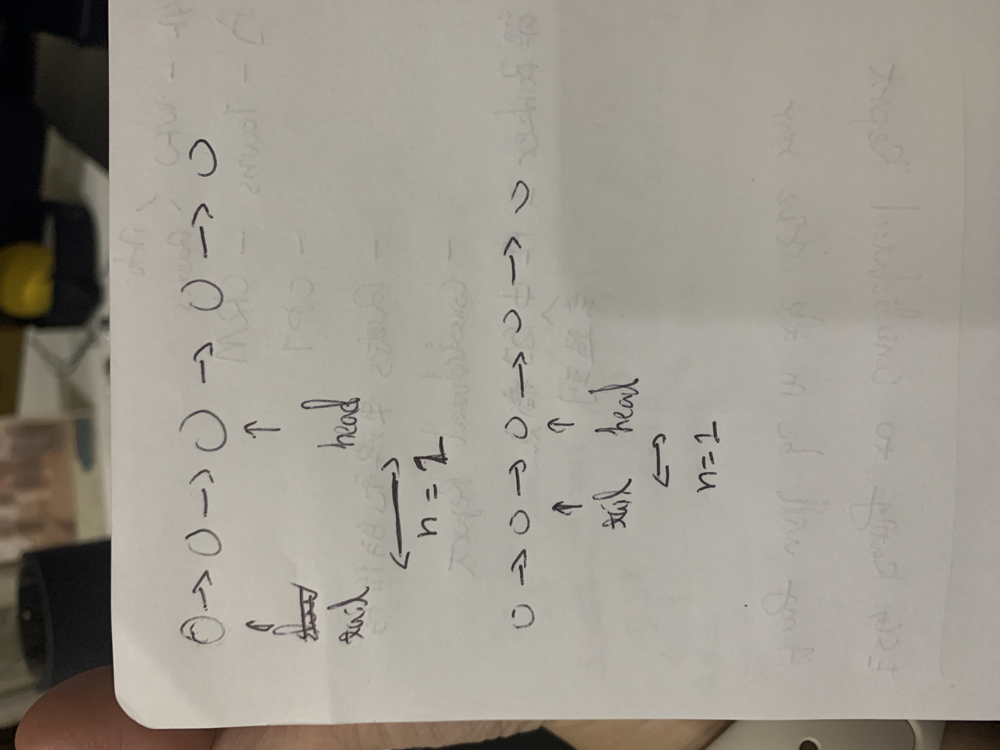

## Intuition


## Complexity
- Time complexity: O(n)
<!-- Add your time complexity here, e.g. $$O(n)$$ -->

- Space complexity: O(1)
<!-- Add your space complexity here, e.g. $$O(n)$$ -->

## Code
```python
# Definition for singly-linked list.
# class ListNode:
#     def __init__(self, val=0, next=None):
#         self.val = val
#         self.next = next

# one pass
class Solution:
    def removeNthFromEnd(self, head: Optional[ListNode], n: int) -> Optional[ListNode]:
        mv_tail = mv_head = head
        
        while n > 0:
            n -= 1
            mv_head = mv_head.next

        # when n == len(LL)
        # handle head = [1], n = 1, output = []
        # handle head = [1, 2], n = 2, output = [2]
        if mv_head is None:
            return head.next

        while mv_head.next is not None:
            mv_tail = mv_tail.next
            mv_head = mv_head.next
            
        mv_tail.next = mv_tail.next.next

        return head
        

             
            

```