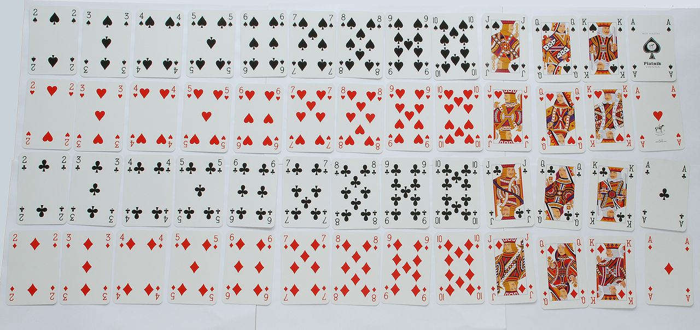

## Sample Situation
[Delete Duplicate Emails - LeetCode](https://leetcode.com/problems/delete-duplicate-emails/description/)

Table:  `Person`
```
+-------------+---------+
| Column Name | Type    |
+-------------+---------+
| id          | int     |
| email       | varchar |
+-------------+---------+
id is the primary key column for this table.
Each row of this table contains an email. The emails will not contain uppercase letters.
```
Write an SQL query to  **delete**  all the duplicate emails, keeping only one unique email with the smallest  `id`. Note that you are supposed to write a  `DELETE`  statement and not a  `SELECT`  one.

After running your script, the answer shown is the  `Person`  table. The driver will first compile and run your piece of code and then show the  `Person`  table. The final order of the  `Person`  table  **does not matter**.

The query result format is in the following example.

**Example 1:**

**Input:**
    
    Person table:
    +----+------------------+
    | id | email            |
    +----+------------------+
    | 1  | john@example.com |
    | 2  | bob@example.com  |
    | 3  | john@example.com |
    +----+------------------+

**Output:**

    +----+------------------+
    | id | email            |
    +----+------------------+
    | 1  | john@example.com |
    | 2  | bob@example.com  |
    +----+------------------+
    
**Explanation:** john@example.com is repeated two times. We keep the row with the smallest Id = 1.
## Solution
```sql
# Please write a DELETE statement and DO NOT write a SELECT statement.
# Write your MySQL query statement below
DELETE p1 FROM person p1, person p2
WHERE p1.email=p2.email AND p1.id>p2.id;
```
### Explanation

**Input:**
    
    Person table:
    +----+------------------+
    | id | email            |
    +----+------------------+
    | 1  | john@example.com |
    | 2  | bob@example.com  |
    | 3  | john@example.com |
    +----+------------------+

=> `From Person p1, Person p2` (Cartesian product[^Cartesianproduct]): it would look like:
```
1|john@example.com|1|john@example.com
1|john@example.com|2|bob@example.com 
1|john@example.com|3|john@example.com

2|bob@example.com|1|john@example.com
2|bob@example.com|2|bob@example.com
2|bob@example.com|3|john@example.com
_____________________________________
3|john@example.com|1|john@example.com <-
_____________________________________
3|john@example.com|2|bob@example.com
3|john@example.com|3|john@example.com

# its performing cross join, replace "," with "cross join" even this will work. Cross join is taking every record in 1st table and mapping with every record in 2nd table. if # # there is 'n' number of records in table 1 and 'm' number of records in table 2 total number of records after cross join will be 'mn.
# example : table 1 = 3 records
# table 2 = 3 records
# table 1 cross join table 2 = 33 = 9 records.
```

=> `From Person p1, Person p2 where p1.email=p2.email and p1.id>p2.id`:
It would look like:

    3|john@example.com

Now delete this row's matching row in p1 using p1:  `delete p1`

*More: [Delete Duplicate Emails - LeetCode](https://leetcode.com/problems/delete-duplicate-emails/solutions/2627589/my-sql-solution/)*

[^Cartesianproduct]: [Cartesian product - Wikipedia](https://en.wikipedia.org/wiki/Cartesian_product)