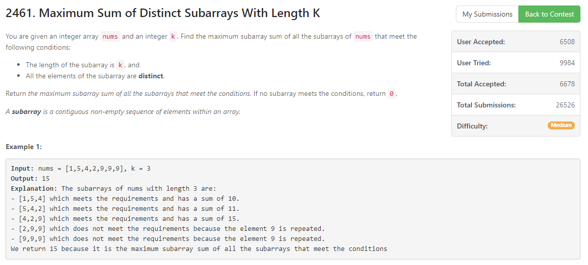

## Weekly Contest 318
This problem ate most of my time and not until a week after the contest did I realize my code wasn't correct... So I lost 4 points which means I've only solved only 1 question in that weekly contest. Let's dive right into this tricky but quite frankly easy problem.
## Maximum Sum of Distinct Subarrays With Length K

[Maximum Sum of Distinct Subarrays With Length K - LeetCode Contest](https://leetcode.com/contest/weekly-contest-318/problems/maximum-sum-of-distinct-subarrays-with-length-k/)

This is mainly a *Sliding Window problem*[^window-sliding-technique].
```python
from collections import defaultdict, deque

class Solution:
    def maximumSubarraySum(self, nums: List[int], k: int) -> int:
        if k > len(nums):
            return 0
        
        window = deque()
        window_dict = defaultdict(int)
        
        max_sum = 0
        local_sum = 0
        valid = 0
        false_num = 0
        true_num = 0
        for i in range(len(nums)):
            if i >= k:
                if window.popleft() == False:
                    false_num -= 1
                window_dict[nums[i-k]] -= 1
                local_sum -= nums[i-k]
            local_sum += nums[i]
            window_dict[nums[i]] += 1
            if window_dict[nums[i]] == 1:
                window.append(True)
                if true_num < k:
                    true_num += 1
            else:
                window.append(False)
                false_num += 1
            if (false_num == 0 or (false_num==1 and not window[0])) and true_num == k:
                if local_sum > max_sum:
                    max_sum = local_sum
        return max_sum
```
The above was my temp solution but failed at some cases as same as the below one:
```python
from collections import defaultdict, deque

class Solution:
    def maximumSubarraySum(self, nums: List[int], k: int) -> int:
        if k > len(nums):
            return 0
        
        window_dict = defaultdict(int)
        one_chr = set()
        
        max_sum = 0
        local_sum = 0
        for i in range(len(nums)):
           # widow right
            local_sum += nums[i]
            window_dict[nums[i]] += 1
            one_chr.add(nums[i])
            # the right part needs to be placed before the left part

            # windoe left
            if i >= k:
                local_sum -= nums[i-k]
                window_dict[nums[i-k]] -= 1
                if window_dict[nums[i-k]] != 1:
                    if nums[i-k] in one_chr:
                        one_chr.remove(nums[i-k])
 
            if len(one_chr) == k:
                if local_sum > max_sum:
                    max_sum = local_sum
        return max_sum

# Failed at [9,9,9,1,2,3], k=3
# output = 6, Expected = 12
```
### Solution
This is my final solution.
```python
from collections import defaultdict, deque

class Solution:
    def maximumSubarraySum(self, nums: List[int], k: int) -> int:
        if k > len(nums):
            return 0
        
        window_dict = defaultdict(int)
        one_chr = set()
        
        max_sum = 0
        local_sum = 0
        for i in range(len(nums)):
           # widow right
            local_sum += nums[i]
            window_dict[nums[i]] += 1
            one_chr.add(nums[i])
            # the right part needs to be placed before the left part

            # windoe left
            if i >= k:
                local_sum -= nums[i-k]
                window_dict[nums[i-k]] -= 1
                if window_dict[nums[i-k]] == 0:
                    if nums[i-k] in one_chr:
                        one_chr.remove(nums[i-k])
 
            if len(one_chr) == k:
                if local_sum > max_sum:
                    max_sum = local_sum
        return max_sum
```
Simply just to code out what happend when you faces different situs. I utilize the `set()` here to **handle the window moving's left part**.

And use

    if len(one_chr) == k:
        if local_sum > max_sum:
            max_sum = local_sum

to update the `max_sum`.

[^window-sliding-technique]: [Window Sliding Technique - GeeksforGeeks](https://www.geeksforgeeks.org/window-sliding-technique/)