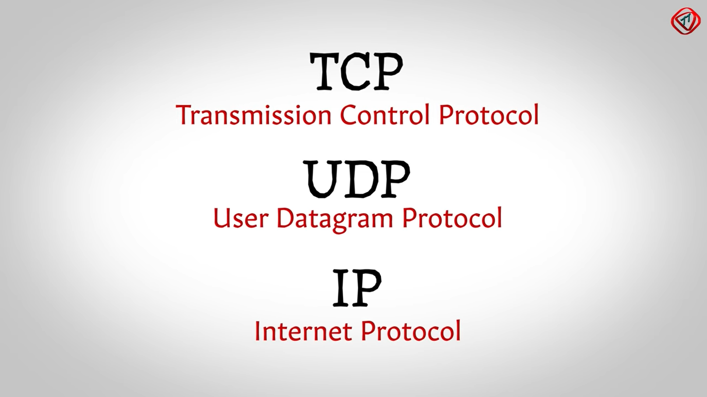
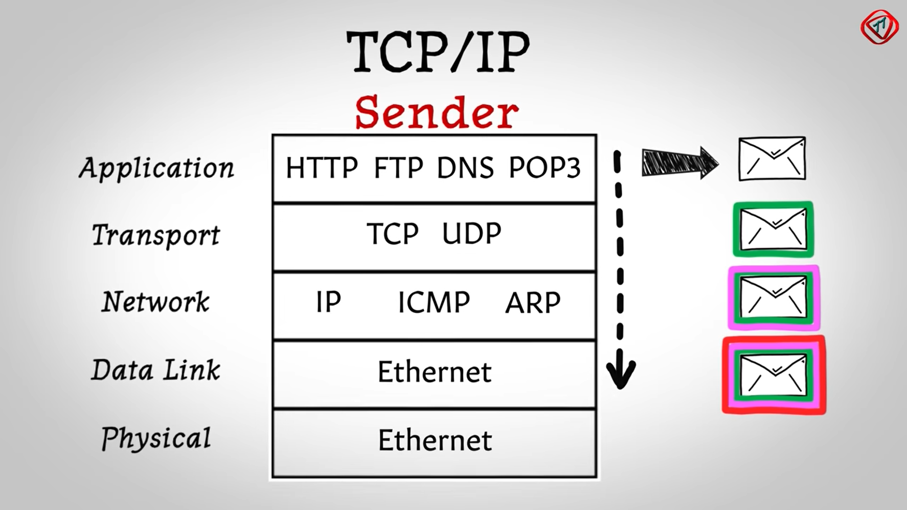
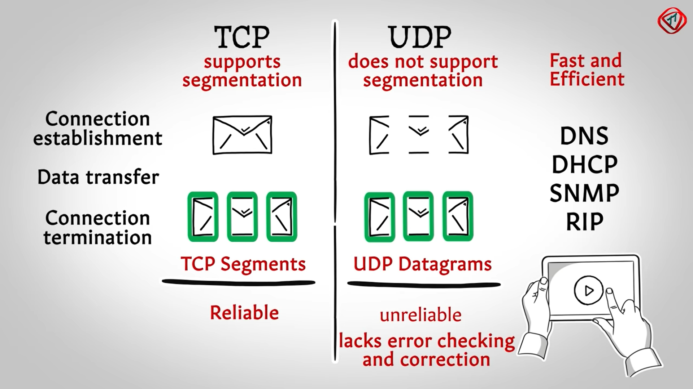

## What's TCP/IP
### Internet protocol suite[^Internet_protocol_suite]
The  **Internet protocol suite,**  commonly known as  **TCP/IP,**  is a framework for organizing the set of  [communication protocols](https://en.wikipedia.org/wiki/Communication_protocol "Communication protocol")  used in the  [Internet](https://en.wikipedia.org/wiki/Internet "Internet")  and similar  [computer networks](https://en.wikipedia.org/wiki/Computer_network "Computer network")  according to functional criteria. 


The foundational protocols in the suite are
- [Transmission Control Protocol](https://en.wikipedia.org/wiki/Transmission_Control_Protocol "Transmission Control Protocol")  (TCP)
- [User Datagram Protocol](https://en.wikipedia.org/wiki/User_Datagram_Protocol "User Datagram Protocol")  (UDP)
- [Internet Protocol](https://en.wikipedia.org/wiki/Internet_Protocol "Internet Protocol")  (IP)

In the development of this networking model, early versions of it were known as the  **Department of Defense**  (**DoD**)  **model**  because the research and development were funded by the  [United States Department of Defense](https://en.wikipedia.org/wiki/United_States_Department_of_Defense "United States Department of Defense")  through  [DARPA](https://en.wikipedia.org/wiki/DARPA "DARPA").

> The Internet protocol suite provides  [end-to-end data communication](https://en.wikipedia.org/wiki/End-to-end_principle "End-to-end principle")  specifying **how data should be packetized, addressed, transmitted,  [routed](https://en.wikipedia.org/wiki/Routing "Routing"), and received.**


This functionality is organized into four [abstraction layers](https://en.wikipedia.org/wiki/Abstraction_layer "Abstraction layer"), which classify all related protocols according to each protocol's scope of networking.[[1]](https://en.wikipedia.org/wiki/Internet_protocol_suite#cite_note-rfc1122-1)[[2]](https://en.wikipedia.org/wiki/Internet_protocol_suite#cite_note-R9Fra-2)  An implementation of the layers for a particular application forms a  [protocol stack](https://en.wikipedia.org/wiki/Protocol_stack "Protocol stack"). From lowest to highest, the layers are
- [link layer](https://en.wikipedia.org/wiki/Link_layer "Link layer"), containing communication methods for data that remains within a single network segment (link)
- [internet layer](https://en.wikipedia.org/wiki/Internet_layer "Internet layer"), providing  [internetworking](https://en.wikipedia.org/wiki/Internetworking "Internetworking")  between independent networks
- [transport layer](https://en.wikipedia.org/wiki/Transport_layer "Transport layer"), handling host-to-host communication
- [application layer](https://en.wikipedia.org/wiki/Application_layer "Application layer"), providing process-to-process data exchange for applications


### How They Work
- **Pysical -> Data Link**

  0/1 Data to Frame (Ethernet Protocol)

      Header: Mac Address
      IP-Packet: Data
      Trailer: Error Checking Data
  
  - *Mac Address: A3:12:56:B5:95:7F*

  - *IP Address:*

    ```
    192.168.1.3
    (11000000-10101000-10000000-00000000)
    ```
- **Transport**

  In the world of Internet protocol traffic, consumers can choose between a TCP or UDP setup for their business or personal use. When it comes to TCP vs UDP features and functions, each brings its own set of advantages and challenges.

  **What is TCP?**

  Transmission Control Protocol (TCP) is connection-oriented.
  > Once a connection has been established, data can be transmitted in two directions.

  TCP has built-in systems to **check for errors** and to **guarantee data** will be delivered in the **order** it was sent, making it the perfect protocol for transferring information like *still images*, *data files*, and *web pages*.

  But while TCP is instinctively reliable, its feedback mechanisms also result in a larger overhead, translating to greater use of the available bandwidth on your network.
  ```
  Sender TCP ---Connection Request---> Receiver TCP
  Sender TCP <----------ACK---------- Receiver TCP
  Sender TCP ----------ACK----------> Receiver TCP

  # Three-way Handshake
  ```
  **What is UDP?**

  User Datagram Protocol (UDP) is a simpler, connectionless Internet protocol wherein **error-checking and recovery services are not required**. With UDP, there is no overhead for **opening a connection, maintaining a connection, or terminating a connection**.
  > Data is continuously sent to the recipient, whether or not they receive it. 

  Although UDP isn’t ideal for sending an email, viewing a webpage, or downloading a file, it is largely preferred for **real-time communications** like broadcast or multitask network transmission.

  **What is the Difference Between TCP and UDP?**
  
  > TCP is a connection-oriented protocol, whereas UDP is a connectionless protocol.
  
  A key difference between TCP and UDP is speed, as **TCP is comparatively slower than UDP**. Overall, UDP is a much faster, simpler, and efficient protocol, however, **retransmission of lost data packets is only possible with TCP**. 

  Another notable discrepancy with TCP vs UDP is that **TCP provides an ordered delivery** of data from user to server (and vice versa), whereas UDP is not dedicated to end-to-end communications, nor does it check the readiness of the receiver (requiring fewer overheads and taking up less space).
- **Application**[^The-Application-Layer-in-TCP/IP-Model]

  The application layer is the highest abstraction layer of the TCP/IP model that **provides the interfaces and protocols needed by the users**. It combines the functionalities of the session layer, the presentation layer and the application layer of the OSI model.

  - The functions of the application layer are −
    - It **facilitates the user to use the services** of the network.
    - It is used to **develop network-based applications**.
    - It **provides user services** like user login, naming network devices, formatting messages, and e-mails, transfer of files etc.
    - It is also concerned with error handling and recovery of the message as a whole.

  - This layer uses a number of protocols, the main among which are as follows −
    - *Hyper Text Transfer Protocol, HTTP* − It is the underlying protocol for world wide web. It defines how hypermedia messages are formatted and transmitted.
    - *File Transfer Protocol, FTP* − It is a client-server based protocol for transfer of files between client and server over the network.
    - *Simple Mail Transfer Protocol, SMTP* − It lays down the rules and semantics for sending and receiving electronic mails (e-mails).
    - *Domain Name System, DNS* − It is a naming system for devices in networks. It provides services for translating domain names to IP addresses.
    - *TELNET* − It provides bi-directional text-oriented services for remote login to the hosts over the network.
    - *Simple Network Management Protocol, SNMP* − It is for managing, monitoring the network and for organizing information about the networked devices.

## More to read
1. [TCP vs. UDP: What’s the Difference? - Lifesize](https://www.lifesize.com/en/blog/tcp-vs-udp/#:~:text=TCP%20is%20a%20connection%2Doriented,is%20only%20possible%20with%20TCP.)
2. [(20) 2018 Network Programming Basics #01 Quick Understanding Network Protocol (1) - YouTube](https://www.youtube.com/watch?v=iNITVjVLpxI)
3. [(20) 2018 Network Programming Basics #02 Quick Understanding Network Communication Protocol Part2 - YouTube](https://www.youtube.com/watch?v=RDpyv1HET-o)


  
  
  


[^Internet_protocol_suite]: [Internet protocol suite - Wikipedia](https://en.wikipedia.org/wiki/Internet_protocol_suite)
[^The-Application-Layer-in-TCP/IP-Model]: [The Application Layer in TCP/IP Model (tutorialspoint.com)](https://www.tutorialspoint.com/The-Application-Layer-in-TCP-IP-Model#:~:text=The%20application%20layer%20is%20the,layer%20of%20the%20OSI%20model.&text=It%20facilitates%20the%20user%20to%20use%20the%20services%20of%20the%20network.)