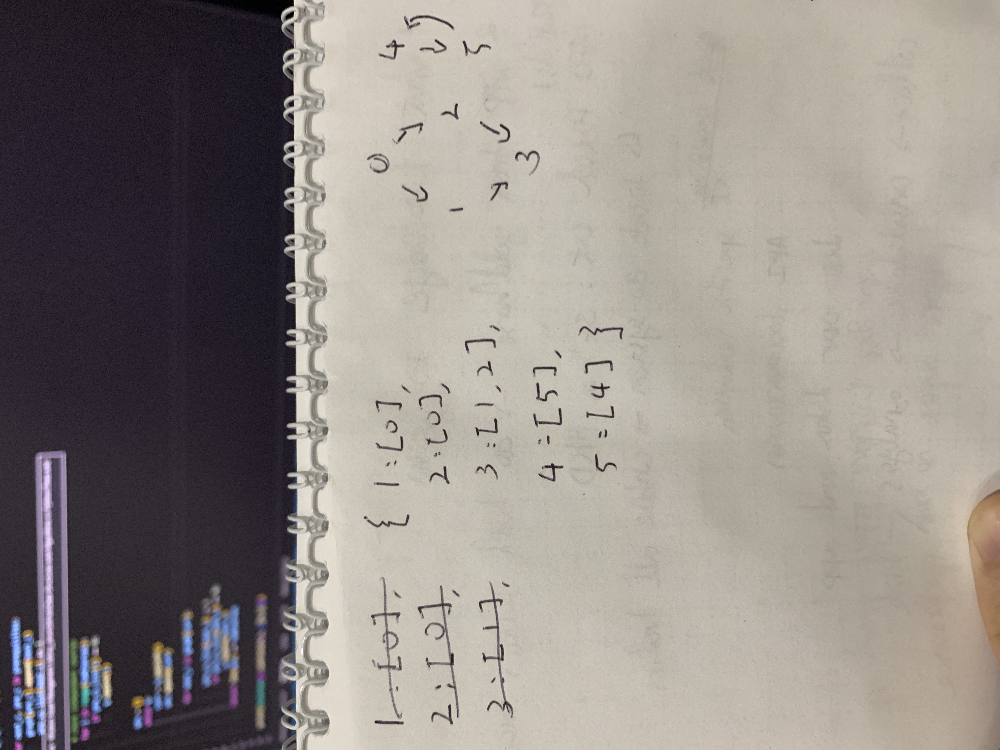

## What's Topological Sorting
Topological sorting for **Directed Acyclic Graph (DAG)** is a linear ordering of vertices such that for every directed edge u v, **vertex u comes before v** in the ordering.[^topological-sorting]

**Note:** Topological Sorting for a graph is not possible if the graph is not a DAG. (i.e. If there is a loop/cycle in the Graph)

*Below is the implementation of the above approach:*
<script src="https://gist.github.com/chienhsiang-hung/c468ece14fd0fee5af4ec24edf39e134.js"></script>

## Examples
### Course Schedule II
**LeetCode 210. Course Schedule II**[^course-schedule-ii]

It's basically a slightly advanced version of [Course Schedule](#course-schedule) in which *you need to record the courses this time*.



At the first I tried to approach this by **DFS**.
```python
from collections import defaultdict

# DAG - topological sorting
class Solution:
    def findOrder(self, numCourses: int, prerequisites: List[List[int]]) -> List[int]:
        if not prerequisites:
            return list( range(numCourses) )

        adj_lit = defaultdict(list)
        for c0, c1 in prerequisites:
            adj_lit[c0].append(c1)

        def traverse(c0):
            '''check a vertix's prerequisite'''
            visited[c0] = True
            for cs in adj_lit[c0]:
                if not visited[cs]:
                    traverse(cs) # DFS
            stack.append(c0)

        visited = [False] * numCourses
        stack = []
        adj_keys = list(adj_lit.keys()) # to handle defaultdict's size changed during iteration in line-12
        for c0 in adj_keys:
            if not visited[c0]:
                traverse(c0)
        
        return stack
# Failed at task like:
#   n = 2
#   prerequisites = [[0,1],[1,0]]
```
But I quickly realized I've *missed to handle the loop*. Then I tried again.
```python
###### still failed at n=2, pre=[[0,1],[1,0]] ######  
class Solution:
    def findOrder(self, numCourses: int, prerequisites: List[List[int]]) -> List[int]:
        adj_list = [[] for _ in range(numCourses)]
        for c0, c1 in prerequisites:
            adj_list[c0].append(c1)

        def DFS(c0, master):
            visited[c0] = True
            for c1 in adj_list[c0]:
                # detect loop (cycle)
                if adj_list[c1] == master:
                    acycle[0] = False

                if not visited[c1]:
                    DFS(c1, master)
            
            output.append(c0)
                    
        visited = [False] * numCourses
        output = []
        acycle = [True]
        for c0 in range(numCourses):
            if acycle[0] == False:
                return []
            
            if not visited[c0]:
                # independent course
                if adj_list[c0] == []:
                    visited[c0] = True
                    output.append(c0)

                else:
                    DFS(c0, c0)
        return output    
###### still failed at n=2, pre=[[0,1],[1,0]] ######  
```
Still missing...

Then I adopted the [solution](https://leetcode.com/problems/course-schedule-ii/solutions/1642354/c-python-simple-solutions-w-explanation-topological-sort-using-bfs-dfs/) from [archit91](https://leetcode.com/archit91/) with **BFS** approach. It's nicely structured and well-run.

[**Code**](https://github.com/chienhsiang-hung/Data-Structures-and-Algorithms-in-Python/blob/main/Trees%20and%20Graphs/Course%20Schedule%20II.py)
```python
from collections import defaultdict, deque

class Solution:
    def findOrder(self, numCourses: int, prerequisites: List[List[int]]) -> List[int]:
        graph = defaultdict(list)
        in_degree = [0] * numCourses
        
        for next_c, pre_c in prerequisites:
            graph[pre_c].append(next_c)
            in_degree[next_c] += 1
            
        BFS_q = deque()
        for cs in range(numCourses):
            if in_degree[cs] == 0:
                BFS_q.append(cs)
        
        ans = []
        while BFS_q:
            curr = BFS_q.popleft()
            ans.append(curr)
            for next_c in graph[curr]:
                in_degree[next_c] -= 1
                if in_degree[next_c] == 0:
                    BFS_q.append(next_c)
        
        return ans if len(ans)==numCourses else []
```
### Course Schedule
**LeetCode 207. Course Schedule**[^course-schedule] *[Medium]*

There are a total of  `numCourses`  courses you have to take, labeled from  `0`  to  `numCourses - 1`. You are given an array  `prerequisites`  where  `prerequisites[i] = [ai, bi]`  indicates that you  **must**  take course  `bi`  first if you want to take course  `ai`.

-   For example, the pair  `[0, 1]`, indicates that to take course  `0`  you have to first take course  `1`.

Return  `true`  if you can finish all courses. Otherwise, return  `false`.

**Example 1:**

> **Input:** numCourses = 2, prerequisites = [[1,0]]
>
> **Output:** true
>
> **Explanation:** There are a total of 2 courses to take. 
>
> To take course 1 you should have finished course 0. So it is possible.

**Example 2:**

> **Input:** numCourses = 2, prerequisites = [[1,0],[0,1]]
> 
> **Output:** false
> 
> **Explanation:** There are a total of 2 courses to take. 
> 
> To take course 1 you should have finished course 0, and to take course 0 you should also have finished course 1. So it is impossible.

**Constraints:**

-   `1 <= numCourses <= 2000`
-   `0 <= prerequisites.length <= 5000`
-   `prerequisites[i].length == 2`
-   `0 <= ai, bi < numCourses`
-   All the pairs prerequisites[i] are  **unique**.

**Thinking**

This is basically the simpler version of [Course Schedule II](#course-schedule-ii).

[**Code**](https://github.com/chienhsiang-hung/Data-Structures-and-Algorithms-in-Python/blob/main/Trees%20and%20Graphs/Course%20Schedule.py)
```python
# if there is a loop, it won't be possible to finish all courses

from collections import defaultdict, deque

class Solution:
    def canFinish(self, numCourses: int, prerequisites: List[List[int]]) -> bool:
        graph = defaultdict(list)
        pre_cs_list = [0] * numCourses

        for next_c, pre_c in prerequisites:
            graph[pre_c].append(next_c)
            pre_cs_list[next_c] += 1
            
        q = deque()
        # check independent cources
        for i in range(numCourses):
            if pre_cs_list[i] == 0:
                q.append(i)
        

        ans = []    
        while q:
            curr = q.popleft()
            ans.append(curr)

            for next_c in graph[curr]:

                pre_cs_list[next_c] -= 1
                if pre_cs_list[next_c] == 0:
                    q.append(next_c)
        return len(ans) == numCourses
```
### Related FAQ in The Discussion
[range() vs xrange() in Python - GeeksforGeeks](https://www.geeksforgeeks.org/range-vs-xrange-in-python/)

[^topological-sorting]: [Topological Sorting - GeeksforGeeks](https://www.geeksforgeeks.org/topological-sorting/)
[^course-schedule]: [Course Schedule - LeetCode](https://leetcode.com/problems/course-schedule/)
[^course-schedule-ii]: [Course Schedule II - LeetCode](https://leetcode.com/problems/course-schedule-ii/)
