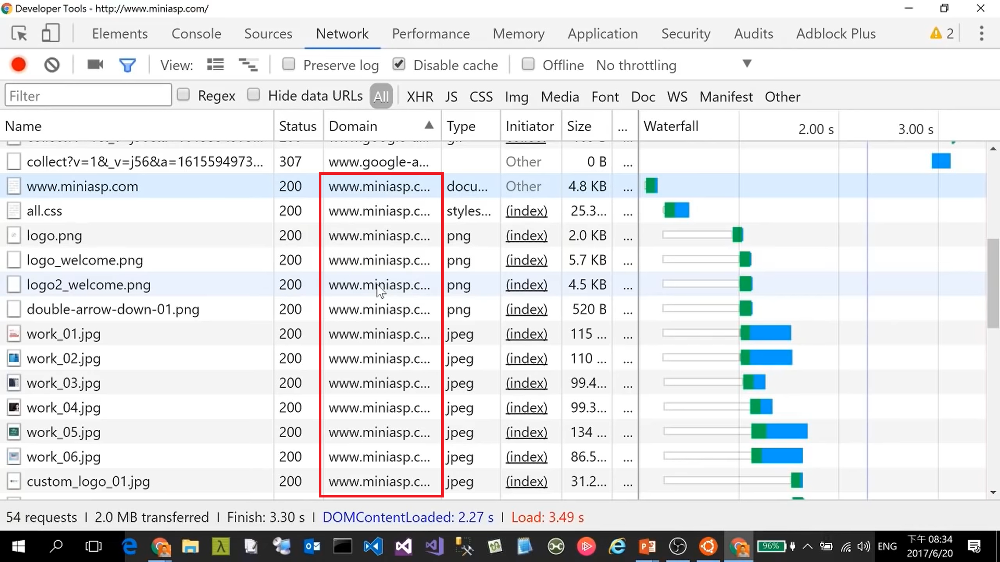
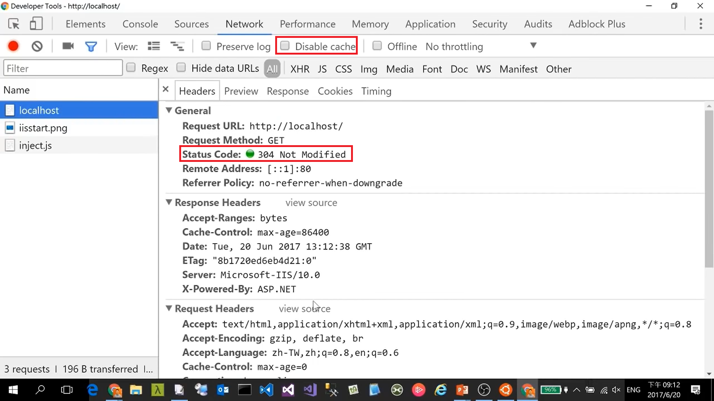
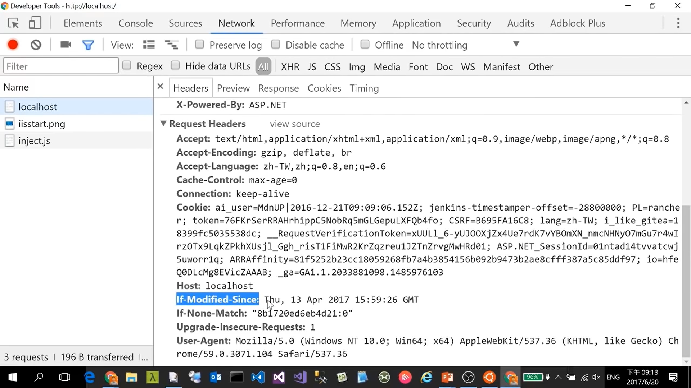

## HTTP
### HTTP/0.9

- Client send a request

  -> launch a TCP[^TCP]/IP connect: `telnet google.com 80`
  
  -> **one-line commend: `GET /about`**
- _CRLF_[^CRLF] to end a request
- Respond HTML in _ASCII_[^ASCII]
- Auto-shut-down every Request / Response (close TCP[^TCP]/IP connect)
### HTTP/1.0

- Still in _ASCII_[^ASCII]
  - **Multi-line commend is allowed including `Header`**
    > Method + Header + _CRLF_[^CRLF]

  -> launch a TCP[^TCP]/IP connect: `telnet google.com 80`
  
  -> commend:

    ```
    GET /about HTTP/1.0
    Host: www.google.com
    ```

  -> additional _CRLF_[^CRLF]: `\n`
  
  
- Response with _ASCII_[^ASCII]
  1. Status code
  2. Header
  3. Conten type
- Auto-shut-down every Request / Response (close TCP[^TCP]/IP connect)
### HTTP/1.1
Improved Overall Efficiency
- **Persistent Connection** without TCP[^TCP]/IP connect Auto-shut-down

  Keep the [connection alive to be reused for other resources](https://youtu.be/Taq5TV1K4XU?t=1620) in the same domain (so that you don't need to re-do all TCP[^TCP] hand-shake again and again)
  
- Chunked encoding transfer: [Transfer-Encoding - HTTP | MDN (mozilla.org)](https://developer.mozilla.org/en-US/docs/Web/HTTP/Headers/Transfer-Encoding) encoded-compress for large data 
- Byte range request

  ```
  GET / HTTP/1.1
  Host: www.miniasp.com
  Range: bytes=0-100
  ```
  ```
  GET / HTTP/1.1
  Host: www.miniasp.com
  Range: bytes=101-200
  ```
  To get the 2 chunked _206 Partial Content_
- Cache control
- Request pipeline[^pipelined-connection]: multiple requests at a time

  
#### Updates
- RFC 7230: Message Syntax and Routing (Proxy Server)
- [RFC 7231: Semantics and Content](https://www.rfc-editor.org/rfc/rfc7231)
- [RFC 7232: Conditional Requests](https://www.rfc-editor.org/rfc/rfc7232)

  
  
- RFC 7233: Range Requests
- RFC 7234: Caching
- RFC 7235: Authentication
### Summary
The Hypertext Transfer Protocol (HTTP) is a stateless application-level protocol for distributed collaborative, hypertext information systems.
- Stateless
### Resource
- [(18) 初學者都該學會的 HTTP 通訊協定基礎 - YouTube](https://www.youtube.com/watch?v=Taq5TV1K4XU)

[^CRLF]: The term CRLF refers to Carriage Return (ASCII 13, \r ) Line Feed (ASCII 10, \n ). They're used to note the termination of a line, however, dealt with differently in today's popular Operating Systems. [CRLF Injection | OWASP Foundation](https://owasp.org/www-community/vulnerabilities/CRLF_Injection)
[^ASCII]: ASCII, in full American Standard Code for Information Interchange, a standard data-encoding format for electronic communication between computers. ASCII assigns standard numeric values to letters, numerals, punctuation marks, and other characters used in computers. [ASCII | Definition, History, Trivia, & Facts | Britannica](https://www.britannica.com/topic/ASCII)
[^TCP]: TCP is a connection-oriented protocol, whereas UDP is a connectionless protocol. The speed for TCP is slower while the speed of UDP is faster. TCP uses handshake protocol like SYN, SYN-ACK, ACK while UDP uses no handshake protocols. [TCP vs UDP: Key Difference Between Them (guru99.com)](https://www.guru99.com/tcp-vs-udp-understanding-the-difference.html)
[^pipelined-connection]: HTTP pipelining is a feature of HTTP/1.1 which allows multiple HTTP requests to be sent over a single TCP connection without waiting for the corresponding responses. [HTTP pipelining - Wikipedia](https://en.wikipedia.org/wiki/HTTP_pipelining)