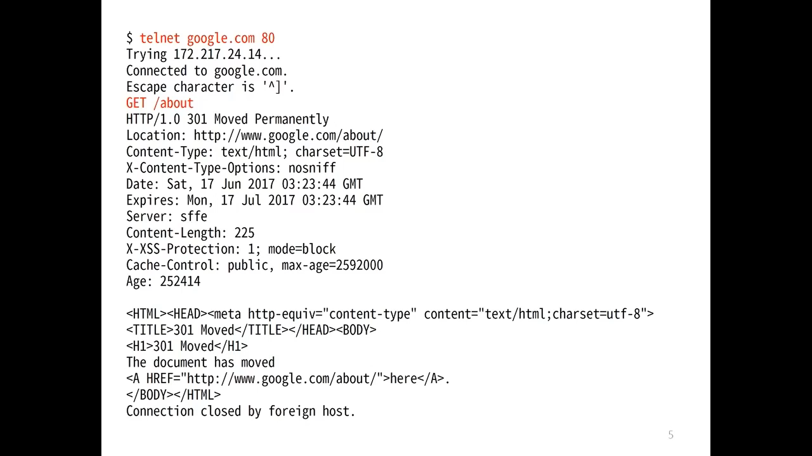

## URL
**What happens when we hit any URL?**

Before discussing what happens after hitting the _URL_, we must go through what a _URL_ actually is, and what different parts of the _URL_ mean - right? Without wasting any time, let’s understand more about *URL*s.

**URL – Uniform Resource Locator**

If you look into its full form, then it is self explanatory: it has the location of the resources which we want to access. **It is an address of the place where we want to go to interact with or find information.**

> The web site is like the house and the **URL (Uniform Resource Locator)** is the address.


### Anatomy of an URL
Let’s take an example:

https://chienhsiang-hung.github.io/blog/

Here, the first part is `https`. This basically tells the browser which [protocol](#http-history) it should use. It can be [http](#http-history), https, ftp, etc. A [protocol](#http-history) is a set of rules that browser use for communication over the network. `https` is basically a secure version, i.e. information is exchanged in a secure way.

The second part `chienhsiang-hung.github.io` is a **domain name**. You can relate it to your friend’s house. It is an address of website. We use it to reach to the server (trained computer) that is responsible for serving the information for that website. Wait! You might think, a seconds before I mentioned URL is the **address** whereas I also mentioned **domain name** is also **address**. You may have been confused. Don’t be confused!
### URL vs. Domain Name
Difference between URL and Domain Name

The major difference between both is that the **URL is a complete address**. URL tells about the method through which information should exchange, the path after reaching that website. Whereas the **domain name is part of a URL**.
### Domain Name
As we know, when we hit any URL or you can say **domain name**, then that website gets opened with its content. **A server (a trained computer) serves it.** We also know that **every computer has an IP address** which is used for communication over the internet. It is an address as its self explaining ‘IP address’. When we hit any URL, then we are actually hitting the IP address of the computer which is responsible for serving the website content (hosting).

But, now, you might think what the hell...is everything an address? Why does this domain name exist if the IP address is there? Why can’t we use IP address to get content of the website?

Yes! You can use IP addresses to get content of the website but really!.. Would you be able to remember each website’s associated IP address? Obviously not! It’s hard to remember the IP address of every website. That’s why domain names came into the market.

You can relate it to your contact list. You can’t remember every person’s number, but you can remember their name. Same concept applies here as well. You can’t remember those scary IP addresses, but you can easily remember domain names.

This huge amount of data is maintained in a database where the domain name with its IP address is stored.
> A system that stores domain names with its corresponding IP address is known as **DNS (Domain name system)**.
### DNS lookup to find IP address
**DNS is like a phone book and helps us to provide the IP address** that is associated with the domain name just like our phone book gives a mobile number which is associated with the person’s name.

This is the overview, but there are four layers through which this domain name query goes through.

*More on: [What happens when you click on a URL in your browser (freecodecamp.org)](https://www.freecodecamp.org/news/what-happens-when-you-hit-url-in-your-browser/)*
## HTTP History
### HTTP/0.9

- Client send a request

  -> launch a TCP[^TCP]/IP connect: `telnet google.com 80`
  
  -> **one-line commend: `GET /about`**
- _CRLF_[^CRLF] to end a request
- Respond HTML in _ASCII_[^ASCII]
- Auto-shut-down every Request / Response (close TCP[^TCP]/IP connect)
### HTTP/1.0

- Still in _ASCII_[^ASCII]
  - **Multi-line commend is allowed including `Header`**
    > Method + Header + _CRLF_[^CRLF]

  -> launch a TCP[^TCP]/IP connect: `telnet google.com 80`
  
  -> commend:

    ```
    GET /about HTTP/1.0
    Host: www.google.com
    ```

  -> additional _CRLF_[^CRLF]: `\n`
  
  
- Response with _ASCII_[^ASCII]
  1. Status code
  2. Header
  3. Conten type
- Auto-shut-down every Request / Response (close TCP[^TCP]/IP connect)
### HTTP/1.1
Improved Overall Efficiency
- **Persistent Connection** without TCP[^TCP]/IP connect Auto-shut-down

  Keep the [connection alive to be reused for other resources](https://youtu.be/Taq5TV1K4XU?t=1620) in the same domain (so that you don't need to re-do all TCP[^TCP] hand-shake again and again)
  
- Chunked encoding transfer: [Transfer-Encoding - HTTP | MDN (mozilla.org)](https://developer.mozilla.org/en-US/docs/Web/HTTP/Headers/Transfer-Encoding) encoded-compress for large data 
- Byte range request

  ```
  GET / HTTP/1.1
  Host: www.miniasp.com
  Range: bytes=0-100
  ```
  ```
  GET / HTTP/1.1
  Host: www.miniasp.com
  Range: bytes=101-200
  ```
  To get the 2 chunked _206 Partial Content_
- Cache control
- Request pipeline[^pipelined-connection]: multiple requests at a time

  
#### Updates
- RFC 7230: Message Syntax and Routing (Proxy Server)
- [RFC 7231: Semantics and Content](https://www.rfc-editor.org/rfc/rfc7231)
- [RFC 7232: Conditional Requests](https://www.rfc-editor.org/rfc/rfc7232)

  
  
- RFC 7233: Range Requests
- RFC 7234: Caching
- RFC 7235: Authentication
### Summary
The Hypertext Transfer Protocol (HTTP) is a stateless application-level protocol for distributed collaborative, hypertext information systems.
- Stateless
- Distributed
- Collaborative
- Hypertext: not just "text" but with "links"
### Resource
- [(18) 初學者都該學會的 HTTP 通訊協定基礎 - YouTube](https://www.youtube.com/watch?v=Taq5TV1K4XU)
## HTTP Request Methods
- [GET](#get)
- [POST](#post)
- [PUT](#put)
- [HEAD](#head)
- DELETE
- PATCH
- OPTIONS
- CONNECT
- TRACE
### GET
> GET is used to request data from a specified resource.

The query string (name/value pairs) is **sent in the URL** of a GET request:
`/test/demo_form.php?name1=value1&name2=value2`
- GET requests can be cached
- GET requests remain in the browser history
- GET requests can be bookmarked
- GET requests should never be used when dealing with sensitive data
- GET requests have length restrictions
- GET requests are only used to request data (not modify)
### POST
> POST is used to send data to a server to create/update a resource.

The data sent to the server with POST is **stored in the request body** of the HTTP request:
```
POST /test/demo_form.php HTTP/1.1
Host: w3schools.com

name1=value1&name2=value2
```
- POST requests are never cached
- POST requests do not remain in the browser history
- POST requests cannot be bookmarked
- POST requests have no restrictions on data length
### GET vs. POST
- GET for retrieving sensitive data.
- POST for sending sensitive data.

The reason to use POST for sending sensitive data is that it prevents data leakage via the query string. One more reason to use POST is that modern browsers don't appear to cache the results of POST requests by default. However, **this should not be relied upon**. It is much better to set `Cache-control: no-store header` in your response either way, any time that sensitive data is output. _(More: [Should I use GET or POST when requesting sensitive data?](https://stackoverflow.com/questions/37328684/should-i-use-get-or-post-when-requesting-sensitive-data))_
<table>
  <tr>
    <th style="width:30%">&nbsp;</th>
    <th style="width:35%">GET</th>
    <th>POST</th>
  </tr>
  <tr>
    <td>BACK button/Reload</td>
    <td>Harmless</td>
    <td>Data will be re-submitted (the browser should alert the user that the data are about to be re-submitted)</td>
  </tr>
  <tr>
    <td>Bookmarked</td>
    <td>Can be bookmarked</td>
    <td>Cannot be bookmarked</td>
  </tr>
  <tr>
    <td>Cached</td>
    <td>Can be cached</td>
    <td>Not cached</td>
  </tr>
  <tr>
    <td>Encoding type</td>
    <td>application/x-www-form-urlencoded</td>
    <td>application/x-www-form-urlencoded or multipart/form-data. Use multipart encoding for binary data</td>
  </tr>
  <tr>
    <td>History</td>
    <td>Parameters remain in browser history</td>
    <td>Parameters are not saved in browser history</td>
  </tr>
  <tr>
    <td>Restrictions on data length</td>
    <td>Yes, when sending data, the GET method adds the data to the URL; and the length of a URL is limited (maximum URL length is 2048 characters)</td>
    <td>No restrictions</td>
  </tr>
  <tr>
    <td>Restrictions on data type</td>
    <td>Only ASCII characters allowed</td>
    <td>No restrictions. Binary data is also allowed</td>
  </tr>
  <tr>
    <td>Security</td>
    <td>GET is less secure compared to POST because data sent is part of the URL<br>
 <br>
 Never use GET when sending passwords or other sensitive information!</td>
    <td><b>POST is a little safer than GET because the parameters are not stored in browser history or in web server logs</b></td>
  </tr>
  <tr>
    <td>Visibility</td>
    <td>Data is visible to everyone in the URL</td>
    <td>Data is not displayed in the URL</td>
  </tr>
</table>

### PUT
PUT is used to send data to a server to create/update a resource.

The difference between POST and PUT is that **PUT requests are idempotent**. That is, calling the same PUT request multiple times will always produce the same result. In contrast, calling a POST request repeatedly have side effects of creating the same resource multiple times.

- [What is the difference between POST and PUT in HTTP?](https://stackoverflow.com/questions/630453/what-is-the-difference-between-post-and-put-in-http#:~:text=POST%20means%20%22create%20new%22%20as,the%20server%20to%20create%20it.)
  - `POST` means "create new" as in "Here is the input for creating a user, create it for me".
  
    You `POST` to example.com/users since you don't know the URL of the user yet, you want the server to create it.
  - `PUT` means "insert, replace if already exists" as in "Here is the data for user 5".

    You `PUT` to example.com/users/id since you want to replace/create a *specific* user.
> POSTing twice with the same data means create two identical users with different ids. PUTing twice with the same data creates the user the first and updates him to the same state the second time (no changes).
### HEAD
**HEAD is almost identical to GET, but *without the response body*.**

In other words, if GET /users returns a list of users, then HEAD /users will make the same request but will not return the list of users.

HEAD requests are useful for checking what a GET request will return before actually making a GET request - like before downloading a large file or response body.
### More
[HTTP Methods GET vs POST (w3schools.com)](https://www.w3schools.com/tags/ref_httpmethods.asp)

[^CRLF]: [CRLF Injection | OWASP Foundation](https://owasp.org/www-community/vulnerabilities/CRLF_Injection) The term CRLF refers to Carriage Return (ASCII 13, \r ) Line Feed (ASCII 10, \n ). They're used to note the termination of a line, however, dealt with differently in today's popular Operating Systems.
[^ASCII]: [ASCII | Definition, History, Trivia, & Facts | Britannica](https://www.britannica.com/topic/ASCII) ASCII, in full American Standard Code for Information Interchange, a standard data-encoding format for electronic communication between computers. ASCII assigns standard numeric values to letters, numerals, punctuation marks, and other characters used in computers.
[^TCP]: [TCP vs UDP: Key Difference Between Them (guru99.com)](https://www.guru99.com/tcp-vs-udp-understanding-the-difference.html) TCP is a connection-oriented protocol, whereas UDP is a connectionless protocol. The speed for TCP is slower while the speed of UDP is faster. TCP uses handshake protocol like SYN, SYN-ACK, ACK while UDP uses no handshake protocols.
[^pipelined-connection]: [HTTP pipelining - Wikipedia](https://en.wikipedia.org/wiki/HTTP_pipelining) HTTP pipelining is a feature of HTTP/1.1 which allows multiple HTTP requests to be sent over a single TCP connection without waiting for the corresponding responses.