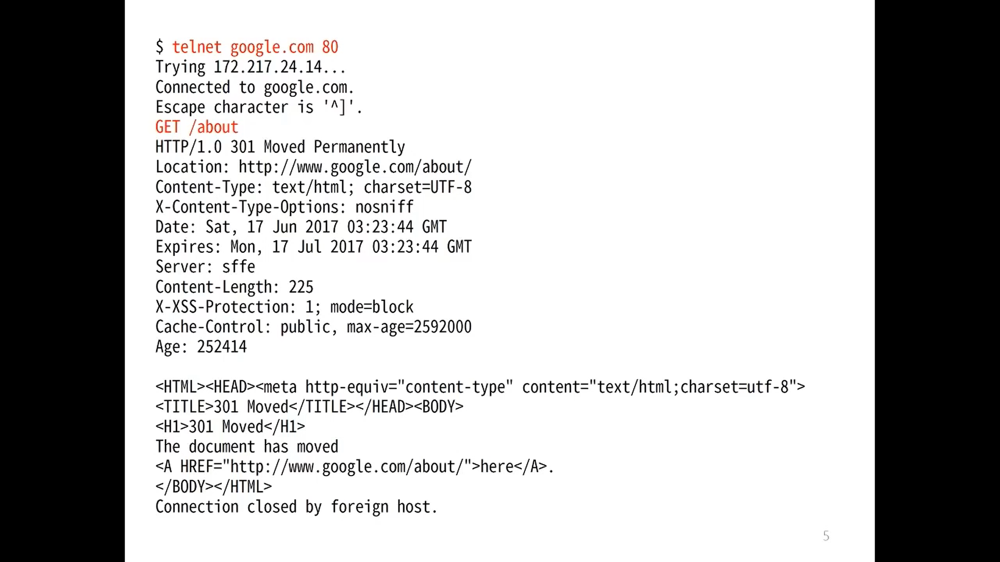
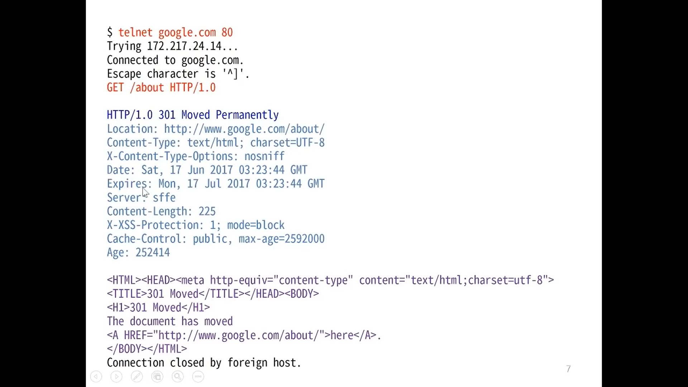
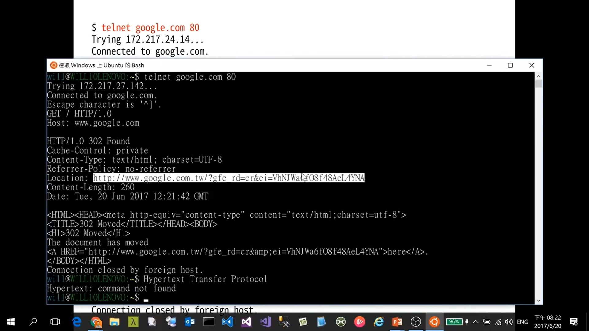
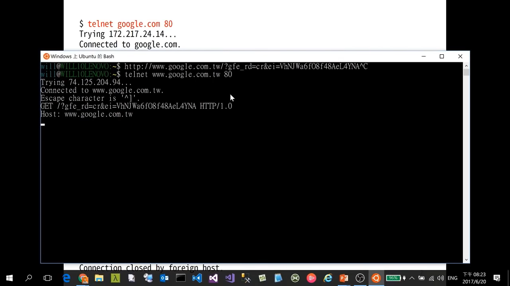

## HTTP
### HTTP/0.9

- Client send a request

  -> launch a TCP/IP connect: `telnet google.com 80`
  
  -> **one-line commend: `GET /about`**
- _CRLF_[^CRLF] to end a request
- Respond HTML in _ASCII_[^ASCII]
- Auto-shut-down every Request / Response (close TCP/IP connect)
### HTTP/1.0

- Still in _ASCII_[^ASCII]
  - **Multi-line commend is allowed including `Header`**
    > Method + Header + _CRLF_[^CRLF]

  -> launch a TCP/IP connect: `telnet google.com 80`
  
  -> commend:

    ```
    GET /about HTTP/1.0
    Host: www.google.com
    ```

  -> additional _CRLF_[^CRLF]: `\n`
  
  
- Response with _ASCII_[^ASCII]
  1. Status code
  2. Header
  3. Conten type
- Auto-shut-down every Request / Response (close TCP/IP connect)

[^CRLF]: The term CRLF refers to Carriage Return (ASCII 13, \r ) Line Feed (ASCII 10, \n ). They're used to note the termination of a line, however, dealt with differently in today's popular Operating Systems. [CRLF Injection | OWASP Foundation](https://owasp.org/www-community/vulnerabilities/CRLF_Injection)
[^ASCII]: ASCII, in full American Standard Code for Information Interchange, a standard data-encoding format for electronic communication between computers. ASCII assigns standard numeric values to letters, numerals, punctuation marks, and other characters used in computers. [ASCII | Definition, History, Trivia, & Facts | Britannica](https://www.britannica.com/topic/ASCII)