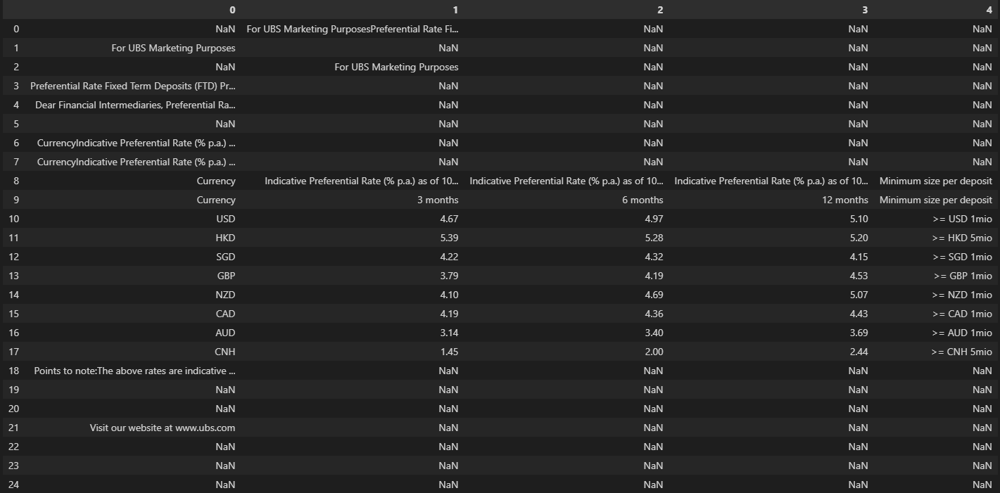
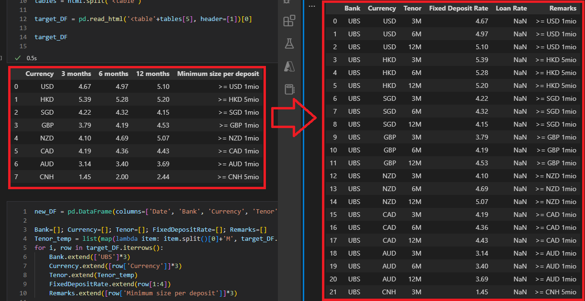

## Examine the HTML
*Use [Best HTML Viewer, HTML Beautifier, HTML Formatter and to Test / Preview HTML Output (codebeautify.org)](https://codebeautify.org/htmlviewer) beautifier to view `html`.*

We can simply use `Pandas.read_html()` to read the tables inside a given `html`.

> If you ever faced the problem `UnicodeDecodeError: 'cp950' codec can't decode byte 0xe2 in position 4204: illegal multibyte sequence`
>
> Simply add a parameter `encoding="utf-8"` to the `open`.[^how-do-i-fix-this-cp950-illegal-multibyte-sequence-unicodedecodeerror-when-rea]

But, what if we have a `HTML` body that has **nested tables**.
```html
<table ...>
  <th>
    <table ...>
      ...
```


We can play with the string by finding the n-th occurence `'<table'` to filter out the unwanted `<table>`. Then use the `header` parameter to anchor the right header.

But how can we transform the table to the format we want?
## Transpose/Transform


Let's ignore the complex `DataFrame` `transpose` things. A simple and intuitive approach will be loop through the `DataFrame` and Create a new `DF`.

Like the above tables, I've written the example code you can refer to.
```python
new_DF = pd.DataFrame(columns=['Date', 'Bank', 'Currency', 'Tenor', 'Fixed Deposit Rate', 'Loan Rate', 'Remarks'])

Bank=[]; Currency=[]; Tenor=[]; FixedDepositRate=[]; Remarks=[]
Tenor_temp = list(map(lambda item: item.split()[0]+'M', target_DF.columns[1:4].to_list()))
for i, row in target_DF.iterrows():
    Bank.extend(['UBS']*3)
    Currency.extend([row['Currency']]*3)
    Tenor.extend(Tenor_temp)
    FixedDepositRate.extend(row[1:4])
    Remarks.extend([row['Minimum size per deposit']]*3)
new_DF['Bank'] = Bank
new_DF['Currency'] = Currency
new_DF['Tenor'] = Tenor
new_DF['Fixed Deposit Rate'] = FixedDepositRate
new_DF['Remarks'] = Remarks
```
How about the `datetime`? How can we handle the local `datetime` issue if we want to deploy the app to the cloud.
### Time Zone
With `classmethod datetime.now(tz=None)`[^datetime-Basic-date-and-time-types-Python-3.11.1-documentation], we have `tzinfo` to get the certain local time. Though the standard library does not define any timezones -- at least not well (the toy example given in [the documentation](http://docs.python.org/2/library/datetime.html#tzinfo-objects) does not handle subtle problems like the ones [mentioned here](http://pytz.sourceforge.net/#problems-with-localtime)).[^python-datetime-tzinfo-time-zone-names-documentation]

My suggestion is to use `timedelta` to change the local time from `utcnow()` instead. For example we want the local time to be fixed to `Taipei time` (utc+8). We can just use `timedelta`:
```python
from datetime import datetime
from datetime import timedelta

_today = datetime.utcnow() + timedelta(hours=8)
```


[^how-do-i-fix-this-cp950-illegal-multibyte-sequence-unicodedecodeerror-when-rea]: [python - How do I fix this cp950 "illegal multibyte sequence" UnicodeDecodeError when reading a text file? - Stack Overflow](https://stackoverflow.com/questions/49021589/how-do-i-fix-this-cp950-illegal-multibyte-sequence-unicodedecodeerror-when-rea)
[^datetime-Basic-date-and-time-types-Python-3.11.1-documentation]: [datetime — Basic date and time types — Python 3.11.1 documentation](https://docs.python.org/3/library/datetime.html#datetime.datetime.now)
[^python-datetime-tzinfo-time-zone-names-documentation]: [Python: datetime tzinfo time zone names documentation - Stack Overflow](https://stackoverflow.com/questions/15692906/python-datetime-tzinfo-time-zone-names-documentation)