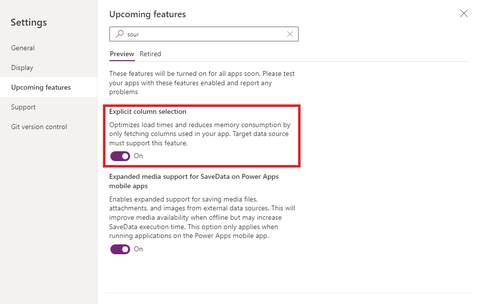

## Problem
[Re: Can't display data after addcolumns() to a dat... - Power Platform Community (microsoft.com)](https://powerusers.microsoft.com/t5/Building-Power-Apps/Can-t-display-data-after-addcolumns-to-a-datasource/m-p/2049326)

Here is the table:

```markup
With(
    {
        isnotteamhead: First(colSession).CurrLevel <> "RO",
        isnotbanker: First(colSession).CurrLevel <> "Banker",
        ro: First(colSession).CurrTeam,
        banker: First(colSession).CurrBanker
    },
    Search(
        AddColumns(
            GroupBy(
                Filter(
                    WAM_Trade_Summarizes,
                    FinalDate_yyyymm in ComboBoxTradeFinalDate.SelectedItems,

                    (isnotteamhead || RO_gb=ro),
                    (isnotbanker || GroupBanker_gb=banker)
                ),
                "crfb8_statement_prod_type_gb", "rest"
            ),
            "total_income", Sum(rest, Final_Rev_gb),
            "total_aum", Sum(rest, Total_amount_gb)
        ),
        SearchTypeRevenue.Text, "crfb8_statement_prod_type_gb"
    )
)
```

It looks like this:


I am able to see the table is generated successfully though the `addColumns()` generated columns (`total_aum`, `total_income`) couldn't be displayed in a gallery or anywhere in the canvas app.

fx: `First(table).total_income` should display 0 not blank().


Same when I try to retrieve data within a gallery.


Has anyone faced a similar situation? I'm stuck :dizzy_face:


Even weirder now when I tested it with Label. In the Ideas, it showed Current formate xxxxxx.xx means the data was fetched successfully. But it just wouldn't show. So confused :dizzy_face:


## Solution

Then I found the problem is because of the **Explicit column selection** feature again.

When I tried to calculate the `total_income` number in the gallery.
```
Sum(
    Thisitem.rest, revenue
)
```
The data was able to be **retrieved** and **displayed** successfully. So I figured the problem would be 
>`AddColumns()` wouldn't be considered

when you have **Explicit column selection** ticked.

Below is the trick I used to retrieve the needed data at the first steps of `With()` instead of using `ShowColumns()` to explicitly select columns but still able to tell the power apps to load the data.
```
With(
    {
        userlevel_isnot_banker: First(colSession).UserLevel <> "Banker",
        isnotteamhead: First(colSession).CurrLevel <> "RO",
        isnotbanker: First(colSession).CurrLevel <> "Banker",
        ro: First(colSession).CurrTeam,
        banker: First(colSession).CurrBanker,
        fetch_Final_Rev_gb: First(WAM_Trade_Summarizes).Final_Rev_gb,
        fetch_Total_amount_gb: First(WAM_Trade_Summarizes).Total_amount_gb
    },
    Search(
        AddColumns(
            GroupBy(
                Filter(
                    WAM_Trade_Summarizes,
                    FinalDate_yyyymm in ComboBoxTradeFinalDate.SelectedItems,

                    (isnotteamhead || RO_gb=ro),
                    (isnotbanker || GroupBanker_gb=banker),

                    (userlevel_isnot_banker || (
                        Statement_prod_type_gb <> "Extra Rate" &&
                        Statement_prod_type_gb <> "Management fee" &&
                        Statement_prod_type_gb <> "Error"
                    ))
                ),
                "crfb8_statement_prod_type_gb", "rest"
            ),
            "total_income", Sum(rest, Final_Rev_gb),
            "total_aum", Sum(rest, Total_amount_gb)
        ),
        SearchTypeRevenue.Text, "crfb8_statement_prod_type_gb"
    )
)
```
Notice, I use `fetch_Final_Rev_gb: First(WAM_Trade_Summarizes).Final_Rev_gb`, `fetch_Total_amount_gb: First(WAM_Trade_Summarizes).Total_amount_gb` to achieve the goal.