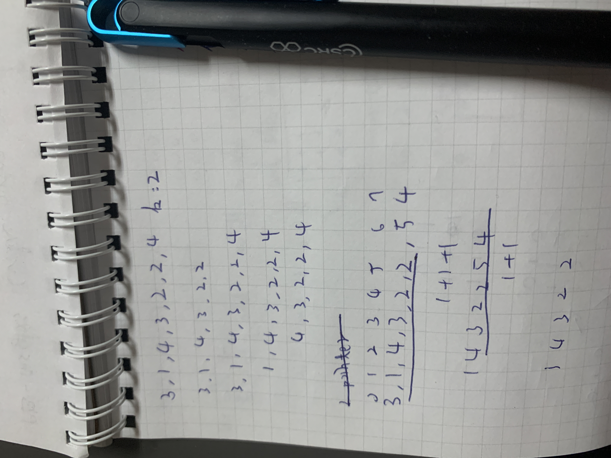
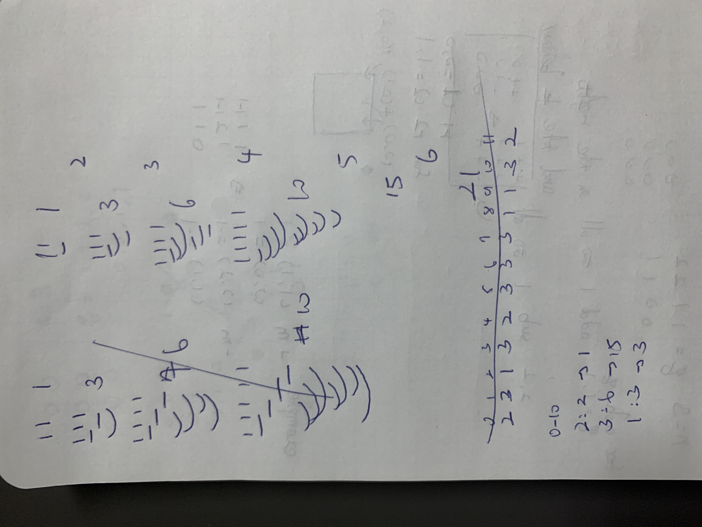

## Count the Number of Good Subarrays

Given an integer array  `nums`  and an integer  `k`, return  _the number of  **good**  subarrays of_  `nums`.

A subarray  `arr`  is  **good**  if it there are  **at least** `k`  pairs of indices  `(i, j)`  such that  `i < j`  and  `arr[i] == arr[j]`.

A  **subarray**  is a contiguous  **non-empty**  sequence of elements within an array.

**Example 1:**

**Input:** nums = [1,1,1,1,1], k = 10
**Output:** 1
**Explanation:** The only good subarray is the array nums itself.

**Example 2:**

**Input:** nums = [3,1,4,3,2,2,4], k = 2
**Output:** 4
**Explanation:** There are 4 different good subarrays:
- [3,1,4,3,2,2] that has 2 pairs.
- [3,1,4,3,2,2,4] that has 3 pairs.
- [1,4,3,2,2,4] that has 2 pairs.
- [4,3,2,2,4] that has 2 pairs.

**Constraints:**

-   `1 <= nums.length <= 105`
-   `1 <= nums[i], k <= 109`

## Solution
### Sliding Window
Intuitive Sliding Window O(n) Python Solution 

Dry run some examples with sliding window technique.


Notice. You need to make sure the left most window, mid-window, and the right most window all collected. With the trend we found below:


Combine them to implement the solution.
```python
class Solution:
    def countGood(self, nums: List[int], k: int) -> int:
        right = left = 0
        window = defaultdict(int)
        pairs_count = defaultdict(int)
        ans = 0
        while left < len(nums)-1:
            # extend window
            if right < len(nums):
                window[nums[right]] += 1
                if window[nums[right]] >= 2:
                    pairs_count[nums[right]] += window[nums[right]]-1

            while sum([v for v in pairs_count.values()]) >= k:
                ans += len(nums)-right if len(nums)-right else 1
                # shrink window
                window[nums[left]] -= 1
                if window[nums[left]] >= 1:
                    pairs_count[nums[left]] -= window[nums[left]]
                left += 1
                continue

            if right < len(nums):
                right += 1
            else:
                left += 1
        return ans
```