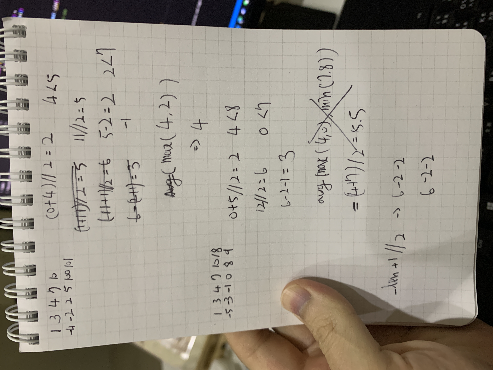

## Median of Two Sorted Arrays

Given two sorted arrays  `nums1`  and  `nums2`  of size  `m`  and  `n`  respectively, return  **the median**  of the two sorted arrays.

The overall run time complexity should be  `O(log (m+n))`.

**Example 1:**

**Input:** nums1 = [1,3], nums2 = [2]
**Output:** 2.00000
**Explanation:** merged array = [1,2,3] and median is 2.

**Example 2:**

**Input:** nums1 = [1,2], nums2 = [3,4]
**Output:** 2.50000
**Explanation:** merged array = [1,2,3,4] and median is (2 + 3) / 2 = 2.5.

**Constraints:**

-   `nums1.length == m`
-   `nums2.length == n`
-   `0 <= m <= 1000`
-   `0 <= n <= 1000`
-   `1 <= m + n <= 2000`
-   `-10^6 <= nums1[i], nums2[i] <= 10^6`

## Solution
Most Python solution you can find usding either this or kth solution they sliced the `nums1` and `nums2` for loop and it makes the time complexity from $O(\log n)$ to $O(n\log n)$.

**Slicing Examples:**
1. `return self.kth(a, b[ib + 1:], k - ib - 1)` by [clue](https://leetcode.com/clue/)
2. `return self.findKth(A[:i],B[j:],i)` by [yawnzheng](https://leetcode.com/yawnzheng/)

### Optimized
Here I share a solution using pointer to avoid such the problem so that we can really get the $O(\log min(m, n))$ time complexity.



```python
class Solution:
    def findMedianSortedArrays(self, nums1: List[int], nums2: List[int]) -> float:
        _len = len(nums1) + len(nums2)
        if len(nums1) > len(nums2): # let nums1 be the short one
            nums1, nums2 = nums2, nums1

        mid1 = len(nums1) // 2
        while True:
            mid2 = (_len+1) // 2 - mid1 -1
            if (
                1 <= mid1 <= len(nums1) and
                0 <= mid2+1 < len(nums2) and
                nums1[mid1-1] > nums2[mid2+1]
            ):
                mid1 -= 1
            elif (
                0 <= mid1 < len(nums1) and 
                0 <= mid2 < len(nums2) and
                nums2[mid2] > nums1[mid1]
            ):
                mid1 += 1
            
            # found the partition
            else:
                lu = nums1[mid1-1] if 1 <= mid1 <= len(nums1) else -(10**6)
                ld = nums2[mid2] if 0 <= mid2 < len(nums2) else -(10**6)
                ru = nums1[mid1] if 0 <= mid1 < len(nums1) else 10**6
                rd = nums2[mid2+1] if 0 <= mid2+1 < len(nums2) else 10**6
                if _len % 2 == 1:
                    return max(lu, ld)
                return ( max(lu, ld) + min(ru, rd) ) /2
```

If you don't understand the concept please have a look at the below video first by [@tusharroy2525](https://www.youtube.com/@tusharroy2525/about). 

