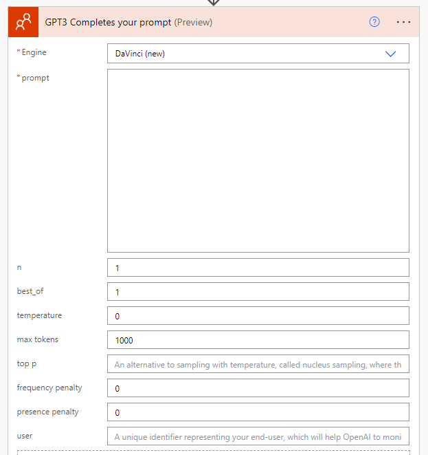

## OpenAI Connector
[OpenAI (Independent Publisher) - Connectors | Microsoft Learn](https://learn.microsoft.com/en-us/connectors/openaiip/#gpt3-completes-your-prompt)

The OpenAI IP Connector is a tool that allows you to use GPT-3 to complete your prompts in Microsoft Learn. You can write a partial sentence or paragraph and let GPT-3 generate the rest of the text based on your style and tone. You can also adjust the parameters such as creativity, length and temperature to fine-tune the output. The OpenAI IP Connector is a great way to enhance your learning experience and explore new possibilities with GPT-3.

## Use it in Power Automate

Search the **GPT3 Completes your prompt** Connector in your power automate flow then give it a name and Enter API Key as `Bearer YOUR_API_KEY`. When entering your API key in the Power Platform, you need to type it as: "Bearer YOUR_API_KEY" (the word "Bearer" a blank and the actual API_KEY).[^OpenAI]
[^OpenAI]: [PowerPlatformConnectors/independent-publisher-connectors/OpenAI at dev · microsoft/PowerPlatformConnectors (github.com)](https://github.com/microsoft/PowerPlatformConnectors/tree/dev/independent-publisher-connectors/OpenAI)

And you can find API Key here: [Overview - OpenAI API](https://platform.openai.com/) with the documentation i.e. Token Usage, Parameters setting etc.

## Pass Long Content
There is an 4096 token limitation in openai so you wouldn't be able to pass a content or receive the prompt longer than that. **What if you need openAI help you to summarize a great content but too long.**

Congratulations! I will show you a workaround for you in power platform.
### Sharepoint
You can 