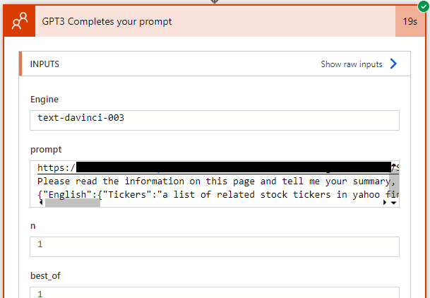

## OpenAI Connector
[OpenAI (Independent Publisher) - Connectors | Microsoft Learn](https://learn.microsoft.com/en-us/connectors/openaiip/#gpt3-completes-your-prompt)

The OpenAI IP Connector is a tool that allows you to use GPT-3 to complete your prompts in Microsoft Learn. You can write a partial sentence or paragraph and let GPT-3 generate the rest of the text based on your style and tone. You can also adjust the parameters such as creativity, length and temperature to fine-tune the output. The OpenAI IP Connector is a great way to enhance your learning experience and explore new possibilities with GPT-3.

## Use it in Power Automate

Search the **GPT3 Completes your prompt** Connector in your power automate flow then give it a name and Enter API Key as `Bearer YOUR_API_KEY`. When entering your API key in the Power Platform, you need to type it as: "Bearer YOUR_API_KEY" (the word "Bearer" a blank and the actual API_KEY).[^OpenAI]
[^OpenAI]: [PowerPlatformConnectors/independent-publisher-connectors/OpenAI at dev · microsoft/PowerPlatformConnectors (github.com)](https://github.com/microsoft/PowerPlatformConnectors/tree/dev/independent-publisher-connectors/OpenAI)

And you can find API Key here: [Overview - OpenAI API](https://platform.openai.com/) with the documentation i.e. Token Usage, Parameters setting etc.

## Pass Long Content
There is a 4096 token limitation in openai so you wouldn't be able to pass contents or receive the prompt longer than that. **What if you need openAI help you to summarize great contents but too long?**

Congratulations! I will show you a workaround for you in the power platform.
### Sharepoint for a Link
You can store the contents as a html etc. and put in on Sharepoint List like I did here. Then share it as a link to GPT3 for the task. This way you saved a ton of tokens but still get it reading the contents and doing the job for you.

Now another problem came up. How do we structure the response so that we can write the data back to our database? There are many ways to do this. Here I show you a simple example.

## Structure The Answer
You can either show an example or explicitly tell the machine to do what you want. In most situations, they work as same and will give you the result you want. But if we want to write it back to our database, we need them to be standardized like if I ask the GPT to summarize the link provided and extract certain information. I can do:
```
<URL>

Please read the information on this page and tell me your summary, and the related stock tickers and related industries mentioned in the following way in 2 languages - English and Traditional Chinese.
[English]
1. summary: the summary of this page
2. tickers: a list of related stock tickers in yahoo finance format i.e. [AAPL, GOOG] if there are no related stock tickers, return leave []
3. industries: a list of the related industries as above put them in [] using "," as separators if there are no related industries, leave []
[繁體中文]
1.大綱:...
2.標的股票:...
3.產業:...
```
Or you can replace the format if you want the JSON format.
```
<URL>
Please read the information on this page and tell me your summary, and the related stock tickers and related industries mentioned in the following way in 2 languages - English and Traditional Chinese.
{
    "English": {
        "Tickers": "a list of related stock tickers in yahoo finance format i.e. [AAPL, GOOG] if there are no related stock tickers, return leave []",
        "Summary": "the summary of this info",
        "Industries": "a list of the related industries as above put them in [] using ',' as separators if there are no related industries, leave []"
    },
    "繁體中文":{
        "大綱": "上面的Summary中文版",
        "產業": "上面的Industries中文版"
    }
}
```
But in this format, it will reply with the format full of space as we typed above. For better usage, we need to give the GPT a more specific guide and remove the space and`\n` etc. That is, compose a JSON schema. The final request will be something like this:
```
<URL>
Please read the information on this page and tell me your summary, and the related stock tickers and related industries mentioned in the following format(json) in 2 languages - English and Traditional Chinese.
{"English":{"Tickers":"a list of related stock tickers in yahoo finance format i.e. [AAPL, GOOG] if there are no related stock tickers, return []","Summary":"the summary of this info","Industries":"a list of the related industries as above put them in [] using ',' as separators if there are no related industries, return []"},"繁體中文":{"大綱":"上面的Summary中文版","產業":"上面的Industries中文版"}}
```
You can use this site to easily minify your JSON - [Best JSON Viewer and JSON Beautifier Online (codebeautify.org)](https://codebeautify.org/jsonviewer), this site to convert your JSON to JSON schema - [Free Online JSON to JSON Schema Converter (liquid-technologies.com)](https://www.liquid-technologies.com/online-json-to-schema-converter).

At first, I tried to compose it by myself and examine it through [this site](https://www.liquid-technologies.com/online-json-to-schema-converter) but found it so inefficient and in a way, I think this site doesn't work so well so I strongly suggest just using the combination of the above two sites to form a schema and minification.

Last, the question is how do we read the answer in Power Automate.