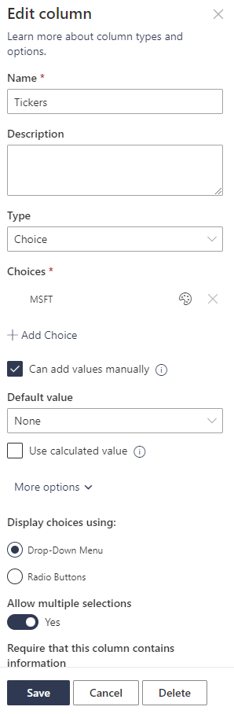
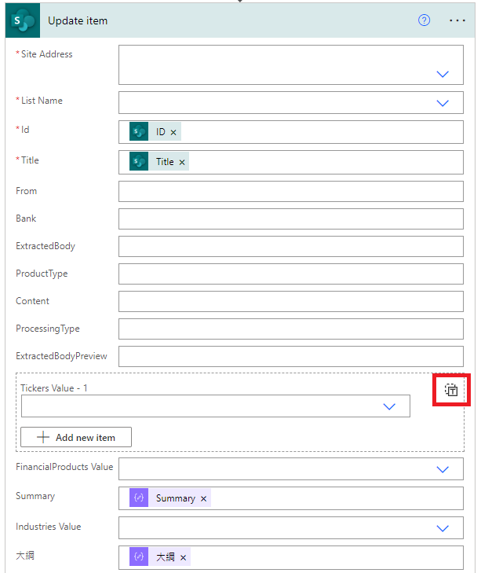
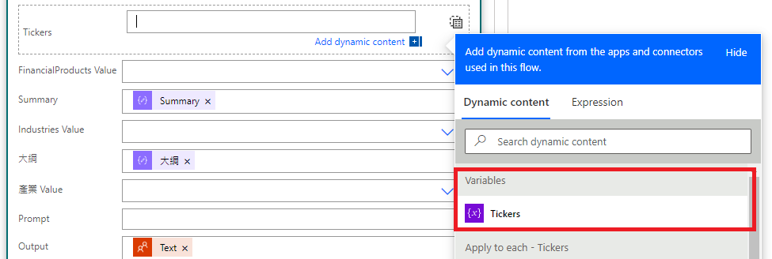

## Update Sharepoint List Item Choice Column
**Power Automate - Microsoft Forms & SharePoint choice field (multi-select) updates**

You can update the choice list item by this:


### TL;DW
Make sure you can generate the following `cell value`/`item`:
```
{
  "Value": "<iterated item>"
}
```
But like [Destroyzer](https://www.youtube.com/channel/UCoKVtS-C2ON7pP9MxXB5-NQ) mentioned:
> the items is added on my list in this way:
> 
> {"Value":"Desvio em processo"}{"Value":"Desvio em relatório"}

or it will show like `@variable('YourArrayVariable')` literally when you try to add it manually. We just can't add the arr variable to the PA connector by **Dynamic Content**. Why?

### Solution
It turned out it's the column setting in the Sharepoint List was wrong. Make sure you've selected the **Allow multiple selections** in the advanced setting of the choices column.

Then you can go back to your Power Automate flow. You'll see the input box changed. Then you clicked on the icon shown below to *switch to input entire array mode*.

Vola! Now you can add the array variable you created before to the choice column.


## Difference Between Choices and Distinct
> *powerapps combobox choice column*
>
> *powerapps error loading control*
>
> *powerapps filter choices column*

If you're in search of a solution or just kind of want to know the Difference Between Choices and Distinct. You're in the right place.

Let's first look at the first question - *powerapps combobox choice column*.

### Why you shouldn't use choice for your Combobox
You should check the purpose of your combo box because the `Choices()` will show the default items in the column setting instead of the existing values in the column. To achieve this, you can use `Distinct()` and `Ungroup()`. Below is an example:
```
Ungroup(Distinct('Your List', Tickers), "Value")
```

For the second question - *powerapps error loading control*. The answer is easy. Just go check the `items`/`data source` of your combobox first.

Then, the last question, **how do you filter choices column in Sharepoint list in PowerApps** - *powerapps filter choices column*.
### PowerApps Filter Choices Column
We already know the `Choices` will return the table of the set and you know that each row/cell of a choices column is basically a table in power apps. So the problem is easy.

> Use `ShowColumns()`

Here is an example:
```
With(
    {
        selected_ticker: ComboBoxTickers.Selected.Value
    },
    Filter(
        'Your List',
        (IsBlank(selected_ticker) || selected_ticker in ShowColumns(Tickers,"Value"))
    )
)
```
Feel free to leave a comment if you have any questions :smile: