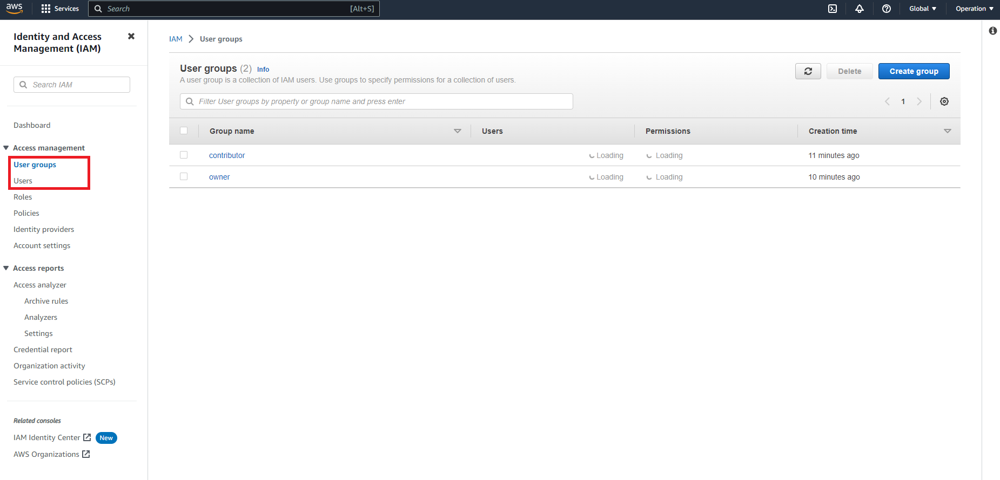

## Handover Documentation: Ensuring a Smooth Transition
Power Platform and Cloud (Azure, AWS) Handover to the other employees

**Power Platform and Cloud Handover Documentation: Ensuring a Smooth Transition**

This article serves as a guide for smoothly transitioning Power Platform and Cloud (Azure, AWS) responsibilities to a new employee when an individual resigns. As organizations increasingly rely on these technologies, it becomes crucial to ensure a seamless handover process to maintain business continuity. The documentation outlines key aspects that need to be addressed during the handover, including an overview of the Power Platform and Cloud environment, relevant processes and workflows, and essential considerations for the new employee.

The article emphasizes the importance of comprehensive documentation, providing clear instructions on accessing and managing Power Platform resources, Azure or AWS environments, and associated services. It covers the documentation of existing solutions, workflows, and customizations, allowing the new employee to understand the system's functionalities and dependencies. Additionally, it highlights best practices for organizing documentation to ensure easy navigation and comprehension.

The handover documentation also addresses user access management, including instructions for provisioning and revoking user accounts, permissions, and security configurations. It emphasizes the significance of safeguarding sensitive data and ensuring compliance with relevant regulations.

Furthermore, the article encourages collaboration between the outgoing and incoming employees during the handover process. It emphasizes the importance of knowledge sharing sessions, providing opportunities for the new employee to ask questions, clarify doubts, and gain insights from the departing employee's experience.

Lastly, the documentation stresses the significance of continuous improvement and encourages the new employee to stay updated on industry trends, attend relevant training sessions, and leverage available resources to enhance their knowledge and skills.

By following the guidelines outlined in this article, organizations can ensure a smooth and efficient transition of Power Platform and Cloud responsibilities, minimizing disruptions and maximizing the new employee's potential to contribute effectively from the start.
## Check List
- [x] Positions documentation
- [x] all repositories back up both places
- [ ] all files back up both places
- [ ] forms copy
- [ ] PowerAutomate copy ALL from the `Owner`
- [ ] PowerApps copy
- [x] AWS root user and billing acct
  - [x] C&P lambda and s3
    - [x] reconnect the APIs
  - [x] build a proper structure
- [ ] AWS CI/CD demo
- [x] Azure root user and billing acct
  - [x] Repository back-up
    - [x] CheckHoliday
      - [x] HolidayChecker
    - [x] IB-quotation
      - [x] extract_html
    - [x] KO-Notification
      - [x] get_CurrentPrice
      - [x] get_MarketData
      - [x] list_to_json
    - ~~[x] MonthlyReportHTML~~
      - ~~[x] TableandChart~~
    - [x] *PreferentialRateExtractor*
      - [x] *HttpTrigger*
    - [x] ~~*SharedInvestmentMailBodyExtractor*~~
  - [x] [CI/CD](#cicd)
  - [x] [Local Test](#local-test)
    - [x] [REST Client](#rest-client)

## Power Platform
what happened to my PowerApps and automates if my account gets deleted after I resign?

I've developed lots of power automate and SharePoint lists and power apps. Most of them are shared or co-owned. What would happen to them if my account gets deleted after I resign from the current company?

I imagine the not-shared would also be deleted, but how about those that were shared and even co-owned? Thank you.

> [BCBuizer](https://powerusers.microsoft.com/t5/user/viewprofilepage/user-id/266500)[^whathappenedtomyPowerAppsandautomates]:
>
> Any flows where you are the full **owner** will no longer work since there is no plan (which is tied to your account) to run them on. Also the connection references will break. 
>
> For Power Apps, in my personal experience, it doesn't seem like to big of an issue.
>
> In any case it is advised to transfer / replace ownership of all involved components to another user or, ideally, a service account before your account gets deleted.

[^whathappenedtomyPowerAppsandautomates]: [Solved: Re: what happened to my PowerApps and automates if... - Power Platform Community (microsoft.com)](https://powerusers.microsoft.com/t5/Building-Power-Apps/what-happened-to-my-PowerApps-and-automates-if-my-account-gets/m-p/2157698#M540222)


## Azure
### Assign a user (add a role)
[Assign a user as an administrator of an Azure subscription - Azure RBAC | Microsoft Learn](https://learn.microsoft.com/en-us/azure/role-based-access-control/role-assignments-portal-subscription-admin)

Then make sure the others can see your resources.


**difference between add role assignment and add co-administrator in azure**

In Azure, "Add Role Assignment" and "Add Co-Administrator" are two different ways to grant permissions and access rights to users within an Azure subscription. Here's a brief explanation of each:

1. Add Role Assignment:
"Add Role Assignment" allows you to assign a specific role to a user or group at a specific scope within an Azure subscription. A role defines a set of permissions that determine what actions the user can perform and what resources they can access within that scope. By assigning a role, you grant the user the specified permissions associated with that role. Role assignments are more granular and allow for fine-grained control over permissions.

For example, you can assign the "Virtual Machine Contributor" role to a user, which would allow them to manage virtual machines (create, start, stop, etc.) but not have access to other Azure resources. Role assignments can be made at the subscription level, resource group level, or even at the individual resource level.

2. Add Co-Administrator:
"Add Co-Administrator" is a legacy method in Azure that grants full administrative access to an Azure subscription. A co-administrator has the highest level of access and can perform any action within the subscription, including managing resources, configuring services, and assigning roles. By adding a co-administrator, you give the user full control over the subscription.

It's important to note that the "Add Co-Administrator" option is being deprecated in favor of Azure role-based access control (RBAC), which provides more granular control over permissions and follows the principle of least privilege. It's recommended to use RBAC and "Add Role Assignment" instead of adding co-administrators whenever possible.

In summary, "Add Role Assignment" allows you to assign specific roles with defined permissions to users at different scopes, while **"Add Co-Administrator" grants full administrative access** to the Azure subscription. RBAC and role assignments offer more flexibility and security in managing user permissions within Azure.

**But how to transfer azure credits to another account?**
### Transfer billing ownership
Head over to Azure Portal and search for `Subscriptions` and follow the steps: [Transfer billing ownership of an MOSP Azure subscription - Microsoft Cost Management | Microsoft Learn](https://learn.microsoft.com/en-us/azure/cost-management-billing/manage/billing-subscription-transfer).

### Create Function App in Azure
#### VSCode Extensions
**Install** > **Sign-in** > **Create Function App in Azure**

### Maintain and Deploy
#### CI/CD


Create and Deploy:

#### Local Test


Edit in VSCode, you can open the Azure extension and click on `Execute Function Now` or just press on *F5* at `__init__.py` to run the local test.

or

_F5_ is equivalent to `func start` in the terminal.

> **Prerequisites[^'func'isnotrecognized]:**
> - [Downloading and Installing Node.js and npm](https://docs.npmjs.com/downloading-and-installing-node-js-and-npm)
> - [NVM for Windows](https://github.com/coreybutler/nvm-windows/releases)
>
> Then install [Azure/azure-functions-core-tools: Command line tools for Azure Functions (github.com)](https://github.com/Azure/azure-functions-core-tools#installing) using command or URL.
>
> And make sure it's in your Environment Variable Path.
> 
[^'func'isnotrecognized]: [python - 'func' is not recognized as an internal or external command, operable program or batch file - Stack Overflow](https://stackoverflow.com/questions/56526088/func-is-not-recognized-as-an-internal-or-external-command-operable-program-or)
##### REST Client
> Install **REST Client** extension on your VSCode if you don't already have it.
>
> 

Remember the api url at the [last step](#local-test): `http://localhost:<port>/api/<your api name>`


Make a file with the file name ends with `<your file name>.http` and the content EXAMPLE:
```http
POST http://localhost:7071/api/YOURAPINAME HTTP/1.1
Content-Type: application/json

{
  "email_body": "none",
  "bank": "abc"
}
```
(Similar to postman)

Then press on `F1` or `Ctrl`+`Alr`+`R` to **Send the Request** to your local server.
## AWS
### Add another root user

Can AWS have multiple root users?

While you can only have one root user for each AWS account, your organization doesn’t need to have everything on AWS running within a single AWS account.[^AWSRootAccountBestPractices]

[^AWSRootAccountBestPractices]: [AWS Root Account Best Practices | Logicata](https://www.logicata.com/blog/aws-root-user-best-practices/#:~:text=While%20you%20can%20only%20have,within%20a%20single%20AWS%20account.)

- **[amazon web services - How to share lambda function with another user in organization - Stack Overflow](https://stackoverflow.com/questions/58441717/how-to-share-lambda-function-with-another-user-in-organization)**
- **[AWS Account Structure Considerations - Laying the Foundation: Setting Up Your Environment for Cost Optimization (amazon.com)](https://docs.aws.amazon.com/whitepapers/latest/cost-optimization-laying-the-foundation/aws-account-structure.html)**
- **[(4) AWS environment for dev, stage and prod opinions : aws (reddit.com)](https://www.reddit.com/r/aws/comments/6ajxni/aws_environment_for_dev_stage_and_prod_opinions/)**

**How to solve it?**
### New AWS Account Structure
1 main/master acct for all (billing and control) - root (operation).

Deploy to operation - [AWS Deploy Lambda Function, API Gateway, Invoke/Call another Lambda Function, Save to S3, Public Access etc.](https://chienhsiang-hung.github.io/blog/posts/2023/aws-deploy-lambda-function-api-gateway-invoke-call-another-lambda-function-save-to-s3-public-access-etc/).

### Access Management
If the above won't work, try a simpler way *Access Management*- Add **User Groups** and **Users**.

First Add Group then Add User and make sure you assign the psw w/ **Manage Console Access**.

Or you can Provide User Access at Create Stage.

*Note: The last is to check and make sure the IAM users are in the same Region (at the top right corner to toggle) when they try to maintain the function.*