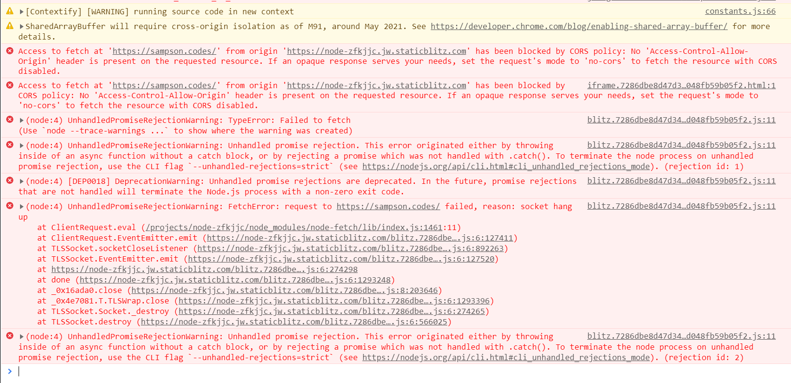
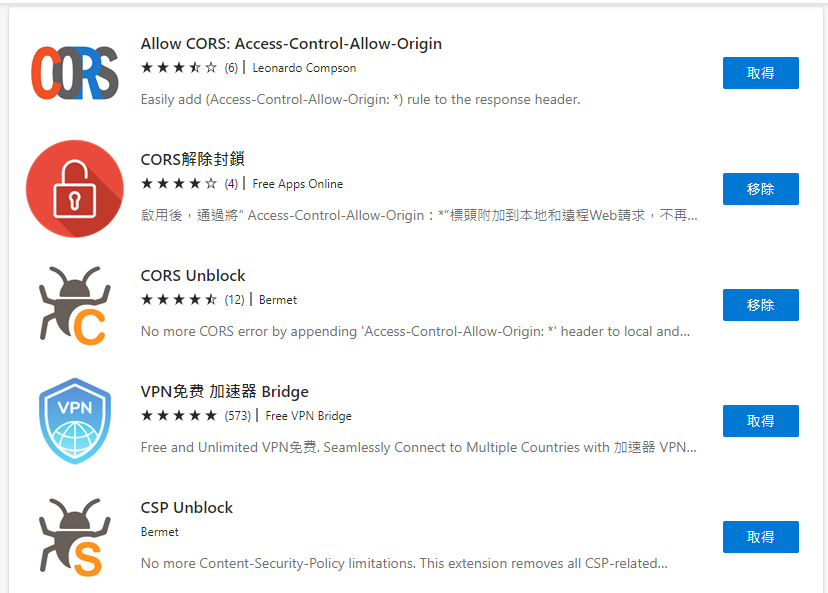

## StackBlitz
> StackBlitz is an instant fullstack web IDE for the JavaScript ecosystem. It's powered by WebContainers, the first WebAssembly-based operating system which boots the Node.js environment in milliseconds, securely within your browser tab. This allows you to use the web to build the web. StackBlitz is a browser-based IDE that lets you create and share secure, reproducible, and fast dev environments for web and Node.js projects. You can boot a fresh environment in milliseconds, run live templates for bug reports, and debug with Chrome Dev Tools.

I was trying StackBlitz at first and soon to realize it's not easy to manage your Hugo site on top of that.

### How to manage Hugo on StackBlitz?
There is no way to install Hugo to the StackBlitz machine so I figured that I can maybe install it via npm as a module and use it. (Because Node.js is supported on the platform.)

#### Download Hugo
- [hugo-installer - npm (npmjs.com)](https://www.npmjs.com/package/hugo-installer)
- [dominique-mueller/hugo-installer: Installs hugo into your repository. (github.com)](https://github.com/dominique-mueller/hugo-installer/tree/develop?tab=readme-ov-file)

`npm install hugo-installer --save-dev`

You will see `Socket hang up` Error msg. It's due to the browser rejecting the request because of CORS reasons.[^Socket-hang-up]

[^Socket-hang-up]: [BUG: node-fetch/https.get doesn't work (Socket hang up) · Issue #7 · stackblitz/webcontainer-core (github.com)](https://github.com/stackblitz/webcontainer-core/issues/7)

#### Unblock CORS
I even tried **Unblock CORS** which resulting in access denied (403 forbidden) from StackBlitz proxy.

I even tried downloading these extensions[^WebBrowserTools] on my Edge but still failed (Worked at addressing CORS issue but still not able to download the package).

[^WebBrowserTools]: [Test CORS :: WebBrowserTools](https://webbrowsertools.com/test-cors/)

**What's the workaround?**
## GitHub Codespaces
Follow the steps here [hugo-installer - npm (npmjs.com)](https://www.npmjs.com/package/hugo-installer) and check out the example [chienhsiang-hung/blog (github.com)](https://github.com/chienhsiang-hung/blog).