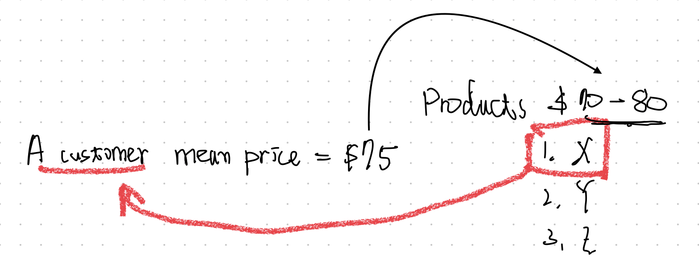
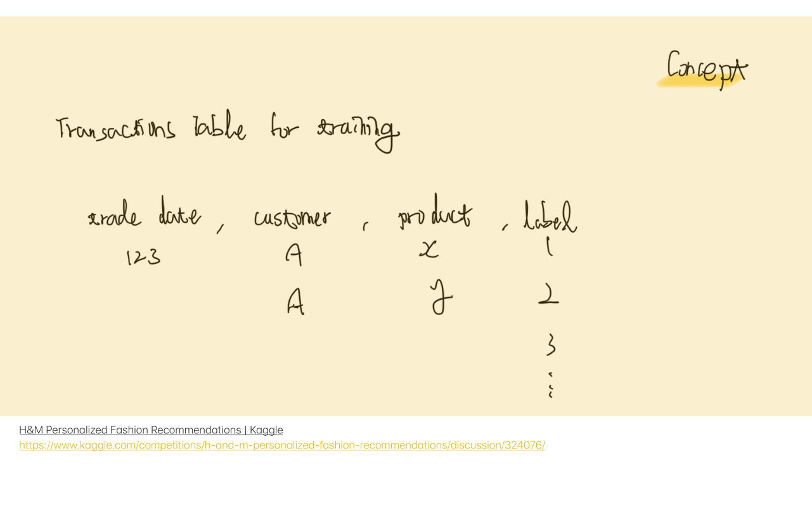

## 目錄
1. 選題原由
2. 建模內容與成效說明
3. 發現
4. 應用場景

## 摘要
Title: Building a Personalized Fashion Recommendation System using Customer Purchase History and Product Information

This project aims to develop a recommendation system that predicts the products customers are likely to purchase in the coming week based on their past purchase history and product information. The dataset used for this project is sourced from H&M's Kaggle competition, which includes product information such as text and images.

The motivation behind this project is to help businesses personalize their marketing strategies and improve customer satisfaction by providing relevant product recommendations.

Various modeling techniques were applied, including collaborative filtering and deep learning, to develop the recommendation system. The performance of the models was evaluated using metrics such as recall, precision, and F1 score. The results showed that the deep learning model outperformed the collaborative filtering model.

Insights were obtained from the analysis of customer purchase behavior, including identifying different customer segments and their preferences for product categories. The customer lifetime value (CLTV) was also calculated to estimate the potential profitability of different customer segments.

The methods and insights obtained from this project can be applied to other industries, including the financial sector, to develop personalized marketing strategies and improve customer retention. For example, banks can use customer transaction history and financial data to develop personalized investment recommendations, while insurance companies can use customer demographic data and claim history to offer customized insurance packages.

## 題目
[H&M Personalized Fashion Recommendations | Kaggle](https://www.kaggle.com/competitions/h-and-m-personalized-fashion-recommendations/overview)

> Provide product recommendations based on previous purchases

根據客戶過去**一段時間內**的<mark>商品購買紀錄</mark>以及<mark>商品資訊(文字、圖片)</mark>精準<mark>預測未來一週內可能購買的商品</mark>。可以延伸分析**不同客群對商品組合的偏好**、**客戶CLTV**等。

## 筆記
<object data="H&M%20Personalized%20Fashion%20Recommendations.pdf" type="application/pdf" width="100%" height="600px">
    <embed src="H&M%20Personalized%20Fashion%20Recommendations.pdf">
        
This browser does not support PDFs. Please download the PDF to view it: <a href="H&M%20Personalized%20Fashion%20Recommendations.pdf">Download PDF</a>.

    </embed>
</object>

### 選題原由
第一題是推薦系統，第二題是進銷存系統

以金融業的商業模式來說，推薦系統會是更值得優先投入的領域

## 問題、資料與模型
預測12個最好的候選推薦，從105542個articles

*我們知道這類ranking問題可以用LGBM, XGBoost, CatBoost等來處理*

但要根據每個使用者特徵對10萬個商品預測排序似乎不太實際，因此我們還需要在前一步加filter，或者說-選出候選人（召回）

初步的流程就會是從pool召回幾十到幾百個，然後再排序出前12個。因為排序是從召回的候選人來進行，因此，要是前面召回不夠精準，後面排序模型再準確也沒用，那麼召回流程就至關重要。

關鍵問題就來了，我們該如何來進行召回呢？怎麼做才能從10萬筆項目中找出有效候選人（候選項目）？

## 資料集data
首先我們來看看我們手上有哪些資料集
- 商品圖庫
- 商品敘述(主要為文字): 商品分類、顏色、款式及用戶群(男女老幼)等
- 顧客資料: 區域、年齡及是否接受電子行銷等
- 顧客消費紀錄: 顧客、價格與通路等

## 資料處理與特徵
資料量有多少呢（35GB）

10萬種產品、3千萬筆交易
- 召回方法

  **(light-weight召回，不用CF跟img/txt embedding 節省時間)**

  **平均約25個排序候選每次購買** 
  1. 找出購買這些產品的人還購買什麼(找出5個，以過去一個禮拜為限)
  2. 只找過去一週有銷售的商品
  3. 去除少於兩人購買的商品

  **(少於12的用過去一週熱門商品補齊)**

  **意義: 找出有相同購買喜好的消費者過去一週都買了些什麼 -> CF且隱含時間資訊**

- 特徵
  - 配對商品總配對數
  - 近期該商品被購買次數

## 建模結果與分析
LGBMRanker來排序，分數為...

召回方法、特徵、排序比較

#### 其他方法-百個候選人
- 過去購買過（商品、類別）
- user based collaborative filtering
- item to item similarity
- 上一週熱門產品
- 去年同期熱門產品
- graph embedding（圖片分類）
- logistic regression on 類別資訊（分類、款式、年齡、地區等）

### 特徵
*（50%使用者近三個月沒有交易紀錄）*

**增加**
- 日期
- 顧客商品購買次數、顧客分類購買次數 (周月季/去年同期(周)/全期/時間加權)
- 上次距離這次購買日期差異、商品新舊ratio（顧客為key）

  商品第一次在交易紀錄中出現日期視為產品release date與購買日期的ratio

  判斷消費者對於新舊產品的喜好

- 平均、最大、最小購買價格

- 商品平均銷售年齡與使用者年齡差距、商品總銷售

**移除**
- 移除article ID, product code避免overfitting

#### 冷啟動
用*熱門產品*但缺乏動態資訊，效果不好

直接用模型的top12即可

### 訓練與測試

每一個顧客都有百個候選商品（會有太多negative samples）(will lead to common inbalance problems)
- negative samples 數量太多

  Downsampling to 可以隨機抽樣，一到兩百萬個每週(for all customers)有比較好的performance

#### CV
用最後一週當作測試集

做5個folds

## 應用分析
*本次數據分析在金融業中的應用場景也非常廣泛。例如，銀行可以使用類似的數據分析方法，根據客戶的金融紀錄和交易行為，對客戶進行個性化推薦金融產品，例如貸款、投資產品、信用卡等。此外，保險公司也可以使用類似的方法來預測客戶的風險概率，以更好地評估客戶的風險水平並定價保險產品。*
### 建模與特徵經驗
從H&M的建模經驗中，可以沿用以下特徵和方法：

商品屬性特徵處理：H&M將商品的品牌、分類、顏色等屬性進行處理，以便在模型中使用。這種方法可以適用於任何具有商品屬性的領域，例如零售、食品等行業。

個人化推薦模型：H&M的模型是基於用戶過去的購買記錄和商品屬性等信息進行建模，從而推薦相似的商品。這種個人化推薦模型可以在電商、零售等領域中使用。

時序數據處理：H&M在建模中考慮了時間因素，將過去一段時間內的購買記錄作為特徵加入模型中，以預測未來一周的購買情況。這種方法可以適用於任何具有時序性的領域，例如金融、醫療等行業。

分析客戶偏好：H&M的模型可以分析不同客戶對商品組合的偏好，從而提供更個性化的推薦。這種方法可以在任何領域中使用，例如餐飲、旅遊等行業。

模型評估：H&M的模型使用了多種評估指標，例如AUC、precision、recall等，從不同的角度評估了模型的效果。這種方法可以用於任何機器學習模型的評估。
現況 -> 客戶 / 可能能夠沿用的特徵 -> 問題 -> 應用方案

### 解決金融業與客戶痛點
針對上述應用場景，採用上面的作法可以改善或解決以下問題：

客戶流失問題：透過客戶購買行為的分析，可以提升客戶體驗，了解客戶的需求並針對客戶提供個人化的產品或服務，從而提高客戶的忠誠度，減少客戶流失率。

行銷成本問題：透過客戶分群與個人化推薦，可以降低行銷成本，提高行銷效率，從而增加收益。

業務績效問題：透過客戶分群與個人化推薦，可以提高銷售業務的績效，從而增加收益。

風險控制問題：透過客戶分群與個人化推薦，可以了解客戶的風險偏好，從而針對客戶提供相對應的風險控制方案，降低風險。

產品設計問題：透過客戶購買行為的分析，可以了解客戶的偏好，從而調整產品設計，提高產品銷售量和市場占有率。
### 各BU方案
四大BU
- 銀行: 服務推薦 to 客戶
- 人壽: 保險推薦 to 客戶
- 產險: 產險推薦 to 客戶
- 證券: 客戶推薦 (名單) to 營業員
#### 銀行
基於客戶購買行為，預測客戶未來可能需要的金融產品，例如借貸、投資、信用卡等，並根據不同客戶分群進行個性化推薦。可以使用類似於H&M資料集的方法進行建模，也可以加入額外的客戶資訊，例如職業、年齡、收入等特徵進行模型訓練。此外，可以利用LTV（Lifetime Value）等指標評估客戶價值，並針對高價值客戶提供更優惠的金融產品。
#### 人壽
基於客戶的個人和家庭狀況，預測其未來可能的保險需求，例如人壽保險、健康保險等，並進行個性化推薦。可以使用過去的購買紀錄以及客戶特徵進行建模，例如年齡、性別、婚姻狀況、職業等。此外，可以對客戶進行風險評估，例如身體健康狀況、職業風險等，以更準確地預測其未來保險需求。
#### 產險
基於客戶的保險需求和風險評估，預測其未來可能產生的損失額度，並進行風險管理。可以使用類似於人壽保險的方法進行建模，並將客戶分為不同風險等級，進行個性化的風險管理。此外，可以利用大數據技術監控不同區域的天氣、交通等因素，及時預測可能發生的災害，並提前進行風險管理。
#### 證券
在證券方面，可以使用類似的客戶行為分析，預測客戶對不同證券產品的需求和風險，以便提供更個性化的證券投資方案。例如，可以根據客戶的年齡、性別、投資偏好、風險承受能力等特徵，預測其未來的證券投資需求。同時，可以根據客戶的投資歷史和風險承受能力，評估客戶的風險和收益，以便更好地評估客戶風險和定價策略。

### 延伸應用
...