## Flow Outline

flowchart TD

subgraph PowerPlatform
  subgraph PowerApps
    WIT
  end
  PowerApps --> PowerAutomate
  subgraph PowerAutomate
    WAM_monthly_statement
  end
end

WAM_monthly_statement -- "POST" --> TableandChart
WAM_monthly_statement -. "(delay 2 mins)  GET" .-> wampdfs

subgraph AWS
  subgraph Lambda
    TableandChart -- "invoke RequestResponse" --> HtmltoPDF
  end
  HtmltoPDF --> wampdfs
  subgraph S3
    wampdfs
  end
end

## Structure
*(EXAMPLE)*

**TableandChart**
- Code
  + Python 3.9 (Architecture x86_64), HTML and CSS
    - main package - matplotlib
- Layers
  + dataVisLayer (custom)
  + AWSDataWrangler-Python39	
  + numerize (custom)

**HtmltoPDF**
- Code
  + Python 3.9 (Architecture x86_64)
    - main package - pandas, PyPDF2
    - custom-fonts
- Layers
  + wkhtmltopdf
  + pandas
  + fonts
  + PyPDF2

## How to Deploy a Lambda Function
### Regions
**First check your region.**
<!--  -->
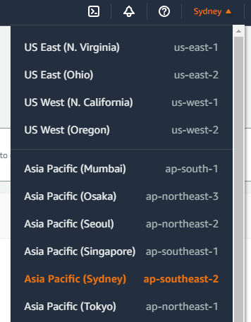
**Find the nearest (server) region.**
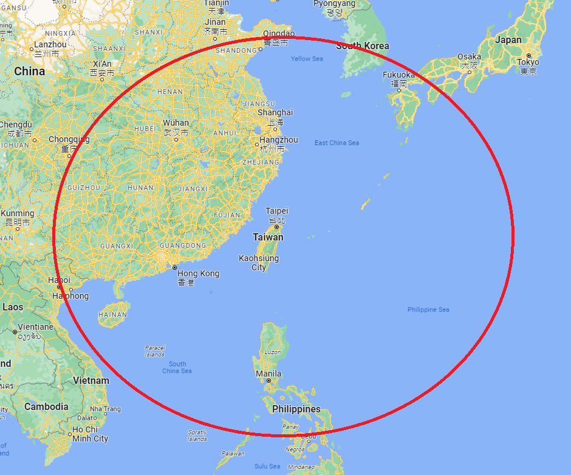
*choose Singapore for Operation (in Asia)*
### Create function
> [Lambda](https://ap-southeast-1.console.aws.amazon.com/lambda/home?region=ap-southeast-1#/) > [Functions](https://ap-southeast-1.console.aws.amazon.com/lambda/home?region=ap-southeast-1#/functions) > [Create function](#Create-function)

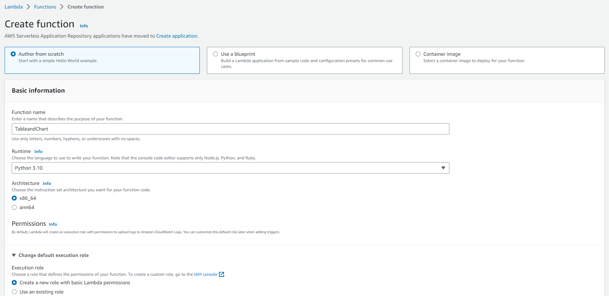
#### Add trigger (API Gateway)
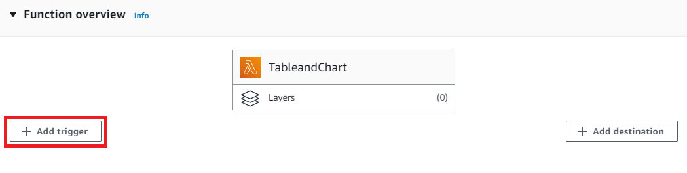
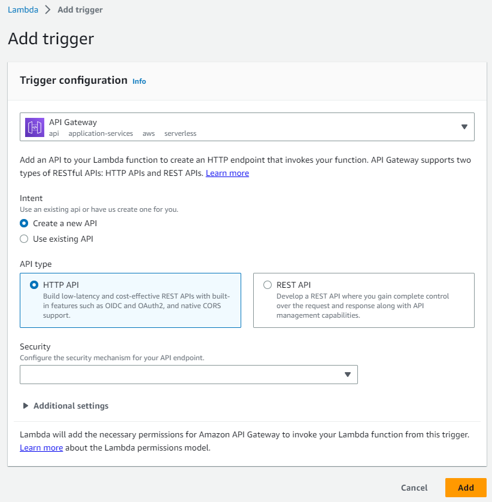
#### Layers
**2 ways to add layers**
- Add layer `AWSSDKPandas-Python310` at the Functions page *(`AWSDataWrangler-Python39` upgrades to `AWSSDKPandas-Python310`)*
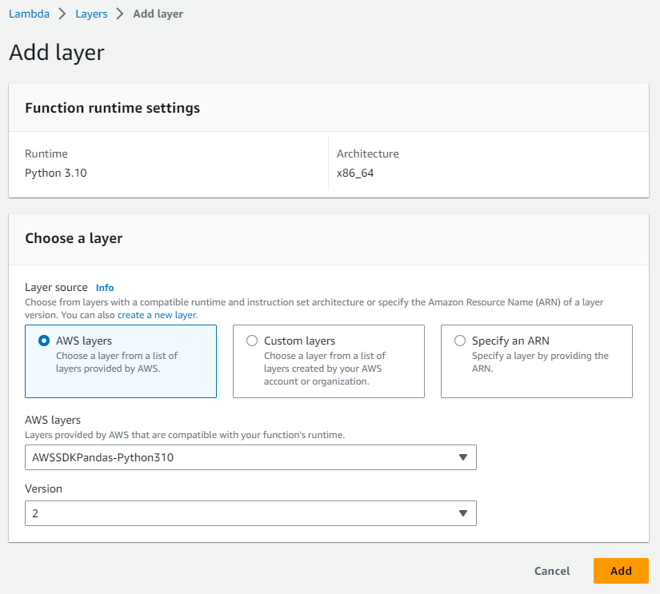
> [Lambda](https://us-east-1.console.aws.amazon.com/lambda/home?region=us-east-1#/) > [Layers](#Layers)

If you can't find the ARN or you need to customize some packages inside.
- Create layer
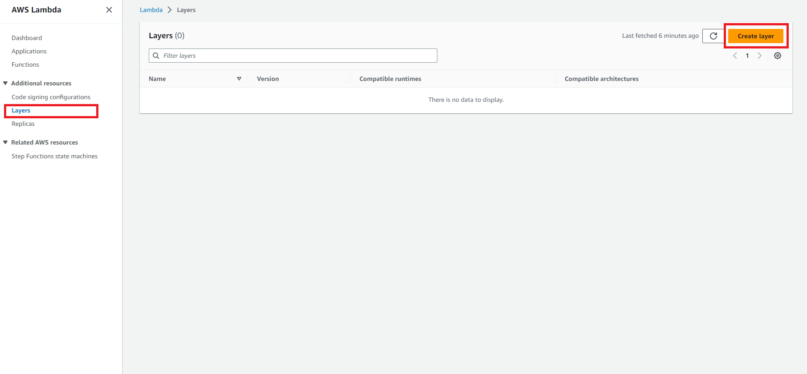
- Layer configuration
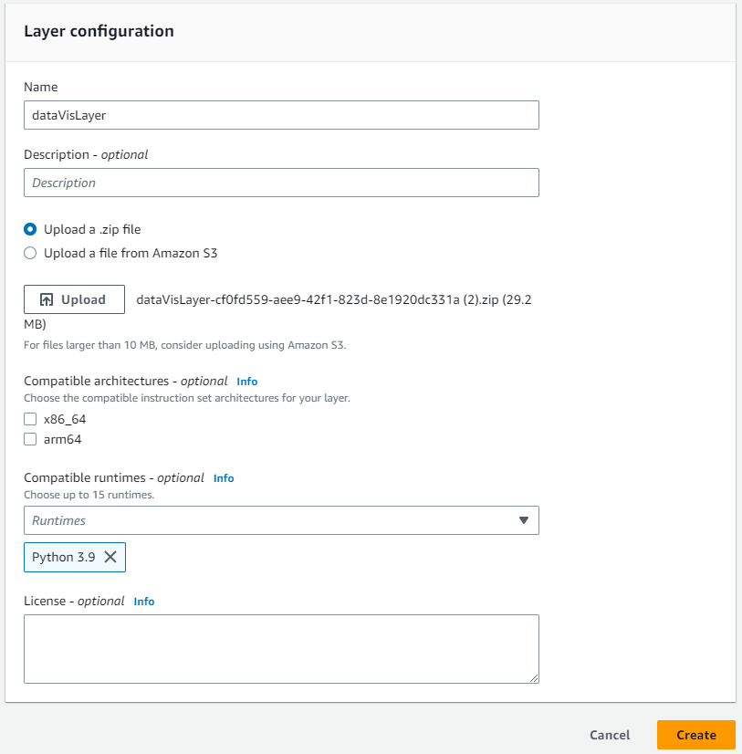

***Including library dependencies in a layer:***
<table id="w366aac23c43c23b7">
  <thead>
    <tr><th class="table-header" colspan="100">
Layer paths for each Lambda runtime
</th></tr>
    <tr>
      <th>Runtime</th>
      <th>Path</th>
    </tr>
  </thead>
    <tbody><tr>
      <td rowspan="4">
        
Node.js

      </td>
      <td>
        
<code class="code">nodejs/node_modules</code>

      </td>
    </tr>
    <tr>
      <td>
        
<code class="code">nodejs/node14/node_modules</code> (<code class="code">NODE_PATH</code>)

      </td>
    </tr>
    <tr>
      <td>
        
<code class="code">nodejs/node16/node_modules</code> (<code class="code">NODE_PATH</code>)

      </td>
    </tr>
    <tr>
      <td>
        
<code class="code">nodejs/node18/node_modules</code> (<code class="code">NODE_PATH</code>)

      </td>
    </tr>
    <tr>
      <td rowspan="2">
        
Python

      </td>
      <td>
        
<code class="code">python</code>

      </td>
    </tr>
    <tr>
      <td>
        
<code class="code">python/lib/python3.10/site-packages</code>(site directories)

      </td>
    </tr>
    <tr>
      <td>
        
Java

      </td>
      <td>
        
<code class="code">java/lib</code> (<code class="code">CLASSPATH</code>)

      </td>
    </tr>
    <tr>
      <td rowspan="2">
        
Ruby

      </td>
      <td>
        
<code class="code">ruby/gems/2.7.0</code> (<code class="code">GEM_PATH</code>)

      </td>
    </tr>
    <tr>
      <td>
        
<code class="code">ruby/lib</code> (<code class="code">RUBYLIB</code>)

      </td>
    </tr>
    <tr>
      <td rowspan="2">
        
All runtimes

      </td>
      <td>
        
<code class="code">bin</code> (<code class="code">PATH</code>)  

      </td>
    </tr>
    <tr>
      <td>
        
<code class="code">lib</code> (<code class="code">LD_LIBRARY_PATH</code>)

      </td>
    </tr>
  </tbody>
</table>

*See [Creating and sharing Lambda layers - AWS Lambda (amazon.com)](https://docs.aws.amazon.com/lambda/latest/dg/configuration-layers.html).*
##### Runtime Check
Remember to check your function runtime. Make sure the runtime of layers and the function are the same.
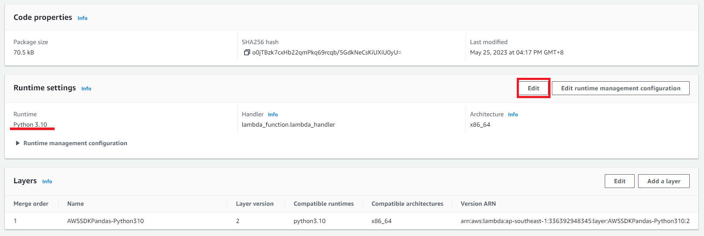
###### AWS Data Wrangler
And, for **AWSDataWrangler-Python39** (Python*XX* should meet your runtime version as well), the `ARN` should be `arn:aws:lambda:YOUR-REGION:336392948345:layer:AWSDataWrangler-Python39:2`. For example, **AWS Data Wrangler Lambda Layer - 2.15.0 (Python 3.9)** and region **Singapore** will be `arn:aws:lambda:ap-southeast-1:336392948345:layer:AWSDataWrangler-Python39:2`.
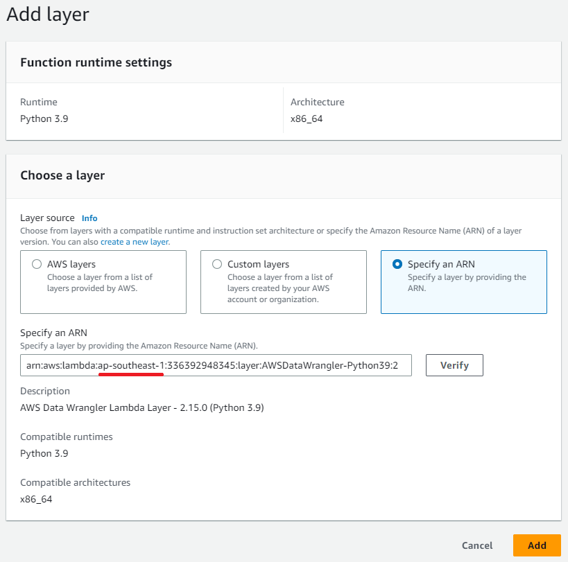
### Deploy
2 ways to manually CI/CD
#### Download and Upload
1. Actions > **Export function** > Download deployment package
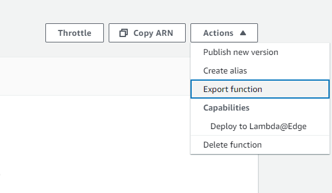
2. (edit your code package)
3. **Compress your files > Upload from > .zip file**
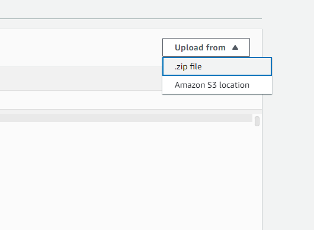
#### Edit on the Portal
1. Save
2. Deploy
