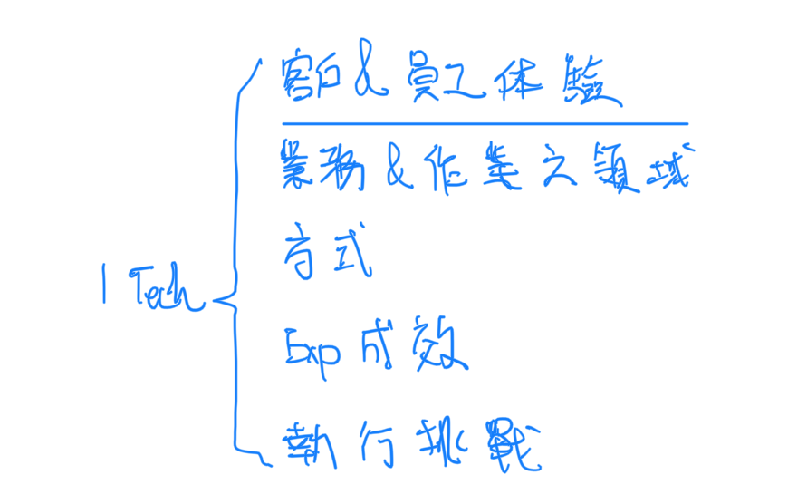

## 題目

請列舉一科技項目，你認為可為中信帶來更佳的客戶/員工體驗，並說明可能可助攻業務/作業之領域、方式、預計成效及可能面臨執行上的挑戰。

專題簡報：採用智能客服技術以提升中信客戶服務體驗

一、介紹智能客服技術的基本概念及運作方式
- 人工智慧和自然語言處理技術的運用
- 自動回答客戶問題、處理客戶需求、提供建議等功能

二、探討智能客服技術在中信的應用
- 如何提升客戶服務體驗
- 如何加快客戶服務速度和解決問題的能力

三、分析採用智能客服技術的預期效益
- 減少客戶等待時間，提高客戶滿意度
- 減少員工的工作負荷和處理時間
- 隨時跟蹤客戶需求和問題，提高客戶關係管理效能

四、評估實施智能客服技術可能面臨的挑戰
- 設計一個高效且準確的對話系統
- 保證客戶資訊的安全和隱私
- 與現有系統和流程整合，確保順利實施

五、提出中信採用智能客服技術的具體方案
- 制定完整的實施計劃
- 與相關技術供應商和專家合作
- 建立客戶回饋和持續改進機制

Q&A：
1. 中信目前是否已經有採用智能客服技術的相關探討或實施計畫？
2. 在實施智能客服技術時，可能面臨哪些客戶反應不佳的情況，應該如何因應？
3. 智能客服技術是否會影響中信員工的工作內容和工作態度？應如何因應？
4. 實施智能客服技術需要投入大量資源，是否可以進行風險評估，以確保投資報酬率？
5. 中信實施智能客服技術後，是否需要對客戶進行相應的教育和引導，以確保客戶能夠適應新的客戶服務體驗？

一個科技項目，我認為可為中信帶來更佳的客戶/員工體驗，是建立一個智慧客服平台。這個平台可以利用人工智慧、大數據和雲端技術，提供客戶快速、準確和個性化的服務，同時也能減輕員工的工作壓力和提高效率。這個項目可能可助攻業務/作業之領域有：
- 客戶關係管理：智慧客服平台可以分析客戶的需求、偏好和行為，並根據不同的場景和渠道，推薦合適的產品和服務，增加客戶的忠誠度和滿意度。
- 風險控管：智慧客服平台可以利用機器學習和自然語言處理，辨識和防範各種風險，例如詐騙、洗錢、違規等，並及時通報相關部門和單位，降低損失和罰款。
- 數位轉型：智慧客服平台可以整合和優化現有的系統和流程，提供更多的自助服務和智能解決方案，減少人工介入和成本，提升數位化水平和競爭力。

這個項目的預計成效有：
- 提高客戶滿意度和轉換率：根據研究，智慧客服平台可以提高客戶滿意度達 20% 以上，轉換率達 15% 以上。
- 節省人力和時間：根據研究，智慧客服平台可以節省人力成本達 30% 以上，處理時間達 50% 以上。
- 增加收入和利潤：根據研究，智慧客服平台可以增加收入達 10% 以上，利潤達 5% 以上。

這個項目可能面臨執行上的挑戰有：
- 資料安全和隱私：智慧客服平台需要處理大量的敏感資料，例如客戶的個人資訊、交易紀錄、信用評分等，需要確保資料的安全性和隱私性，遵守相關的法規和規範。
- 技術整合和更新：智慧客服平台需要與現有的系統和平台進行整合和協調，需要考量技術的兼容性和穩定性，並持續更新和優化技術，以適應市場的變化和需求。
- 員工培訓和接受度：智慧客服平台需要改變員工的工作方式和角色，需要提供足夠的培訓和指導，以提高員工的技能和信心，並增加員工對於科技的接受度和信任度。

## 簡報
### 專題
利用生成式AI技術提升中信客戶服務體驗與員工作業流程
### 什麼是生成式AI
**生成式AI趨勢**

生成式AI是指一種基於深度學習技術的人工智慧模型，能夠通過學習大量的資料並根據其模式進行生成。生成式AI能夠生成各種形式的資訊，例如圖片、文本、音頻等。生成式AI通常採用生成對抗網路（GAN）等架構進行訓練，其特點是不需要先驗知識，能夠通過學習資料庫中的模式，從而生成符合特定目標的新資訊。

經過大量數據訓練出能夠產生複雜人工作品的模型。什麼作品呢?

目前最火紅的生成式語言模型GPT3.5, GPT4 - 處理文字問題，從左邊開始依序還有Descript處理聲音，GitHub協助產生Programming Code，ChatGPT，MidJourney根據文字敘述生成圖像，Amper產出音樂，還有**其他影片、人像轉人物動態影像念稿等等**。其中目前能夠被整合於金融業各種商業模式的場景中的當屬ChatGPT。
1. Descript是一個創新的視頻編輯軟件，它集成了文字編輯、音頻編輯和視頻編輯等功能，能夠讓用戶在編輯視頻的同時，快速添加字幕、剪輯音頻和視頻片段，以及進行色彩校正等操作，讓視頻編輯變得更加容易和高效。

    Descript的text to speech功能是一種文本轉語音技術，它可以將文字轉換為語音，並自動添加到視頻或音頻文件中。Descript的text to speech功能使用了最先進的文本轉語音技術，可以實現非常自然的語音合成，讓觀眾聽起來就像是一個真人說話。

    使用Descript的text to speech功能，用戶可以省去自己錄製語音的時間和麻煩，大大提高視頻和音頻編輯的效率。此外，Descript還提供了多種語音選擇和音調調整功能，讓用戶可以自由地選擇語音和調整音調，以適應不同的內容和觀眾。

    總的來說，Descript的text to speech功能是一個非常實用的工具，能夠大大簡化視頻和音頻編輯的過程，讓用戶更加專注於創意和內容的表達。
2. GitHub Copilot是一個基於人工智慧技術的編程助手，它能夠自動生成代碼片段，幫助程序員更快地完成編程任務。GitHub Copilot是由GitHub和OpenAI聯合開發的，它通過學習開源代碼庫中的代碼，可以提供更加智能的編程輔助，大大提高了編程效率。
3. ChatGPT是一個大型語言模型，基於GPT-3.5架構，由OpenAI開發，它擁有強大的自然語言處理能力，可以通過對話方式與用戶進行交互，幫助用戶解決各種問題。ChatGPT可以應用於客戶服務、智能對話機器人等領域，提高客戶體驗和工作效率。

    ChatGPT是基於GPT-3.5架構的大型語言模型，具有以下幾個特色：
    1.  自然對話能力：ChatGPT可以自然流暢地進行對話，可以理解輸入的文本並提供有意義的回答。它可以處理各種常見的自然語言對話，包括問答、詢問意見、閒聊等。
    2.  多語言支持：ChatGPT可以支持多種語言，包括英語、中文、法語、西班牙語、德語等，能夠滿足不同用戶和場景的需求。
    3.  學習能力：ChatGPT可以透過對大量文本資料進行訓練，不斷地學習和進化。這意味著它可以不斷改進自己的回答能力，更好地適應用戶的需求。
    4.  廣泛應用：ChatGPT可以應用於多個領域，例如客服應答、自動回復、智能助手等。它可以幫助企業提高客戶體驗，提高工作效率。
        
    總的來說，ChatGPT是一款強大的語言模型，具有自然對話、多語言支持、學習能力和廣泛應用等特點，是現今應用最廣泛的自然語言處理技術之一。
4. ~~MidJourney是一個雲端數據分析平台，它能夠通過對企業數據進行分析，幫助企業領導者制定更加科學的決策。MidJourney提供了多種分析工具和報告模板，能夠快速生成可視化的報告，方便企業管理人員進行分析和決策。~~

    MidJourney是一個文本到圖像的AI，它可以根據您的文本提示生成華麗的視覺效果。MidJourney與DALL·E 2或Craiyon（以前的DALL·E Mini）一樣，但默認偏向於創建具有繪畫性、美觀性的圖像。MidJourney沒有web應用程序，需要在Discord社群中使用。您可以在左側列表中找到“#newbies-”開頭為名的頻道，輸入/imagine，就可以把想要生成的圖像的提示詞輸入了。¹³⁴

    Source: Conversation with Bing, 30/04/2023(1) 關於MidJourney你想知道的一切–羊皮大叔Ai繪畫 - 知乎. https://bing.com/search?q=MidJourney+%e7%94%9f%e6%88%90%e5%bc%8fAI+%e7%89%b9%e8%89%b2 Accessed 30/04/2023.
    (2) 關於MidJourney你想知道的一切–羊皮大叔Ai繪畫 - 知乎. https://zhuanlan.zhihu.com/p/564497338 Accessed 30/04/2023.
    (3) Midjourney AI繪圖工具使用教程 - 知乎. https://zhuanlan.zhihu.com/p/616724555 Accessed 30/04/2023.
    (4) Midjourney V5實測、教學來了！AI畫作終於長出「正常的手」｜數位時代 BusinessNext. https://www.bnext.com.tw/article/74483/midjourney-v5-released Accessed 30/04/2023.
    (5) Midjourney直接生成UI界面！AI設計體驗指南 - 知乎. https://zhuanlan.zhihu.com/p/624928938 Accessed 30/04/2023.
    (6) 圖文教你做／Midjourney是什麼？「打完字AI自動生成圖片」超炫工具操作方法看這 | 工具人教室 | udn科技玩家. https://udn.com/news/story/122658/6391012 Accessed 30/04/2023.
5. Amper是一個人工智慧音樂生成平台，它能夠通過機器學習和人工智慧技術，生成多種風格的音樂，並提供音樂製作工具，方便用戶進行後期製作和編輯。Amper能夠應用於音樂製作、廣告音樂、遊戲音樂等領域，讓音樂製作變得更加簡單和高效。

可以看到其中ChagtGPT的應用原理...(turn to the next page)

**<mark>特別適合大量文字報告溝通往來的金融業</mark>**
### ChatGPT
ChatGPT有什麼優點呢?
  - 能力強大，訓練過程使用45TB的data set以及175B個參數，能夠理解並產出複雜語意文字
  - 根據上面的特點，ChatGPT可擴展性非常強，不管是訓練上的擴展，拿來finetune或是應用上的擴展...(check open ai api doc for example)

    (或是直接拿來應用像是找各種問題答案、翻譯等等)
  - 透過強大的能力與多元的應用解決重複性高且複雜的人工問題，像是辨識、分類、找相似、萃取以及推薦等
### 應用
智能客服技術是近年來快速發展的一項人工智慧應用技術，通過自然語言處理、機器學習等技術，實現了智能問答、對話式客服等功能，能夠有效地提升客戶的體驗，同時降低企業的客服成本。在中信的應用中，智能客服技術可以用來改善客戶的服務體驗，提升客戶的滿意度和忠誠度，同時也能提高員工的工作效率，減少人力成本。

以下是智能客服技術在中信的應用場景和優勢：
1. 在線客服應用

    中信可以利用智能客服技術開發智能對話式客服系統，提供24小時的客戶服務，能夠快速響應客戶的問題，解決客戶的問題，並提供精準的產品和服務推薦，這樣可以減少客戶等待時間，提高客戶滿意度。
2. 資訊查詢

    中信可以利用智能客服技術開發智能問答系統，通過自然語言處理技術，讓客戶能夠直接與系統對話，查詢各種產品和服務的資訊，提供客戶更加方便快捷的服務，同時也能降低客服人員的工作量，提高工作效率。
3. 技術支援

    中信可以利用智能客服技術開發智能技術支援系統，這樣可以幫助客戶更好地使用產品和服務，提供各種使用教程和技術支援，幫助客戶解決各種產品和服務使用問題，同時也能降低客服人員的工作量，提高工作效率。

智能客服技術在中信的應用還面臨一些挑戰，包括技術成熟度、系統安全和隱私保護等問題。因此，在實施智能客服技術的時候，需要謹慎評估風險和收益，同時要加強技術研發和人才培養，以確保技術的穩定性和可靠性。

### 開發方向
Graph/FlowChart...

智能小C，中信的Jarvis
### 應用與作法
**智能客服與智能RPA**

#### 應用

#### 作法
根據這些優點我簡要提出能利用ChatGPT這類模型達成的**能夠落地的**應用與延伸
  - 首先我們能將LLM pretrained model拿來finetune面對金融場景，賦予其更深的domain knowledge
  - 再來對外部我們用訓練完的模型取代原先智能助理，結合客戶資訊，提供1. 能夠理解並處理複雜問題的智能助理2.加入客戶資訊後更能夠提供客製化服務
  - 對內部而言，這樣的模型還能夠幫助我們蒐集並整理市場、交易、與客戶資訊

建立屬於我們自己的Jarvis

### 預期效益&解決痛點
中信客戶服務體驗的挑戰

中信在經營過程中，客戶服務體驗是一個非常重要的環節。然而，現有的客戶服務體驗仍然存在一些挑戰，例如：
-   客戶等待時間過長(外)
-   客戶提問的種類很多，需要耗費大量員工時間處理(外)
-   員工處理客戶提問時需要查詢多個系統，效率低下(內)

> 1. 仍有許多人工處理問題 -> 等待時間長、耗人力，客戶體驗差，關鍵資訊取得不易 <- 優化智能小C提供客製化資訊與推薦，理解複雜語意並回覆所需資訊，一次部屬，統一作業，服務隨時隨地，提高客戶滿意、忠誠及貢獻 (且達到精準行銷)
> 2. 重複人工作業流程卡住人員貢獻與行政效率 <- 智能RPA，改善作業流程，強化行政效率，解放重覆作業人力，降低資訊取得門檻
> 
> 減少員工負荷，改善工作效率與客戶關係管理效能

*<mark>提高營收和利潤</mark>：智能客服和RPA技術可以提高中信的客戶忠誠度和滿意度，從而提高銷售和營收。根據Forrester的一份報告顯示，使用智能客服技術可以將客戶忠誠度提高3倍以上，而使用RPA技術可以實現平均年均投資回報率高達300%。
使用生成式AI技術提升中信客戶服務體驗*

-   自動回答客戶問題：使用生成式AI模型訓練出一個能夠理解客戶問題並自動回答的系統，透過這個系統能夠快速回答客戶提問，減少客戶等待時間和員工處理時間
-   聚合系統資料：使用生成式AI模型從多個系統中抓取客戶資訊，聚合成一個綜合的客戶資訊檔案，方便員工快速查詢
-   語音辨識技術：使用生成式AI模型訓練出一個能夠辨識客戶語音指令的系統，透過這個系統能夠加快客戶服務速度和解決問題的能力

預期效益
-   減少客戶等待時間，提高客戶滿意度
-   減少員工的工作負荷和處理時間
-   提高員工的工作效率和客戶關係管理效能
### 執行挑戰
面臨的(落地)挑戰

-   訓練出準確性高、應用場景多樣的AI模型
-   確保客戶資訊的安全和隱私
-   與現有系統進行整合和升級，確保新系統能夠順利運作
-   處理客戶問題和指令的多樣性和複雜性，以及模型在實際應用中的穩定性和可靠性。
## 講稿
-   ChatGPT特色
    
    -   即使不finetune也已經可以處理與應對許多複雜任務
        
        -   理解複雜語意，回應相應期待答案
            
    -   這樣強大的能力能夠擴展協助改善企業內部流程，提升工作效率
        
        -   像是辨識 分類 找相似 以及萃取、總結等任務
            
-   了解ChatGPT的特色、優點與屬性等後，可以注意到(針對chatgpt的特點與金融作業與服務場景)兩個開發方向
    
    -   第一個顯而易見的是利用這樣的技術為客戶提供能夠理解更複雜語意以及客製化的如同萬能管家般的智能助理
        
    -   第二個是為組織作業流程24小時無上限工作的機器人
        
-   升級智能小Ｃ，做一個我們中信自己的Jarvis
    
    -   具體來講要做出什麼功能或應用呢？
        
-   這裡針對剛剛提到的兩個方向分別在往下深入
    
    -   首先是面向客戶的應用
        
        -   我們能夠做到更精準地瞭解並回答更複雜的問題，hey 小Ｃ，信用卡機場周圍停車如果從1230停到0102這樣是分兩年算嗎還是都算在前一年
            
        -   至可以進一步結合顧客資訊與推薦系統，達到智能理專，再解決顧客疑問同時進行相關服務或商品推薦
            
    -   再來是優化內部作業流程的應用
        
        -   我們能夠利用chatgpt對於文本處理的特點，升級ＲＰＡ，針對重複且複雜過去無法純靠hardcode rpa解決的問題，各個突破，例如分類找相似，資訊查找等問題
            
-   具體來講根據前面提到的三種應用，做法如下
    
    -   針對使用者體驗，我們能利用ＬＬＭ升級智能小Ｃ，在網頁、app部署，並結合客戶資訊加入推薦系統，當問題與商品服務相關時，建議使用者登入，再根據使用者屬性推薦相關產品回答問題，推薦系統則是（可以訓練兩組一組是所有種類商品推薦再來是）訓運練一組所有商品的推薦模型以及特定商品的推薦模型…
        
        -   另外我們可以建立現有資訊與功能maps讓使用者利用ＮＬ就能取得所求應用、功能、服務
            
    -   內部應用ＲＰＡ優化則是可以更輕易建立
        
        -   直接使用ＡＰＩ協助標注市場資料、分析研究報告、市場訊息等（理專查詢市場資訊或協助理專分析市場）
            
    -   再來是針對兩者進行模型finetune，提升模型金融場域的準確性與適應性
        
-   透過引入ＬＬＭ的應用我們能夠解放重複作業人力，提升作業效率，以及解決目前智能助理無法理解與處理複雜問題的狀況
    
    -   達到精準行銷提升客戶貢獻與黏著，內部則改善效率抑制/控管成本
        
-   然而我也有發現一些潛在執行挑戰
    
    -   不準確
        
    -   客戶隱私
        
    -   訓練資料來源，如何證明等等