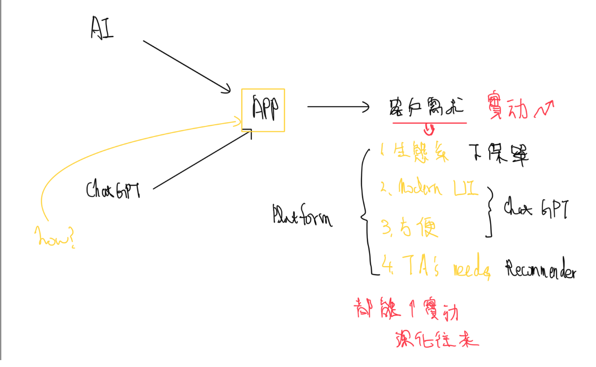

## 題目
以<mark>客戶需求為中心</mark>，如何運用**金融科技(如AI、ChatGPT等)**創造數位通路(如APP)的**差異化優勢**，提供**無縫的個人化服務體驗**，促動用戶<mark>實動</mark>及深化往來。
## 架構

### WHY
~~參考Apple, Amazon，那些因素讓消費者買更多更常買更愛用?~~
~~1. NPS名果實縣~~

~~不想做這頁，直接講重點好了~~

[The Reasons Behind Apple’s Customer Loyalty: Insights from a Marketing Expert (openbusinesscouncil.org)](https://www.openbusinesscouncil.org/the-reasons-behind-apples-customer-loyalty-insights-from-a-marketing-expert)

蘋果和亞馬遜之所以能夠保持高度的顧客黏著和貢獻度，主要是因為它們在生態系、現代化UI、便利性和推薦系統等方面的優勢。

首先，蘋果和亞馬遜都建立了龐大而完整的生態系統，讓用戶可以在一個統一的平台上完成多種操作。例如，蘋果的生態系統包括iOS、MacOS、watchOS、tvOS和iCloud等產品，而亞馬遜的生態系統則包括Amazon Prime、Alexa、Kindle和Amazon Web Services等。這些生態系統的存在為用戶提供了方便和效率，使得用戶更加願意在這些平台上消費和使用產品。

其次，現代化的UI設計是吸引用戶的重要因素。蘋果和亞馬遜都非常注重UI的設計和使用體驗，這使得用戶可以更加輕鬆地使用產品。例如，蘋果的iOS系統具有簡潔明了的界面設計和易於操作的手勢控制，而亞馬遜的Alexa智能音箱則通過語音交互實現了更加自然和人性化的使用體驗。

第三，便利性也是蘋果和亞馬遜保持顧客黏著度和貢獻度的重要原因之一。這兩家公司都在不斷地為用戶提供更加方便和高效的服務。例如，蘋果的Apple Pay讓用戶可以通過手機完成支付，而亞馬遜的一日送達和自動訂閱等服務也讓用戶的購物體驗更加便利。

最後，推薦系統也是蘋果和亞馬遜維持高顧客黏著度和貢獻度的一個重要因素。這兩家公司通過精準的推薦系統，向用戶展示他們感興趣的產品和服務。這不僅提高了用戶的滿意度，也讓用戶更加願意在這些平台上消費和使用產品。
### 消費者
現今消費者重視
1. 生態系
2. 使用者體驗(UI&UX)
  - 快速完成需求 -> 方便便利

讓消費者體會到我們了解消費者
1. 預判消費者需求(recommender)

### 方法
那目標就很明顯了

結合1&2，我們要想辦法提供完整生態系，使用者不管要什麼服務，始終都留在APP，且只需要Single sign-on，就能使用所有功能滿足所有需求

如此能夠改善消費者體驗

另外還要再針對消費者體驗改善UI，更面向使用者 -> 改為使用者導向而非功能導向

還有什麼能增強生態系與消費者體驗?

ChatGPT
- Hey Fubon! 我想印存摺封面跟薪資明細，幫我把不相關的跟餘額隱藏起來
- Hey Fubon! Fubon costco卡有機場周圍停車優惠嗎? 有機場貴賓室嗎?

結合使用者資訊，提供客製化服務
- Hey Fubon! 我想買一部150萬的車，你建議我車貸還是信貸
- Hey Fubon! 根據我的消費習慣，我應該申辦什麼信用卡

最後根據上面平台的更新我們還可以進一步利用使用者資訊，加入推薦系統在平台與智慧助理

### 期待成效
[Report: Brand loyalty at an all-time high of 92% for Apple as Android brands take a dive - SellCell.com Blog](https://www.sellcell.com/blog/cell-phone-brand-loyalty-2021/)

Amazon有35%的收入是來自推薦引擎，而 Netflix則有高達75%至80%的收入是通過極度客製化的演算法產生的，藉由這些演算法讓觀眾不斷回來觀看更多內容。

## 講稿
1. 大家好我是洪健翔，我今天要分享如何運用fintech創造數位通路差異優勢，以使用者需求為核心，促動用戶實動及深化往來，也就是加強使用者黏著與貢獻。以使用者需求為中心，那現代使用者在意什麼? 怎麼樣代表好的黏著與貢獻?
2. 我們來看看現代科技巨擘是如何追求這兩項目標。Apple 前陣子巴菲特才指出，給蘋果用戶1萬美金，要他們一輩子不用蘋果，他們會斷然拒絕，但如果你給福特汽車車主1萬美要他們一輩子不開福特，他們收下錢轉身就去訂Chevron。Apple在使用者黏著度上可說是成就非凡。而Amazon營收中有35%來自推薦系統，透過推薦系統無痛增加使用者貢獻。他們究竟如何做到?
  - 生態系: 延展服務觸角，相關服務無縫串接，解決轉換問題，也能蒐集到更多使用者資料，結合交叉使用
  - 適應各種型態UIUX
  - 便利, user-friendly
  - 精準行銷
3. 透過這些 他們解決了客戶的什麼痛點?
  - 生態系解決服務中斷，換改善轉換問題
  - UIUX跟便利看作是同一項，提供使用者現代消費體驗，快速便利自然且舒服
  - 推薦系統免除傳統推銷問題，精準命中，讓消費者更常買、買更多(在需要的時候，推一把或拉一把)

  了解觀念後，具體要怎麼做呢?
4. 先來看前兩項，生態系與UIUX。
  - 首先我們可以結合集團內BU快速達到生態系的整合，讓生態系內的各項服務無痕連接。例如定存利息買保險、一鍵線上保險與申辦信用卡(兩者所需資訊應該高度重合，繳款通路要一起抓住)。
  - 

無痛指相對於傳統透過電銷方式提升使用者貢獻，這樣的精準行銷不僅不會對消費者造成困擾，也能增加顧客滿意、黏著，與貢獻。

*與眾不同之處*