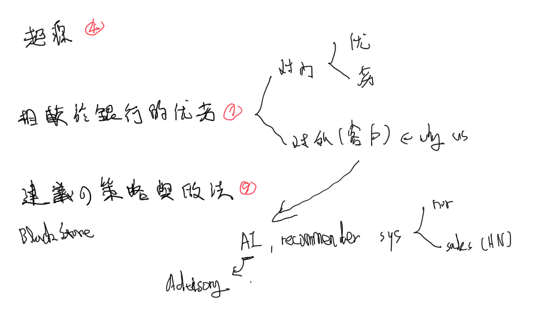
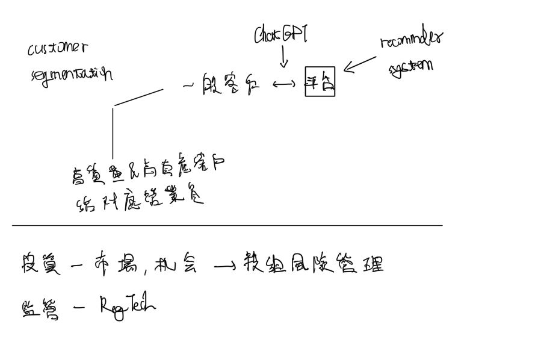

## 問題
- 近年積極發展財富管理業務，原因為何？
- 券商相較於銀行，發展財富管理業務，有何優勢與劣勢？
- 承上分析，對於券商發展財管業務有何建議之策略做法？

## 起源
近年積極發展財富管理業務，原因為何？

### 成長的事實
根據瑞士信貸最新公布的「2021全球財富報告」（Credit Suisse Global Wealth Report）指出，台灣高資產人士的財富正突飛猛進成長。報告顯示，台灣去年平均每位成人財富增加15,270美元，達到238,860美元；以中位數來說，台灣每位成人財富也足足提高6,660美元，達93,040美元。以人數計算，台灣的百萬美元富豪人數，預估到2025年將增加至103.1萬人，比2020年增加69.3％，成長幅度遠大於韓國的68.6％、新加坡的61.9％，及香港的59.8％。[^財富管理銀行暨證券評鑑]

無論財富或人數，台灣都以亞洲之冠的亮眼成績快速成長，這不僅代表台灣經濟的成長，更是財富管理的底氣。底氣足了，接下來，就看江湖門派各自高下，各家銀行各展神通了。
[^財富管理銀行暨證券評鑑]: [2021年「財富管理銀行暨證券評鑑」揭曉！資金派對下，最冷靜的財富管家 - 今周刊 (businesstoday.com.tw)](https://www.businesstoday.com.tw/article/category/168206/post/202109080015/)

銀行證券搶攻財管大餅。銀行本來就有在做，證券業近年也開始在財管大放異彩，為什麼
### 證券跨足財管原因
證券業過去以經紀業務為主要收入來源，但隨著市場競爭加劇以及投資人對於金融商品需求的多元化，券商紛紛積極發展財富管理業務。主要原因有以下幾點：
1. 政府開放
2. 市場需求
3. 增加黏性
4. 加強競爭力
5. 財管手續費較高

首先，財富管理業務提供的是一對一的客戶服務，可以讓客戶在較為專業的投資顧問指導下進行投資，而經紀業務則是以大量的零售客戶為主，服務模式較為標準化。

其次，財富管理業務通常有較高的管理費和成功報酬率，可為券商帶來更穩定和可預測的收入。

再者，財富管理業務可以幫助券商增強客戶黏著度，提高客戶忠誠度和客戶滿意度，進而促進其他業務的發展。

相較於銀行，券商發展財富管理業務的優勢在於其具有較豐富的金融商品和投資產品，可以為客戶提供更多樣化的投資選擇。此外，券商通常擁有更多的專業投資人才和投資研究能力，可以提供更為專業的投資建議。

- 市場需求：隨著全球經濟發展和人民生活水平提高，越來越多的人關注資產配置和財富管理，對專業的理財服務需求日益增加，這也促使證券業開始發展財富管理業務。
- 增加收入：經紀業務是證券業的主要收入來源，但由於競爭激烈，收益率逐漸下降，因此發展財富管理業務可以增加公司的經營收入。
- 增強客戶黏性：財富管理業務可以為客戶提供更全面、專業、個性化的理財服務，增加客戶的黏性和忠誠度，有助於長期穩定地經營客戶關係。
- 擴大業務範圍：財富管理業務可以擴大證券業的業務範圍，加強與其他金融機構的競爭力，提高市場占有率和業務規模。

### 近年飛速成長案例
輔圖

[重磅！資管圈雲端對話！探討券商財富管理轉型機遇，券業共話高質量發展…… 港美股資訊 | 華盛通 (hstong.com)](https://www.hstong.com/news/hk/detail/22082813050668290)

[2021年「財富管理銀行暨證券評鑑」揭曉！資金派對下，最冷靜的財富管家 - 今周刊 (businesstoday.com.tw)](https://www.businesstoday.com.tw/article/category/168206/post/202109080015/)

## 相較銀行的優劣
- 優勢：更高的回報、多元化的投資工具、專業化的投資建議、品牌效應
- 劣勢：風險管理、業務模式的轉型、客戶關係的轉型

優勢：

1.  投資品種較多樣化：相較於銀行，券商可以提供更多元化的投資選擇，例如股票、債券、基金、外匯等等，更能滿足客戶不同的投資需求。
    
2.  投資專業性較高：券商擁有較豐富的投資專業知識與經驗，能夠提供客戶更精準的投資建議與風險控制。
    
3.  客戶群體較廣泛：相較於銀行，券商的客戶群體更加廣泛，不僅包括個人客戶，也包括機構客戶，例如保險公司、基金公司等等。
    
4.  收益潛力較高：相較於傳統的經紀業務，財富管理業務的收益潛力更高，並且收益模式更加穩定。

-   投資品種更豐富：券商具備經紀業務的優勢，可以提供各種股票、基金、債券等投資品種，讓客戶有更多元化的投資選擇。
-   投資專業性較高：券商在經紀業務的操作上經驗豐富，擁有相關的專業知識，可以提供客戶更專業的投資建議。
-   手續費用較低：相較於銀行的財富管理業務，券商的手續費用較低，可以讓客戶享有更低成本的投資。

劣勢：

1.  資金安全性較差：相較於銀行，券商的風險較高，投資風險也較大，因此財富管理業務的資金安全性相對較差。
    
2.  費用較高：相較於銀行，券商的費用較高，因此財富管理業務的手續費、管理費等等費用相對較高。
    
3.  法規限制較多：券商在財富管理業務方面有許多法規限制，例如資格認證、風險警示等等，使得券商在財富管理業務方面的發展受到一定程度的限制。

-   風險較高：財富管理業務通常需要客戶進行較高風險的投資，因此若市場不穩定，客戶可能會面臨較大的風險。
-   業務模式的轉型：從經紀業務轉型到財富管理業務需要進行業務模式上的轉型，包括人才培養、系統建設等方面，需要耗費一定時間和成本。
-   客戶關係的轉型：財富管理業務需要與客戶建立長期穩定的關係，需要進行客戶關係管理和維護。

## 黑石為什麼是黑石?

[Blackstone AUM skyrockets 42% in year to $880.9 billion | Pensions & Investments (pionline.com)](https://www.pionline.com/alternatives/blackstone-aum-skyrockets-42-year-8809-billion)

黑石是一家全球知名的投資公司，截至去年12月31日，其管理的資產總額達8809億美元，較去年同期增長42%，是該公司十年來增長最快的一年，也使其在2022年達成了管理1萬億美元資產的目標，比原先計劃提前了4年。該公司主席兼CEO Stephen A. Schwarzman在最近的財報電話會議中表示，這一增長主要歸功於2021年的2705億美元資金流入，其中第四季度的資金流入達1548億美元。他還強調，全球沒有其他替代性投資公司能夠在單年實現這樣的絕對增長。

私募股權是黑石最大的業務，截至去年12月31日，其管理的私募股權資產總額為2615億美元，較前一季度增長13%，較去年同期增長32%。房地產業務是黑石的收益主要來源之一，其房地產資產總額為2795億美元，較9月30日增長21%，較去年同期增長49%。信貸和保險業務的資產總額為2586億美元，較前一季度增長37%，較去年同期增長68%。對沖基金解決方案業務的資產總額為813億美元，較9月30日增長1%，較去年同期增長2%。

此外，黑石還擁有1358億美元的乾粉資金，使其能夠在定價變得更加有利時快速投資。黑石的2021年GAAP淨收益為29億美元，全年為124億美元。

### 42%的年成長，一兆美元AUM的秘密
根據前述的優劣勢，如何在更多元的投資選擇、更廣泛的客群，提供更精準的投資建議與風險控制，並維護長期穩定的客戶關係?

Blackstone是全球最大的私募股權公司之一，擁有廣泛的投資組合和資產管理能力。在財富管理方面，Blackstone在金融科技和數據分析方面的應用非常成功，這是其他證券公司可以學習的方面之一。

Blackstone在財富管理中融入數據分析的方式，是通過其所擁有的科技公司Blackstone Innovations，以及其他合作夥伴進行的。Blackstone Innovations為其投資組合中的公司提供各種數據工具，以幫助Blackstone更好地管理這些公司的業務和資產。同時，Blackstone也將這些工具和技術應用到其財富管理業務中，以提高其客戶服務的效率和質量。

Blackstone在數據分析方面的應用還體現在其投資決策中。Blackstone使用大數據和人工智能等技術，**分析和評估各種投資機會**，以更好地選擇投資組合中的標的。同時，Blackstone還使用數據分析來**監控投資組合中的風險**，並采取相應的措施以減少風險。

因此，其他證券公司可以從Blackstone的應用中學習如何將數據分析融入其財富管理業務中，以提高客戶服務和投資決策的質量。通過提高服務質量，證券公司可以增加客戶的忠誠度和信任感，從而提高業務的長期穩定性和收益。

黑石作為全球知名的投資管理公司，對於風險管理及大數據分析技術有著深入的研究和應用，其財富管理業務出色的原因主要可以歸結為以下幾點：

1.  風險管理科技：黑石在風險管理方面投入了大量的資源，建立了完整的風險管理體系，並且將科技應用於風險管理之中。例如，黑石擁有一套名為「Aladdin」的風險管理平台，能夠對各類投資產品進行全面的風險評估、風險監控和風險控制，並且可以根據風險情況對投資組合進行調整和優化，以保證風險控制的有效性。
    
2.  大數據分析：黑石擁有龐大的投資組合和客戶資料，能夠通過大數據分析來發現市場趨勢和投資機會，從而指導投資決策。例如，黑石可以利用大數據技術分析市場需求，發現新的投資機會，同時也可以利用大數據分析投資組合的表現，以優化投資策略和風險控制。
    
3.  消費者滿意度：黑石非常關注客戶的滿意度，不斷提升客戶體驗和服務質量。例如，黑石可以通過大數據分析來了解客戶的需求和偏好，並且能夠利用人工智能技術提供個性化的投資建議和定制化的投資組合，滿足客戶的不同需求。
    

在財富管理業務中，券商可以學習黑石在風險管理和大數據分析方面的經驗，並且注重提高客戶的滿意度。同時，券商也可以發揮自身優勢，例如擁有豐富的投資產品和投資經驗，進行差異化經營，以滿足不同客戶的需求。

### 我們可以怎麼做
