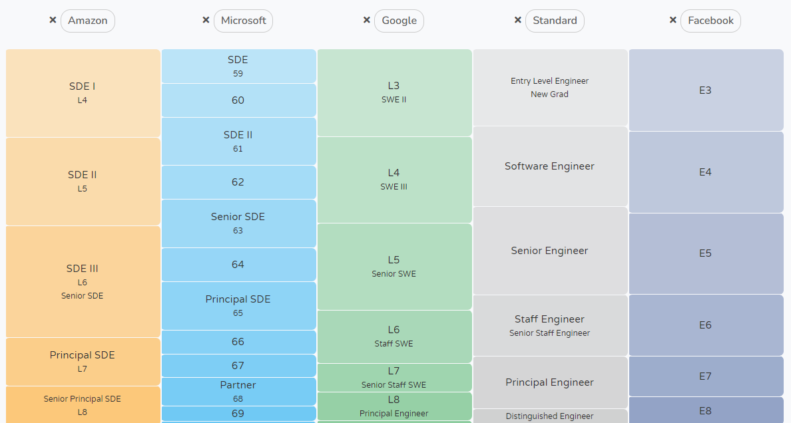
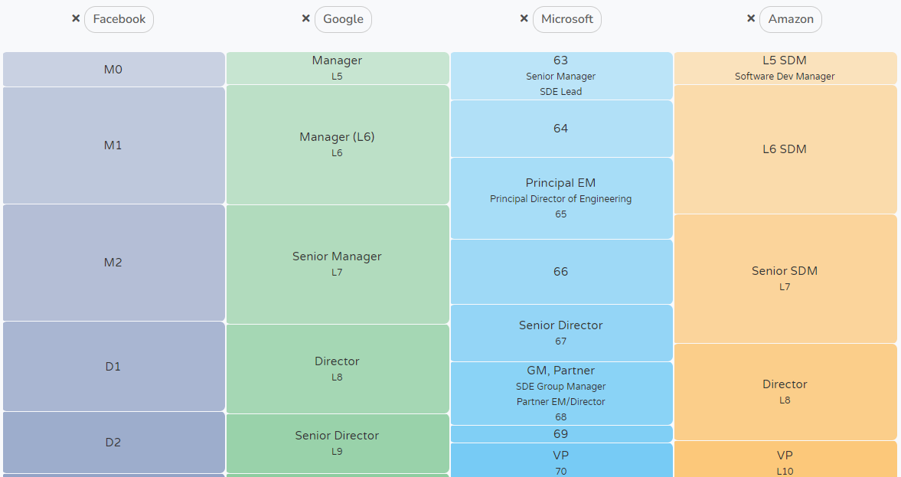

## 台灣金融業IT狀況
近期隨著台灣金融業上雲發展，企業開始出現雲端人才需求，同時另一方面，台灣金融業IT技術人員的職涯發展出現結構問題，應該如何改善?

## 技術人員職涯發展機會
1. 一是為技術人員(但較不具備管理能力者)提供另外一個職涯發展機會,
2. 另 近期隨著雲端顧問案發展, 我們會提出雲端能力中心的腳色與職能需求, 也需要參考同業發展概況.

1. 先分別調查國內外金融與非金融單位的技術職 (i.e.軟體工程師等) 在組織中的職涯發展路徑規劃 (通常在一定實力累積後分為兩條路，管理職與純技術職aka個人貢獻者)，以及其在各階段所應具備的能力。
2. 另外針對雲端顧問/管理師/架構師等職位，研究其所扮演的腳色以及所需技能和同業現況。

## 產業現況 (就IT從業人員而言)
1. 金融限制多、文化相對保守、學不到新技術(甚至許多有老舊狀況)、成長緩慢、養老、薪資不是特別優渥(因為過去IT只是成本單位，金融業不靠軟體實力賺錢)，想衝的會往科技業，想安穩的又可能會在意金融業的管理嚴緊相較不自由，文書作業流程複雜且多。
2. 能力的重要程度體現在薪級上<輩分(年資)。

    **需要別於一般側重經驗(年資)因素做為升遷依據的成長路線**

> 問題就是金融業到底要找優秀的人還是能用的人就好?(金融業到底要找什麼樣的工程師?)
>
> **潛力好企圖心強的工程師/ [能力好穩定度高的工程師]**

## 職類
台灣金融IT分類
- SA 找廠商 開會 -> 管理
- SD 全端 Java C# JS IOS Andriod -> 個人貢獻、管理 
- OP 維運 資安 DBA 網管 等 -> 個人貢獻、管理

針對個人貢獻者，目前職級比照金控一般內勤同仁辦理。
### 國外軟體公司如何規劃
[Amazon vs Microsoft vs Google vs Standard vs Facebook - Compare career levels across companies with Levels.fyi](https://www.levels.fyi/?compare=Amazon,Microsoft,Google,Standard,Facebook&track=Software%20Engineer#)

### 設計參照
台灣金融業狀況: IT若不升管理職，沒有個人貢獻的路線可以前進，將遇到瓶頸，參照以上公司狀況，可另設IC[^individualcontributor]職涯路徑。

[^individualcontributor]: [What Is An Individual Contributor? Definition & Career Path (honehq.com)](https://honehq.com/glossary/individual-contributor/#:~:text=The%20definition%20of%20an%20individual,are%20accountable%20for%20their%20work.)

## 雲端能力中心的腳色與職能需求