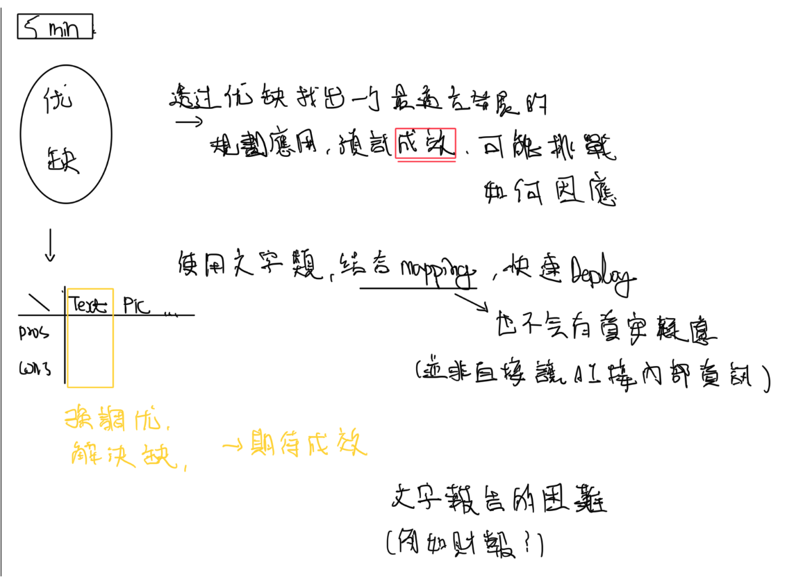
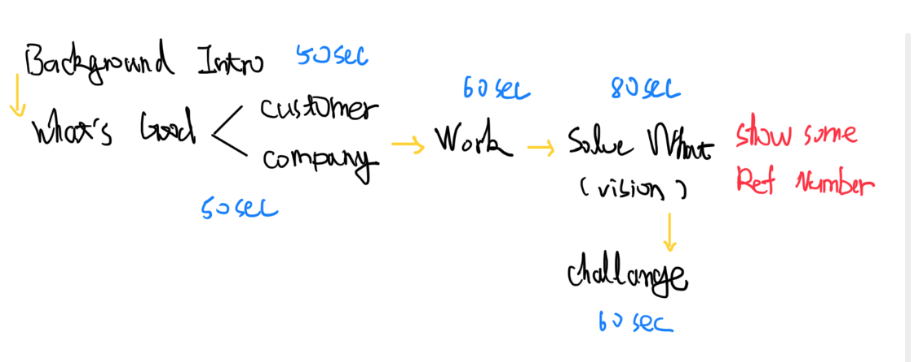

## 題目
**在2023年的ChatGPT應用熱潮下,請探討金融業整合此類生成式 AI 模型的優點和缺點,並規劃㇐項最佳應用。**
- 時間: 5分鐘
- 對象: 單位處長

中英不限
## Outline

- 題目
- 背景
- 蓋覽
- 蓋覽+優缺
- 應用
- 挑戰+因應
- 成效

### 題目
**在2023年的ChatGPT應用熱潮下,請探討金融業整合此類生成式 AI 模型的優點和缺點,並規劃㇐項最佳應用。**
### 背景
#### 生成式AI崛起
生成式AI是指使用神經網絡等機器學習技術，通過大量數據進行訓練，從而能夠生成新的數據，如圖像、音頻、文本等。這種技術在近年來得到了廣泛的應用，如自然語言處理、圖像生成等領域。
- 語言有ChatGPT
- 圖像有MidJourney
- 聲音有Descript
- 音樂有Amper
- 程式有GitHub Copilot

[What is Generative AI? Everything You Need to Know (techtarget.com)](https://www.techtarget.com/searchenterpriseai/definition/generative-AI#:~:text=Generative%20AI%20tools%20exist%20for,2%2C%20Midjourney%20and%20Stable%20Diffusion.)
### 蓋覽
(畫圖)

各種類代表
### 蓋覽與優缺
(製表)

各種類特色

應用於金融業優缺

顯然最直接能夠apply的還是ChatGPT - 語言類

剛剛大致介紹各類，現在來dig in to ChatGPT

ChatGPT能為我們帶來什麼好處?

首先，他有什麼優點?

- 用了多少資料訓練 參數有多少

  作為一個預先訓練的大型語言模型，ChatGPT的訓練使用了非常龐大的數據集和參數量。

  具體而言，ChatGPT-3是目前最新的版本，使用了大約45TB的數據集和1,750億個參數進行訓練。這些數據集包括網絡文本、書籍、新聞文章、電影劇本、科學論文等多種來源，並且是在大量計算資源的幫助下進行了長時間的訓練和調整。

  當然，作為一個模仿自然語言的人工智能系統，ChatGPT所使用的資料集和參數量是非常龐大的，需要大量的計算資源和時間進行訓練。
### 應用
> 客戶服務 (智慧助理)
>
> 詐欺偵測
> 
> 貸款服務 (利率、額度、擔保等問題)
>
> 財富管理 (投資建議、風險分析)
>
> 合規 

ChatGPT是一種基於GPT-3.5架構的大型自然語言處理模型，能夠自動回答用戶的問題、生成文字內容、進行語言理解和生成等多種自然語言處理任務。ChatGPT的主要優點包括：

優點：
1.  能力強大：ChatGPT擁有巨大的語言模型和訓練數據，因此具有極高的自然語言理解和生成能力，能夠幫助人們快速獲取所需的信息。
2.  可擴展性強：由於ChatGPT是一個基於神經網絡的模型，可以通過增加模型的層數和參數來進行擴展，因此它非常適合應對大量的自然語言處理任務。

  可擴展性強，FineTune只是其中一個
3.  自動化：ChatGPT能夠自動生成語言內容，減少了人工處理的時間和成本，從而提高了工作效率。

> 對顧客來說:快速獲取所需的信息。
>
> 對公司來說，可擴展性強，FineTune只是其中一個

**隱藏的擴展: 相似找尋、分類判別問題**

### 能為銀行帶來什麼幫助
- 更精準回答客戶問題(FAQ)
- 提供everywhere, anytime 更精準客製專屬理專服務(進一步結合客戶資訊)

  (Hey sinopac...)
- 結合內部資料提供市場資訊(Like what I've done in wisdome)

### 挑戰與因應
然而，ChatGPT也存在一些缺點，例如：

缺點：
1.  模型偏差：由於ChatGPT是基於訓練數據訓練出來的，因此可能存在數據偏差，導致模型產生不正確的回答。
2.  知識來源：ChatGPT的回答依賴於訓練數據，因此如果數據缺乏某些知識，模型也無法提供相關的答案。

在銀行業中，ChatGPT可以應用於以下幾個方面：
1.  客戶服務：ChatGPT可以用於自動回答客戶的問題，幫助客戶快速獲取所需的信息。
2.  投資建議：ChatGPT可以通過分析市場數據和公司財務報告等資訊，提供投資建議。
3.  欺詐檢測：ChatGPT可以檢測可疑交易和其他不尋常活動，以幫助銀行識別詐騙行為。

不過，在銀行業中使用ChatGPT也存在一些挑戰。例如，銀行需要投入大量的時間和資源來訓練模型，以確保模型的準確性和可靠性。

在銀行業中應用ChatGPT時，需要避免以下幾點：
1.  數據偏差：銀行需要收集大量的數據來訓練模型，但這些數據可能存在偏差，導致模型產生不正確的回答。因此，銀行需要定期檢查數據，以確保數據的質量和準確性。
2.  安全風險：ChatGPT模型可能受到惡意攻擊，導致模型出現安全漏洞或泄露機密信息。因此，銀行需要採取適當的安全措施，例如加密模型和數據，限制模型訪問敏感信息等。
3.  模型準確性：ChatGPT模型可能產生不正確的回答，因此銀行需要訓練多個模型，並定期檢查模型的準確性。此外，銀行還需要定期更新模型，以確保模型能夠應對新的問題和情境。
4.  合規風險：銀行需要確保ChatGPT模型的應用符合相關的合規法規和標準，避免產生法律風險和負面影響。因此，銀行需要與監管機構合作，確保ChatGPT模型的應用符合相關的法規和政策。

### 成效
ChatGPT成長速度與使用人數

能夠幫助減少多少人力，多多少幫助

## 講稿
多提數字佐證自己的決定，**有因才有果**

**在2023年的ChatGPT應用熱潮下,請探討金融業整合此類生成式 AI 模型的優點和缺點,並規劃㇐項最佳應用。**

1. 大家好我是洪健翔，選題是探討金融業整合生成式AI模型優缺並規劃應用
2. 什麼是生成式AI
3. 經過大量數據訓練出能夠產生複雜人工作品的模型。什麼作品呢?
4. 目前最火紅的生成式語言模型GPT3.5, GPT4 - 處理文字問題，從左邊開始依序還有Descript處理聲音，GitHub協助產生Programming Code，ChatGPT，MidJourney根據文字敘述生成圖像，Amper產出音樂，還有其他影片、人像轉人物動態影像念稿等等。其中目前能夠被整合於金融業各種商業模式的場景中的當屬ChatGPT。
5. ChatGPT有什麼優點呢?
  - 能力強大，訓練過程使用45TB的data set以及175B個參數，能夠理解並產出複雜語意文字
  - 根據上面的特點，ChatGPT可擴展性非常強，不管是訓練上的擴展，拿來finetune或是應用上的擴展...(check open ai api doc for example)
  - 透過強大的能力與多元的應用解決重複性高且複雜的人工問題
6. 根據這些優點我簡要提出能利用ChatGPT這類模型達成的**能夠落地的**應用與延伸
  - 首先我們能將LLM pretrained model拿來finetune面對金融場景，賦予其更深的domain knowledge
  - 再來對外部我們用訓練完的模型取代原先智能助理，結合客戶資訊，提供1. 能夠理解並處理複雜問題的智能助理2.加入客戶資訊後更能夠提供客製化服務
  - 對內部而言，這樣的模型還能夠幫助我們蒐集並整理市場、交易、與客戶資訊

  建立屬於我們自己的Jarvis
7. 透過這樣的方式具體來說能夠做出什麼改變呢?
  - 曉風