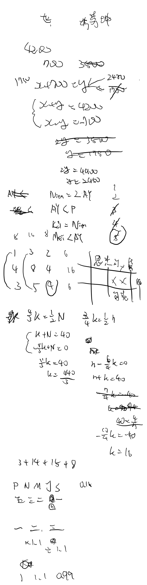
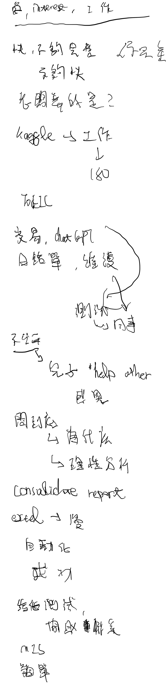
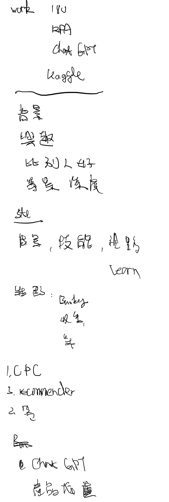

## 背景
> **國立中山大學MBA in Finance，大數據、ML競賽得牌，在香港EAM龍頭擔任IT Manager，開發前後端、內外部Apps與提供RPA方案並實作。**
### 研究論文(題目／研究目的)
台灣 ICO 發展之研究 （A Study of ICO Development in Taiwan） 

本篇論文透過過往文獻、基礎，以及背景的探討，藉以了解 ICO 之生成，並且如此火熱的原因。並解析其自身優缺點，輔以與 IPO 差異之分析，試推斷 ICO之利與弊。再根據現況各國政府監管狀況（拉力）與推動應用作法（推力），搭配現有成功之 ICO 案例分析，望能對台灣未來 ICO 可能的發展方向與目前現況，做出結論，並提出是否可改善之建議。 
### Foreign Experiences
- Exchange Programme， Business／Managerial Economics， Örebro University， Sep. 2019 to Jan. 2020， Örebro， Sweden
- Summer School Programme， International Relations and Affairs， the State University of Nizhni Novgorod named after N.I. Lobachevsky （UNN）， Jun. 2019 to Aug. 2019， Nizhni Novgorod， Russia
- International Marketing Intern， Hsin－Fei  Internation Co.， Jan. 2019 to Feb. 2019， Cebu， Philippines
### Projects
- [臺灣清冠一號地圖 Taiwan NRICM101 Map](https://chienhsiang-hung.github.io/NRICM101-map/): Creator of a responsive med info map, shows the metadata of nearby clinics for those who were infected or weren’t, in need of finding the NRICM101 treatment for Covid-19 (average 1,000+ daily visitors). Integrated government data with Leaflet (open-source JavaScript map library), and hosted serverless using Vercel, GitHub, and MongoDB.
- [Kaggle Profile Summary Card API](https://chienhsiang-hung.github.io/kaggle-profile-summary-card/): Developed an API by Web Scraping competition data and presented through designing on HTML and CSS / SVG (serves stainless by embedding through HTML or Markdown), deployed on Vercel with Python for Kagglers to display their Kaggle profile at any time, everywhere, and effortlessly. It’s used in more than 10 countries.
- [Asian Traffic| Embedded Object Detection](https://www.kaggle.com/code/chienhsianghung/yolov5-for-asian-traffic-object-detection): Led a team to train an object detection model using YOLOv5 in a competition and further embedded it on the Android app and Raspberry Pi. Managed to raise 20% of mAP (highest in competition), accelerate the running speed by 900% and work smoothly on embedded devices.
### Others
- [Kaggle All-round Expert](https://www.kaggle.com/chienhsianghung): Won the first competition silver medal in the 5th month into Kaggle. Collected all the required amount of medals at each sector (competitions, datasets, notebooks, discussion) to become an all-round expert in the 6th month. Competitions as Shopee - Price Match Guarantee using PyTorch with model EfficientNet to classify products by images and texts, Jane Street Market Prediction using TensorFlow with simple NN (MLP) with purged grouped time series CV to predict the price.

### 工作與實習
- Wisdom Asset Management
  - IT Manager, Data and Digital Integration Team
  - 管理並設計前後端、內外部Apps，開發出產業領先應⽤，替公司節省1年180萬新台幣⽀出，獲中國⼀線券商洽詢對接。提供RPA⽅案並實作，為公司進⾏資料上雲，作業流程數位化、⾃動化，提升各部⾨⼯作效率。
  - 202106-now
- 凱基
  - 財管MA(個金), 財富管理
  - 協助分公司達成財富管理⽬標。分公司重要客⼾陪訪及財富管理業務⽀援協助。分公司財管業務教育訓練。協助舉辦客⼾財富管理說明會。
  - 202009-202009
- 中租
  - 亞太MA(法金), 中小企
  - 蒐集企業名單，電話開發(⼀天70通，每⽇1訪，每⽉責任額$20,000,000)。評估企業營運狀況與資⾦需求，提供產品及營運諮詢服務。
  - 202007-202008
- 新飛國際
  - 國際行銷實習生, 國際行銷部
  - 開發菲律賓當地合作商家。安排規劃並同⾏翻譯、協助台灣顧客與學員⽣活起居，顧客滿意度達95%，後續回購+轉介率達7成。⾏銷活動策定、規劃，利⽤VBA改善⼯作流程，作業速度提升90%。
  - 201901-201902
- 富邦
  - CSR行銷企劃實習生, 職安管理部
  - 研究⽬標顧客消費者⾏為(以Python實作DecisionTree預測)。與組⻑共同推動、制定年度企業社會責任公益活動並開發商品，創造超過150萬企業價值，計劃報酬率超過300%。
  - 201809-201812
- 台灣期貨交易所
  - 暑期實習生, 資訊規劃部
  - 資料分類與整理。期貨模擬交易演練競賽，獲第⼀名。
  - 201807-201808

### 擅長軟體與工具
- Python | HTML | CSS | Bootstrap | MongoDB | SQL | jQuery | JavaScript | Node.js | React | Next.js | Unit Testing | Git | OOP | VBA
- Cloud Computing | Azure | Blob | Functions | AWS | S3 | Lambda | Vercel | API Development | RPA | Web Scraping | Reverse Engineering
- Frontend | Backend | Full-Stack | Machine Learning | Deep Learning | Microservices | Chinese, English - Professional proficiency or above

## 投遞與面試
### 富邦

#### 志願
> 應提及興趣、優勢、發展

##### 台北富邦銀行 - 數位創新組
> 台北富邦銀行學歷資訊統計[^面試趣]
> 
> -   
>     
>     ①  14%  國立政治大學
>     
> -   
>     
>     ②  7.9%  銘傳大學
>     
> -   
>     
>     ③  6.3%  淡江大學

養成金融科技、數據運用及數位服務創新人才。

1.以<mark>優化創新金融科技服務</mark>為主要發展方向，參與內外部服務<mark>平台建置</mark>，推動<mark>大數據智能決策管理</mark>經營環境。  
2.集合IT技術與數位工具，搭建對內或對外部之高效服務平台。  
3.挖掘與發展生活金融之運用機會與場景，打造高效便利的生活金融服務及數位時代金融服務生態圈，並致力實現普惠金融。

GOALS:
- 金融創新服務, 內外部平台, 應用數據決策，利用IT技術與工具 (發掘機會找尋應用場景，實現普惠金融)

###### 選擇原因
在現代金融產業，非傳統金融科技新創如雨後春荀般興起，傳統金融公司對於資料數據和科技創新的的掌握至關緊要。而數位創新組的目標與自身過去在學知識、工作經驗，以及興趣相符，對我而言是一個很好深入學習與發展的機會。能將在中山財管MBA時期知識以及香港EAM龍頭擔任IT Manager之經驗，應用在公司發揮加倍的影響力，創造更大的價值。

##### 富邦金控 - 資訊科技組
> 富邦金控學歷資訊統計[^面試趣]
> 
> -   
>     
>     ①  9.2%  淡江大學
>     
> -   
>     
>     ②  5.8%  國立政治大學
>     
> -   
>     
>     ③  5.8%  中國文化大學

以成為創新技術研究與專案管理之雙軌人才為發展方向。

核心職掌如下：  
1. 研究金融科技創新技術與工具，如：AI、Cloud、RPA、CI/CD (持續整合與持續部署)、 Big Data、容器化工具、微服務架構、企業開源技術等。  
2. 瞭解FinTech發展趨勢，借鏡國內外同業導入狀況，規劃應用解決方案。  
3. 敏捷式專案開發與管理  
於金控資訊創新科技相關專案推動敏捷式開發與管理，以因應動態環境與需求變化，確保專案價值產出。

GOALS: 
- 創新技術研究與專案管理

###### 選擇原因
如前面所提，得益於科技與技術如指數般發展與更新，我們能夠使用更多工具因應趨勢，在領域中保持競爭力。也因為科技與技術不斷地更新，持續擁抱並學習新知的熱情與能力顯得更為重要，而這與我的個性及能力不謀而合。我在中山MBA訓練的敏捷開發管理，以及在香港公司擔任IT Manager時期練就的快速研究並熟悉創新技術的能力，讓我能更好地因應動態環境和需求做出相應合適且高質/量的產出，更確保了自己能在工作中持續提供高價值的產出。

#### 簡報專題
##### 富邦人壽-保險科技
*(還有一個線上behaviour test)*

> 以成為資料科學家為主要發展方向
> 
> 1. 規劃大數據蒐集、儲存與應用策略。
> 2. 執行資料分析與探勘，研究客戶與業務員行為。
> 3. 規劃與執行客戶與業務員Tagging與分群。
> 4. 研究新技術與新應用、執行集團內外合作計畫。

*請針對以下題目，<mark>「擇一題目」</mark>進行簡報製作。專題簡報製作內容為中文或英文投影片，限頁數15頁以內、檔案大小10MB以內。口頭報告時間為10分鐘內，中英文口說均需準備，報告語言現場由主管指定。*
1. 如何運用大數據分析，提升壽險公司在業務員通路市場上的競爭優勢
2. 運用數位客戶經營與大數據分析，增進壽險公司客戶黏著度與貢獻度

**教訓: 太晚開始做簡報，大綱沒列好，簡報結構不夠清晰，缺乏例證(同業分析等)**

##### 富邦金控-數據分析
_**以成為數據科學人才為目標，*期建立*<mark>數據智能分析</mark>進階技術，以協助提升<mark>精準行銷</mark>、<mark>產品定價</mark>、<mark>風險管理</mark>、<mark>營運效能等</mark>。**_

核心職掌如下：  
1. **掌握國內外數據科學演算法及應用**。  
2. 應用金控資料，協助子公司於**風險控管及詐欺詐賠預防**。  
3. 建構跨子公司數位軌跡及推廣金控客戶視圖之業務應用。  
4. 應用AI相關技術協助子公司提升業務效率及提升客戶體驗。
###### 題目
**1.** **根據客戶過去一段時間內的商品購買紀錄以及商品資訊(文字、圖片)精準預測未來一週內可能購買的商品。可以延伸分析不同客群對商品組合的偏好、客戶CLTV等。請參考Kaggle公開數據集，相關背景詳見以下連結(**[**https://www.kaggle.com/competitions/h-and-m-personalized-fashion-recommendations/overview**](https://www.kaggle.com/competitions/h-and-m-personalized-fashion-recommendations/overview)**)**

**2.** **根據商品基本資訊、銷售資訊、事件資料來預測未來各商品的銷售金額。請參考Kaggle公開數據集，相關背景詳見以下連結(**[**https://www.kaggle.com/competitions/store-sales-time-series-forecasting/overview**](https://www.kaggle.com/competitions/store-sales-time-series-forecasting/overview)**)**

**請擇一上述命題，並使用Kaggle平台資料進行建模，簡報內容需包含以下單元**

**(1) 命題挑選之緣由。**

**(2) 建模內容與成效說明。**

**(3) 分析過程或使用不同方法所得到之insight發現。**

**(4) 發想本次數據分析於金融業可能的應用場景。**

**＊加分條件**

**(1) 具差異化或創新分析方法(如: 特徵處理、建模方法、商業分析洞察等)。**

**(2) 具差異化且有意義之insight發現。**

**(3) 發想之應用場景具金融業落地應用之價值。**

※報告格式：

**中文投影片(含英文摘要：1頁)，限頁數15頁以內**、檔案大小10MB以內。

口頭報告時間約10分鐘，中英文皆可(報告語言現場由主管指定)。

###### 製作
**Tips: 附上英文的摘要，提出金融市場現況和競業分析、目標客群分析、公司產品優勢，計畫實施方式（含線上/線下）並製圖、成效與結論。[^2021年MA面試錄取分享]**

##### 富邦證券-客群經營
_**『以客戶為中心』導入<mark>分眾經營</mark>模式透過<mark>大數據分析應用</mark>與結合<mark>智能化數位服務</mark>滿足差異客戶需求，增加客戶<mark>跨商品往來</mark>提升整體效益成長**_

核心執掌如下:  
1. 進行證券**客戶分群**的成長機會分析、擬定差異化經營策略與業務模式、及推動各項客群經營之執行計畫。  
2. 建構客戶經營服務旅程，運用各種數據力分析與導入數位服務，**提升業務人員在業務推動上的量與質**，**增加客戶往來涵蓋率與跨商品往來**。  
3. 參與金控跨子公司/跨部門專案與各種綜效提升活動，以推動證券各項商品與業務。
###### 題目
請針對以下題目進行簡報製作。

※**題目：**

**證券業過往以經紀業務為主，近年積極發展財富管理業務，原因為何？券商相較於銀行，發展財富管理業務，有何優勢與劣勢？承上分析，您對於券商發展財管業務有何建議之策略做法。**

※報告格式：

中文投影片，頁數20頁以內、檔案大小10MB以內。口頭報告時間約10分鐘、中英文皆可(報告語言現場由主管指定)。
###### 製作
- 近年積極發展財富管理業務，原因為何？
- 券商相較於銀行，發展財富管理業務，有何優勢與劣勢？
- 承上分析，對於券商發展財管業務有何建議之策略做法？

#### 團體面談
##### 富邦證券-數據科學
> 富邦證券
>
> 富邦證券規劃完整且多元的培訓內容，能提供MA兼具深度與廣度的歷練， 輪調過程MA將學習證券各大領域之專業，如：數位金融、經紀商品、財富管理、金融交易、投資銀行、通路管理、總經及產業研究等，並優先參與各項專案，將擁有更多機會提升視野拓展人脈。此外，每位MA皆由<mark>資深高階主管擔任Mentor</mark>，輪調期間於各個輪調單位亦安排<mark>高/中階主管擔任Coach</mark>角色，提供策略與管理思維，並即時給予工作指導與回饋，協助MA在短時間內成為全方位金融專業人才。

> 數據科學組
>
> 建立數據智能分析進階技術，協助提升精準行銷<mark>(推薦系統)</mark>、產品定價、風險管理、營運效能等。核心執掌如下: 
> 1. 以機器學習、深度學習等方法**建立智能預測模型**。<mark>(推薦系統?)</mark>(預測什麼)
> 2. 強化場景應用(?)，並以智能方法實現對通路、對客戶之差異化服務。<mark>(推薦系統)</mark>
> 3. 建立數據資產，持續數據拓展與加值。<mark>(Data)</mark>
> 4. 執行*資料治理*專案並依維運架構持續確保資料血緣與品質。<mark>(Data)</mark>
> 5. 新數據科學技術或新應用場域之評估與發展。<mark>(應用/Apps)</mark>
> 6. 結合資料治理、數據科學，發展MLOps。
> 7. 持續迭代與精進模型。

要找有DS知識(資料、整理、建模預測)，並且能**應用**的人才
###### 準備
> *MA甄選，一場知己知彼的旅程﹘林采萱*[^financialholdings]
>
> 下面項目或環節是值得思考注意的，可協助讓自己多次確認<mark>擔任富邦MA動機是否足夠，並且確實地將強烈動機表現出來</mark>。
> 1. 「確認雙方的共同目標」：可以透過收集資料或面談中積極提問，了解到<mark>公司及部門未來的目標，回頭再思索自己當初投履歷的動機是否相同</mark>，再進一步考慮在目前的目標之下**我能為公司帶來何種價值**，而且這樣的價值是不是所認同的。
> 2. 「感受公司文化」：富邦秉持不變的<b>「正向」信念貫徹於組織文化之中</b>，在面談時即可明顯體會到。公司文化會影響公司達成目標的方法，因此對於面試者來說，就可以藉此推測公司在既有的目標之下，可能會以哪些作法達成，並評估執行方式是否是自己所認同的。
> 3. 「展現自我本質及差異性」：富邦三信條之一為「誠信」，誠實地將自己的過往經歷及動機目的表達出來，面試官也會同等地感受到。除此之外，**認知到公司挑選人才的需求後，也可以適時地凸顯自己特殊的經驗**，展現出與他人不同之處，**能多帶給公司什麼價值**。
>
> 富邦甄選流程包含四關主管面談，<mark>每一關都會與未來該職位的直屬長官交流，把握機會提問，能夠認識彼此</mark>即是甄選最大的收穫之一。
[^financialholdings]: [富邦金控-人才招募-焦點職缺-2023MA儲備幹部計畫 | 富邦金控 Fubon Financial](https://www.fubon.com/financialholdings/hr/jobs_1170517_999577.html?gclid=CjwKCAjwiOCgBhAgEiwAjv5whAW0fpv34XpQMxGL9sIiWsS-HVshiseP6s-95lf8fCDRbwquGjbnhxoCwzMQAvD_BwE#share)

**Notes: 記得凸顯自己不同之處 -> 因為這個不同之處，能為集團帶來什麼與他人不同的價值**

- 自我介紹
  
  ||Wisdom|
  |-|-|
  |Func|風險管理|

  

  Kaggle專案比賽們，要複習一下過去的經驗與專案

  1. Wisdom Full Stack, 180 - *Achievement*
  2. [Utilize ChatGPT](#運用新知或科技解決問題) - *AI App, 學習與創新*
  3. [Kaggle Exp](#其他成就與特殊表現事蹟) - *AI App, 學習與創新*

  > 智能分析、<u>精準行銷</u>、產品定價(?)、<u>風險管理</u>、營運效能

  目前在香港最大的外部資產EAM/Family Office擔任IT Manager，負責全端設計開發，及為組織內的各個部門提供數位化自動化RPA解決方案。
  
  我很喜歡與各部門同仁合作幫他們解決工作上複雜重複的人工處理問題（改善工作效率），以及協助公司Bankers，幫他們開發Apps。再加入的第一年，就完成了結構性商品詢價系統，取代外包的White-label App，替公司省下一年相當於新台幣180萬的支出。也陸續開發出像是合併報表系統，能夠蒐集每個客戶各家銀行帳戶月結單資訊進資料庫並產出合併版本供各戶參考(以及風險管理(在EAM資料蒐集更困難))，建立數據資產，也解決助理人工有的work load限制跟時間限制，大幅增加作業效率與應用場景。

  [近期也引進OpenAI(ChatGPT)](#運用新知或科技解決問題)協助銀行產業報告整理，讓原本可能需要花2個月的時間來*訓練模型*[^leading-nlp-language-models-2020]開發的事情，用不到2週就完成。
  [^leading-nlp-language-models-2020]: [10 Leading Language Models For NLP In 2022 (topbots.com)](https://www.topbots.com/leading-nlp-language-models-2020/)

  目前的工作很開心，希望能到資料量更多使用場景更廣的地方展拳腳

  在工作之餘還有製作口罩地圖、參加Kaggle競賽等

  而我認為這份工作需要具備的技能...我也都有 因此我相信自己能勝任這項任務
  
  30秒版本：詢價系統、客戶產品以及交易數據庫、chatgpt（協助銀行市場報告的整理入庫以及標記並翻譯）。(口罩地圖, Kaggle 比賽)也因此我希樣能到像富邦這樣的資料量更多、應用場景更廣的公司，繼續快速成長，並且這也是我原先的規劃
- 履歷上沒有的自我介紹

  Side Projects

- 最成功的或成就感的事情

  AI培訓-> 3個月完成4項專案 6個月內 all-round expert-> 取得多家企業Offers包含Data Scientist、IT Manager等-> 一年內開發出報價系統為公司節省180萬-> 或中國一線券商洽詢對接 

- [失敗的經驗](#失敗的經驗和影響)

  除了優化算法，也要優化解法

- 分享一個工作中的案子

  Consolidated Report

  負面學習: 對平台研究不夠，多花了一個禮拜Azure -> AWS

- 為什麼想離開現職

  1. 現職能給我帶來的挑戰不夠，成長速度趨緩
  2. 組織規模不夠大，產品影響帶來的成就感不夠

  **其實從加入到現在我們員工數量跟AUM都已經翻超過一倍**，不管是硬實力還是軟實力都成長了許多，只是我們因為組織規模跟資訊量相較投行或商銀較小，也因此能做的事情跟做出來的影響及帶來的成就感增加幅度趨緩。希望能迎接更多挑戰，像是未來加入富邦能做的或學到的。

- 為什麼想加入富邦
  
  對金融業的熱情、對數據科學的興趣

  專業領域廣：商品、財管、交易

  以前實習的經驗...重視團隊和積極向上的工作環境

  （跟優秀的人學習）

- 怎麼簡單的說明甚麼是深度學習給兩位完全沒相關背景的主管[^富邦金控數據分析MA]
  
  深度學習是一種人工智慧技術，可以讓**電腦**從**資料**中**自動學習**並**進行預測或判斷**。這種技術透過**模擬神經系統**的運作方式，讓電腦**能夠進行更複雜**的任務，例如圖像辨識、語音識別、自然語言處理等等。簡單來說，就是透過**大量的資料和運算**，讓電腦自動學習並提高自己的準確性，可以應用在許多領域，例如醫療、金融、製造業等等。
  
  **具體來說是怎麼做到的?**

  深度學習透過**類似神經系統**的結構，包含**多層**的神經元（或稱神經網路），從資料中學習模式和特徵，以進行預測或判斷。為了讓模型能夠從資料中學習，我們需要透過**大量的樣本數據和標籤**來訓練模型，並通過優化算法來調整模型的參數，使其能夠更準確地預測結果。

  簡單來說，深度學習的運作方式**就像是一個學生在學習新概念時，透過大量的練習和反覆的學習，逐漸形成自己的知識體系和模式識別能力**。當我們提供足夠的樣本數據和標籤，深度學習模型就能夠透過**反覆的訓練，自我調整參數**，並從資料中找出隱藏的模式和特徵，以進行更加準確的預測和判斷。

  不同於傳統的機器學習技術，深度學習的特點在於它能夠**自動從資料中學習特徵和模式，無需人工設計特徵工程**，因此深度學習在處理複雜的、高維度的資料上具有更好的表現。

  **優化算法**

  優化算法是指用於**調整深度學習模型參數**的方法。在深度學習中，我們需要尋找最佳的模型參數，以最大程度地降低模型的預測誤差。優化算法的目標就是通過不斷地調整模型參數，**讓模型在訓練數據上的損失函數**最小化，進而**提高模型的準確性**。

  深度學習中常用的優化算法包括梯度下降、Adam、Adagrad、RMSprop等等。這些優化算法的基本思想都是通過計算模型參數的梯度，從而尋找最小化損失函數的方向。不同的優化算法有不同的適用情況和性能表現，在實際應用中需要根據問題的特點選擇適當的優化算法。
  
  **梯度是什麼**

  在深度學習中，梯度是指函數在某一點的斜率或者方向導數。梯度的計算可以幫助我們找到函數的最小值或最大值，也是深度學習中優化算法的基礎。

  在深度學習中，我們通常將損失函數作為模型優化的目標，該函數描述了模型預測值和真實值之間的誤差。梯度可以幫助我們計算出損失函數對模型參數的偏導數，這些偏導數表示了損失函數在某個點的變化速率和方向。

  透過計算梯度，我們可以找到損失函數下降最快的方向，並更新模型參數以使其更加接近最優解。在深度學習中，通常使用反向傳播算法來高效地計算梯度，該算法可以自動地計算損失函數對模型中每個參數的偏導數，從而實現模型的優化。

  **解釋一下損失函數**

  損失函數是用來衡量模型預測值和真實值之間的差距的函數。在深度學習中，我們通常使用損失函數來衡量模型對訓練數據的擬合程度，並且通過優化損失函數來改進模型的預測能力。

  在深度學習中，常用的損失函數有均方誤差（Mean Squared Error，MSE）、交叉熵（Cross Entropy）等。均方誤差是最常用的損失函數之一，它的計算方式是將預測值和真實值之間的差距平方後求和，再除以樣本數。**交叉熵則是在分類問題中常用**的損失函數，它可以衡量預測值與真實值之間的距離。

  在深度學習中，**損失函數的選擇通常取決於具體的問題和應用場景**。例如，在**二元分類問題中，交叉熵損失函數通常表現優異**；在**回歸問題中，均方誤差損失函數則比較常用**。選擇合適的損失函數可以提高模型的訓練效果和預測能力。

- *給他一句話說服他錄用你*[^富邦金控數據分析MA]、我可以帶來什麼價值

  優點：快速學習領悟並得名、懂技術也懂domain應用

  比別人快的學習能力、比別人豐富一些的Domain Knowledge及經驗、比別人果斷以及積極的執行力

- 最重要的三個技能

  **排名**

  domain = PM > statistic > cs

- 為了投遞這個MA你做了多少準備

  超過15,000字筆記(筆記當下)。而我們知道，一份質性分析的商管碩論平均也就10,000-15,000字。

- 想問的問題

  1. 公司及部門未來目標
  2. 組別介紹有寫，以ML/DL建立智能預測模型。要預測什麼?

[^富邦金控數據分析MA]: [新鮮人面試心得：富邦金控數據分析MA、友達工程師、6間數據分析師面試經驗暨工作甘苦談-1111人力銀行](https://www.1111.com.tw/1000w/fanshome/discussTopic.asp?cat=fans&id=243699)

- 1 Minute Pitch
  - My value
  - Why I want to work here

- 履歷上沒有的自我介紹
  
  *自我介紹兩分鐘，內容不要履歷上有的。*
  
  https://www.ptt.cc/bbs/Finance/M.1560350311.A.85A.html

###### 面試
面試前大概五個人在休息區，以為都是同場面試人員，還有一位在台大醫當DS研究助理的俄羅斯人

跟他聊得蠻開心的，本來想說一起面試結束出來再交換聯絡方式，沒想到是不同場，就沒再遇到了

結果只有一位台大工管/工工資訊組的女同學，跟我是同場面試

2對4(1人資3用人主管 - 同一個部門各不同單位)

主管很專業，都懂ML/DL

如果有提到模型，會往原理、作法、核心問去
- **一分鐘自我介紹，講重點，履歷上沒有提到的想讓主管知道的**
  
  <mark>講話斷斷續續，不流暢</mark>

  忘記講side projects: GitHub, Kaggle
- **兩位看起來都偏IT，志願也沒寫到數據組，為什麼邀請兩位會想來 (確認動機)**
  
  應該講，我根據自己背景選有把握的組別，其實在工研院時期也發現自己很喜歡數據分析

  只是當時在部屬模型時發現自己還有很多DS外的東西，知識儲備不夠，因此選擇IT加強相關技能

  (應該注意自己面試的單位，不要講到別的單位，例如:銀行)
- **現在的工作還不錯，多大的動機促使你毅然決然放棄目前的職位來挑戰MA**
  
  想講動機卻講數金，應該至少提到數據 (下次面試要先徹底convince自己要去的組別)

  提到目前公司很有趣(剛開始)，挑戰很多(剛開始)，但現在都會了，成長就變慢了，怕停滯，因此來這

- **大學跟研究所是企管跟財管，那你的IT專長是從哪裡學的**

- **大學+研究所學了6年的知識都棄而不用，全部轉到IT，工作上的技能都是自學，為什麼會走到這樣一條路，現在又要放棄IT轉數據?**

- **不管是哪種技術，技術會翻新，但企業追求穩定，會不會你來到富邦過了三五年覺得技術沒翻新，又想離開，你是在追求技術的樣子**

- **最後一個問題，純粹好奇，為什麼履歷用英文**

面試官在跟另一位面試者聊論文時我也好想加入XD

有一些地方他沒有聽懂面試官的意思，都想幫他回答

因為他的論文跟我過去經驗也有關，所以我也很好奇他的做法，後來忍不住在面試官問完後，當場給了他一下我當下想到的建議，不確定這樣的行為好不好:sweat_smile:

講完我的建議後，面試官也馬上補上一些建議給他，應該是還行:sweat_smile: 

- candidates 提問

  - 將來能玩的資料僅限於證券嗎?

    全公司都可以，有集中式資料庫在做，想怎麼撈就怎麼撈

  - 組別介紹有寫用DL/ML預測，請問是要預測什麼? 解決什麼問題?

    250萬個客戶資料，每個客戶都有幾千個特徵

    如何透過這些資料做 i.e. 篩出maybe一萬個關鍵客戶讓一千兩買個營業員去主力銷售

    *(如何將龐大的客戶數據精縮，讓有限的人力量能進行銷售推廣) -> **精準行銷***

    其中一位鼎文經理的單位就是負責模型精進
    
    另一位就是解決通路需求i.e.
    1. 提供通路有效名單
    2. 提供即時管理報表
    3. RPA(改善各部門行政流程)

    除了部門內事務，也有跨單位的案子要合作

    四大BU應該更能碰到數據並且應用，因為業務更有落地的場景

##### 富邦證券-客群經營
_**『以客戶為中心』導入<mark>分眾經營</mark>模式透過<mark>大數據分析應用</mark>與結合<mark>智能化數位服務</mark>滿足**差異客戶**需求，<mark>增加客戶跨商品往來</mark>提升整體效益成長**_

核心執掌如下:  
1. 進行證券<mark>客戶分群</mark>的成長機會分析、擬定差異化經營策略與業務模式、及*推動各項客群經營之執行計畫*。  
2. 建構客戶經營服務旅程，運用各種<mark>數據力分析</mark>與導入<mark>數位服務</mark>，提升<mark>業務人員在業務推動上的量與質 **(營業員客戶推薦)** </mark>，增加客戶往來涵蓋率與跨商品往來(商品推薦)。  
3. 參與金控跨子公司/跨部門專案與各種綜效提升活動，以推動證券各項商品與業務。
###### 準備
> 組別關鍵字: 分眾經營(客戶分群)、數據分析應用、智能客服 -> 差異化服務、跨商品往來(推薦系統)
>
> 推動各項客群經營之執行計畫(? 具體來說指的是什麼? 針對客群建模嗎，還是campagne發想?)
>
> UX，透過數據導入數位服務(推薦系統) (+平台服務 ChatGPT)
>
> 以「客戶為中心」發展

*想找什麼人?*

懂分眾經營，數據與**數位服務**

數位與數據具體項目 1.數據驅動（推薦系統：客戶、**營業員**、監管） 2.平台驅動（chatGPT）

> **以客戶為中心為理念，數據與平台為工具，提升客戶滿意忠誠，以增加公司持續且永續收益**

- 自我介紹(履歷上沒有的)
  1. 學歷工作 （ＣＲＭ系統，數位化等等） 180 rpa chatgpt
  2. maps, kaggle
  3. kaggle expert

  畢業於中山財管所，目前在...負責全端開發與組織數位化自動化智能化，包含常與各部門合作提供rpa方案與協助實作

  加入的第一年...180...近期改善使用者體驗與資料搜集能力透過chatgpt

  工作以外清冠地圖、kaggle api and kaggle mldl achievements

  希望能繼續**快速**成長，產出更大的impact

  <mark>(加入證券客群經營組，直面客戶需求，不管是財管高資產客戶還是一般客戶)</mark>

  *(實習過，喜歡正向組織文化)*
- 為什麼想來我們組別? 我看妳都投數金?
- 為什麼想來? 會不會同樣原因想離開?

  一直以來就想加入富邦

  成長趨緩、追求更大的Impact（差異：目前面對的是bankers）與成就感
- 想問我們什麼問題?
  1. 發展方向或目標，想達成的?
  2. 推動各項客群經營之執行計畫(? 具體來說指的是什麼? 針對客群建模嗎，還是campagne發想?)
  3. 併日盛時遇到最大的挑戰是什麼(跟機會)
- 你的優勢弱勢
  
  優勢： 快速學習、財金與資訊背景跟經驗

  劣勢：
  1. 不夠detail oriented，好處是能夠快速行動，讓事情進展更快速，但運氣不好時也會需要反覆修改，也因此在面對重要程度較高的事情時我會多檢查2-3遍來確保品質，不出錯
  2. 對他人太嚴厲，學到**用他人的立場來設想跟溝通**
- 你能帶來的價值? 為什麼要你? 說服我們
- 針對富邦證券你的了解

  [併完日盛後](https://money.udn.com/money/story/5613/6971366)帳戶數來到250萬（據點成長一倍34->76）

  市場佔有：
  1. 元大11
  2. 凱基10 (延伸： 在凱基時是財管ＭＡ比較像個法金，非專案管理類型)
  3. 富邦5->8

- 建議：
  
  針對app and website: ＬＬＭ(large language model)智能客服 （原15字輸入限制，未能根據使用者資料提供差異化服務）

  (我們還能記錄使用者搜尋紀錄與功能使用紀錄、資訊查找紀錄)
- ＭＡ分享：

  *OJT, 金控資料治理到證券CRM系統導入以及日盛整併[^financialholdings]*
  
#### 團體視訊
##### 富邦銀行-數位創新
> [在瞬息萬變的數位浪潮中，發展自我無限的可能﹘陳于婷](https://www.fubon.com/financialholdings/hr/jobs_1170517_999577.html#share)
> 
> 我於2019年加入北富銀數位金融MA行列，經歷包括**數位金融創新專案規劃**、**數位平台服務建置**、**數位營銷**，並參與部門數位金融策略擬定。主管給予MA非常多機會參與創新專案及策略的討論，也藉由工作上的嚴格要求與經驗傳授輔導， 協助MA從各項任務中厚實專業知識、累積實作經驗、發展強大的應變能力。  
>  
> 過去傳統金融主要是以「產品」為導向的單維度思維，北富銀則教導我們要有「<mark>CPC(Customer、Product、Channel)</mark>」的多維度思維；絕對要以客戶為中心，記得從客戶(Customer)的痛點、需求出發，為客戶量身打造數位金融產品(Product)、建立與客戶生活深度融合的數位平台(Channel)。  
>  
> 回顧我加入北富銀MA的三年培訓計畫，第一年，我專注在「家庭客群」的經營，從研究、訪談，到規劃家庭客群所需數位服務，陸續推出設定家庭成員卡片暱稱、家庭消費分析等功能，致力為家庭客群提供完善的數位金融體驗。  
>  
> 第二年，新冠疫情爆發，為鼓勵客戶線上開立數位存款帳戶，我搭配時事(covid-19疫情)規劃開戶的行銷活動；透過改善既有服務體驗上的痛點來滿足客戶需求；另也參與了「Fu+ 諮詢服務」專案，於分行打造全新生活金融諮詢服務，經營線下客群。  
>  
> 第三年，我被賦予經營數位投資客群、線上自助貸款客群的任務，這讓我學習制定商業計畫，以創新模式擴大數位客群規模。  
> 
> 三年的MA培訓，我獲得了很多難得的學習機會，我深刻地理解，要**鎖定目標客群，透過數據分析、客戶回饋與訪談中挖掘客戶的需求與痛點**，發展客戶所需的數位服務、優化客戶體驗，並且**用平易近人的語言和客戶在數位的世界對話**。工作最大的成就是能看見一個個新型態的數位金融服務誕生，而自己也是運用金融科技帶來便利生活的推手之一。  
>  
> 我真心建議想成為MA的朋友們，在實戰中淬煉成長、在快速變化的數位浪潮中不斷挖掘自我的可能。歡迎你加入北富銀數位金融團隊，我們一同創造數位金融藍海！

**Notes: Customer > Product > Channel**
###### 準備
> [PainPoint](#台北富邦銀行---數位創新組)
>
> 金融<mark>創新</mark>服務, 內外部<mark>平台</mark>, 應用<mark>數據決策</mark>，利用IT技術與工具 (發掘機會找尋應用場景，實現普惠金融)

<object data="北富銀數金一面-準備.pdf" type="application/pdf" width="100%" height="600px">
    <embed src="北富銀數金一面-準備.pdf">
        
This browser does not support PDFs. Please download the PDF to view it: <a href="北富銀數金一面-準備.pdf">Download PDF</a>.

    </embed>
</object>

- 自我介紹

  *沒有限時間，就照自己準備的講出來[^台北富邦商業銀行股份有限公司的所有【MA】]*

- 分享過去怎麼選擇工作、實習？最有趣的事或想彌補的事？

  *選擇的標準注意要也符合富邦的特色，像我就講我選規模跟產業（因為之前剛好也在台灣強勢的產業內的龍頭實習），這樣對應到富邦也不會太奇怪。有趣的事我就真的講有趣的事，因為我實習的公司比較特別一點，大家聽了都會覺得滿酷的ＸＤ[^台北富邦商業銀行股份有限公司的所有【MA】]*

- *怎麼想轉換跑道或想要應徵[^富邦金融控股股份有限公司的所有【MA】]*

- 給你一筆預算，要用來更新使用者體驗（已經知道使用者體驗不好）還是發優惠券

  *因為申請的是數位創新組才有這個問題。我當初是講說更新使用者體驗，並且舉蝦皮免運造成養壞用戶的事來指出優惠券不是一個能走長期的策略[^台北富邦商業銀行股份有限公司的所有【MA】]*

- 純網銀會成功還失敗

  *我說會失敗ＸＤＤ但我覺得這題只要推理合理就好。我主要原因是(1)台灣法規超嚴格，中間烙一些專有名詞（監理沙盒之類的）(2)台灣有集團資源的銀行已經很多，小蝦米無法對抗大鯨魚（順便帶到富邦可作生態圈）[^台北富邦商業銀行股份有限公司的所有【MA】]*

- 你覺得為什麼（我實習過的公司）當初會錄取你

  *這題講公司名字怕太顯眼所以先碼掉。只能說有去過有名的公司實習真的容易被看到，我主要是回答人格特質類的，讓主管覺得我是一個超級正向的人[^台北富邦商業銀行股份有限公司的所有【MA】]*

- 用過最成功的線上數位體驗跟最失敗的

  *最成功的我講國泰世華銀行網銀App 理由是會有很多user friendly的指引。最失敗的這裡就不提了，反正講了之後就說哪裡失敗就好ＸＤ（我也不是講金融業的）[^台北富邦商業銀行股份有限公司的所有【MA】]*

- 自己的優勢

  *要跟你要投遞的職缺有所連結，用一個完整的故事包裝，如課程研究報告、實習所負責的項目、或是考證照所學，並與你的特色、優勢做出說明，有實際案例補助比較好。因為面試的主管都是高階，最少也是副總，甚至到總經理、董事長，回答要簡短、給她重點，並也有依據(就是實際案例)，才可以在簡短的面試中快速地推銷自己。[^台北富邦商業銀行股份有限公司的所有【MA】]*

  *我看到過去有些應徵者，背景是法金領域、投法金職缺，很明顯在面試前查了一堆數位金融的趨勢與應用，文不對題，且被挑戰時答不出來，很明顯就是動機不夠強烈，這對主管來說是扣分，因為你很有可能隨時會離職，那我幹嘛錄取你??[^台北富邦商業銀行股份有限公司的所有【MA】]*

> 非常著重個人履歷、富邦最近有哪些產品，並詢問創意題目如要怎麼讓更多人使用 lucky pay
>
> 富邦想要拓展新的族群，你認為還有誰? 數位長心裡的答案是：外勞可以讓他們轉帳回家
>
> 面試銀行的時候一定要把他們最近的產品摸熟，最好可以和朋友借來使用，同時想好建議方案
>
> From [富邦金融控股股份有限公司儲備幹部面試心得 | 面試趣 (interview.tw)](https://interview.tw/i/5cbee88fdb46107d2e068f03).

*(現今的金融生態圈、純網銀、FinTech等大環境趨勢、同時在回答問題時也要展現熱情與積極度)*[^2021年MA面試錄取分享]
- 對於現在數位金融的看法 (想知道你對Fintech的了解程度)

  > **達到如Javis**

  數位金融是金融業的未來趨勢，它能夠**提供更多元、更便捷、更智能的服務給客戶**，同時也能夠**提升金融機構的經營效率和競爭力**。我認為數位金融有以下幾個特點：
  1. 數位金融能夠**利用科技和數據，創造更多的服務場景和價值**。例如，透過大數據分析客戶的行為和需求，提供更個性化和<mark>精準的產品和服務</mark>；透過人工智慧和機器學習，<mark>提升風險管理和決策能力</mark>*(Regtech[^fintech-2023])*；透過區塊鏈和雲端技術，<mark>提高交易的安全性和效率等</mark>。
      > [從事後偵測到事前預測：監理科技帶來的改革曙光](https://buzzorange.com/techorange/2019/04/24/tff-taiwan-financial-law/)
      >
      > 舉例來說，投信業要監測員工有無進行不法投資操作、下單有無違反交易規範…等行為，假設為 A 客戶購買甲公司的股票，為 B 客戶卻賣出股票，這種行為其實就有炒作股價和違反公平處理的嫌疑，而透過人工智慧的應用，在交易進行中就能即時偵測並發出紅燈警示，嚇阻員工繼續進行不法行為。
      >
      > 換句話說，在導入監理科技前，**想要揪出內部不法行為，只能透過事後的被動偵測**，由系統匯整當日交易紀錄後再進行比對分析，現在透過監理科技的應用，就能<mark>從事後被動偵測走向事前預防</mark>。
    
      **Notes: 可用過去違反規定的交易當作目標訓練，用來預測違常交易發生**
  2. 數位金融能夠打造更**開放和協作的生態圈**。例如，透過開放銀行的模式，讓不同的金融機構**和第三方服務商共享資料和服務**，提供更多元化和整合化的解決方案給客戶；透過**跨界合作和創新平台**，讓金融業者與其他產業或社會組織共同創造更多的商業模式和社會價值等。
  3. 數位金融能夠**實現普惠金融**的目標。例如，透過行動支付和電子錢包等數位工具，**讓更多沒有銀行帳戶或無法取得傳統金融服務的人群**，能夠享受金融科技帶來的便利。
  4. [更多嵌入式金融科技，完整的消費體驗整合](https://buzzorange.com/techorange/2023/01/17/fintech-2023/)

      嵌入式金融科技（Embedded fintech）是十分值得金融科技經理人們留意的重大趨勢，指的是**金融服務能與消費者的生活需求完全結合**，例如在網購、預約外送與計程車服務的同時，平台能直接提供消費者金融服務選項。

      雖然看似普及，但要持續推動嵌入式金融，代表銀行業需向更多的第 3 方、合作夥伴甚至同業開放服務與連結，這種打通商業與金融界橋樑的破壞式創新將有望創造出更多新機會。
  5. [即時發薪，更快拿到薪水](https://buzzorange.com/techorange/2023/01/17/fintech-2023/)

      目前多數企業的薪資發放週期受限於許多流程與限制，多以「月」為單位，但當金融科技開始讓所有流程都變得更流暢簡便，企業的發薪制度也可能迎來新規則。

      「下班打卡，手機就會收到當日工資。」的概念會是一個金融科技的發展新方向，新的薪酬規則將帶來更多元的聘僱模式。對員工來說，薪資發放的速度或許會開始影響應徵意願；**對企業來說，即時給薪模式有機會在人力資源短缺時更快招募到臨時員工**。
- 您有提到未來金融科技發展快速且勢在必行，若你錄取後，能對於這方面帶來什麼貢獻嗎?

  ~~過去我工作經驗為經營管理，我將針對公司未來發展研擬步調及策略，提出建議並統合相關部門引領科技潮流，作為同業標竿。[^富邦金融控股股份有限公司的所有【MA】]~~
- 最常使用哪些金融服務 (想知道你除了了解，應用面到哪)
  
  *(查看帳戶餘額、轉帳(朋友間)、提款、繳卡費、貸款...)*

  我最常使用的金融服務有以下幾種：

  - **網路銀行**：**(餘額、轉帳)** 我通過網路銀行進行轉帳、查詢餘額、繳費、投資等操作，方便快捷，節省時間和成本。
  - **行動支付**：**(付款)** 我使用行動支付進行線上和線下的消費，享受優惠和回饋，提高消費效率和安全性。
  - **數位理財**：**(定存)** 我使用數位理財平台進行資產配置和管理，根據我的風險偏好和收益目標，選擇合適的理財產品和策略。
  - 區塊鏈服務：我使用區塊鏈服務進行跨境匯款、身份認證、數位資產交易等，減少中介成本和時間延遲，提高信任度和透明度。

  這些金融服務都是金融創新服務的代表，**利用了IT技術與工具**，建立了內外部平台，**應用了數據決策，發掘了機會和場景(例如針對我發送定存訊息)**，實現了普惠金融。我希望能夠加入富邦銀行數位金融儲備幹部的團隊，學習更多的金融科技知識和技能，參與更多的金融創新項目，為客戶提供更好的金融服務。
- 富邦最近有哪些產品 (對於富邦集團提供的產品及服務的了解程度)

  富邦銀行是一家致力於數位金融創新的金融機構，近年來推出了多項數位金融相關產品，以滿足客戶的多元需求。以下是富邦銀行最近的一些數位金融產品：

  - 富邦商務網：這是一個為商業客戶提供的網路銀行服務平台，可以讓客戶透過網路或手機應用程式，隨時隨地進行存款、轉帳、外匯、投資、貸款等各種金融交易，並享受優惠利率和手續費。此外，富邦商務網還提供了電子結單服務，讓客戶可以方便地查看和管理自己的賬戶明細和交易記錄。
  - 富邦｢先享錢｣信用卡商戶貸款：這是一個為富邦信用卡商戶提供的貸款服務，可以讓商戶根據自己的信用卡交易額度，申請最高達100萬港元的貸款，並享受低利率和靈活的還款方式。此外，富邦｢先享錢｣信用卡商戶貸款還可以讓商戶利用大數據分析，了解自己的客戶行為和市場趨勢，並提供相關的營銷建議和優惠活動。
  - 富邦白金卡：這是一個為高端客戶提供的信用卡產品，可以讓客戶享受多項尊貴禮遇和優惠，例如免費機場接送服務、全球機場貴賓室服務、全球旅遊保險、全球購物優惠等。此外，富邦白金卡還可以讓客戶通過手機應用程式Fubon+，輕鬆管理自己的信用卡賬戶和消費記錄，並享受更多的數位服務和功能。
  
  *(建議方案)*

  可加入ChatGPT/OpenAI，協助導引使用者至需要的功能或頁面，獲取相關資訊
  

- 要怎麼讓更多人使用 lucky pay

  以下是一些創新、獨特的方法，可以讓更多人使用 Lucky Pay：

  - 與其他公司合作，例如電信公司、銀行等等，讓 Lucky Pay 可以在更多的地方使用。
  - 提供更多的優惠活動，例如折扣、回饋等等，吸引更多人使用 Lucky Pay。
  - 推出 Lucky Pay 的獨家功能，例如線上購物、訂票等等，讓 Lucky Pay 變得更加有吸引力。

  **根據使用者數據推薦優惠**
- 富邦想要拓展新的族群，你認為還有誰

  *數位長心裡的答案是：~~外勞~~外籍移工可以讓他們轉帳回家*

  年輕世代
- Q&A

  1.  可以介紹一下數位創新組的組織架構及團隊成員背景嗎？
  2.  富邦銀行在金融科技方面有哪些具體的創新服務或應用案例？
  3.  在建置內外部平台方面，數位創新組如何與其他部門進行協調與合作？
  4.  如何進行大數據的搜集、分析及應用在決策管理環境中？
  5.  數位創新組如何保證在金融服務中的安全性及隱私性？
  6.  如何掌握市場需求及挖掘生活金融的運用機會和場景？
  7.  數位創新組如何實現普惠金融的目標？
  8.  在工作中，數位創新組通常使用哪些IT技術或工具？
  9.  數位創新組在未來的發展中，會考慮加入哪些新技術或應用？
  10.  如何評估金融科技服務或平台的成功指標？

  這些問題旨在了解數位創新組的組織架構、工作範圍、技術應用、業務發展方向及目標等相關情況，幫助我更深入了解該職位的職責和工作內容，以及自己是否適合這個職位。

[^fintech-2023]: [2023 金融科技將迎來哪些破壞式創新？盤點全球 6 大 Fintech 應用趨勢！ | TechOrange 科技報橘 (buzzorange.com)](https://buzzorange.com/techorange/2023/01/17/fintech-2023/)
[^台北富邦商業銀行股份有限公司的所有【MA】]: [台北富邦商業銀行股份有限公司的所有【MA】/【儲備幹部】面試心得 | 面試趣 (interview.tw)](https://interview.tw/c/9WIp?page=1&position%5B%5D=MA&position%5B%5D=%E5%84%B2%E5%82%99%E5%B9%B9%E9%83%A8&sort=featured)
[^富邦金融控股股份有限公司的所有【MA】]: [富邦金融控股股份有限公司的所有【MA】/【ma】/【儲備幹部】面試心得 | 面試趣 (interview.tw)](https://interview.tw/c/re0s?page=1&position%5B%5D=MA&position%5B%5D=ma&position%5B%5D=%E5%84%B2%E5%82%99%E5%B9%B9%E9%83%A8&sort=featured)

###### 面試
**Notes: 應該準備好自我介紹後(履歷上沒有的)，<mark>輕鬆面試</mark>**

### 國泰
> 國泰金學歷資訊統計[^面試趣]
> 
> -   
>     
>     ①  19%  國立政治大學
>     
> -   
>     
>     ②  8.3%  國立臺灣大學
>     
> -   
>     
>     ③  7.1%  國立臺北科技大學

*國泰官網徵才系統英文版故障，無法成功進入下一步。*
#### 工作認知及憧憬與目標設定
_對此工作的認知、憧憬與自我目標設定_
##### GMA
國泰GMA計畫召集具碩士以上學歷且英文流利，並具創新思維、懂得善用團隊，積極且重邏輯思考解決問題之人才。透過在不同BU間輪調培養多元專業、了解跨部門業務，來塑造通曉**企劃、數金、業務及管理**之通才，達成*集團策略高度管理之任務。*

這與我的興趣及能力不謀而合。結合我在中山財管MBA訓練的商管素質及知識，與目前在香港金融EAM龍頭擔任IT Manager練就的快速研究熟悉創新技術並開發實作的能力，**在持續變動的環境中快速學習**，期許自己能**擴充自己的影響力**，讓每一次經手的專案或產品價值都能夠大於前次，不斷成長。另外，**除了產業、產品，及技術等硬實力外**，也要具備優秀且能**獨當一面領導團隊共同進步的軟實力**。
##### CMA
國泰CMA計畫召集具英文流利，並具創新思維、懂得善用團隊，積極且重邏輯思考解決問題之人才。透過在前中後台輪調培養多元專業、了解各部門業務，來塑造推動策略轉型驅動人才，達成*集團海外布局及數位轉型的任務。*

這與我的興趣及能力不謀而合。結合我在中山財管MBA訓練的商管素質及知識，與目前在香港金融EAM龍頭擔任IT Manager練就的快速研究熟悉創新技術並開發實作的能力，**在持續變動的環境中快速學習**，期許自己能**擴充自己的影響力**，讓每一次經手的專案或產品價值都能夠大於前次，不斷成長。另外，**除了產業、產品，及技術等硬實力外**，也要具備優秀且能**獨當一面領導團隊共同進步的軟實力**。

#### 線上說明會
*快速學習 快速修正*

#### OA
##### 認知能力測驗
46 mins 認知能力測驗(General Ability)

you need pen and calculator

[國泰認知能力測驗計算Sample](國泰認知能力測驗計算Sample.ipynb) - 簡單計算

<iframe width="100%" height="600px" src="國泰認知能力測驗計算Sample.html"></iframe>

要把握時間，少寫會倒扣，來不及就猜
##### 特質測驗
30-40分鐘

應該照直覺 _(不知道的時候應該就是盡量寫團隊合作的)_ 就OK了
### 中信
> 中信金學歷資訊統計[^面試趣]
> 
> -   
>     
>     ①  7.7%  國立政治大學
>     
> -   
>     
>     ②  6.6%  德明財經科技大學
>     
> -   
>     
>     ③  5.5%  淡江大學

#### 志願
1. 銀行- 科技
2. 台壽- 保險數位
3. 銀行- 個人金融
#### 申請中信金MA動機
_請說明您申請<mark>中信金控儲備幹部</mark>計畫的動機，以及能在眾多應徵者中脫穎而出的理由。(250-500字)_

中信擁有最成熟完整的MA培訓制度，作為台灣金融業龍頭，中信提供最全面的金融服務，而MA的培訓制度又能讓人才在加入公司後藉由在各領域的學習，擴大自身技能廣度以及深度。配合培訓體系的完整規劃以及對業務養成的前瞻理念，讓訓練不只紮實且挑戰，提供最佳的成長空間。

而這與我的能力及興趣不謀而合，結合我在中山財管MBA訓練的商管素質及知識，與目前在香港金融EAM龍頭擔任IT Manager練就的快速研究熟悉創新技術並開發實作的能力，在持續變動的環境中快速學習，為組織帶來。期許自己能擴充自己的影響力，讓每一次經手的專案或產品價值都能夠大於前次，不斷成長。另外，除了產業、產品，及技術等硬實力外，也要具備優秀且能獨當一面領導團隊共同進步的軟實力。

相關作品:
- Personal Website: https://hsiang.eu.org/
- GitHub: https://github.com/chienhsiang-hung/
#### OA
*測驗為英文形式，三大部分總計需20分鐘，內含計算題，請預先備妥計算機、紙、筆以利作答，測驗結果將綜合考量作答正確率與速度。*

時間非常短，要做很快

答題策略，在Verbal part應該是稍微看過就可以答了，求全答完不求全對

第一大題幾乎爆掉，沒寫幾題，沒想到過了 **(記得要當托福或雅思的閱讀來寫)**
### 元大
#### 數位金融儲備幹部
**<mark>資訊分析</mark>專長結合<mark>創新思維</mark>發展數位金融**

數位金融成為全球金融業發展趨勢的重要戰略，我們需要對**金融產業的應用場景**具備高敏銳度及勇於挑戰創新的優秀人才，參與這個新興的項目，朝向普惠金融智能服務邁進，包括大數據、AI人工智能、文字探勘、AR/VR、機器人理財及金融區塊鏈生態圈、社群經營及客戶體驗UI/UX設計…等多元項目數金人才。加入元大數位金融儲備幹部陣容，一起成為數位時代的領航者。
#### 動機及期待
*請說明申請本職務(計劃)的動機及期待*
##### 背景
元大金控是台灣最具規模和實力的金融控股公司之一，擁有廣泛的金融業務和服務項目，包括證券、基金、保險、銀行、信託等。以下是元大金控在台灣金融業的優勢或特點：
1.  跨足多個金融領域：元大金控涵蓋證券、基金、保險、銀行、信託等多個金融領域，可提供全方位的金融服務，滿足客戶不同的金融需求。
2.  強大的研究和投資團隊：元大金控擁有專業的研究和投資團隊，能夠提供高品質的投資建議和風險管理服務。
3.  高效的科技應用：元大金控投入大量資源在科技應用上，擁有先進的金融科技平台和系統，提供客戶高效、方便的金融服務。
4.  國際化經驗：元大金控在亞洲多個國家設有分支機構，具有豐富的國際化經驗和全球視野。

選擇元大的MA program，主要原因如下：
1.  專業性：元大金控的MA program強調培養專業人才，涵蓋金融投資、風險管理、企業財務等多個領域，可提升我的金融專業素養和能力。
2.  實戰性：元大金控的MA program注重實戰能力的培養，強調理論與實踐相結合，可以提供豐富的實踐經驗和機會。
3.  發展性：元大金控是台灣金融業的龍頭企業之一，有良好的發展前景和職涯發展機會，參加MA program可以為我的未來職涯發展打下基礎。
4.  文化氛圍：元大金控的企業文化以專業、創新、卓越為核心價值觀，這種文化氛圍對我個人成長和發展也具有好的影響。
##### 填答
在現代金融產業，非傳統金融科技新創如雨後春荀般興起，傳統金融公司對於資料數據和科技創新的的掌握至關緊要。而數位金融儲備幹部的計劃目標與自身過去在學知識、工作經驗，以及興趣相符，對我而言是一個很好深入學習與發展的機會。能將在中山財管MBA時期知識以及香港資產管理公司龍頭擔任IT Manager之經驗，應用在公司發揮加倍的影響力，創造更大的價值。

#### 生涯發展規劃
*請說明您對於未來的生涯發展的規劃*
##### 背景
首先，我希望能夠在數位金融儲備幹部計劃中獲得全面的金融和數位技術知識。通過參加課程、實習和項目，我希望能夠學習金融產品的設計、開發和銷售，以及數位技術的應用，例如區塊鏈、人工智能和大數據等，提升自己的專業素養和能力。

其次，我希望能夠在數位金融領域建立自己的人脈和社交資本。通過參加數位金融相關的活動、項目和研討會，我希望能夠與金融和數位技術領域的專業人士建立良好的關係，擴大自己的人脈網絡。

接著，我希望能夠在數位金融儲備幹部計劃結束後進入元大金控的相關部門工作，例如數位金融產品開發、數據分析、網路行銷等領域。通過實踐和實踐經驗，我希望能夠不斷提升自己的專業素養和技能，進一步發展自己的職業生涯。

最後，我希望能夠成為元大金控的優秀人才，並為公司的數位轉型和發展做出貢獻。通過積極參與公司的項目和活動，我希望能夠不斷成長和進步，實現自己的職業目標和夢想，同時為公司的成功貢獻自己的力量。
##### 填答
期許自己能夠善用自己對於金融產品、市場，以及科技的理解及經驗，並在持續變動的環境中快速學習，讓每一次經手的專案或產品價值都能夠大於前次，不斷成長。另外，除了產業、產品，及技術等硬實力外，也要具備優秀且能獨當一面領導團隊共同進步的軟實力。其中我對FinTech特別有興趣，我希望能夠在數位金融儲備幹部計劃結束後進入元大金控的相關部門工作，例如數位金融產品開發、數據分析、網路行銷等領域。相信自己能帶領專案，產出能商轉或是為公司帶來巨大利益的產品，為公司的數位轉型和發展做出貢獻。此外也希望自己能成為在這個領域的指標人物，樹立榜樣，為大家帶來正面影響。
#### 初試面談
*(有線上適性測驗20分鐘)*
- 10min HR介紹
- 30min 攜帶筆、橡皮擦，進行邏輯測驗 (會提供紙)
- 30min 即席簡報製作
- 100min 團體面談 

帶身分證 與有安裝PPT的筆電 

現場教室有wifi跟充電線

可連絡#3810 廖小姐

### 台新
*官網投遞要小心不要一下就按應徵，按了就寄出了無法收回或修改，**一定要先進編輯履歷頁面填寫完再去點應徵***
#### 儲備幹部資訊
組別分類：  
- 個人金融儲備菁英  
- <mark>數位金融儲備菁英</mark>
- <mark>數據分析儲備菁英</mark>
- 法人金融儲備菁英  
- 國際金融儲備菁英  
- 金融市場儲備菁英  
- 證券市場儲備菁英  
- 人壽保險儲備菁英

興趣特質:
1. 積極學習，對金融服務業有強烈興趣  
2. 創意思考，樂於解決問題  
3. 具備高度邏輯分析能力  
4. 強烈企圖心與抗壓力且願意挑戰全球布局

#### 自我介紹
> 成就

目前在香港最大的EAM/Family Office擔任IT manager，建置資料庫、開發前後端、管理內外部Apps，以及為BU提供RPA方案並交付。在加入1年內開發出新交易及管理程式，取代舊有外包的white label app，替公司節省1年180萬新台幣支出，更將其加入多項產業領先應用，包含Structured Porduct Quotation Feature、Monthly Statement Consolidated Report Generator，獲得中國一線券商洽詢對接。

> 團隊合作、PM Function

除了E2E的應用開發外，包含資料抓取、建置、前後端開發，我也為公司其他部門進行了數位化、RPA優化，節省人力、提高工作效率外，各部門也更能將時間投入在增進其核心功能上。這些經驗讓我能夠快速累積技術實力、理解實務金融狀況，同時培養溝通協調能力。學習到如何在沒有比別人高的權力下，展現研究、努力與同理精神，把各部門拉到同一陣線，運用各單位的資源，為公司做出正確的改變。

> 動機

在現代金融產業，非傳統金融科技新創如雨後春荀般興起，傳統金融公司對於資料數據和科技創新的的掌握至關緊要。而數位金融儲備幹部的計劃目標與自身過去在學知識、工作經驗，以及興趣相符，對我而言是一個很好深入學習與發展的機會。能將在中山財管MBA時期知識以及香港資產管理公司龍頭擔任IT Manager之經驗，應用在公司發揮加倍的影響力，創造更大的價值。

> 規劃

期許自己能夠善用自己對於金融產品、市場，以及科技的理解及經驗，並在持續變動的環境中快速學習，讓每一次經手的專案或產品價值都能夠大於前次，不斷成長。另外，除了產業、產品，及技術等硬實力外，也要具備優秀且能獨當一面領導團隊共同進步的軟實力。其中我對FinTech特別有興趣，我希望能夠在數位金融儲備菁英計劃結束後進入台新相關部門工作，例如數位金融產品開發、數據分析、平台創新等領域。相信自己能帶領專案，產出能商轉或是為公司帶來巨大利益的產品，為公司的數位轉型和發展做出貢獻。此外也希望自己能成為在這個領域的指標人物，樹立榜樣，為大家帶來正面影響。

> [台新自我介紹](台新自我介紹.txt)不允許以下字元 ( ) ; ' \<>
### 玉山
- 科技儲備幹部TMA - Fintech
- 科技儲備幹部TMA - Ai-Big Data

> 規劃

期許自己能夠善用自己對於金融產品、市場，以及科技的理解及經驗，並在持續變動的環境中快速學習，讓每一次經手的專案或產品價值都能夠大於前次，不斷成長。另外，除了產業、產品，及技術等硬實力外，也要具備優秀且能獨當一面領導團隊共同進步的軟實力。其中我對FinTech特別有興趣，我希望能夠在科技儲備幹部計劃結束後進入玉山相關部門工作，例如數位金融產品開發、數據分析、平台創新等領域。相信自己能帶領專案，產出能商轉或是為公司帶來巨大利益的產品，為公司的數位轉型和發展做出貢獻。此外也希望自己能成為在這個領域的指標人物，樹立榜樣，為大家帶來正面影響。

(提交履歷的時候沒檢查，結果台新複製過去的資料沒改到，上面還寫著*希望能夠在數位金融儲備菁英計劃結束後進入**台新**相關部門工作*:sweat_smile:)
### 南山
#### 儲備菁英計畫
南山儲備菁英計畫 Nan Shan Elite Program
1. 金融科技: 在金融科技領域中，您將參與**FinTech**相關專案，關注**金融科技發展趨勢**，提出**技術應用情境或優化建議**，導入最適數位科技，分析與應用技術，發揮創新能力並驅**動數位轉型**。  
2. 數位健康:透過與跨產業的合作夥伴鏈結，並整合各式數位工具的開發及應用，共思共創健康加值服務及創新保險商品設計，與異業合作夥伴攜手落地執行，滿足客戶「健康促進」及「醫療照護」的需求，為客戶打造完善的健康生態圈，讓台灣國人生活更健康！  
3. 數位服務: 在南山數位服務領域中，您可了解保險經營管理。輪調過程中，您需提出保險服務賦能建議，投入於數位行銷、數位客群經營、創新經營管理、建立數據智能模型等科技領域，並將規劃落地執行。
##### 履歷
自傳、挫折、新觀點、動機規劃
#### 動機以及職涯規劃
*請說明您應徵南山儲備菁英計畫的動機以及您對未來的職涯規劃。*

在現代金融產業，非傳統金融科技新創如雨後春荀般興起，傳統金融公司對於資料數據和科技創新的的掌握至關緊要。而數位金融儲備幹部的計劃目標與自身過去在學知識、工作經驗，以及興趣相符，對我而言是一個很好深入學習與發展的機會。能將在中山財管MBA時期知識以及香港資產管理公司龍頭擔任IT Manager之經驗，應用在公司發揮加倍的影響力，創造更大的價值。

期許自己能夠善用自己對於金融產品、市場，以及科技的理解及經驗，並在持續變動的環境中快速學習，讓每一次經手的專案或產品價值都能夠大於前次，不斷成長。另外，除了產業、產品，及技術等硬實力外，也要具備優秀且能獨當一面領導團隊共同進步的軟實力。其中我對FinTech特別有興趣，我希望能夠在儲備菁英計劃結束後進入南山相關部門工作，例如數位金融產品開發、數據分析、平台創新等領域。相信自己能帶領專案，產出能商轉或是為公司帶來巨大利益的產品，為公司的數位轉型和發展做出貢獻。此外也希望自己能成為在這個領域的指標人物，樹立榜樣，為大家帶來正面影響。
#### 競爭力暨健診報告
*求職策NSEP競爭力暨健診報告*

*競爭力暨健診報告，供準備面試的優劣勢及題材優化參考，關於內容您並可於諮詢時間與顧問討論。(2次機會)*
#### OA
- 錄影面試

  *8題目，每題思考45秒，作答3分鐘*

  *建議使用手機或平板，品質較佳*

  *下載及安裝 APP 「 HRDA 雲端智慧面試」*
- 適性測驗(10-15分鐘)
##### 準備
- 自我介紹

  中山財管、香港最大資產管理公司 EAM Family office擔任it manager

  我負責全端開發，以及各BU的智能RPA開發部屬，流程數位轉型

  我在加入的第一年開發出了結構型產品自動詢價系統，替公司節省相當於一年180萬新台幣支出

  也在最近引入ChatGPT協助建置內部資訊資料庫，並且加入前端服務，讓顧問能夠透過自然語言直接get access to the functions或者是相應資訊

  將原本需要兩個月來訓練部屬的模型應用，用不到兩周就建置完成開始測試

  解決原先顧問無法隨時隨地請助理幫忙整理資訊的問題

  我很喜歡跟各部門合作解決大家的需求，數位轉型、讓工作效率提升

  此外還有像是清冠地圖、Kaggle profile api等等，喜歡不管是工作時候是工作外，不斷學習與挑戰自己

  這也是我今天來這裡的原因，希望能在南山人壽這樣base更大，客戶更廣，應用更多元的公司持續進步

- BAM

  南山人壽與ReMark合作，推出智能健康管理服務-BAM活力洋溢App，以更直覺的「生理年齡」作為健康管理工具，目的是幫助保戶促進健康，以多元樂活的方式達成更年輕健康的體態。BAM活力洋溢App由SCOR子公司ReMark開發所有，南山人壽。

  BAM活力洋溢App目前已經榮獲Garmin Health Awards 2022保險類/最佳創新解決方案「第一名」。如果要改進BAM活力洋溢App，可以考慮增加更多健康管理工具或者增加更多健康飲食建議等等。

- 帶來什麼價值
  
  Fintech: 財金、科技

  RPA

  快速學習/並應用的能力，讓公司的成長永遠走在趨勢上

  *團隊合作*

- 南山的特點

  創新、願意嘗試，以顧客為中心

  健康守護圈 BAM 一起年輕
##### 實際錄影

問題...
#### 南山儲備菁英引薦計畫
##### 米卡免費線上諮詢
(取消)
1. 關於市場研究能力與策略提案，什麼樣的事例會有幫助
2. 專案管理...
3. ...

### 永豐銀
- 財富金融 - 財富管理企劃:
  
  掌理全行財富管理業務發展策略，掌握顧客需求並運用大数據資料分析，進而開發或精進數位科技平台，進而滿足顧客需求及體驗價值的金融服務，打造完整的金融服務生態圈。
- 資訊科技 - 資訊科技:

  數位金融專案規劃與產品創新、大数據資料庫行銷分析與應用、AI人工智慧應用研發及machine learning模型建置，以有效驅動整體數位、資訊發展，提供科技賦能、行動永豐之使命。
- 數位金融 - 數位金融:

  數位金融平台經營管理，包含個人網銀、行動銀行、海外行動銀行等平台建置、功能規劃、客戶體驗流程設計與專𣏦執𧗠；擬定數位帳戶發展策略，如跨售經營及生態𡇙建構；建置並蒐集運用數位足跡平台及数據資料，進而滿足境內外及線上線下支付服務，打造完整的金融服務生態圈，帶領消費者體驗金融科技的便利應用。
- 營運管理 - 營運管理:

  因應通路數位轉型，規劃全行各項業務作業，導入新興科技技術，推動業務作業流程自動化、透過数據模型分析與應用，驅動整體通路創新與最佳體驗。
#### 收獲成就對勝任MA的幫助
*請您分享曾經參與的活動或工作中最大的收獲成就，對您勝任MA的幫助？*

參加工研院AI and Deep Learning培訓計畫，在3個月內從原理、實作，到應用，完成四項專案、在Kaggle深度學習競賽中取得銀牌。6個月內成功成為Kaggle All-round Expert並獲得多家企業徵才邀請，包括資安資料科學家、IT經理等，成功轉職進入外商協助建置資料工程以、產品數位化及作業自動化。

目前在香港最大的EAM/Family Office擔任IT manager，建置資料庫、開發前後端、管理內外部Apps，以及為BU提供RPA方案並交付。在加入1年內開發出新交易及管理程式，取代舊有外包的white label app，替公司節省1年180萬新台幣支出，更將其加入多項產業領先應用，包含Structured Porduct Quotation Feature、Monthly Statement Consolidated Report Generator，獲得中國一線券商洽詢對接。

除了E2E的應用開發外，包含資料抓取、建置、前後端開發，我也為公司其他部門進行了數位化、RPA優化，節省人力、提高工作效率外，各部門也更能將時間投入在增進其核心功能上。這些經驗讓我能夠快速累積技術實力、理解實務金融狀況，同時培養溝通協調能力。學習到如何在沒有比別人高的權力下，展現研究、努力與同理精神，把各部門拉到同一陣線，運用各單位的資源，為公司做出正確的改變。
#### SWOT
*請說明您有何種特質或專業強項適合擔任永豐MA其中的機會與挑戰為何*

- Strengths:
  1. 中山財管碩畢專業素養與香港金融EAM龍頭擔任IT Manager的工作經驗
  2. 主動積極，在團隊中總是第一個提出問題、第一個想出解決方法，或第一個執行的人
  3. 學習、進步、創新，懂得搜尋善用資源
- Opportunities:
  1. 科技日新月異如指數般成長進步，學不完的資源，已經沒有什麼是透過網路無法習得的了
  2. 環境變化快速，隨時都有新的機會、新的市場等待投入
- Threats:
  1. 科技日新月異如指數般成長進步，這一刻剛學會的技術，下一刻被另一個技術取代，須要時刻站在浪尖上並不斷學習
  2. 環境變化快速，新的需求出現，舊市馬上就退場，須要保持警覺，為隨時可能的變動做調整

相信If you want something you’ve never had. You must be willing to do something you’ve never done.。熱愛嘗試、學習，擁抱新鮮事物，視失敗與挫折為通往成功道路上的沿途景致。相信進步來自於迎接新事物帶來的挑戰，期許且實踐，每天都要比昨天的自己更進步。

[個人網站與作品]
- Personal Website: https://hsiang.eu.org/
- GitHub: https://github.com/chienhsiang-hung/
#### 五年規劃
*未來五年的職涯規劃*

在現代金融產業，非傳統金融科技新創如雨後春荀般興起，傳統金融公司對於資料數據和科技創新的的掌握至關緊要。而數位相關儲備幹部的計劃目標與自身過去在學知識、工作經驗，以及興趣相符，對我而言是一個很好深入學習與發展的機會。能將在中山財管MBA時期知識以及香港資產管理公司龍頭擔任IT Manager之經驗，應用在公司發揮加倍的影響力，創造更大的價值。

期許自己能夠善用自己對於金融產品、市場，以及科技的理解及經驗，並在持續變動的環境中快速學習，讓每一次經手的專案或產品價值都能夠大於前次，不斷成長。另外，除了產業、產品，及技術等硬實力外，也要具備優秀且能獨當一面領導團隊共同進步的軟實力。其中我對FinTech特別有興趣，我希望能夠在儲備幹部計劃結束後進入永豐銀相關部門工作，例如數位金融產品開發、數據分析、數位平台、人工智能等領域。相信自己能帶領專案，產出能商轉或是為公司帶來巨大利益的產品，為公司的數位轉型和發展做出貢獻。此外也希望自己能成為在這個領域的指標人物，樹立榜樣，為大家帶來正面影響。
#### 筆試與團面
> 是團隊辯論 運作模式大概是當場宣布題目 抽正反方 然後有6分鐘討論分工時間
> 
> 先是申論 然後有2分鐘討論提問
> 
> 提問完要立刻回答 回答完總結跟補述
> 
> 永豐筆試的部分 第一部分給一串文字或是數字 然後四個選項裡面要找「完全吻合」的 （細心度測驗
> 
> 舉例 題目是 台北市大安區忠孝東路四段50號
> 
> A選項 台北市大安區忠孝東路三段50號
> 
> B選項 台北市大安區忠孝東路四段50號
> 
> C選項 台北市大安區忠孝西路四段50號
> 
> D選項 台北市大安區忠孝東路四段60號
> 
> 第二部分就是純純的邏輯題
> 
> 像是 1 5 20 60 120 問接下來是什麼數字
> 
> 大約3面A4的題目 只給10分鐘…
##### 準備
> 數位金融 - 數位金融:
> 
> 數位金融平台經營管理，包含個人**網銀、行動銀行、海外行動銀行等平台建置**、**功能**規劃、**客戶體驗**流程設計與專案執行；擬定數位帳戶發展策略，如跨售經營及生態𡇙建構；建置並蒐集運用數位足跡平台及数據資料，進而滿足境內外及線上線下支付服務，打造完整的金融服務生態圈，帶領消費者體驗金融科技的便利應用。

https://bank.sinopac.com/sinopacBT/digital.html

永豐數金做得看來相當不錯
- 網銀, App
- 大咖管繳費：對消費者來說繳費有大咖
- 豐收款管金流 （還有其他ＡＰＩ可串接）*（自己有用過證券的）*：對商家來說，收款有豐收款


https://www.dcard.tw/f/job/p/236252443
#第一關-甄選活動(桌遊關) 

*一桌小組簡單自我介紹(1min)*

紙筆測驗(10 mins)
 - 細心程度
 - 耐心程度
 - 邏輯推理
測驗內容都是選擇題，沒有專業科目內容，測驗難度普通。

桌遊(2 hrs)
今年桌遊是「靈能偵探」，大概一桌5-6人。
有兩個陣營(偵探與幽靈)，雙方在不溝通的情況下合作完成解謎任務。
總共玩三輪，第一輪是暖身(不算考核)，第二三輪才是實際考核。

一組有兩個考官在旁邊觀察遊玩過程，最後他們會一對一提問。

人資QA問題差不多是以下這些︰
 - 今天遊玩的**心得**。
 - 今天這樣的表現結果，你給**自己打幾分，給整組打幾分**？
 - 你覺得你們**這組誰的表現比較好/不好**？
 - 你覺得哪個陣營表現比較好？
 - 你覺得哪個陣營**比較難**？
 - 你覺得你*適合哪個陣營*？
 - 如果今天有一個**升遷的機會，你覺得誰的表現比較有這個機會**？
 - 要你選一個人，**你應該要淘汰誰**？
 - 你覺得這遊戲成功/失敗，**哪個組員責任最大**？

<mark>桌遊有點類似專案，多人一起完成一項專案，</mark>考驗邏輯分析、應變能力、解決問題能力、表達論述能力。

每個回答都必須有一套邏輯，而不是單純回答誰比較好/不好，是要講出你的理由。

人資QA大概一人5分鐘，一組大概30分鐘。

整體過程，蠻愉快的，氣氛很好。

建議：
 - 主動爭取發揮空間比較大的陣營。
 - 桌遊遊完過程，要積極表達自己的想法，也要適時聽取別人的想法。
 - 誠實回答，不要矯情做作。


https://university.1111.com.tw/zone/university/discussTopic.asp?cat=University&id=338268

［一面 桌遊＋筆試］

人資

桌遊： 解任務的遊戲，我已經忘記是什麼了。玩完後會由人資主持賽後檢討，問題如下（我記得的）：
- 你們沒有完成任務，你覺得問題在哪？要怎麼改？ 
- 你們一開始就用掉很多求救卡，你覺得好還是不好？ 
- 你覺得你表現得怎樣？ －你覺得誰要為這個失敗負責？ 
- 你覺得誰做得最好？

筆試：我已經忘光了 桌遊的標準很謎。我覺得玩桌遊的時候就是要主動參與，不管是做什麼都好，負責盯進度、想解法都行，至少讓人知道你有在玩遊戲。賽後檢討很看臨場反應，但有幾題是必考的啦。**我覺得原則是要觀察其他人的表現，玩的時候不斷思考更好的流程，觀察隊伍的運作狀況。**


- 大戶DAWHO的特色

  永豐銀行的「大戶DAWHO」數位帳戶提供優質數位金融服務，包括符合資格的DAWHO可享新臺幣30萬元內活儲利率1.3%、每月跨行提款或轉帳共20次免手續費及DAWHO信用卡最高回饋4%²。此外，永豐銀行也有DAWHO現金回饋信用卡，持卡人可享有高達6.66%的循環信用年利率優惠¹。

  希望這些資訊對你有幫助！如果你還有其他問題，歡迎再問我。

  Source: Conversation with Bing, 4/7/2023
  1. 永豐「大戶DAWHO」數位帳戶 理財、消費首選 - SinoPac. https://bank.sinopac.com/sinopacBT/about/news-center/news/content/2022062201.html.
  2. DAWHO現金回饋信用卡-永豐銀行 - SinoPac. https://bank.sinopac.com/sinopacBT/personal/credit-card/introduction/bankcard/DAWHO.html.
  3. 永豐大戶數位帳戶優缺點評價2023｜1.5％高利率活存優惠與銀行開戶教學 - Jerry成長駭客. https://jerrywangtc.blog/dawho-digit-account/.

  DAWHO 不只是數位帳戶

  存款帳戶、信用卡、信託投資、台股交割、海外股票都可以一次申辦
  
  因為我們相信如果可以簡單，為什麼要複雜？

獨特項目：永豐銀數金已有：付款（ＤＡＣＡＲＤ）、收款（豐收款）、還有其他試驗api
- [自我介紹](#%E6%BA%96%E5%82%99-1)

  一直很欣賞永豐銀在數位金融的努力與成果，對我來講希望加入一起成長，對公司來講我也相信我的學、經歷能夠很好的在這個領域貢獻為公司帶來價值並成長。

- 動機？為什麼來永豐

  其實我真的覺得永豐銀數金做得很好而且走得很前面，包含dacard, 豐收款, 開放api

  跟我對數金發展的理念相同，擁抱改變，可以的話引領趨勢，不能的話搭上趨勢

  讓銀行間的競爭不再只是削價、推優惠

###### 辯論
[我從辯論學到的問題分析與論述能力（上）](https://evonneyifangtsai.medium.com/%E6%88%91%E5%BE%9E%E8%BE%AF%E8%AB%96%E7%A4%BE%E5%AD%B8%E5%88%B0%E7%9A%84%E5%95%8F%E9%A1%8C%E5%88%86%E6%9E%90%E8%88%87%E8%AB%96%E8%BF%B0%E8%83%BD%E5%8A%9B-%E4%B8%8A-c6169dff383)

> 討論的方式很自由，一開始大家先提出支持或反對己方的理由，然後就會開始被狂戰與打臉XDDD
> 
> 例如「批踢踢匿名發言利大於弊／弊大於利」（臨時隨便舉的例子鄉民不要戰我XD 參考改寫自最近台大菁英盃辯題），正方要論述利大於弊，反方要論述弊大於利。
> 
> 大家一開始可能開始先發表「直覺」的想法與立場，**即使是在反方，一開始也可以闡述自己認為利大於弊，先發散提出，後期討論才會收斂**。
> 
> 例如可能有個論點是：**我覺得匿名比較好，這樣才能暢所欲言**。
> 
> 然後大家就會開始討(ㄍㄨㄥ)論(ㄐㄧˊ)
> 
> 例如可能有的反駁是：「這樣就不用為你的言論負責，母豬教就是這樣來的」、「一群人無話可說時，總是說人壞話，匿名時更是激發人性黑暗面的最佳手段」，然後討論可能會延伸到「言論自由的界線」，以及擴大／限縮言論自由，對社會帶來什麼影響，或延伸到網路霸凌的問題；也可能從網軍或假新聞著手，討論對社會的影響，甚至可能會延伸到，當你的「帳號」久而久之也建立了一個人格印象時，匿名的意義是什麼？這種有點哲學的討論。
> 
> 然後還有一位「**那又怎麼樣**」學姊，至少會問三次：「那又怎麼樣？」輔以各種邏輯拆解與攻擊。
> 
> 一開始在討論時常會有些雞同鴨講的情況，最後會發現問題常發生在「定義」－－兩人心中對同一件事情的定義與認知不同，所以最後在討論時，不會預設對方想的和自己一樣，會有意識地釐清定義與同步歧見
>
> <mark>話說打辯論打到最後會發現，搶到題目的定義權或詮釋權，題目就贏一半了（這其實跟現實社會很像）</mark>
> 
> 在中國奇葩說很紅的辯手黃執中（其實在我高中時就是我們小女生遠目的超強辯手），其實常用這方法，他會說「這個辯題本質上是xxx的問題」，例如「愛上人工智慧算不算愛情」這個辯題（隨手選自奇葩說某段），他會說「這個問題其實在討論的是，當科技越來越進步之後，虛擬和現實，還有沒有差別？我們還有沒有必要，去分辨真跟假？」
>
> 當大家認同辯題的本質是「我們還有沒有必要，去分辨真跟假？」，他就贏一半了，因為一般人都會傾向需要分辨，而他也準備好一套論述要加強這個論點，當你已經走進他為你設計好的戰場時，還不受人宰割嗎？

##### 面試
**太專注於辯論了，實際上應該是在看團隊表現，而非專注於辯論能力等**

### 遠銀
數位金融事業群

Digital Banking Group

負責數位金融業務，擬定數位發展策略，**規劃行動APP, 官方網站，個人網路銀行**, 企業網路銀行及金流平台,提供最佳的客戶體驗；發展行動支付及創新服務，研析Fintech發展趨勢，與新創業者合作發展新新商模、發展Bankee 做為純網銀平台(也是第一家主推共享經濟的銀行)，整合自媒體、社群及線上線下通路發展數位行銷，建立全行數位品牌；並運用跨平台之大數據及創新技術，**發展AI智能服務，提供關鍵商業智慧分析**，提高營運績效。

Responsible for offering the best CX (customer experience) by planning of APP, official website, web banking, corporate web banking/ payment platform. We develop mobile payment services for variant retail business. We have sharp sense in fintech trends and develop new business models with many fintech companies. We own the digital brand Bankee~ the 1st internet-only-bank platform with sharing-economy DNA. We run marketing and branding innovatively with social media, KOL, online & offline channels. We have multiplatform big data and new technology to develop AI smart services. We provide business intelligence to enhance operation outcomes.
#### 履歷
##### 成長背景
*成長背景(包含個人特質介紹)*

父母親經營家族企業-行李箱批發維修公司，從小便浸淫在變化快速的商業環境中，為後續求學、求職進入商管領域埋下種子。家裡還有優秀的弟弟跟妹妹，弟弟進入WeMo，妹妹目前在國泰核心資訊，留職停薪回政大繼續攻讀統計所。身為大哥，做為弟弟妹妹的榜樣，我必須持續在前披荊斬棘，而這也是另一個促使我不斷前進的動力。

相信If you want something you’ve never had. You must be willing to do something you’ve never done.。熱愛嘗試、學習，擁抱新鮮事物，視失敗與挫折為通往成功道路上的沿途景致。相信進步來自於迎接新事物帶來的挑戰，期許且實踐，每天都要比昨天的自己更進步。

[個人網站與作品]
- Personal Website: https://hsiang.eu.org/
- GitHub: https://github.com/chienhsiang-hung/
##### 棘手問題經驗
*請描述或舉例過去你曾經遇到最棘手的問題及你用過哪些方式解決它，結果如何？*

在一次參加物件偵測模型比賽時，比賽過程測試之公開成績非常漂亮，卻因疏忽忘記在上傳最終結果時附上隊伍資料⽽喪失決賽資格。經過反省後，整理出幾點下次可以改進的地⽅： 
1. 明確指定負責專案管理的組員，確保計畫按時程進⾏，避免事情擠在最後⼀團亂，尤其是行政、文書這類特別容易疏忽卻異常重要的工作
2. 增加團隊開會的次數以追蹤組員進度 
3. 更加清楚分⼯，且應知⼰知彼，根據組員能⼒條配，減少有⼈事情太多，有⼈事情太少，浪費時間、效率低下的事情發⽣

##### 動機及規劃
*請說明為什麼您選擇參加本儲備主管計畫的原因及規劃如何快速且超乎期待的勝任該角色。*
###### 個金
*遠銀個人金融除了傳統個金業務，還運用大數據及機器/深度學習，建置客戶行為預測模型精準行銷、經營自媒體Line、YouTube、FB發展影音行銷培養新生代網紅、設計導客計畫發展創新行銷模式、建構智能理財與e化系統，量身打造以客戶為中心之金融服務，創建金融生態圈。在台灣金融業當中少見直接在’個金’儲備幹部中進行類似工作。*

*將在報到前與公司前幾屆MA、領域同仁取得聯繫，在上崗前裝備應有之武器，能在進入公司當下馬上進入狀況，全效率工作，不浪費任何時間。*
###### 數金
在現代金融產業，非傳統金融科技新創如雨後春荀般興起，傳統金融公司對於資料數據和科技創新的的掌握至關緊要。而數位金融儲備幹部的計劃目標與自身過去在學知識、工作經驗，以及興趣相符，對我而言是一個很好深入學習與發展的機會。能將在中山財管MBA時期知識以及香港資產管理公司龍頭擔任IT Manager之經驗，應用在公司發揮加倍的影響力，創造更大的價值。

期許自己能夠善用自己對於金融產品、市場，以及科技的理解及經驗，並在持續變動的環境中快速學習，讓每一次經手的專案或產品價值都能夠大於前次，不斷成長。另外，除了產業、產品，及技術等硬實力外，也要具備優秀且能獨當一面領導團隊共同進步的軟實力。其中我對FinTech特別有興趣，我希望能夠在儲備幹部計劃結束後進入遠銀相關部門工作，例如數位金融產品開發、數據分析、數位平台、人工智能等領域。相信自己能帶領專案，產出能商轉或是為公司帶來巨大利益的產品，為公司的數位轉型和發展做出貢獻。此外也希望自己能成為在這個領域的指標人物，樹立榜樣，為大家帶來正面影響。
#### 視訊面試
*(另有15分鐘線上適性測驗-華德士測驗)*
#### 英文面試
This is to gauge your ability to communicate in English in the business environment.

1. Smooth.
2. Understandable
3. Understand.

Hi, I'm Hsiang. I'm an IT manager in one of the biggest external asset management companies in Hong Kong. My job is to design and develop front-end and back-end interfaces and databases for the relationship manager to manage the account and the high-level team manager to monitor the risks. 

The first year I joined this company, I rolled out a structured product quotation system that saved our company 1.8 M NTD expenses every year. Also, I help other internal departments to digitalize their work, and free them from daily redundant robotic work, aka. RPA.

And after around 2 years in this company, I'm getting into the zone where my growth pace starts getting slower. So I figured to seek a new environment to further challenge myself and so to grow. And that's why I'm here today. I believe my ...
##### 數位金融
###### 事前資料
線上AI面談

[遠東國際商業銀行股份有限公司 儲備幹部 面試經驗 2020.9.3 | GoodJob 職場透明化運動](https://www.goodjob.life/experiences/5f50df651c5ca3001df87fcf)

[遠東國際商業銀行股份有限公司 MA 面試經驗 2021.11.28 | GoodJob 職場透明化運動](https://www.goodjob.life/experiences/61a322738ff738001212a17b)

[多家金融機構-儲備幹部MA-面試經驗分享面試經驗暨工作甘苦談-1111人力銀行](https://www.1111.com.tw/1000w/fanshome/discussTopic.asp?cat=fans&id=233389&page=4)

- 自我介紹

  畢業於中山財管，目前在香港最大的資產管理公司eam family office擔任it manager

  負責全端開發以及各部門RPA方案交付
  
  結構型產品交易系統 省下一年一百八十萬台幣支出

  近期引入chatgpt，協助建立市場資訊系統以及app功能指引

- 為什麼想加入遠銀

  ...

用蠻放鬆的心情當作練習參加，用手機錄製

###### 實際狀況
- *[遠銀數金計畫介紹1](遠銀數金計畫介紹1.PNG)*
- *[遠銀數金計畫介紹2](遠銀數金計畫介紹2.PNG)*
- *[遠銀數金計畫介紹3](遠銀數金計畫介紹3.PNG)*

6題, 每題思考30秒回答3分鐘

- 3分鐘自我介紹
- 為什麼選擇數位金融為第一志願? 未來職涯規劃? 你會怎麼做?
- 能夠為遠銀帶來什麼價值?
- 對遠銀的了解? 遠銀有什麼特點?
- 如何讓更多人認識以及使用Bankee?
- 給Bankee的建議? 有什麼可以開發的功能?

#### 英文視訊面試
15分鐘，應該就是測試英文口說跟聽力

事前有一個視訊設備測試 可以先測試會不會有螢幕麥克風跟網路問題

### 統一證
具備金融產業知識、擅於**精準分析梳理問題、並能迅速提出解決方案的敏捷創新人才**
#### 數據分析人才
整合內部資料庫及外部數據、統計分析並建置精準行銷模型掌握客戶360輪廓，並協助發展經紀客戶經營/行銷策略，進行成效分析優化及經紀業務資料預處理。
##### 資格條件
1.  國內外大學以上應屆畢業生至2年以下工作經驗者
2.  不限科系，商管相關系所尤佳，具備資料蒐集、處理及分析之能力
3.  具TOEIC 750分以上或同等能力證明
4.  對新技術新事物充滿學習熱情，具團隊合作精神
5.  個性主動積極，具備簡報以及溝通協調能力
6.  對數字具高敏感度、邏輯清晰，細心負責與解決問題的能力
##### 證券業發展現況與挑戰

證券業是金融業中的重要一環，隨著科技的進步和市場環境的變化，證券業也在不斷地發展和面臨著挑戰。

首先，隨著互聯網金融的快速發展，證券業也開始加速向線上化轉型，使得投資者可以通過手機等終端設備實現交易和投資組合管理。這種轉型帶來了巨大的商業機會，但同時也對證券公司的業務流程和資訊技術能力提出了更高的要求。

其次，市場競爭日益激烈，證券公司需要通過數據分析和行銷手段來擴大客戶群和提高客戶忠誠度。這就要求證券公司擁有優秀的數據分析人才和行銷策略，從而更好地掌握客戶需求和市場趨勢，提供個性化的投資建議和服務。

另外，證券業還需要應對金融市場的風險和不確定性，特別是在經濟下行時期，證券公司需要通過風險控制和投資組合管理來保護客戶的資產安全，同時也需要發展新的投資產品和服務，以滿足客戶多元化的需求。

綜上所述，證券業在發展中面臨著多重的挑戰和機遇，需要不斷地提高業務能力和創新能力，從而更好地滿足客戶需求，實現可持續發展。對於數據分析人才來說，要具備深厚的金融產業知識和數據分析能力，不斷學習新技術和新知識，成為行業中的佼佼者。


證券業是金融產業的重要一環，提供資本市場的交易、融資、投資、顧問等服務，促進經濟發展與社會福祉。然而，證券業也面臨著許多挑戰，如市場競爭、科技創新、法規變動、風險管理等，需要不斷地調整與創新，以滿足客戶需求與提升經營效率。

我認為，證券業要因應現況與挑戰，需要做到以下幾點：

一、加強數據分析能力。數據分析是證券業的核心競爭力之一，可以幫助證券公司了解市場動態、客戶行為、產品效益等，並提供精準的行銷策略、投資建議、風險控制等。數據分析人才需要具備金融產業知識、統計分析技巧、程式語言能力等，並能整合內外部數據，建置行銷模型，進行成效分析優化。

二、運用科技創新提升服務品質。科技創新是證券業的另一個關鍵因素，可以幫助證券公司提供更便捷、更多元、更個人化的服務，如線上交易平台、智能投顧系統、區塊鏈技術等。科技創新人才需要具備新技術新事物的學習熱情、團隊合作精神、溝通協調能力等，並能迅速提出解決方案，創造價值。

三、遵守法規規範維護信譽。法規規範是證券業的基本要求，可以保障市場秩序、客戶權益、公司利益等。法規規範人才需要具備法律知識、倫理觀念、責任感等，並能擅於精準分析梳理問題，避免違法違規的風險。

透過加強數據分析能力、運用科技創新提升服務品質、遵守法規規範維護信譽，因應市場變化與客戶需求，創造競爭優勢。

##### 統一證券轉型與業務發展

統一證券在面對日益激烈的市場競爭和快速變化的產業環境下，需要不斷調整業務策略以及轉型發展，並且充分發揮數據分析的優勢，以提高公司的核心競爭力。以下是我對統一證券轉型與業務發展的一些觀點和建議：

整合內部資源與外部網絡：統一證券應該通過整合內部資源和外部網絡來實現多元化的業務發展，這包括建立和開發與其他金融機構的合作關係，並且通過跨行業合作開發金融科技領域，進一步提高公司的核心競爭力。

強化金融科技創新：統一證券需要加大對金融科技的投入力度，加強數據分析和挖掘能力，建立精準行銷模型，提升客戶體驗，創造更多價值。同時，公司需要通過人才培養和技術創新，進一步推動金融科技的發展，提高公司的科技含量和核心競爭力。

擴大業務規模和市場份額：統一證券需要在穩固傳統業務的基礎上，開拓新的業務領域和市場，增加收入渠道。例如，通過開發更多的金融衍生品或通過開發互聯網金融平台，實現業務擴展和增長。

優化客戶服務體驗：統一證券需要更加關注客戶體驗，通過完善的客戶服務體系和提供更優質的金融產品和服務，提高客戶黏著度和滿意度，增加客戶忠誠度和口碑效應。

總的來說，統一證券需要在多個方面進行轉型和業務發展，充分發揮數據分析的優勢，加強金融科技創新，擴大業務規模


1. 加強數位化轉型，利用人工智慧、大數據、區塊鏈等新技術，提升經營效率、降低成本、增加競爭力。例如，可以建立智能投顧平台，根據客戶的風險偏好、投資目標、資產配置等，提供個人化的投資建議和管理服務。也可以利用區塊鏈技術，實現證券交易的去中心化、透明化、安全化，減少中介成本和風險。

2. 拓展多元化的業務範疇，開發新的市場和客群，創造更多的收入來源。例如，可以進入海外市場，尤其是東南亞和大陸地區，利用當地的經濟成長和金融需求，提供跨境的證券服務。也可以針對年輕世代和女性客戶，設計更符合他們需求和喜好的產品和服務，例如社群媒體互動、遊戲化元素、社會責任投資等。

3. 強化數據分析人才的培養和留用，建立一個數據驅動的組織文化，提高決策品質和創新能力。例如，可以提供數據分析人才更多的學習和成長機會，例如內部培訓、外部進修、專案參與等。也可以給予數據分析人才更多的自主權和責任，讓他們參與重要的策略規劃和執行，並給予適當的獎勵和認可。

##### 證券業擔任基層主管將面臨情境與挑戰
作為一名數據分析人才，我認為在未來的證券業中，基層主管將面臨許多挑戰和情境，其中包括以下幾點：

技術轉型與數位化趨勢：證券業正處於技術轉型和數位化趨勢的浪潮中，基層主管需要具備相應的數位技能和數據分析能力，以應對業務和客戶需求的不斷變化。

法規變革：隨著金融市場的不斷發展，相應的法規也在不斷變化，基層主管需要熟悉相關法規，確保業務的合規性，並能夠適應不斷變化的法規環境。

客戶體驗：客戶體驗已經成為證券業的一個關鍵因素，基層主管需要關注客戶體驗，從數據角度出發，分析客戶的需求，提供更好的服務和產品。

團隊管理：作為基層主管，需要有良好的團隊管理能力，能夠激勵團隊成員，協調工作，確保業務目標的實現。

綜合以上，我認為基層主管需要具備數位技能和數據分析能力、熟悉法規、關注客戶體驗、以及良好的團隊管理能力，才能在證券業的激烈競爭中立足並取得成功。我相信自己具備以上的能力和素質，可以在未來成為一名優秀的基層主管，為企業的發展貢獻力量。
##### 職涯發展目標與行動計劃
在現代金融產業，非傳統金融科技新創如雨後春荀般興起，傳統金融公司對於資料數據和科技創新的的掌握至關緊要。而數據分析儲備幹部的計劃目標與自身過去在學知識、工作經驗，以及興趣相符，對我而言是一個很好深入學習與發展的機會。能將在中山財管MBA時期知識以及香港資產管理公司龍頭擔任IT Manager之經驗，應用在公司發揮加倍的影響力，創造更大的價值。

期許自己能夠善用自己對於金融產品、市場，以及科技的理解及經驗，並在持續變動的環境中快速學習，讓每一次經手的專案或產品價值都能夠大於前次，不斷成長。另外，除了產業、產品，及技術等硬實力外，也要具備優秀且能獨當一面領導團隊共同進步的軟實力。其中我對FinTech特別有興趣，我希望能夠在儲備幹部計劃結束後進入統一證相關部門工作，例如數位金融產品開發、數據分析、數位平台、人工智能等領域。相信自己能帶領專案，產出能商轉或是為公司帶來巨大利益的產品，為公司的數位轉型和發展做出貢獻。此外也希望自己能成為在這個領域的指標人物，樹立榜樣，為大家帶來正面影響。
##### 最大的挫折
*請分享您目前為止遇過最大的挫折？如何克服？您堅持的信念為何？*

幾個月前因為朋友要準備FAANG-SWE，邀請自己一起練Algorithm、Data Structure，刷LeetCode，當時離報名MA也還有段時間因此想藉此機會測試自己實力。

策略是用熟悉語言(Python)先快速理解各主題基本原理、實作，完成一輪學習後開始刷題並參加競賽，目標為開始比賽1個月內能進入全球排名前10%。

開始比賽幾週後卻卡在前30%，挑戰失敗，但也理解是因為自己用興趣學習的方式進行，雖然花很多時間很努力，但沒有採用最有效率的方式刷提(根據弱點補強並跳過艱深低頻類型題目)、解題過程也未優化(除了優化算法，也要優化解法)，雖然失望，但若改變刷題策略執行，有信心可以達成。
#### MA適性測驗
共計48分鐘(同意將測評結果授權給本公司及104求才企業參閱)

(2)登入後請填寫【受測者姓名】與【電子郵件】，並點選【外部求職者】。

　(填寫之姓名及電子郵件務必與計劃申請表內相同，以免系統比對錯誤將判讀為未施測影響您的測驗結果)

1. 適性
2. 第2部分：職能情境測驗
3. 第3部分量表，是想瞭解您在選擇工作時，重視與考量的因素為何。量表沒有正確答案，無須做過多思考，依直覺反應作答即可。測驗包含兩部分，約需 5 分鐘。

### 開發金
#### 自傳
父母親經營家族企業-行李箱批發維修公司，從小便浸淫在變化快速的商業環境中，為後續求學、求職進入商管領域埋下種子。家裡還有優秀的弟弟跟妹妹，弟弟進入WeMo，妹妹目前在國泰核心資訊，留職停薪回政大繼續攻讀統計所。身為大哥，做為弟弟妹妹的榜樣，我必須持續在前披荊斬棘，而這也是另一個促使我不斷前進的動力。

在2017-2020兩年半的時間內取得中山MBA財管碩士，參加各大商業競賽並取得獎項，像是國泰商業大數據競賽優選，DBS Hackthon冠軍等。累積金融業實習經驗像是富邦、期交所等，了解金融場景，也參加政府新南向至菲律賓實習，同時累積國際經驗，包含俄羅斯暑期學程與瑞典交換。並在過程中持續增加現金流量，透過實習薪資、比賽獎金、各類獎學金之取得，幸運地使現金流入總和大於期間各校學費、生活費、住宿費等等。降低額外打工需求，提升學習品質，休閒時間除了社團活動也熱愛旅遊、戶外運動等，還考取了像是PADI  AOW進階開放水域潛水員的證照。

目前在香港最大的EAM/Family Office擔任IT manager，建置資料庫、開發前後端、管理內外部Apps，以及為BU提供RPA方案並交付。在加入1年內開發出新交易及管理程式，取代舊有外包的white label app，替公司節省1年180萬新台幣支出，更將其加入多項產業領先應用，包含Structured Porduct Quotation Feature、Monthly Statement Consolidated Report Generator，獲得中國一線券商洽詢對接。

除了E2E的應用開發外，包含資料抓取、建置、前後端開發，我也為公司其他部門進行了數位化、RPA優化，節省人力、提高工作效率外，各部門也更能將時間投入在增進其核心功能上。這些經驗讓我能夠快速累積技術實力、理解實務金融狀況，同時培養溝通協調能力。學習到如何在沒有比別人高的權力下，展現研究、努力與同理精神，把各部門拉到同一陣線，運用各單位的資源，為公司做出正確的改變。

相信一句話： If you want something you’ve never had. You must be willing to do something you’ve never done.。熱愛嘗試、學習，擁抱新鮮事物，視失敗與挫折為通往成功道路上的沿途景致。相信進步來自於迎接新事物帶來的挑戰，期許且實踐，每天都要比昨天的自己更進步。

在現代金融產業，非傳統金融科技新創如雨後春荀般興起，傳統金融公司對於資料數據和科技創新的的掌握至關緊要。而數位金融儲備幹部的計劃目標與自身過去在學知識、工作經驗，以及興趣相符，對我而言是一個很好深入學習與發展的機會。能將在中山財管MBA時期知識以及香港資產管理公司龍頭擔任IT Manager之經驗，應用在公司發揮加倍的影響力，創造更大的價值。

期許自己能夠善用自己對於金融產品、市場，以及科技的理解及經驗，並在持續變動的環境中快速學習，讓每一次經手的專案或產品價值都能夠大於前次，不斷成長。另外，除了產業、產品，及技術等硬實力外，也要具備優秀且能獨當一面領導團隊共同進步的軟實力。其中我對FinTech特別有興趣，我希望能夠在儲備幹部計劃結束後進入開發金相關公司部門工作，例如數位金融產品開發、數據分析、數位平台、人工智能等領域。相信自己能帶領專案，產出能商轉或是為公司帶來巨大利益的產品，為公司的數位轉型和發展做出貢獻。此外也希望自己能成為在這個領域的指標人物，樹立榜樣，為大家帶來正面影響。

[個人網站與作品]
- Personal Website: https://hsiang.eu.org/
- GitHub: https://github.com/chienhsiang-hung/

My parents run a family business that wholesales and repairs luggage. Growing up in such a rapidly changing commercial environment has instilled in me a passion for business and management, which has motivated me to pursue further education and career opportunities in these fields. I have a talented younger brother who works at WeMo, and a younger sister who currently works at Cathay Financial Holding. She is taking a leave of absence to continue her studies in statistics at National Chengchi University. As the eldest sibling, I feel the responsibility to set an example for my siblings by continuing to overcome obstacles and pursue success.

Over the course of two and a half years, from 2017 to 2020, I obtained a Master's degree in Finance from the National Sun Yat-sen University's MBA program. During this time, I participated in various business competitions and won awards, such as being selected as a winner of the Cathay Business Big Data Competition and winning the DBS Hackathon. I accumulated practical experience in the financial industry, interning at companies such as Fubon and Taiwan Futures Exchange, and I also completed an internship in the Philippines as part of the Taiwanese government's New Southbound Policy. During this time, I gained international experience, including attending summer programs in Russia and participating in an exchange program in Sweden. I was fortunate enough to generate a positive cash flow during this period through internships, competition awards, and scholarships, which allowed me to cover my tuition, living expenses, and accommodation costs without the need for additional part-time work. This reduced my need for additional work, enabling me to focus on improving the quality of my education. In my free time, I enjoy traveling, engaging in outdoor activities, and I even obtained a license as a PADI Advanced Open Water Diver.

I currently work as an IT manager at the largest EAM/Family Office in Hong Kong, where I develop databases, front-end and back-end applications, manage internal and external apps, and provide RPA solutions for BU. Within a year of joining the company, I developed new trading and management programs, replacing the old outsourced white label app and saving the company NTD 1.8 million in expenses over a year. These programs were also integrated into several industry-leading applications, including Structured Product Quotation Feature and Monthly Statement Consolidated Report Generator, which gained the attention of a first-tier Chinese securities firm.

In addition to end-to-end application development, including data acquisition, construction, and front-end and back-end development, I have also digitized and optimized RPA for other departments within the company. This has not only saved manpower and improved work efficiency but has also enabled departments to focus on improving their core functions. These experiences have allowed me to quickly accumulate technical expertise, understand practical financial situations, and develop communication and coordination skills. I have learned how to demonstrate research, effort, and empathy without having more power than others, bringing all departments together and utilizing each unit's resources to make the correct changes for the company.

I believe that if you want something you've never had, you must be willing to do something you've never done. I am passionate about trying new things and learning, embracing new challenges, and viewing failures and setbacks as part of the journey to success. I believe that progress comes from embracing new challenges, and I aspire to continuously improve myself every day.

In the modern financial industry, non-traditional financial technology startups are emerging like mushrooms after rain, and the mastery of data and technology innovation is crucial for traditional financial companies. The plan for digital finance aligns well with my past academic knowledge, work experience, and interests, and presents a great opportunity for me to deepen my learning and development. I believe that I can apply the knowledge and experience I gained during my MBA at Sun Yat-Sen University and my previous role as IT Manager at a leading asset management company in Hong Kong to have a doubled impact and create greater value for the company.

I hope to leverage my understanding and experience in financial products, markets, and technology, and quickly learn in the ever-changing environment, so that every project or product I handle can be more valuable than the previous one and I can constantly grow. In addition to hard skills such as industry knowledge, product development, and technical expertise, I also aim to possess excellent soft skills that enable me to lead a team to progress together. In particular, I have a keen interest in FinTech and hope to work in departments related to the development of digital financial products, data analysis, digital platforms, and artificial intelligence after completing the program. I am confident that I can lead projects and produce products that can be commercialized or bring significant benefits to the company, thereby contributing to its digital transformation and development. Additionally, I aspire to become a role model in this field and to bring positive influence to others.

[Personal Website and Works]

Personal Website: https://hsiang.eu.org/
GitHub: https://github.com/chienhsiang-hung/
### 保誠
工作內容

只要你是研究所應屆畢業生，或是工作資歷兩年以下之新鮮人，對壽險業充滿熱忱，具高企圖心、抗壓性，優秀的團隊合作與溝通協調能力，歡迎你加入儲備幹部計畫，挑戰自我！

[計畫介紹]

保誠儲備幹部計畫的目的，為透過18個月跨單位輪調以及參與組織專案的實務學習、加上客製化的專業與軟實力的培訓，來培育具有國際與前瞻未來視野、以專業及客戶導向來提升客戶與大眾福祉的使命感與價值觀、以及影響團隊突破現況、挑戰未來的領導潛力的人才。

在18個月中除了輪調的主管會透過持續的教練對話來協助儲備幹部成長之外，每位儲備幹部都會有一位高階主管擔任導師，定期關心的學習狀況、給予專業以及職涯與個人成長的引導與建議。

[招募職位] (依職能分類，請直接應徵您的目標職位)
1. 策略管理：參與保誠人壽策略制訂，及跨團隊專案規劃。以經營管理的角度洞悉產業脈動，深化專案管理及策略規劃等專業能力。
2. 客戶體驗：以客戶體驗旅程(Customer Journey)角度，了解客戶需求，提升服務效率，敏捷回應客戶需求為目標，為通路銷售提供強力的營運支援。
3. 行銷：關注市場脈動並從多元管道了解消費者、客戶與合作夥伴需求、彈性調整與多元世代目標客群的溝通模式，進而優化整體客戶體驗歷程。
4. **資訊科技：負責數據分析以幫助通路團隊深入了解客戶、規劃執行各項策略性數位專案以及新科技的整合運用及導入，提供更優化的數位客戶經驗。**
5. 精算商品：培養企業精算、商品管理領域之專業能力，於培訓期間通過精算專業考試，提升自我專業。透過內部輪調，了解通路商品需求並開發商品的過程，協助達成公司業務及策略目標
6. 永續經營管理(ESG)：對於ESG的議題具備好奇心，提出並形塑公司ESG的文化。透過溝通與推動各種專案與活動，建立員工對於ESG 覺察意識及推動ESG活動，協助公司落實永續經營的目標。

[申請資格]
1. 學歷：國內外研究所以上學歷，科系依各職缺類別要求
2. 經歷：應屆畢業生、2年以下工作經驗之新鮮人
3. 語言能力：中英文流利，TOEIC 750分以上/TOEFL 90分以上/IELTS 6.0分以上 
4. 個人特質：具備邏輯思考、 簡報能力及專案管理能力
5. 其他條件: 符合保誠價值觀特質: Ambitious, Empathetic, Curious, Courageous, Nimble 

[應徵方式]

104直接應徵，並須檢附附件：
1. 個人履歷
2. 英文能力證書
#### 自傳
目前在香港最大的EAM/Family Office擔任IT manager，建置資料庫、開發前後端、管理內外部Apps，以及為BU提供RPA方案並交付。在加入1年內開發出新交易及管理程式，取代舊有外包的white label app，替公司節省1年180萬新台幣支出，更將其加入多項產業領先應用，包含Structured Porduct Quotation Feature、Monthly Statement Consolidated Report Generator，獲得中國一線券商洽詢對接。

除了E2E的應用開發外，包含資料抓取、建置、前後端開發，我也為公司其他部門進行了數位化、RPA優化，節省人力、提高工作效率外，各部門也更能將時間投入在增進其核心功能上。這些經驗讓我能夠快速累積技術實力、理解實務金融狀況，同時培養溝通協調能力。學習到如何在沒有比別人高的權力下，展現研究、努力與同理精神，把各部門拉到同一陣線，運用各單位的資源，為公司做出正確的改變。

相信一句話： If you want something you’ve never had. You must be willing to do something you’ve never done.。熱愛嘗試、學習，擁抱新鮮事物，視失敗與挫折為通往成功道路上的沿途景致。相信進步來自於迎接新事物帶來的挑戰，期許且實踐，每天都要比昨天的自己更進步。

在現代金融產業，非傳統金融科技新創如雨後春荀般興起，傳統金融公司對於資料數據和科技創新的的掌握至關緊要。而科技儲備幹部的計劃目標與自身過去在學知識、工作經驗，以及興趣相符，對我而言是一個很好深入學習與發展的機會。能將在中山財管MBA時期知識以及香港資產管理公司龍頭擔任IT Manager之經驗，應用在公司發揮加倍的影響力，創造更大的價值。

期許自己能夠善用自己對於金融產品、市場，以及科技的理解及經驗，並在持續變動的環境中快速學習，讓每一次經手的專案或產品價值都能夠大於前次，不斷成長。另外，除了產業、產品，及技術等硬實力外，也要具備優秀且能獨當一面領導團隊共同進步的軟實力。其中我對金融科技特別有興趣，我希望能夠在儲備幹部計劃結束後進入開發金相關公司部門工作，例如數位金融產品開發、數據分析、數位平台、人工智能等領域。相信自己能帶領專案，產出能商轉或是為公司帶來巨大利益的產品，為公司的數位轉型和發展做出貢獻。此外也希望自己能成為在這個領域的指標人物，樹立榜樣，為大家帶來正面影響。

[其他專案成果]
- 開發臺灣清冠一號地圖 Taiwan NRICM101 Map 響應式跨裝置網頁。讓染疫或未染疫但有視訊看診或清冠一號處方需求者能夠透過互動式地圖實時查閱所在地周遭資療資訊，包含剩餘劑量公費及自費、是否支援線上看診等，並且每20分鐘自動更新網頁資料，確保資訊即時性。平均每日造訪人數超過1,000人。資料來源為中醫公會及政府資源，並利用Leaflet呈現圖資，再部屬到Vercel、GitHub，及MongoDB。
- 建置Kaggle Profile Summary Card API，透過爬蟲抓取Kaggle競賽資料後，以HTML+CSS及SVG的方式繪出獨有資訊卡，能被輕易使用於網頁或Markdown筆記。所需資訊是利用Python爬取，並以Vercel當作Server處理請求、建置API。便於Kagglers即時並輕易地展現其Kaggle競賽、筆記、資料，及討論等成果。目前使用者遍布全球，超過10個國家。
- Kaggle All-round Expert: 在開始加入Kaggle競賽的第3個月取得筆記金牌，並在第6個月在其他3項領域-競賽、資料、討論，也都各取得其要求的金、銀牌數量，獲得四項專家成就。奪牌之比賽包含:
  
  1. Shopee - Price Match Guarantee，以PyTorch使用EfficientNet模型來對商品圖片、名稱進行分類來增進搜尋準確率。比賽過程因Public Score排名迅速竄升且筆記受關注獲金牌，因而吸引各國好手邀約組隊。最終再與法、印、阿拉伯、台等隊友聯手分工訓練、調整、組合模型後，獲得前4%金牌殊榮。
  2. Jane Street Market Prediction，以TensorFlow建置simple NN - MLP利用 purged grouped time series CV驗證訓練效果提升模型成效。
- 工研院AI與深度學習專案擔任組長，使用YOLOv4, YOLOv5 和 MobileNetv2 建立亞洲交通物件偵測模型，應用於嵌入式裝置。提升20% mAP與降低模型計算負擔、提升10倍效能，並應用於手機Apps、以及Raspberry Pi等邊緣裝置。
- Kaggle 貸款違約風險預測競賽，利用各項含外部非信用客戶資料預測客戶是否會還款/違約。使用LightGBM與"根據產業知識產生之特徵"進行訓練，大幅改善預測效果、成果豐碩且泛化能力卓越，測試AUC與實際皆達0.8。

[個人網站與作品]
- Personal Website: https://hsiang.eu.org/
- GitHub: https://github.com/chienhsiang-hung/

I am an IT manager at the largest EAM/Family Office in Hong Kong, where I develop databases, front-end and back-end applications, manage internal and external apps, and provide RPA solutions for BU. Within a year of joining the company, I developed new trading and management programs, replacing the old outsourced white label app and saving the company NTD 1.8 million in expenses over a year. These programs were also integrated into several industry-leading applications, including Structured Product Quotation Feature and Monthly Statement Consolidated Report Generator, which gained the attention of a first-tier Chinese securities firm.

In addition to end-to-end application development, including data acquisition, construction, and front-end and back-end development, I have also digitized and optimized RPA for other departments within the company. This has not only saved manpower and improved work efficiency but has also enabled departments to focus on improving their core functions. These experiences have allowed me to quickly accumulate technical expertise, understand practical financial situations, and develop communication and coordination skills. I have learned how to demonstrate research, effort, and empathy without having more power than others, bringing all departments together and utilizing each unit's resources to make the correct changes for the company.

I believe that if you want something you've never had, you must be willing to do something you've never done. I am passionate about trying new things and learning, embracing new challenges, and viewing failures and setbacks as part of the journey to success. I believe that progress comes from embracing new challenges, and I aspire to continuously improve myself every day.

In the modern financial industry, non-traditional financial technology startups are emerging like mushrooms after rain, and the mastery of data and technology innovation is crucial for traditional financial companies. The plan for digital finance aligns well with my past academic knowledge, work experience, and interests, and presents a great opportunity for me to deepen my learning and development. I believe that I can apply the knowledge and experience I gained during my MBA at Sun Yat-Sen University and my previous role as IT Manager at a leading asset management company in Hong Kong to have a doubled impact and create greater value for the company.

I hope to leverage my understanding and experience in financial products, markets, and technology, and quickly learn in the ever-changing environment, so that every project or product I handle can be more valuable than the previous one and I can constantly grow. In addition to hard skills such as industry knowledge, product development, and technical expertise, I also aim to possess excellent soft skills that enable me to lead a team to progress together. In particular, I have a keen interest in FinTech and hope to work in departments related to the development of digital financial products, data analysis, digital platforms, and artificial intelligence after completing the program. I am confident that I can lead projects and produce products that can be commercialized or bring significant benefits to the company, thereby contributing to its digital transformation and development. Additionally, I aspire to become a role model in this field and to bring positive influence to others.

[Projects]
- 臺灣清冠一號地圖 Taiwan NRICM101 Map: Creator of a responsive med info map, shows the metadata of nearby clinics for those who were infected or weren’t, in need of finding the NRICM101 treatment for Covid-19 (average 1,000+ daily visitors). Integrated government data with Leaflet (open-source JavaScript map library), and hosted serverless using Vercel, GitHub, and MongoDB.
- Kaggle Profile Summary Card API: Developed an API by Web Scraping competition data and presented through designing on HTML and CSS / SVG (serves stainless by embedding through HTML or Markdown), deployed on Vercel with Python for Kagglers to display their Kaggle profile at any time, everywhere, and effortlessly. It’s used in more than 10 countries.
- Asian Traffic| Embedded Object Detection: Led a team to train an object detection model using YOLOv5 in a competition and further embedded it on the Android app and Raspberry Pi. Managed to raise 20% of mAP (highest in competition), accelerate the running speed by 900% and work smoothly on embedded devices.
- Kaggle All-round Expert: Won the first competition silver medal in the 5th month into Kaggle. Collected all the required amount of medals at each sector (competitions, datasets, notebooks, discussion) to become an all-round expert in the 6th month. Competitions as Shopee - Price Match Guarantee using PyTorch with model EfficientNet to classify products by images and texts, Jane Street Market Prediction using TensorFlow with simple NN (MLP) with purged grouped time series CV to predict the price.

[Personal Website and Works]
- Personal Website: https://hsiang.eu.org/
- GitHub: https://github.com/chienhsiang-hung/

### 一銀
#### 自傳
在中山大學攻讀財管碩士時，參加各大商業競賽並取得獎項，累積金融業實習經驗，也參加政府新南向至菲律賓實習，累積國際經驗，包含俄羅斯暑期學程與瑞典交換。

目前在香港最大的EAM/Family Office擔任IT manager，建置資料庫、開發前後端、管理內外部Apps，以及為BU提供RPA方案並交付。在加入1年內開發出新交易及管理程式，取代舊有外包的white label app，替公司節省1年180萬新台幣支出，更將其加入多項產業領先應用，包含Structured Porduct Quotation Feature、Monthly Statement Consolidated Report Generator，獲得中國一線券商洽詢對接。

除了E2E的應用開發外，包含資料抓取、建置、前後端開發，我也為公司其他部門進行了數位化、RPA優化，節省人力、提高工作效率外，各部門也更能將時間投入在增進其核心功能上。這些經驗讓我能夠快速累積技術實力、理解實務金融狀況，同時培養溝通協調能力。學習到如何在沒有比別人高的權力下，展現研究、努力與同理精神，把各部門拉到同一陣線，運用各單位的資源，為公司做出正確的改變。

[其他專案成果]
- 開發臺灣清冠一號地圖 Taiwan NRICM101 Map 響應式跨裝置網頁。讓染疫或未染疫但有視訊看診或清冠一號處方需求者能夠透過互動式地圖實時查閱所在地周遭資療資訊，包含剩餘劑量公費及自費、是否支援線上看診等，並且每20分鐘自動更新網頁資料，確保資訊即時性。平均每日造訪人數超過1,000人。資料來源為中醫公會及政府資源，並利用Leaflet呈現圖資，再部屬到Vercel、GitHub，及MongoDB。
- 建置Kaggle Profile Summary Card API，透過爬蟲抓取Kaggle競賽資料後，以HTML+CSS及SVG的方式繪出獨有資訊卡，易於使用在網頁或Markdown筆記。資訊是利用Python爬取，並以Vercel當作Server處理請求、建置API。讓Kagglers即時並輕易地展現其Kaggle競賽、筆記及討論等成果。目前使用者遍布全球，超過10個國家。
- Kaggle All-round Expert: 在開始加入Kaggle競賽的第3個月取得筆記金牌，並在第6個月在其他3項領域-競賽、資料、討論，也都各取得其要求的金、銀牌數量，獲得四項專家成就。

[個人網站與作品]
- Personal Website: https://hsiang.eu.org/
- GitHub: https://github.com/chienhsiang-hung/
### 永豐證
### 合庫
### 新光

## 問題
### 自我描述與經驗
#### 自傳與家庭成長背景
*Same as:自我個性(特質)、價值觀, 請簡述家庭成員對您的影響*

父母親經營家族企業-行李箱批發維修公司，從小便浸淫在變化快速的商業環境中，為後續求學、求職進入商管領域埋下種子。家裡還有優秀的弟弟跟妹妹，弟弟進入WeMo，妹妹目前在國泰核心資訊，留職停薪回政大繼續攻讀統計所。身為大哥，做為弟弟妹妹的榜樣，我必須持續在前披荊斬棘，而這也是另一個促使我不斷前進的動力。

在2017-2020兩年半的時間內取得中山MBA財管碩士，參加各大商業競賽並取得獎項，像是國泰商業大數據競賽優選，DBS Hackthon冠軍等。累積金融業實習經驗像是富邦、期交所等，了解金融場景，也參加政府新南向至菲律賓實習，同時累積國際經驗，包含俄羅斯暑期學程與瑞典交換。並在過程中持續增加現金流量，透過實習薪資、比賽獎金、各類獎學金之取得，幸運地使現金流入總和大於期間各校學費、生活費、住宿費等等。降低額外打工需求，提升學習品質，休閒時間除了社團活動也熱愛旅遊、戶外運動等，還考取了像是PADI  AOW進階開放水域潛水員的證照。

相信一句話： If you want something you’ve never had. You must be willing to do something you’ve never done.。熱愛嘗試、學習，擁抱新鮮事物，視失敗與挫折為通往成功道路上的沿途景致。相信進步來自於迎接新事物帶來的挑戰，期許且實踐，每天都要比昨天的自己更進步。

[個人網站與作品]
- Personal Website: https://hsiang.eu.org/
- GitHub: https://github.com/chienhsiang-hung/
##### 為何不在家幫忙
父母已半退休加上自己對金融科技較感興趣

#### 重要事蹟、挑戰、成就
##### 系學會/社團/工作等經歷及重要事蹟 
*請列舉近3年參加系學會/社團/工作等經歷及重要事蹟*

參加工研院AI and Deep Learning培訓計畫，在3個月內從原理、實作，到應用，完成四項專案、在Kaggle深度學習競賽中取得銀牌。6個月內成功成為Kaggle All-round Expert並獲得多家企業徵才邀請，包括資安資料科學家、IT經理等，成功轉職進入外商協助建置資料工程、產品數位化及作業自動化等。

目前在香港最大的EAM/Family Office擔任IT manager，建置資料庫、開發前後端、管理內外部Apps，以及為BU提供RPA方案並交付。在加入1年內開發出新交易及管理程式，取代舊有外包的white label app，省下1年180萬台幣支出，更將其加入多項產業領先應用，包含Structured Porduct Quotation Feature、Monthly Statement Consolidated Report Generator，獲得中國一線券商洽詢對接。

除了E2E的應用開發外，包含資料抓取、建置、前後端開發，我也為公司其他部門進行了數位化、RPA優化，節省人力、提高工作效率外，各部門也更能將時間投入在增進其核心功能上。這些經驗讓我能夠快速累積技術實力、理解實務金融狀況，同時培養溝通協調能力。學習到如何在沒有直接職權下，展現研究、努力與同理精神，把各部門拉到同一陣線，運用各單位的資源，為公司做出正確的改變。

##### 工作經歷與收穫
- 想知道你的經歷與這份工作是否吻合
  - 能夠**串聯**不同BU間之資源，發揮集團綜效
  - *通曉*企劃、數金、業務、管理等 -> 全局思維

目前在香港最大的EAM/Family Office擔任IT manager，建置資料庫、開發前後端、管理內外部Apps，以及為BU提供RPA方案並交付。在加入1年內開發出新交易及管理程式，取代舊有外包的white label app，替公司節省1年180萬新台幣支出，更將其加入多項產業領先應用，包含Structured Porduct Quotation Feature、Monthly Statement Consolidated Report Generator，獲得中國一線券商洽詢對接。

除了E2E的應用開發外，包含資料抓取、建置、前後端開發，我也為公司其他部門進行了數位化、RPA優化，節省人力、提高工作效率外，各部門也更能將時間投入在增進其核心功能上。這些經驗讓我能夠快速累積技術實力、理解實務金融狀況，同時培養溝通協調能力。學習到如何在沒有比別人高的權力下，展現研究、努力與同理精神，把各部門拉到同一陣線，運用各單位的資源，為公司做出正確的改變。
###### 過去MA經驗
- 為何離開、為何如此短暫
  
  在進入FinTech前想了解法金與個金實際工作狀況 *(及測試自己在兩個領域的市場價值)*

  想至少嘗試過

##### 最有挑戰或最有成就的事情
_近年做過最有挑戰或最有成就的事情_

|   |   |
| - | - |
| S | 嘗試個法金後決定走數金 |
| T | 培養技術(硬)實力 |
| A | 參加工研院、Kaggle比賽、自學CS |
| R | Kaggle All-round Expert, IT Manager at one of the biggest EAMs in HK |

參加工研院AI and Deep Learning培訓計畫，在3個月內從原理、實作，到應用，完成四項專案、在Kaggle深度學習競賽中取得銀牌。6個月內成功成為Kaggle All-round Expert並獲得多家企業徵才邀請，包括資安資料科學家、IT經理等，成功轉職進入外商協助建置資料工程以、產品數位化及作業自動化。在加入1年內開發出並取代原先外包之白標應用程式，省下1年180萬台幣支出。此外還開發出多項產業領先應用，包含Structured Porduct Quotation Apps、Monthly Statement Consolidated Report Generator，獲得中國一線券商洽詢對接。
#### 失敗的經驗和影響
_近年失敗的經驗和該事件對你的影響_

|   |   |
| - | - |
| S | 想嘗試Tier-1 SWE |
| T | 通過面試 |
| A | 刷題、學習: Algorithm, Data Structure, (Design Pattern) |
| R | 了解自身實力，如果真的要走這條路，要更努力準備 |


|   |   |
| - | - |
| S | 陪朋友準備FAANG |
| T | 比賽1個月內取得全站排名前10% |
| A | 刷題、學習: Algorithm, Data Structure |
| R | 失敗，只打到前30%，因為只是興趣學習，策略未經優化、解題過程也未經優化 雖然失敗有些失望，但改變刷題策略執行下去，有信心可以達成 |

幾個月前因為朋友要準備FAANG-SWE，邀請自己一起練Algorithm、Data Structure，刷LeetCode，當時離報名MA也還有段時間因此想藉此機會測試自己實力。策略是用熟悉語言(Python)先快速理解各主題基本原理、實作，完成一輪學習後開始刷題並參加競賽，目標為開始比賽1個月內能進入全球排名前10%。開始比賽幾週後卻卡在前30%，挑戰失敗，但也理解是因為自己只用興趣學習的方式在陪朋友進行，讀書方式比較隨興、解題過程也未優化，雖然有些失望，但若改變刷題策略執行，有信心可以達成。
##### 很努力但沒達成的目標
_具挑戰性很努力但沒達成的目標_

幾個月前因為朋友要準備FAANG-SWE，邀請自己一起練Algorithm、Data Structure，刷LeetCode，當時離報名MA也還有段時間因此想藉此機會測試自己實力。策略是用熟悉語言(Python)先快速理解各主題基本原理、實作，完成一輪學習後開始刷題並參加競賽，目標為開始比賽1個月內能進入全球排名前10%。開始比賽幾週後卻卡在前30%，挑戰失敗，但也理解是因為自己用興趣學習的方式進行，雖然花很多時間很努力，但沒有採用最有效率的方式刷提(根據弱點補強並跳過艱深低頻類型題目)、解題過程也未優化(除了優化算法，也要優化解法)，雖然有些失望，但若改變刷題策略執行，有信心可以達成。
##### 為什麼不走SWE
相較追求pr99.99單項精通的技術，個熱於選擇pr90少項專業技術加上pr70多項熟手技術的組合。這裡的技術範圍舉例: 科技硬實力為一種技術，管理軟實力亦為一種技術。
#### 運用新知或科技解決問題
*請分享您學習並運用新知識或新科技解決問題的經驗。*

Same as: 工作中有沒有遇過什麼挑戰或困難
|   |   |
| - | - |
| S | 顧問經常請助理或策略團隊協助查找給定標的或市場之特定銀行研究報告 |
| T | 讓顧問能夠隨時隨地搜尋相關資訊 |
| A | 建立資料庫與前後端 |
| R | 減少助理與策略團隊工作量，大幅提升顧問使用服務頻率以及將服務上雲，提升成24/7版本，也更精準 |

*運用新知或科技解決問題，對我來說不僅是習慣，更像是刻在骨子裡的天性，不管是生活中還是工作上。*

在過去，當公司顧問想搜尋特定金融機構對某議題、產業或標的看法時，需要請助理或公司策略團隊幫忙從公司的共享Email inbox搜尋整理出各IB、PB寄給來的報告，找出相關內容或檔案後寄送給顧問，這任務不僅耗時且無法在同仁非上班時間執行。因此我策劃開發銀行研究報告管理系統，目的是讓顧問能夠隨時隨地搜尋相關資訊。為了達成這件事，除了需要開發前端查詢介面和後端運行API，資料處理(擷取、分類、儲存)更是關鍵。在更早之前，我曾起草過類似專案，但在"如何自動辨識報告內容相關之標的、產業、以及看法"上，可解決方法需耗費大量精力開發(訓練AI模型或人工建立標籤比對資料庫)，因此一直延宕。直到上個月我引入ChatGPT，這項專案的開發期望值再度為正。過去需要2個月才能開發出的模型或查找資料庫，利用ChatGPT API，2周不到就完成了，協助判斷內容相關之標的、產業、以及看法後存入資料庫。為計畫注入活水，成功讓新功能能進入開發上線，也在上線後顯著提升顧問使用該服務頻率(10倍成長)，讓功能上雲、自動化，服務24/7。
##### 最深刻的領導經驗
_請描述您在學校、實習或工作中印象**最深刻的領導經驗**_

_請描述過去與他人的**合作經驗**、你在團隊中所扮演的**角色**以及你**如何幫助團隊解決問題或達成目標**_

情境、角色、貢獻、決策、挑戰、成果
|   |   |
| - | - |
| S | 在現任公司擔任IT Manager，顧問反應研究報告或相關資訊搜尋困難(情境) |
| T | 建置資料搜尋引擎(中、英) (決策、角色、貢獻) |
| A | 研究如何利用ChatGPT新增功能改善流程，開會探詢需求，並帶領同仁開發 |
| R | 減少助理與策略團隊工作量，大幅提升顧問使用服務頻率以及將服務上雲，提升成24/7版本，也更精準 |

在現任公司，顧問們經常需要搜尋特定金融機構對某議題、產業或標的的看法，但是公司沒有一個統一的平台來存放和管理這些報告，而是分散在共享Email inbox裡。這樣不僅效率低下，而且顧問無法在非助理上班時間尋求服務幫助。因此，公司需要一個能夠自動化、智能化、24/7運行的資料搜尋引擎。發現到問題後，我需要設計和開發這個搜尋引擎，並且確保它能夠準確地辨識報告的內容和相關性，以及支援中文和英文的查詢。我還需要與其他部門溝通需求和反饋，並且帶領我的同事完成開發和測試。

我首先研究了市場上現有的資料搜尋引擎，發現它們都有一些缺陷，比如無法處理多語言、無法理解報告的語義和情感、無法自動分類和標籤等，自己訓練又太花時間跟機器。於是我決定利用ChatGPT這個新興的自然語言處理技術來改善這些問題。ChatGPT是一個基於深度學習的模型，能夠生成自然而流暢的文本，並且能夠理解文本的意圖和情感。我利用ChatGPT來分析報告的內容和相關性，並且生成適合的標籤和摘要。我還利用ChatGPT來建立一個中英文互譯的功能，讓顧問能夠用自己熟悉的語言來查詢。我與我的團隊分工合作，開發了前端查詢介面和後端運行API，並建置資料庫，定期與其他部門開會探詢需求和收集反饋。我還負責監督測試和上線的過程，確保沒有任何錯誤或漏洞。

過去需要2個月才能開發出的模型或查找資料庫，利用ChatGPT API，2周不到就完成了，協助判斷內容相關之標的、產業、以及看法後存入資料庫。為計畫注入活水，成功讓新功能能進入開發上線，也在上線後顯著提升顧問使用該服務頻率(10倍成長)，讓功能上雲、自動化，服務24/7。

- 五百字內版本

  在現任公司，顧問們經常搜尋特定金融機構對某議題的看法，但是公司沒有一個統一的平台來存放和管理這些報告，而是分散在共享信箱裡。不僅查找效率低下，而且助理一下班，顧問更沒人幫忙做這件事。因此需要一個能夠自動化、智能化、24/7運行的資料搜尋引擎。發現到問題後，我需要設計和開發這個搜尋引擎，並且確保它能夠準確地辨識報告的內容和相關性。我還需要與其他部門溝通需求和反饋，並且帶領我的同事完成開發和測試。

  首先我研究了市場上現有的模型，發現它們都有一些缺陷，比如無法處理多語言、無法理解報告的語義等，但自己訓練又太花時間跟機器。剛好這幾個月ChatGPT興起，於是我決定利用來OpenAI改善這些問題，並且新增搜索中英文互譯的功能，讓顧問能夠用自己熟悉的語言來查詢。我與我的團隊分工合作，開發了前端查詢介面和後端運行API，並建置資料庫，與其他部門開會探詢需求和收集反饋。我還負責監督測試和上線的過程，確保沒有任何錯誤或漏洞。

  過去需要2個月才能開發出的模型或查找資料庫，利用OpenAI API，2周不到就完成了。也在上線後顯著提升顧問使用該服務頻率(10倍成長)，讓功能上雲、自動化，服務24/7。

  In my current company, consultants often search for specific financial institutions' views on certain issues. However, the company does not have a unified platform to store and manage these reports. Instead, they are scattered in shared mailboxes. This not only reduces efficiency in searching but also means that when assistants are off duty, consultants have no one to help them with the task. Therefore, an automated, intelligent, and 24/7 data search engine is needed. I needed to design and develop the search engine, ensuring it can accurately identify the content and relevance of reports. I also need to communicate with other departments to gather feedback and lead my colleagues in development and testing.

  First, I researched existing models on the market and found that they have some flaws, such as the inability to handle multiple languages and understand the semantic meaning of reports. However, training a model from scratch would take too much time. Luckily, ChatGPT has risen in popularity in recent months, so I decided to use OpenAI to improve these issues and add a search function for translating Chinese and English. I worked with my team to develop a frontend query interface and a backend running API and built a database. I also attended meetings with other departments to understand their needs and gather feedback. I was responsible for supervising the testing and deployment process, ensuring there were no errors or vulnerabilities.

  Before, it would take two months to develop a model or search database, but with OpenAI API, we completed the task in less than two weeks. After deployment, the frequency of consultants using this service significantly increased (10 times growth), making the function cloud-based, automated, and available 24/7.
###### 合作方法
會主動出任組長的角色，但若組員各色分明、各司其職，且有更厲害的領導者，則會願意撿取團隊中尚未被負責之部分。在過去的實習、比賽、專案經驗中學習到幾個團隊合作要成功必備的重要元素:
1.	明確分工，善用各組員之優勢，在所位司所職，讓專案在最有效率的工作模式下前進，同時組員也能同步因為其職加強自信與組認同感
2.	進度掌握，確保所有人知道誰負責什麼，讓專案與分工都透明化，減少疏忽釀禍的發生機率，且能因應進度與突發狀況彈性調整
3.	鼓勵團員間工作內容交流，確保所有人都清楚專案全貌且不遺漏任何人

#### SWOT分析自己、職涯策略
*請以SWOT構面條列分析您自己，並依據您的分析提出個人未來五年內的職涯發展策略。*

- Strengths:
  1. 中山財管碩畢專業素養與香港金融EAM龍頭擔任IT Manager的工作經驗
  2. 主動積極，在團隊中總是第一個提出問題、第一個想出解決方法，或第一個執行的人
  3. 學習、進步、創新，懂得搜尋善用資源
- Weaknesses:
  1. 不夠細心，雖然能在特定環境下能讓事情進展更快速，但也在其他情況事情出錯時，讓我認識到自己在什麼狀況下比較粗心，而能在類似情形出現時透過多檢查2-3次克服
  2. 有時除了對自己，也對周遭的人太嚴厲，因此我加強溝通技巧，特別練習給予正面回饋，並用疑問取代質疑
  3. 多工問題，有時同一時間太多任務在身，會導致事情都不按照進度發展，每件事都想做，每件都沒做好。也因此我學到為代辦事項依照重要度與緊急程度安排順序，能夠有條理跟規劃的把所有事情一一完成
- Opportunities:
  1. 科技日新月異如指數般成長進步，學不完的資源，已經沒有什麼是透過網路無法習得的了
  2. 環境變化快速，隨時都有新的機會、新的市場等待投入
- Threats:
  1. 科技日新月異如指數般成長進步，這一刻剛學會的技術，下一刻被另一個技術取代，須要時刻站在浪尖上並不斷學習
  2. 環境變化快速，新的需求出現，舊市馬上就退場，須要保持警覺，為隨時可能的變動做調整

期許自己能夠善用自己對於金融產品、市場，以及科技的理解及經驗，並在持續變動的環境中快速學習，讓每一次經手的專案或產品價值都能夠大於前次，不斷成長。另外，除了產業、產品，及技術等硬實力外，也要具備優秀且能獨當一面領導團隊共同進步的軟實力。其中我對FinTech特別有興趣，相信自己能帶領專案，產出能商轉或是為公司帶來巨大利益的產品。此外也希望自己能成為在這個領域的指標人物，樹立榜樣，為大家帶來正面影響。
##### 對職涯的規劃
善用自己對於金融產品、市場，以及科技的理解及經驗，並在持續變動的環境中快速學習，期許自己能加入更大的組織擴充自己的影響力，讓每一次經手的專案或產品價值都能夠大於前次，不斷成長。另外，除了產業、產品，及技術等硬實力外，也要具備優秀且能獨當一面領導團隊共同進步的軟實力。
##### 資源
1. Cracking the PM Interview
2. [Personal SWOT Analysis - Making the Most of Your Talents and Opportunities](https://www.mindtools.com/aaiakpy/personal-swot-analysis)
3. [Personal SWOT Analysis: Where Talent Meets Opportunity](https://creately.com/blog/hr-planning/personal-swot-analysis/)

#### 其他成就與特殊表現事蹟
近期專案成果
- 開發臺灣清冠一號地圖 Taiwan NRICM101 Map (響應式跨裝置網頁)。讓染疫或未染疫但有視訊看診或清冠一號處方需求者能夠透過互動式地圖實時查閱所在地周遭資療資訊，包含剩餘劑量(公費、自費)、是否支援線上看診等，並且每20分鐘自動更新網頁資料，確保資訊即時性。平均每日造訪人數超過1,000人。資料來源為中醫公會及政府資源，並利用Leaflet (open-source JavaScript map library)呈現圖資，再部屬到Vercel、GitHub，及MongoDB。
- 建置Kaggle Profile Summary Card API，透過爬蟲抓取Kaggle競賽資料後，以HTML+CSS及SVG的方式繪出獨有資訊卡(名片)，能被輕易使用於網頁或Markdown筆記。所需資訊是利用Python爬取，並以Vercel當作Server處理請求、建置API。便於Kagglers即時並輕易地展現其Kaggle競賽、筆記、資料，及討論等成果。目前使用者遍布全球(超過10個國家)。
- Kaggle All-round Expert: 在開始加入Kaggle競賽的第3個月取得筆記金牌，並在第6個月在其他3項領域(競賽、資料、討論)也都各取得其要求的金、銀牌數量，獲得四項專家成就。

  奪牌之比賽包含:

  - Shopee - Price Match Guarantee，以PyTorch使用EfficientNet模型來對商品圖片、名稱進行分類來增進搜尋準確率。比賽過程因Public Score排名迅速竄升且筆記受關注獲金牌，因而吸引各國好手邀約組隊。最終再與法、印、阿拉伯、台等隊友聯手分工訓練、調整、組合模型後，獲得前4%金牌殊榮。
  - Jane Street Market Prediction，以TensorFlow建置simple NN (MLP)利用 purged grouped time series CV驗證訓練效果提升模型成效。

[Portfolio]

Website: https://hsiang.eu.org/

GitHub: https://github.com/chienhsiang-hung/

- 工研院AI與深度學習專案擔任組長，使用YOLOv4, YOLOv5 和 MobileNetv2 建立亞洲交通物件偵測模型，應用於嵌入式裝置。大幅提升(raise 20%)mAP與降低模型計算負擔、提升10倍效能，並應用於手機Apps、以及Raspberry Pi等邊緣裝置。
- Kaggle 貸款違約風險預測競賽，利用各項(含外部非信用)客戶資料預測客戶是否會還款(/違約)。使用LightGBM與"根據產業知識產生之特徵"進行訓練，大幅改善預測效果、成果豐碩且泛化能力卓越，測試AUC與實際皆達0.8。

### 情境
#### 會不會幾年後覺得挑戰不夠要離開
這是一個很好的問題，因為雇主希望找到長期的員工，而你也希望找到一個有挑戰性且可以持續成長的工作。

以下是一些可以考慮的回答：

1.  "我認為我在職業生涯中會不斷成長和學習，但我相信我可以找到一個能夠提供更多機會和挑戰的環境。如果我在這裡達到了我的職業目標，我會非常樂意在這裡繼續發展。"
2.  "我相信每個人在職業生涯中都會面臨到一個階段，覺得需要轉換工作或行業以繼續成長。但我會盡最大努力去學習和提高自己，並積極參與公司的挑戰性任務。如果我在這裡能夠發展得更好，我肯定會留在這裡長期發展。"
3.  "我相信透過定期設定目標和反思自己，我能夠在這裡不斷地成長和學習。如果三五年後我覺得需要挑戰自己，我會嘗試尋找新的機會。但我認為這裡的文化和價值觀與我相符，如果能夠在這裡長期發展，我會非常樂意。"
    
這些回答強調了你的求職目標和價值觀，同時表達了你對這個機會的積極態度和願意長期發展的意願。最重要的是，你要誠實，不要保證你不能實現的事情，也不要給人不穩定的感覺。
#### 主管要求的事情你不同意
#### 如果同事或主管能力不夠
#### 其他同事加工作給你
*其他同事加工作給你 (不在你的工作範圍)*

### 時事
#### 經濟
...

- silicon valley bank
- chatgpt
### 要準備
#### 遭受不公平對待
#### 處理困難問題
#### 違反做事原則
#### 跟較弱的同事相處

[^面試趣]: [找工作前的第一站 | 面試趣 (interview.tw)](https://interview.tw/)
[^2021年MA面試錄取分享]: [2021年MA面試錄取經驗分享｜富邦金控、中信金控｜Lina | Lina’s Diary (medium.com)](https://medium.com/linas-diary/2021mainterview-ac01dd9e0699)