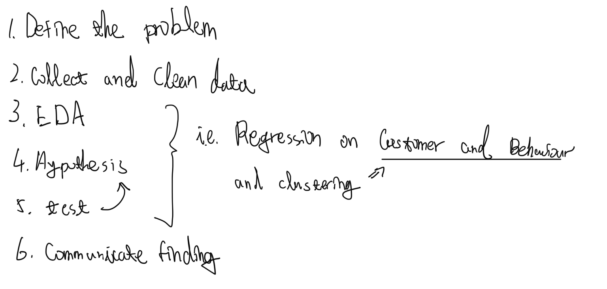
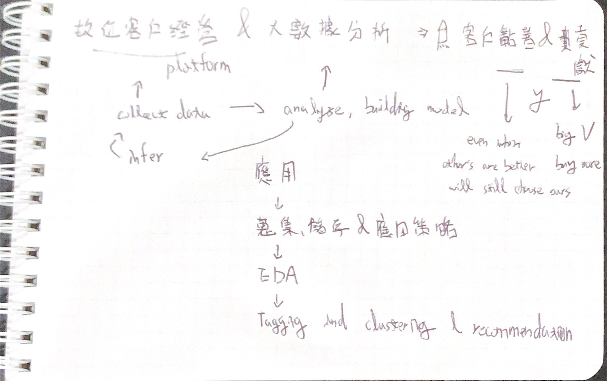

## 組別
### 人壽 - 保險科技
以成為資料科學家為主要發展方向

1. 規劃大數據蒐集、儲存與應用策略。
2. 執行資料分析與探勘，研究客戶與業務員行為。
3. 規劃與執行客戶與業務員Tagging與分群。
4. 研究新技術與新應用、執行集團內外合作計畫。

## 問題
*請針對以下題目，<mark>「擇一題目」</mark>進行簡報製作。專題簡報製作內容為中文或英文投影片，限頁數15頁以內、檔案大小10MB以內。口頭報告時間為10分鐘內，中英文口說均需準備，報告語言現場由主管指定。*
### 數據提升業務通路市場優勢
*如何運用大數據分析，提升壽險公司在業務員通路市場上的競爭優勢*

（1）客戶分群：根據客戶的年齡、性別、職業、健康狀況等特徵，將客戶分為不同的群體，並針對不同的群體制定相應的銷售策略。

（2）行銷活動效果評估：利用大數據分析客戶的行為數據，例如點擊率、轉換率、購買行為等，評估行銷活動的效果，進而調整行銷策略。

（3）風險評估：利用大數據分析客戶的健康狀況、家庭背景、收入情況等信息，評估客戶的風險程度，以便針對不同風險程度的客戶提供相應的保險產品。

（4）客戶需求分析：利用大數據分析客戶的消費習慣、需求等信息，了解客戶的實際需求，進而調整產品設計和銷售策略。

（5）客戶關係管理：利用大數據分析客戶的歷史交易記錄、客戶反饋、投訴等信息，了解客戶的需求和滿意度，進而提高客戶滿意度和忠誠度。

### 數位客戶經營與大數據分析加強客戶黏著與貢獻
*運用數位客戶經營與大數據分析，增進壽險公司客戶黏著度與貢獻度*

（1）個性化服務：利用大數據分析客戶的消費習慣、需求等信息，提供個性化的保險產品和服務，增強客戶體驗，提高客戶滿意度和黏著度。

（2）客戶生命周期管理：利用大數據分析客戶的交易記錄、需求等信息，制定客戶生命周期管理策略，從客戶獲得、維護、發展和擴大等不同階段進行管理，提高客戶貢獻度。

（3）客戶行為分析：利用大數據分析客戶的行為數據

## Think as a Data Scientist

As a data scientist, I would approach these problems using the following steps:

Define the problem: Clearly define the business problem to be solved, identify the data sources required, and establish the relevant metrics.

Collect and clean data: Collect the required data and clean it by removing duplicates, handling missing values, and transforming the data into a format suitable for analysis.

Explore the data: Explore the data by conducting descriptive analysis to understand the data distribution, patterns, and trends. This helps to identify any data anomalies and outliers that need to be addressed.

Develop a hypothesis: Based on the insights gathered from the exploratory data analysis, develop a hypothesis to be tested.

Test the hypothesis: Use statistical and machine learning techniques to test the hypothesis and generate insights. This can involve regression analysis, clustering, or decision tree analysis, among other methods.

Communicate findings: Communicate the findings in a clear and concise manner, using visualizations such as graphs and charts to support the analysis. A report would typically include an executive summary, an introduction, methodology, results, conclusion, and recommendations.

My method of analysis would depend on the specific problem at hand and the data available. I would typically use a combination of statistical and machine learning techniques to analyze the data and generate insights. For example, I might use regression analysis to understand the relationship between variables, or clustering to segment customers based on their behavior. I would then communicate my findings using visualizations, such as graphs or charts, to support the analysis and make recommendations based on the results.

## 簡報
針對第二題 - [數位客戶經營與大數據分析加強客戶黏著與貢獻](#數位客戶經營與大數據分析加強客戶黏著與貢獻)

> 運用數位客戶經營與大數據分析，增進壽險公司客戶黏著度與貢獻度

在這份簡報中，我們將從數位客戶經營和大數據分析的角度來探討如何增進富邦人壽的顧客黏著度和貢獻度。通過分析顧客的行為和偏好，我們可以提供個性化的服務，加強與顧客的溝通和互動，並提高顧客的滿意度和忠誠度。同時，我們還可以進行客戶分析、行為預測、客戶推薦和交叉銷售等方面的工作，以提高顧客貢獻度和增加業務量。

### 大綱
#### 簡介
本章節介紹研究主題，概述簡報內容和目標。
#### 顧客黏著度與貢獻度的意義
本章節解釋顧客黏著度和貢獻度的意義和價值，以及為何它們是保險公司業務成長的關鍵因素。
#### 數位客戶經營與大數據分析的角色
本章節介紹數位客戶經營和大數據分析在提升顧客黏著度和貢獻度中扮演的角色，並強調其重要性。
#### 數位客戶經營與大數據分析的優勢
本章節列舉數位客戶經營和大數據分析的優勢，包括提高市場反應速度、提升客戶體驗和精準行銷等。
#### 數位客戶經營與大數據分析的挑戰
本章節列舉數位客戶經營和大數據分析的挑戰，包括資料品質、隱私和安全、技術複雜性等問題，並探討如何克服這些挑戰。
#### 如何提升顧客黏著度與貢獻度
本章節介紹如何提升顧客黏著度和貢獻度，包括提供個性化服務、加強溝通和互動等方法。
#### 數位客戶經營與大數據分析在提升顧客黏著度與貢獻度的應用
本章節介紹數位客戶經營和大數據分析在提升顧客黏著度和貢獻度方面的應用，包括客戶分析、行為預測、客戶推薦和交叉銷售等。
#### 資料蒐集、儲存與應用策略
本章節介紹如何收集、儲存和應用顧客資料，包括數據來源、數據儲存和數據處理等方面的策略。
#### 資料分析與探勘的工具和技術
本章節介紹資料分析和探勘的工具和技術，包括統計分析、機器學習和自然語言處理等。
#### 客戶與業務員Tagging與分群的實現
本章節介紹客戶和業務員Tagging和分群的實現方法，包括基於行為和偏好的分群、基於社交網絡的分群和基於地理位置的分群等。
#### 數位客戶經營與大數據分析的案例分析
本章節介紹數位客戶經營和大數據分析的案例分析，包括應用場景、方法和結果等。
#### 新技術與新應用的研究
本章節介紹新技術和新應用的研究，包括人工智慧、區塊鏈、物聯網和雲計算等，並探討它們在數位客戶經營和大數據分析中的應用。
#### 集團內外合作計畫的執行
本章節介紹集團內外合作計畫，包括合作夥伴的選擇、合作形式和合作目標等。
#### 富邦人壽保險科技組在數位客戶經營與大數據分析方面的優勢
本章節介紹富邦人壽保險科技組在數位客戶經營和大數據分析方面的優勢，包括數據資源、技術實力和專業團隊等。
#### 結論與文獻
本章節總結全文內容，並提出建議和展望，包括未來數位客戶經營和大數據分析的發展趨勢和未來研究方向等。

### 架構
1.  封面： 呈現報告主題、時間、地點等基本信息。
2.  目錄： 列出本報告的章節和主要內容。
3.  簡介： 介紹報告的主題和背景，以及報告的目的和範圍。
4.  什麼是數位客戶經營和大數據分析： 介紹數位客戶經營和大數據分析的概念、定義和重要性。
5.  數位客戶經營和大數據分析的應用： 介紹數位客戶經營和大數據分析在保險行業中的應用，包括客戶洞察、行為分析、風險評估、保單銷售等方面。
6.  數位客戶經營和大數據分析的挑戰： 介紹數位客戶經營和大數據分析在實際應用中可能面臨的挑戰，包括數據質量、數據安全、人才缺口等方面。
7.  富邦人壽保險科技組的介紹： 介紹富邦人壽保險科技組的背景、組織架構和業務範圍等方面。
8.  富邦人壽保險科技組的目標： 介紹富邦人壽保險科技組的目標和使命，包括為客戶提供更好的保險服務、提高公司的業績和市場競爭力等方面。
9.  數位客戶經營策略： 介紹富邦人壽保險科技組的數位客戶經營策略，包括提供個性化的服務、強化客戶體驗、提高客戶忠誠度等方面。
10.  大數據分析策略： 介紹富邦人壽保險科技組的大數據分析策略，包括數據收集、清理、分析、建模和應用等方面。
11.  客戶分類與推薦系統架構
-   介紹推薦系統的架構
-   針對壽險公司客戶偏好推薦相關保險產品
12.  結論
-   總結本次報告的內容和結論
-   強調數位客戶經營和大數據分析在提高壽險公司客戶黏著度和貢獻度方面的重要性
-   提出未來發展方向和應用場景
13.  參考文獻
-   列出本次報告所引用的文獻和資料來源
14.  附錄
-   包含一些術語和概念的解釋
-   介紹使用的分析工具和技術的詳細說明

### 實作
> 應把內容做清楚，爭取面試機會

#### 客戶黏著度與貢獻度
Let's define Customer Stickiness and Customer Contribution first:

- Customer Stickiness: even when other's products are better will they still stick to ours (P) (platform UI/UX)
- Customer Contribution: buy more in terms of increasing P*Q (recommendation system) (Q)

> 以數位客戶經營提升黏著度，以大數據分析(推薦系統)提升貢獻度
#### 關鍵角色
What data to collect (features) and EDA

可能的特徵:

Train and Test (model)

Deployment Test (platform)

Track the Impact

How to achieve these (departments need to be included)

Expected Result