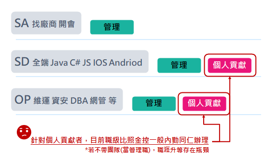
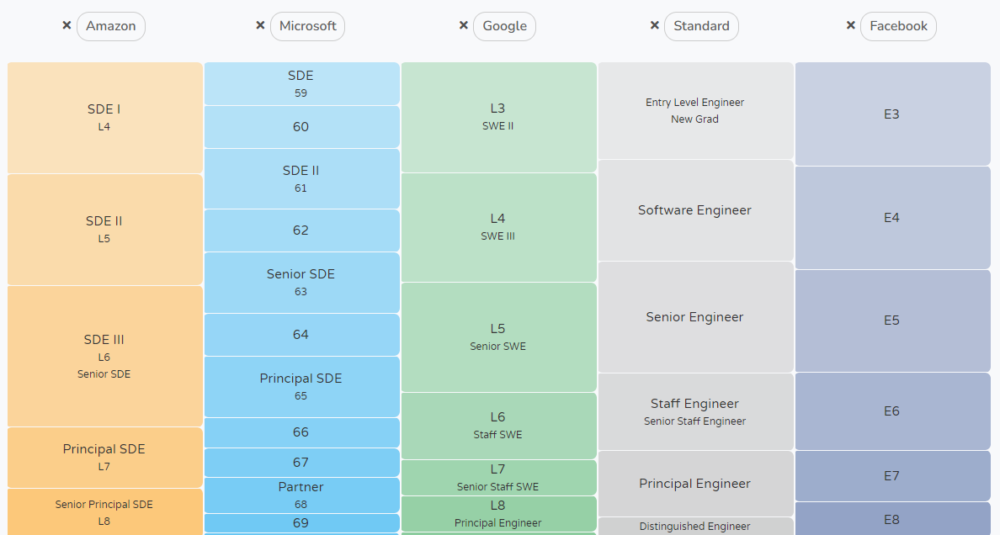
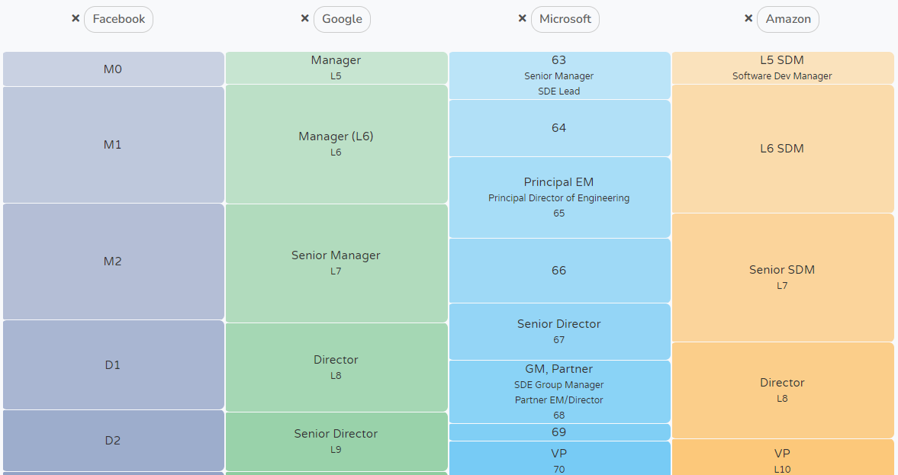
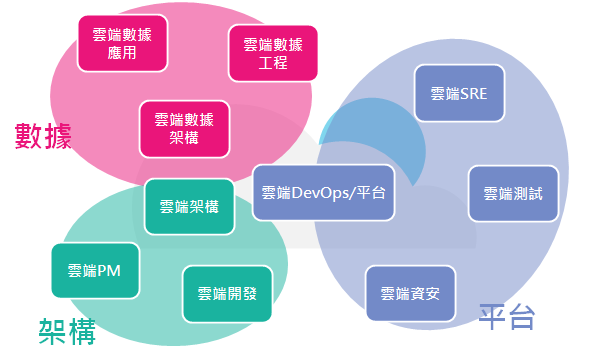
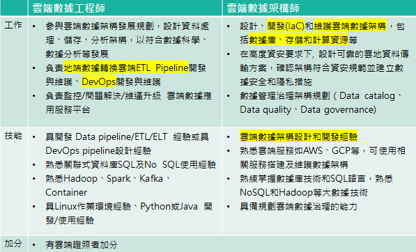
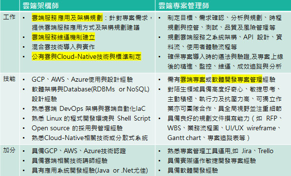
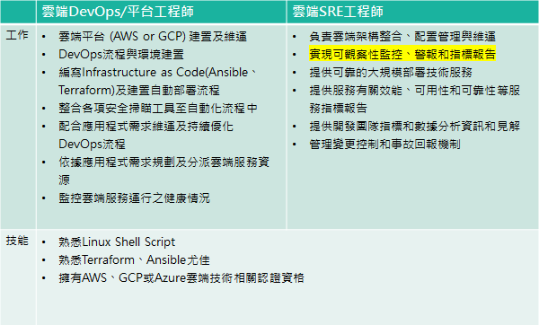

## 台灣金融業IT狀況
近期隨著台灣金融業上雲發展，企業開始出現雲端人才需求，同時另一方面，台灣金融業IT技術人員的職涯發展出現結構問題，應該如何改善?

## 技術人員職涯發展機會
1. 一是為技術人員(但較不具備管理能力者)提供另外一個職涯發展機會,
2. 另 近期隨著雲端顧問案發展, 我們會提出雲端能力中心的腳色與職能需求, 也需要參考同業發展概況.

1. 先分別調查國內外金融與非金融單位的技術職 (i.e.軟體工程師等) 在組織中的職涯發展路徑規劃 (通常在一定實力累積後分為兩條路，管理職與純技術職aka個人貢獻者)，以及其在各階段所應具備的能力。
2. 另外針對雲端顧問/管理師/架構師等職位，研究其所扮演的腳色以及所需技能和同業現況。

## 產業現況 (就IT從業人員而言)
1. 金融限制多、文化相對保守、學不到新技術(甚至許多有老舊狀況)、成長緩慢、養老、薪資不是特別優渥(因為過去IT只是成本單位，金融業不靠軟體實力賺錢)，想衝的會往科技業，想安穩的又可能會在意金融業的管理嚴緊相較不自由，文書作業流程複雜且多。
2. 能力的重要程度體現在薪級上<輩分(年資)。

    **需要別於一般側重經驗(年資)因素做為升遷依據的成長路線**

> 問題就是金融業到底要找優秀的人還是能用的人就好?(金融業到底要找什麼樣的工程師?)
>
> **潛力好企圖心強的工程師/ [能力好穩定度高的工程師]**

## 職類
台灣金融IT分類
- SA 找廠商 開會 -> 管理
- SD 全端 Java C# JS IOS Andriod -> 個人貢獻、管理 
- OP 維運 資安 DBA 網管 等 -> 個人貢獻、管理

針對個人貢獻者，目前職級比照金控一般內勤同仁辦理。

### 國外軟體公司如何規劃
[Amazon vs Microsoft vs Google vs Standard vs Facebook - Compare career levels across companies with Levels.fyi](https://www.levels.fyi/?compare=Amazon,Microsoft,Google,Standard,Facebook&track=Software%20Engineer#)

### 個人貢獻者職涯設計參照
台灣金融業狀況: IT若不升管理職，沒有個人貢獻的路線可以前進，將遇到瓶頸，參照以上公司狀況，可另設IC[^individualcontributor]職涯路徑。

[^individualcontributor]: [What Is An Individual Contributor? Definition & Career Path (honehq.com)](https://honehq.com/glossary/individual-contributor/#:~:text=The%20definition%20of%20an%20individual,are%20accountable%20for%20their%20work.)

## 雲端發展-人才需求

隨金管會鬆綁上雲，台灣金融業也開始可以借助雲端服務提升流程效率。考量台灣金融IT現況...

目前只有國泰有直接相關職缺釋出



<table border="0" cellpadding="0" cellspacing="0" width="3452" style="border-collapse:
 collapse;table-layout:fixed;width:2592pt">
 <colgroup><col class="xl65" width="38" style="mso-width-source:userset;mso-width-alt:1389;
 width:29pt">
 <col class="xl65" width="350" span="2" style="mso-width-source:userset;mso-width-alt:
 12800;width:263pt">
 <col class="xl65" width="405" span="2" style="mso-width-source:userset;mso-width-alt:
 14811;width:304pt">
 <col class="xl65" width="328" style="mso-width-source:userset;mso-width-alt:11995;
 width:246pt">
 <col class="xl65" width="405" style="mso-width-source:userset;mso-width-alt:14811;
 width:304pt">
 <col class="xl65" width="329" style="mso-width-source:userset;mso-width-alt:12032;
 width:247pt">
 <col class="xl65" width="437" style="mso-width-source:userset;mso-width-alt:15981;
 width:328pt">
 <col class="xl65" width="405" style="mso-width-source:userset;mso-width-alt:14811;
 width:304pt">
 </colgroup><tbody><tr height="20" style="height:15.0pt">
  <td height="20" class="xl66" width="38" style="height:15.0pt;width:29pt">　</td>
  <td class="xl66" width="350" style="border-left:none;width:263pt">雲端數據工程師 - 數據科技
  (數數發中心, DDT) - 1年</td>
  <td class="xl66" width="350" style="border-left:none;width:263pt">雲端數據架構師 - 數據科技
  (數數發中心, DDT) - 5年</td>
  <td class="xl66" width="405" style="border-left:none;width:304pt">企業架構(EA)-雲端架構師(數數發中心,
  DDT)&nbsp;</td>
  <td class="xl66" width="405" style="border-left:none;width:304pt">雲端架構師 /
  Cloud-Native技術架構師</td>
  <td class="xl66" width="328" style="border-left:none;width:246pt">雲端DevOps工程師(數數發中心,
  DDT)</td>
  <td class="xl66" width="405" style="border-left:none;width:304pt">雲端平台工程師 (數數發中心,
  DDT)&nbsp;</td>
  <td class="xl66" width="329" style="border-left:none;width:247pt">雲端SRE工程師(數數發中心,
  DDT)&nbsp;</td>
  <td class="xl66" width="437" style="border-left:none;width:328pt">雲端專案經理/專案管理師(數數發中心,
  DDT)</td>
  <td class="xl66" width="405" style="border-left:none;width:304pt">雲端自動化測試工程師</td>
 </tr>
 <tr height="236" style="mso-height-source:userset;height:177.0pt">
  <td height="236" class="xl69" width="38" style="height:177.0pt;border-top:none;
  width:29pt">工作內容</td>
  <td class="xl67" width="350" style="border-top:none;border-left:none;width:263pt">1.
  參與雲端數據架構發展規劃，設計資料處理、儲存、分析架構，以符合數據科學、數據分析等發展			 
    2. 負責地端數據轉換雲端ETL Pipeline開發與維護、DevOps開發與維護 
    3. 負責雲端數據平台穩定及架構精進，以利數據應用發展			 
    4. 負責監控/問題解決/維運升級 雲端數據應用服務平台</td>
  <td class="xl67" width="350" style="border-top:none;border-left:none;width:263pt">1.設計、開發(IaC)和維護雲端數據架構，包括數據庫、存儲和計算資源等。 
    2.與跨部門團隊合作，了解業務需求並提供有效的數據解決方案。 
    3.研究和評估新技術，將其應用於數據架構的開發和維護中。 
    4.在高度資安要求下, 設計可靠的雲地資料傳輸方案，確認架構符合資安規範並建立數據安全和隱私措施。 
    5.數據管理治理架構規劃（Data catalog、Data quality、Data governance)</td>
  <td class="xl67" width="405" style="border-top:none;border-left:none;width:304pt">1.
  雲端服務架構提案：專案需求訪談、提案簡報製作及說明。 
    2. 雲端服務應用及架構規劃：針對專案需求，提供雲端服務應用方式及架構規劃建議。 
    3. 雲端服務維運機制建立。 
    4. 雲端服務研究與功能測試：新技術研究評估。 
    5. 混合雲技術導入與實作。 
    6. 協助及審核金控及子公司雲端架構規劃及雲端資安管控規範，必要時可協助子公司報請主管單位相關程序之協助</td>
  <td class="xl67" width="405" style="border-top:none;border-left:none;width:304pt">1.
  協助集團雲端轉型專案之架構規劃與設計 
    2. 擔任雲端技術顧問之角色 
    3. 公有雲與Cloud-Native技術與標準制定</td>
  <td class="xl67" width="328" style="border-top:none;border-left:none;width:246pt">1.
  負責雲端DevOps平台維運工作。 
    2. DevOps流程建置及設計。 
    3. 編寫Infrastructure as Code(Terraform)及建置自動部署流程。 
    4. 整合各項安全掃瞄工具至自動化流程中。 
    5. 配合應用程式需求維運及持續優化DevOps流程。</td>
  <td class="xl67" width="405" style="border-top:none;border-left:none;width:304pt">1.
  協助雲端平台 (AWS or GCP) 建置及維運工作。 
    2. DevOps流程與環境建置。 
    3. 依據應用程式需求規劃及分派雲端服務資源。 
    4. 監控雲端服務運行之健康情況。 
    5. 開發雲端自動化程式 (如：Ansible、Terraform) 完成日常重複性工作，有效提升執行正確率與整體效率。</td>
  <td class="xl67" width="329" style="border-top:none;border-left:none;width:247pt">1.
  負責雲端架構整合、配置管理與維運。 
    2. 實現可觀察性監控、警報和指標報告。 
    3. 提供可靠的大規模部署技術服務。 
    4. 提供服務有關效能、可用性和可靠性等服務指標報告。 
    5. 提供開發團隊指標和數據分析資訊和見解。 
    6. 管理變更控制和事故回報機制。</td>
  <td class="xl67" width="437" style="border-top:none;border-left:none;width:328pt">-
  雲端專案規劃、推動、執行及管理(包含制定目標、需求確認、分析與規劃、團隊溝通與協調、時程規劃與控管、測試管理、品質管理及風險管理等) 
    - 執行部門內部或跨單位、需求端及開發端之溝通協調及問題排除 
    - 規劃雲端服務之系統架構、API 設計、資料流、使用者體驗流程等 
    - 確保專案導入時的遵法與驗證,及專案上線後的精進、監控、維運 
    - 作為溝通窗口,持續掌握與確認專案內容,確保目標共識並帶領團隊前進 
    - 持續優化雲端專案執行流程並完整執行專案評估、成效追蹤與分析</td>
  <td class="xl67" width="405" style="border-top:none;border-left:none;width:304pt">1.
  利用自動化測試工具撰寫雲端環境專案服務測試腳本(ex. 功能性測試、負載測試、壓力測試、End-to-End測試) 
    2. 協助專案團隊規劃並撰寫測試案例 
    3. 測試平台： Web / API 
    4. 透過自動化測試工具提供測試報告 
    5. 協助專案團隊理解報告結果並持續改善服務品質</td>
 </tr>
 <tr height="178" style="mso-height-source:userset;height:133.5pt">
  <td height="178" class="xl69" width="38" style="height:133.5pt;border-top:none;
  width:29pt">必需條件</td>
  <td class="xl67" width="350" style="border-top:none;border-left:none;width:263pt">1.
  具雲端大數據平台開發資料處理、儲存、分析經驗相關經驗		 
    2. 具開發 Data pipeline/ETL/ELT 經驗或具DevOps pipeline設計經驗 
    3. 熟悉關聯式資料庫SQL及No SQL使用經驗 
    4. 熟悉Hadoop、Spark、Kafka、Container 
    5. 具Linux作業環境經驗、Python或Java 開發/使用經驗</td>
  <td class="xl67" width="350" style="border-top:none;border-left:none;width:263pt">1.至少5年以上的雲端數據架構設計和開發經驗。 
    2.熟悉雲端服務如AWS、GCP等，可使用相關服務搭建及維護數據架構。 
    3.熟練掌握數據庫技術和SQL語言，熟悉NoSQL和Hadoop等大數據技術。 
    4.具備規劃雲端數據治理的能力。 
    5.有良好的解決問題的能力和創造力，能夠快速反應和解決問題。</td>
  <td class="xl67" width="405" style="border-top:none;border-left:none;width:304pt">-五年以上雲端架構規劃及使用開發經驗 
    -具備 AWS/Azure/GCP 其中一項開發及架構規劃經驗,有證照佳 
    -熟悉雲端 DevOps 架構與雲端自動化IaC技術 
    -熟悉 Linux 的程式開發環境與 Shell Script 的使用 
    -具備自我學習研究能力 
    -Open source 的採用與管理經驗 
    -習慣創新與步調快速的環境</td>
  <td class="xl67" width="405" style="border-top:none;border-left:none;width:304pt">1.
  3年以上 GCP、AWS、Azure使用與設計經驗。 
    2. 3年以上軟體架構與Database(RDBMs or NoSQL)設計經驗。 
    3. 熟悉Cloud-Native相關技術或分散式系統。 
    4. 熱愛分享與協助同事解決問題，並針對各項問題與尋求進階解決方案。 
    5. 對學習新技術或雲端服務具有熱情與好奇心。</td>
  <td class="xl67" width="328" style="border-top:none;border-left:none;width:246pt">1.
  熟悉Linux Shell Script 
    2. 熟悉Terraform尤佳 
    3. 擁有AWS、GCP或Azure雲端技術相關認證資格</td>
  <td class="xl67" width="405" style="border-top:none;border-left:none;width:304pt">1.
  熟悉Linux Shell Script 
    2. 熟悉Terraform、Ansible尤佳 
    3. 擁有AWS、GCP或Azure雲端技術相關認證資格</td>
  <td class="xl67" width="329" style="border-top:none;border-left:none;width:247pt">1.
  熟悉Linux Shell Script 
    2. 熟悉Terraform尤佳 
    3. 擁有AWS、GCP或Azure雲端技術相關認證資格</td>
  <td class="xl67" width="437" style="border-top:none;border-left:none;width:328pt">－
  需有雲端專案或軟體開發專案管理經驗至少 2 年以上 
    － 具備良好的溝通協調、邏輯思考與問題分析解決能力 
    － 對陌生領域具備高度好奇心、敏捷思考、主動積極、執行力及抗壓力高、可獨立作業亦可團隊合作、具全局視野並注重細節 
    － 具備良好的規劃文件撰寫能力（如 RFP、WBS、業務流程圖、UI/UX wireframe、Gantt chart、專案追蹤表等） 
    － 具備良好的報告撰寫及簡報能力</td>
  <td class="xl67" width="405" style="border-top:none;border-left:none;width:304pt">1.
  具1年以上測試經驗，有網站前/後端實際測試資歷 
    2. 具備團隊合作能力及敏捷式開發基本知識(Agile/Scrum)</td>
 </tr>
 <tr height="94" style="mso-height-source:userset;height:70.5pt">
  <td height="94" class="xl69" width="38" style="height:70.5pt;border-top:none;
  width:29pt">加分條件</td>
  <td class="xl68" style="border-top:none;border-left:none">1. 有雲端證照者加分</td>
  <td class="xl68" style="border-top:none;border-left:none">1. 有雲端證照者加分</td>
  <td class="xl68" style="border-top:none;border-left:none">　</td>
  <td class="xl67" width="405" style="border-top:none;border-left:none;width:304pt">1.
  具備GCP、AWS、Azure技術認證 
    2. 具備雲端相關技術講師經驗 
    3. 具有應用系統開發經驗(Java or .Net尤佳)</td>
  <td class="xl68" style="border-top:none;border-left:none">　</td>
  <td class="xl68" style="border-top:none;border-left:none">　</td>
  <td class="xl68" style="border-top:none;border-left:none">　</td>
  <td class="xl67" width="437" style="border-top:none;border-left:none;width:328pt">-
  熟悉專案管理工具運用,如 Jira、Trello 者尤佳 
    - 具備實際運作敏捷開發專案經驗者尤佳 
    - 具備軟體開發經驗尤佳</td>
  <td class="xl67" width="405" style="border-top:none;border-left:none;width:304pt">1.
  有使用雲端平台經驗尤佳(ex. GCP、AWS、Azure) 
    2. 有自動化測試經驗尤佳(ex. Jmeter、Postman、Newman、K6、selenium、xk6 browser) 
    3. 對於自動化測試有熱忱，願意學習了解雲端服務者佳</td>
 </tr>
 <!--[if supportMisalignedColumns]-->
 <tr height="0" style="display:none">
  <td width="38" style="width:29pt"></td>
  <td width="350" style="width:263pt"></td>
  <td width="350" style="width:263pt"></td>
  <td width="405" style="width:304pt"></td>
  <td width="405" style="width:304pt"></td>
  <td width="328" style="width:246pt"></td>
  <td width="405" style="width:304pt"></td>
  <td width="329" style="width:247pt"></td>
  <td width="437" style="width:328pt"></td>
  <td width="405" style="width:304pt"></td>
 </tr>
 <!--[endif]-->
</tbody></table>



### 關鍵任務與職能

