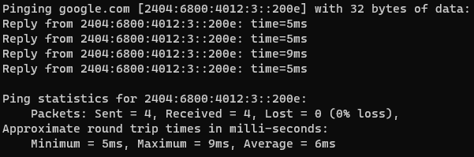

## 從點擊到看到網頁
從搜尋引擎點擊網頁後，發生什麼事?

###### 1. 瀏覽器向DNS伺服器發出請求，DNS返回目標網頁的IP位址 _(以Domain URL交換)_
Windows可透過開啟`cmd`後輸入例如`ping google.com`來取得其`IPv6`

並在瀏覽器輸入`https://[IPV6]/`來開啟網頁
###### 2. 瀏覽器向目標伺服器發出HTTP請求獲得網頁
###### 3. 目標伺服器返回HTTP回應，其中包含網頁的HTML, CSS, JavaScript等資源
###### 4. 瀏覽器根據HTML指令渲染網頁，其中包含的資源，將再次以相同方法回到[1.](#1-瀏覽器向dns伺服器發出請求dns返回目標網頁的ip位址-_以domain-url交換_)依序請求 (內部或外部資源)
###### 5. 渲染完成後使用者始可使用目標網頁完整功能

## 什麼是DNS
DNS (Domain Name System) 是一個分布式資料庫系統，用於將網域名稱對應到網路協定(IP)位址。(Domain Name <-> IP)