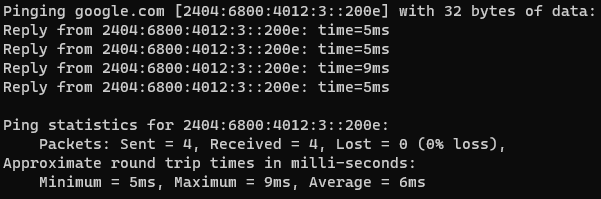

## 從點擊到看到網頁
從搜尋引擎點擊網頁後，發生什麼事?

###### 1. 瀏覽器向[DNS伺服](#什麼是dns)器發出請求，DNS返回目標網頁的IP位址 _(以Domain URL交換)_
Windows可透過開啟`cmd`後輸入例如`ping google.com`來取得其`IPv6`

並在瀏覽器輸入`https://[IPV6]/`來開啟網頁
###### 2. 瀏覽器向目標伺服器發出HTTP請求獲得網頁
###### 3. 目標伺服器返回HTTP回應，其中包含網頁的HTML, CSS, JavaScript等資源
###### 4. 瀏覽器根據HTML指令渲染網頁，其中包含的資源，將再次以相同方法回到[1.](#1-瀏覽器向dns伺服器發出請求dns返回目標網頁的ip位址-_以domain-url交換_)依序請求 (內部或外部資源)
###### 5. 渲染完成後使用者始可使用目標網頁完整功能

## 什麼是DNS
DNS (Domain Name System) 是一個分布式資料庫系統，用於將網域名稱對應到網路協定(IP)位址。(Domain Name <-> IP)
### 什麼是分布式資料庫系統
**分布式資料庫系統是由多個本地機台組成的共享資料中心。** 它在網絡中共享資料，並且允許資料存儲在多台計算機上，以提高可用性和容錯性。在分布式資料庫系統中，每台計算機上都有一個本地資料庫，並且在整個網絡中共享整個資料庫。這樣的設計可以減少資料庫系統的单一故障點，提高系統的容錯性。

**也因此各個機台上可能有相當比例的資料與其他機台重複(多重副本Replication)。** 這取決於分布式資料庫系統的具體設計和配置。有些系統會在所有計算機上保存完整的複製資料，而其他系統則會在每個計算機上保存一份資料的子集。部分系統甚至允許不同計算機上的資料副本不完全相同。這些選擇可以根據需求（如資料安全、體積大小、性能等）和可用的資源（如網絡帶寬、磁盤空間等）進行調整。

### 為什麼我們需要DNS
當我們試圖透過Domain URL取得某網站時，需要DNS進行解析，而Domain比起IP更容易記憶。

除此之外，**DNS還允許網站管理員更改其網站的IP地址**，而不需要更改每個用戶端的瀏覽器配置。當IP地址更改時，DNS伺服器會更新其內部資料庫，以保持與其他網站的通信。因此，DNS是一種高效和彈性的解決方案，幫助網絡系統在運作中更加穩定和容易管理。

## 靜態網站 vs. 動態網站
在每次請求網頁的後端網頁生成方式下，我們又將其區分成兩大種類:
- **靜態網站**：伺服器直接回傳**預先儲存在硬碟上**的 HTML、CSS 和 JavaScript 檔案。當網頁被請求時，伺服器每次回傳的內容都是相同的。
- **動態網站**：伺服器不是直接回傳預先儲存的檔案，而是**根據請求動態生成** HTML 頁面。例如，當使用者請求一個網頁時，**伺服器會讀取資料庫中的資料**，根據此資料生成 HTML 頁面，再回傳給瀏覽器。

> 靜態網站的網頁內容是固定的，而動態網站的網頁內容是根據請求而動態生成的。

### 兩者在前後端速度上的差異
- 前端：靜態網站的前端速度通常較快，因為伺服器直接回傳的頁面已經是最終的 HTML 檔案，無需再進行任何額外的處理。
- 後端：動態網站的後端速度通常較慢，因為每次請求時都需要從資料庫中讀取資料、生成 HTML 頁面，再回傳給瀏覽器。

> 其實也不一定，例如靜態網頁採用serverless的部屬方式，透過API取得資料等其實就像動態網頁