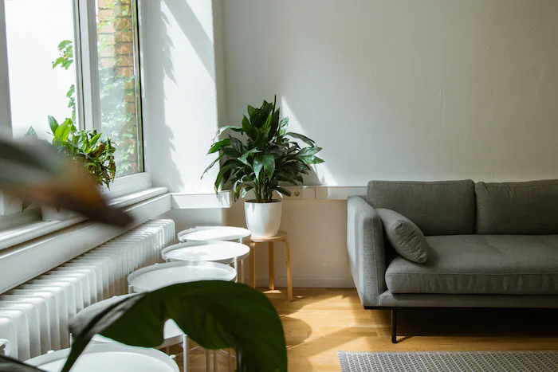

## 背景
- **求租人背景(範例)**

  情侶，找一房兩廳一衛一陽台，好停車最好是電梯大樓，離工作不太遠(一小時內，少走路)，坪數要夠大，放東西跟跳繩，要有地方放書桌

  垃圾集中代收
## 價格
10,000-~~25,000~~27,000(new)

## 原則
**a.工作附近市中心**或者**b.便宜郊區**，切勿本末倒置租了不在公司附近的蛋黃區，既沒省到也不方便

## check list
*(實際去看房時務必再檢查一遍)*

### Fundamental
1. 離公司近 (搭車一小時內，少走路) (用距離換空間與生活品質)
    - 捷運時間20分鐘 (捷運接受轉乘一次)
    - 公車40分鐘內 (不接受轉乘)
    - 騎車開車15分鐘內

    以上皆為尖峰時間車程 (不包含走路時間)
2. *非凶宅*
3. 非頂加

### Primary
1. 坪數要夠大 (放雙人書桌、空間夠跳繩，要記得考慮玄關鞋櫃問題)
2. 洗手間與房間要在同一層 (no 樓中樓)
3. 安全問題
    - 社區大樓管理解決包裹與風險(女性夜歸與火災逃生)問題
    - **a.若是公寓則須為活動鐵窗**或**b.低樓層無鐵窗好逃生(無法放貴重物品)**
4. 正一房 (實牆隔間，有門阻絕燈光)
5. 流理臺
6. 集中垃圾(代收)
7. 門口或大樓停車場
8. 採光
9. (可租補)
10. 台水台電
---
### Secondary
1. 大雙門冰箱
2. (電磁/陶)爐、抽油煙
3. 鄰居、前住戶狀況 (空屋多久?)
4. 洗衣機、陽台曬衣

## Notes
熱水器、瓦斯、飲水機、發票抵稅(合租問題), etc.