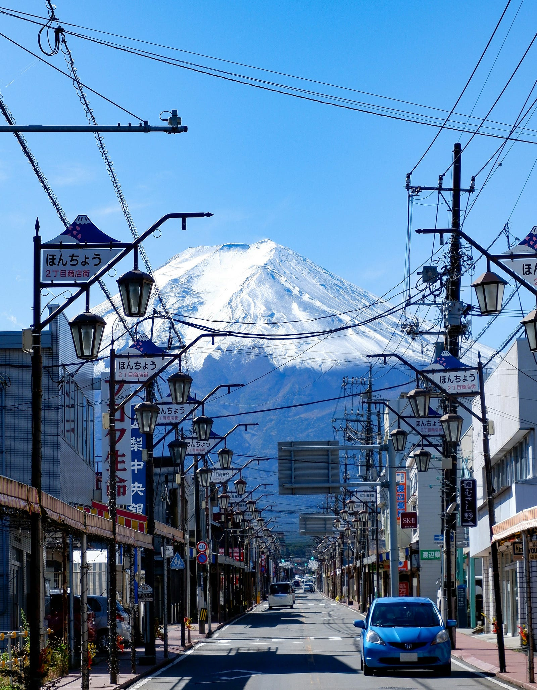

## Todos
- [x] 來回機票
- [ ] 飯店

  12/31-1/...
- [ ] 租車
- [ ] 迪士尼門票
- [ ] 雪票
- [ ] sim card

---

## 12月31日（抵達東京，購物準備，入住富士山附近）

- **11:00**：抵達成田機場。
- **11:30**：辦理租車手續。
- **12:00**：出發前往御殿場Outlet（車程約2小時）。
- **14:00**：到達御殿場Outlet，購物及午餐。
- **16:30**：前往 Second Street 購買滑雪裝備（御殿場Outlet周邊有Second Street店）。
- **18:00**：結束購物，入住富士山附近酒店。
- **19:00**：晚餐。

---

## 1月1日（滑雪日1 - 上午富士山，下午滑雪）

- **07:00**：早餐後退房，出發前往富士山五合目或河口湖（車程約2小時）。
- **09:30**：到達富士山，參觀及遊覽。
- **12:00**：午餐，稍作休息。
- **13:00**：離開富士山，前往 Fujiten Snow Resort 或 Snowtown Yeti（車程約30-40分鐘）。
- **14:00**：下午滑雪。
- **17:00**：滑雪結束，入住富士山附近的住宿。
- **19:00**：晚餐。

---

## 1月2日（滑雪日2 - 苗場或湯澤附近滑雪場）

- **08:00**：早餐後退房，出發前往苗場滑雪場或湯澤附近滑雪場（車程約1.5小時）。
- **09:30**：到達苗場或湯澤，辦理入住，準備滑雪。
- **11:00**：開始滑雪。
- **13:00**：滑雪場內午餐。
- **14:00**：繼續滑雪。
- **17:00**：滑雪結束，回到酒店休息，享受溫泉等設施。
- **19:00**：晚餐。

---

## 1月3日（滑雪日3 - 苗場滑雪場）

- **08:00**：早餐後，準備滑雪。
- **09:00**：全天在苗場滑雪場或周邊的 かぐら滑雪場滑雪。
- **12:00**：午餐。
- **13:00**：繼續滑雪。
- **17:00**：滑雪結束，回到酒店休息。
- **19:00**：晚餐。

---

## 1月4日（滑雪日4 - 苗場滑雪場）

- **08:00**：早餐後，準備滑雪。
- **09:00**：全天在苗場滑雪場或其他附近的滑雪場滑雪。
- **12:00**：午餐。
- **13:00**：繼續滑雪。
- **17:00**：滑雪結束，回到酒店休息。
- **19:00**：晚餐。

---

## 1月5日（滑雪日5 - 苗場滑雪場或石打丸山滑雪場）

- **08:00**：早餐後出發，繼續在苗場滑雪，或自駕前往石打丸山滑雪場（車程約30分鐘）。
- **09:00**：全天滑雪。
- **12:00**：午餐。
- **13:00**：繼續滑雪。
- **17:00**：滑雪結束，回到苗場住宿。
- **19:00**：晚餐。

---

## 1月6日（東京迪士尼 - Day 1）

- **07:30**：早餐後出發前往東京迪士尼（車程約1小時）。
- **08:30**：抵達迪士尼，開始遊玩（選擇迪士尼樂園或迪士尼海洋）。
- **12:00**：園內午餐。
- **13:00**：繼續遊玩迪士尼。
- **18:00**：結束遊玩，返回酒店或在迪士尼附近入住。

---

## 1月7日（東京迪士尼 - Day 2）

- **08:00**：早餐後，繼續遊玩迪士尼樂園或迪士尼海洋。
- **12:00**：午餐。
- **13:00**：繼續遊玩。
- **18:00**：返回酒店，準備隔天返程。

---

## 1月8日（返程）

- **10:00**：早餐後，休息或自由活動。
- **14:00**：退房並前往成田機場（車程約1.5小時）。
- **15:30**：還車，辦理登機手續。
- **20:00**：搭乘航班離開東京。