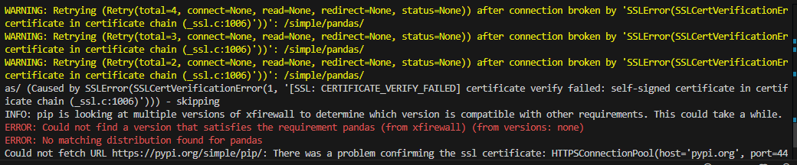

這個錯誤訊息`ERROR: Could not find a version that satisfies the requirement from pip install`可能有多種原因。以下是一些常見的原因和解決方法：
1. 安裝需求檔案時未添加 -r 選項：當你從 requirements.txt 檔案安裝套件時，需要指定 -r 或 --requirement 選項，否則 Python 會認為你在嘗試安裝名為 requirements.txt 的套件。
2. 拼寫錯誤：你可能拼錯了套件名稱，導致找不到相應的版本。請確保你輸入的套件名稱與 PyPI 上的名稱完全一致。
3. 不支援的作業系統：某些套件可能不支援你的作業系統。例如，TensorFlow 不支援 Apple Silicon 芯片1。
4. 過時的 pip 版本：你的 pip 版本可能過舊，無法找到相應的套件版本。請嘗試升級 pip2/pip3。
5. 不支援的 Python 版本：某些套件可能不支援你使用的 Python 版本。請確認你的 Python 版本是否在套件的支援範圍內。

而其中的`SSLError(SSLCertVerificationError) certificate in certificate chain (_ssl.c:1006)`通常是由於 SSL 證書驗證失敗所引起的。以下是一些可能的解決方法：
1. 更新證書：確保你的系統上安裝了最新的根證書。你可以使用 pip install --upgrade certifi 來更新證書。
2. 檢查證書鏈：確保伺服器正在發送完整的證書鏈，包括中間證書。你可以使用 openssl 工具來檢查證書鏈。
3. 禁用 SSL 驗證：在開發或測試環境中，你可以暫時禁用 SSL 驗證來繞過這個問題，但這不建議在生產環境中使用。你可以在 pip 命令中添加 --trusted-host 參數，例如：pip install pandas --trusted-host pypi.org --trusted-host files.pythonhosted.org。
4. 配置 CA 證書：你可以手動指定 CA 證書來進行驗證。這樣可以避免禁用 SSL 驗證帶來的安全風險。

觀察錯訊息:
```ps1
(.venv) PS C:\Users\<user>\<path to your repo>> pip install ./<local pkg name>.whl
Processing C:\Users\<user>\<path to your repo>\<local pkg name>.whl
WARNING: Retrying (Retry(total=4, connect=None, read=None, redirect=None, status=None)) after connection broken by 'SSLError(SSLCertVerificationEr
certificate in certificate chain (_ssl.c:1006)'))': /simple/pandas/
WARNING: Retrying (Retry(total=3, connect=None, read=None, redirect=None, status=None)) after connection broken by 'SSLError(SSLCertVerificationEr
certificate in certificate chain (_ssl.c:1006)'))': /simple/pandas/
WARNING: Retrying (Retry(total=2, connect=None, read=None, redirect=None, status=None)) after connection broken by 'SSLError(SSLCertVerificationEr
certificate in certificate chain (_ssl.c:1006)'))': /simple/pandas/
as/ (Caused by SSLError(SSLCertVerificationError(1, '[SSL: CERTIFICATE_VERIFY_FAILED] certificate verify failed: self-signed certificate in certificate chain (_ssl.c:1006)'))) - skipping
INFO: pip is looking at multiple versions of xfirewall to determine which version is compatible with other requirements. This could take a while.
ERROR: Could not find a version that satisfies the requirement pandas (from xfirewall) (from versions: none)
ERROR: No matching distribution found for pandas
Could not fetch URL https://pypi.org/simple/pip/: There was a problem confirming the ssl certificate: HTTPSConnectionPool(host='pypi.org', port=443): Max retries exceeded with url: /simple/pip/ (Caused by SSLError(SSLCertVerificationError(1, '[SSL: CERTIFICATE_VERIFY_FAILED] certificate verify failed: self-signed certificate in certificate chain (_ssl.c:1006)'))) - skipping
```
下面提供三種快速解法。

## 手動下載，本地安裝
`pip install ./<path to your downloaded pkg>`

## 加入信任
添加受信任的主機：如果你在公司網路或防火牆後面，可以嘗試添加受信任的主機來繞過 SSL 驗證。使用以下命令：
`pip install --trusted-host pypi.org --trusted-host files.pythonhosted.org <package to install>`

以前面的失敗案例，安裝`pandas`失敗來說就會是:
```ps1
pip install --trusted-host pypi.org --trusted-host files.pythonhosted.org pandas
```
成功畫面:


Ref: [pip always fails ssl verification](https://stackoverflow.com/questions/49324802/pip-always-fails-ssl-verification)

## 清華大學開源站
如果上面方法還是不行 ( 例: 無法連上的原因並非SSL而是被防火牆或其他方法封鎖住了 ) ，可以使用對岸的[清华大学开源软件镜像站](https://mirrors.tuna.tsinghua.edu.cn/help/pypi/)。

`pip install -i https://mirrors.tuna.tsinghua.edu.cn/pypi/web/simple some-package`

範例: 
- ( 一樣使用前面接續案例 )
    ```ps1
    WARNING: Retrying (Retry(total=4, connect=None, read=None, redirect=None, status=None)) after connection broken by 'SSLError(SSLCertVerificationError(1, '[SSL: CERTIFICATE_VERIFY_FAILED] certificate verify failed: self-signed 
    certificate in certificate chain (_ssl.c:1006)'))': /simple/transformers/
    WARNING: Retrying (Retry(total=3, connect=None, read=None, redirect=None, status=None)) after connection broken by 'SSLError(SSLCertVerificationError(1, '[SSL: CERTIFICATE_VERIFY_FAILED] certificate verify failed: self-signed 
    certificate in certificate chain (_ssl.c:1006)'))': /simple/transformers/
    WARNING: Retrying (Retry(total=2, connect=None, read=None, redirect=None, status=None)) after connection broken by 'SSLError(SSLCertVerificationError(1, '[SSL: CERTIFICATE_VERIFY_FAILED] certificate verify failed: self-signed 
    certificate in certificate chain (_ssl.c:1006)'))': /simple/transformers/
    WARNING: Retrying (Retry(total=1, connect=None, read=None, redirect=None, status=None)) after connection broken by 'SSLError(SSLCertVerificationError(1, '[SSL: CERTIFICATE_VERIFY_FAILED] certificate verify failed: self-signed 
    certificate in certificate chain (_ssl.c:1006)'))': /simple/transformers/
    WARNING: Retrying (Retry(total=0, connect=None, read=None, redirect=None, status=None)) after connection broken by 'SSLError(SSLCertVerificationError(1, '[SSL: CERTIFICATE_VERIFY_FAILED] certificate verify failed: self-signed 
    certificate in certificate chain (_ssl.c:1006)'))': /simple/transformers/
    Could not fetch URL https://pypi.org/simple/transformers/: There was a problem confirming the ssl certificate: HTTPSConnectionPool(host='pypi.org', port=443): Max retries exceeded with url: /simple/transformers/ (Caused by SSLError(SSLCertVerificationError(1, '[SSL: CERTIFICATE_VERIFY_FAILED] certificate verify failed: self-signed certificate in certificate chain (_ssl.c:1006)'))) - skipping
    INFO: pip is looking at multiple versions of xfirewall to determine which version is compatible with other requirements. This could take a while.
    ERROR: Could not find a version that satisfies the requirement transformers (from xfirewall) (from versions: none)
    ERROR: No matching distribution found for transformers
    ```
- 使用清華源解法:
    1. 查看 pypi pkg 是否存在 -> https://mirrors.tuna.tsinghua.edu.cn/pypi/web/simple/
    2. `pip install -i https://mirrors.tuna.tsinghua.edu.cn/pypi/web/simple transformers`
        
        ( `-i`說明: 在 `pip install` 命令中，`-i` 選項用於指定自定義的包索引（repository）。這個選項允許你從指定的索引位置安裝 Python 包，而不是從默認的 Python Package Index (PyPI) 安裝。)

        如果看到錯誤訊息記得前面第二個解法，加上 `--trusted-host`，如下:

        ## TL;DR
        `pip install -i https://mirrors.tuna.tsinghua.edu.cn/pypi/web/simple transformers --trusted-host mirrors.tuna.tsinghua.edu.cn`

        + 成功畫面
            