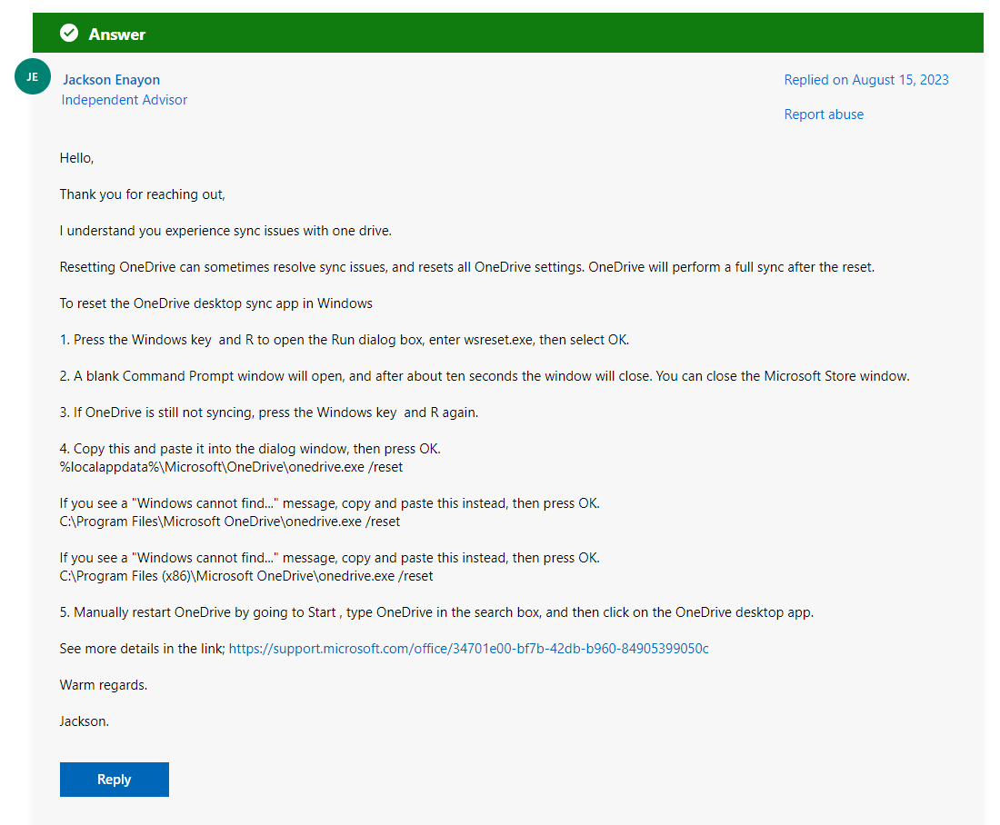
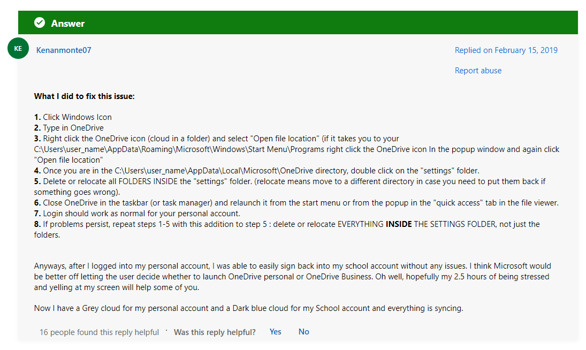
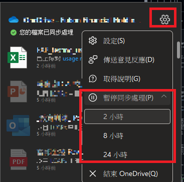

## Solution 1
[How Do I Force-Sync in the new OneDrive app? - Microsoft Community](https://answers.microsoft.com/en-us/msoffice/forum/all/how-do-i-force-sync-in-the-new-onedrive-app/00efb4e3-e3a7-46d9-b72c-ba9f1fe75b68?page=2)

Question: *I have just gotten the new OneDrive app and I want to be able to force OneDrive to sync but I can't find that option. Could anyone tell me where I can go to force-sync OneDrive? Thank you.*

### Reset

Copy this and paste it into the dialog window, then press **OK**.
`%localappdata%\Microsoft\OneDrive\onedrive.exe /reset`

## Solution 2 (Worked)
- [OneDrive login stuck on "Loading..." - Microsoft Community](https://answers.microsoft.com/en-us/msoffice/forum/all/onedrive-login-stuck-on-loading/34c27277-955f-40dc-921d-f66abc3c0617)
- [OneDrive: No longer works with PERSONAL account after signing into - Microsoft Community](https://answers.microsoft.com/en-us/msoffice/forum/all/onedrive-no-longer-works-with-personal-account/ca33cc02-bfb8-4f56-ba42-2b1c2bae32a3)
  
  Delete or relocate all FOLDERS INSIDE the ***"settings" folder*** (`C:\Users\user_name\AppData\Local\Microsoft\OneDrive`). (relocate means move to a different directory in case you need to put them back if something goes wrong).

## Solution 3 (Best)
The above is needlessly complex. Easier to just **pause** syncing then **start** it again. This will force a sync.
