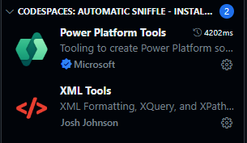
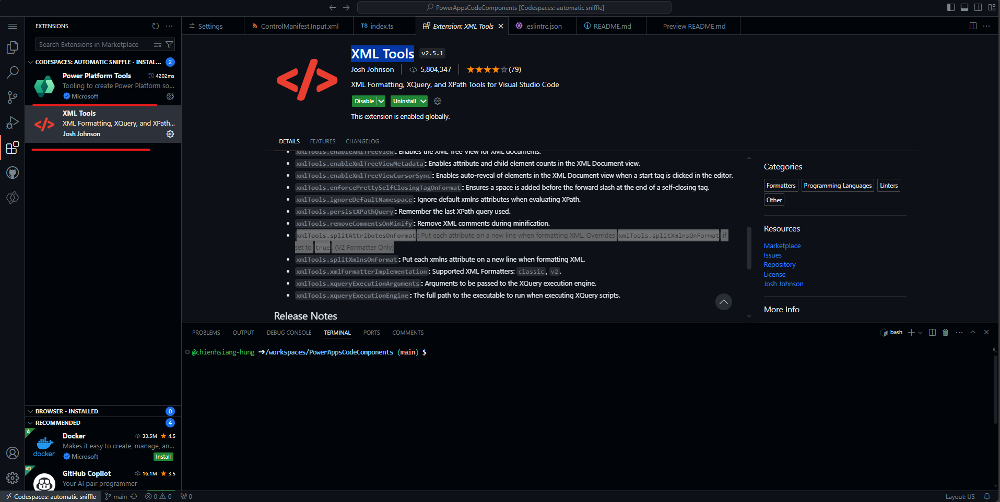

## Create your first component
[Create your first component using Power Apps Component Framework in Microsoft Dataverse - Power Apps | Microsoft Learn](https://learn.microsoft.com/en-us/power-apps/developer/component-framework/implementing-controls-using-typescript?tabs=after#adding-style-to-the-code-component)

## Prerequisites
### Env Side
For this tutorial you need install the following components:
1.  [Visual Studio Code (VSCode)](https://code.visualstudio.com/Download)  (Ensure the Add to PATH option is select)
2.  [node.js](https://nodejs.org/en/download/)  (LTS version is recommended)
3.  [Microsoft Power Platform CLI](https://learn.microsoft.com/en-us/powerapps/developer/data-platform/powerapps-cli#install-power-apps-cli)  (Use either Power Platform Tools for Visual Studio Code or Power Platform CLI for Windows)
4.  .NET Build tools by installing one of the following: (At minimum select the workload  `.NET build tools`.)
    -   Visual Studio 2022
        -   [Visual Studio 2022 for Windows & Mac](https://visualstudio.microsoft.com/downloads/).
        -   [Build Tools for Visual Studio 2022](https://visualstudio.microsoft.com/downloads/#build-tools-for-visual-studio-2022).
    -   Visual Studio 2019
        -   [Visual Studio 2019 downloads](https://visualstudio.microsoft.com/vs/older-downloads/#visual-studio-2019-and-other-products).
### Power Apps Side
#### [Enable the Power Apps component framework feature](https://learn.microsoft.com/en-us/power-apps/developer/component-framework/component-framework-for-canvas-apps#enable-the-power-apps-component-framework-feature)
To add code components to an app, you need to enable the Power Apps component framework feature in each environment where you want to use them. By default, the Power Apps component feature is enabled for model-driven apps. To enable an environment to use code components inside its apps:

1.  Sign in to  [Power Apps](https://powerapps.microsoft.com/).
    
2.  Select  **Settings**  , and then select  **Admin Center**.
    
    
    
3.  On the left pane, select  **Environments**, select the environment where you want to enable this feature, and then select  **Settings**.
    
4.  Expand  **Product**, and select  **Features**.
    
5.  From the list of available features, turn on  **Power Apps component framework for canvas apps**, and then select  **Save**.
    
    
## Extensions for better exp

- Power Platform Tools
- XML Tools
  -   **`xmlTools.splitAttributesOnFormat`:**  Put each attribute on a new line when formatting XML. Overrides  `xmlTools.splitXmlnsOnFormat`  if set to  `true`. (V2 Formatter Only)

  