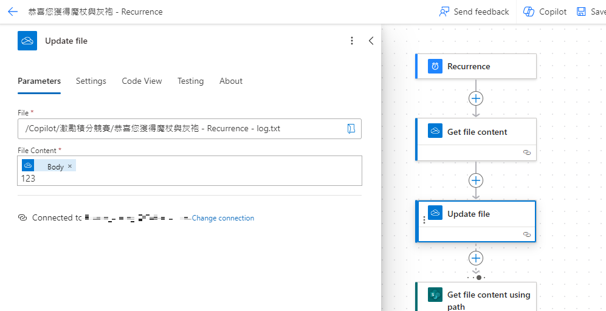
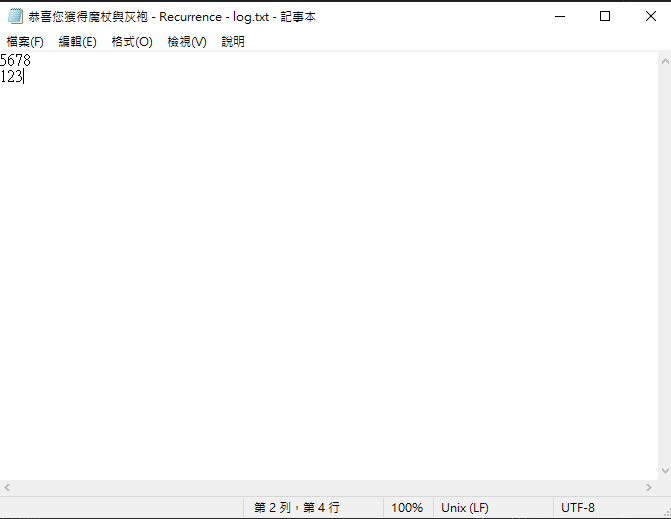
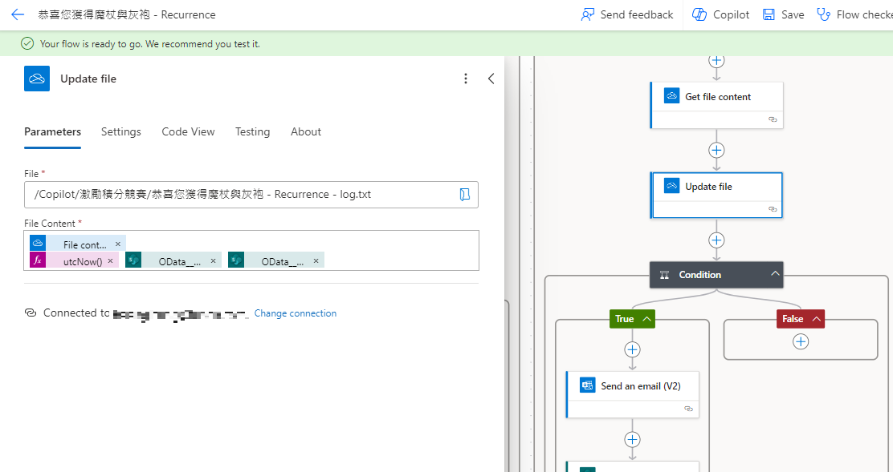

## Introduction
In the world of automation, tacing and logging are essential for diagnosing and understanding the behavior of automated workflows. Power Automate provides robust capabilities for creating flow, but sometimes you noeed to manually trace these flows for better insights. In this blog post, we'll briefly explore how to manually create a log.txt file in Power Automate to trace logs in a flow.

## Actions We Need
1. We need to first create a sample txt file in the folder.
2. and use `Get file content`
3. then follow the `Update file` to update the logs

