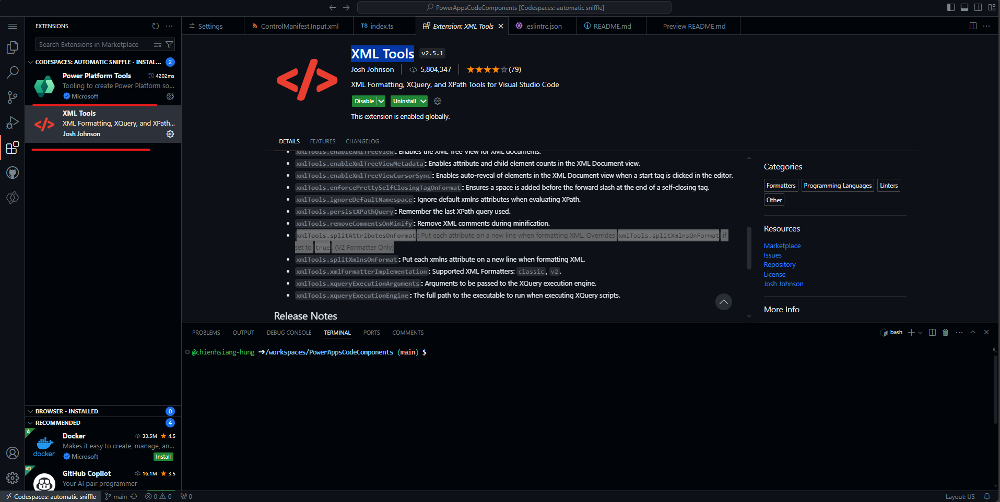
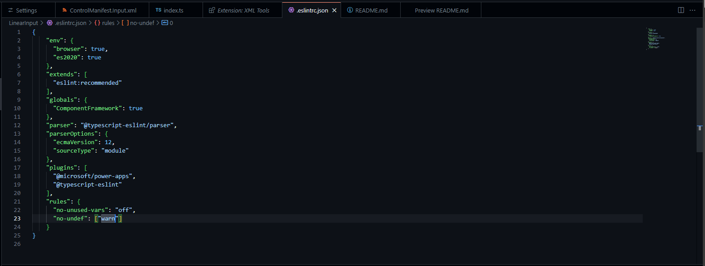
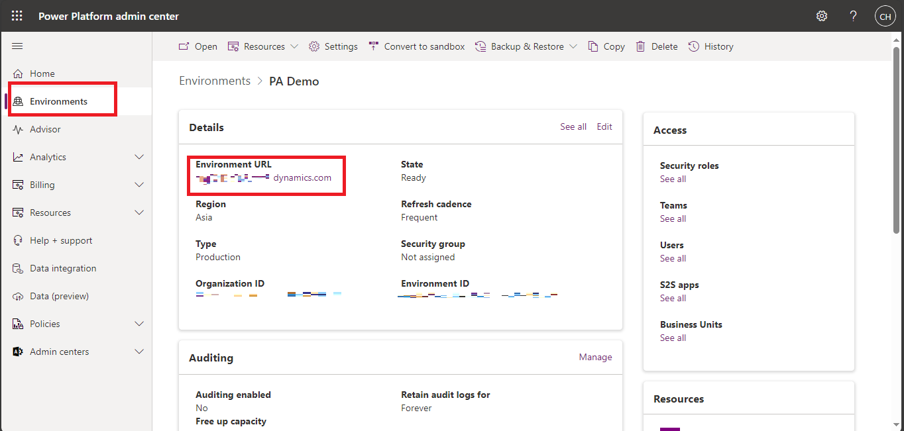

## Create your first component
[Create your first component using Power Apps Component Framework in Microsoft Dataverse - Power Apps | Microsoft Learn](https://learn.microsoft.com/en-us/power-apps/developer/component-framework/implementing-controls-using-typescript?tabs=after#adding-style-to-the-code-component)

## Prerequisites
### Env Side
For this tutorial you need install the following components:
1.  [Visual Studio Code (VSCode)](https://code.visualstudio.com/Download)  (Ensure the Add to PATH option is select)
2.  [node.js](https://nodejs.org/en/download/)  (LTS version is recommended)
3.  [Microsoft Power Platform CLI](https://learn.microsoft.com/en-us/powerapps/developer/data-platform/powerapps-cli#install-power-apps-cli)  (Use either Power Platform Tools for Visual Studio Code or Power Platform CLI for Windows)
4.  .NET Build tools by installing one of the following: (At minimum select the workload  `.NET build tools`.)
    -   Visual Studio 2022
        -   [Visual Studio 2022 for Windows & Mac](https://visualstudio.microsoft.com/downloads/).
        -   [Build Tools for Visual Studio 2022](https://visualstudio.microsoft.com/downloads/#build-tools-for-visual-studio-2022).
    -   Visual Studio 2019
        -   [Visual Studio 2019 downloads](https://visualstudio.microsoft.com/vs/older-downloads/#visual-studio-2019-and-other-products).
### Power Apps Side
#### [Enable the Power Apps component framework feature](https://learn.microsoft.com/en-us/power-apps/developer/component-framework/component-framework-for-canvas-apps#enable-the-power-apps-component-framework-feature)
To add code components to an app, you need to enable the Power Apps component framework feature in each environment where you want to use them. By default, the Power Apps component feature is enabled for model-driven apps. To enable an environment to use code components inside its apps:

1.  Sign in to  [Power Apps](https://powerapps.microsoft.com/).
    
2.  Select  **Settings**  , and then select  **Admin Center**.
    
    
    
3.  On the left pane, select  **Environments**, select the environment where you want to enable this feature, and then select  **Settings**.
    
4.  Expand  **Product**, and select  **Features**.
    
5.  From the list of available features, turn on  **Power Apps component framework for canvas apps**, and then select  **Save**.
    
    
## Extensions for better exp

- Power Platform Tools
- XML Tools
  -   **`xmlTools.splitAttributesOnFormat`:**  Put each attribute on a new line when formatting XML. Overrides  `xmlTools.splitXmlnsOnFormat`  if set to  `true`. (V2 Formatter Only)

## Build your code components
`npm run build` shown `error  'EventListenerOrEventListenerObject' is not defined  no-undef`
### Two Solutions
1. [PowerAppsCodeComponents/LinearInput at main · chienhsiang-hung/PowerAppsCodeComponents (github.com)](https://github.com/chienhsiang-hung/PowerAppsCodeComponents/tree/main/LinearInput) *(this would result in error loading in debug mode)*
2. [Create your first component using Power Apps Component Framework in Microsoft Dataverse - Power Apps | Microsoft Learn](https://learn.microsoft.com/en-us/power-apps/developer/component-framework/implementing-controls-using-typescript?tabs=after#build-your-code-components) **(Better!)**
    
    open `.eslintrc.json` and edit the rules to add a `["warn"]` value for the rule `no-undef`:
    ```json
    "rules": {
      "no-unused-vars": "off",
      "no-undef": ["warn"]
    }
    ```
    

## Packaging your code components
### Notes
1. Create a new folder named Solutions **inside the LinearInputControl** folder and navigate into the folder.

    ```bash
    mkdir Solutions
    cd Solutions
    ```
2. `pac solution init --publisher-name Samples --publisher-prefix samples`

    The  [publisher-name](https://learn.microsoft.com/en-us/power-platform/developer/cli/reference/solution#--publisher-name--pn)  and  [publisher-prefix](https://learn.microsoft.com/en-us/power-platform/developer/cli/reference/solution#--publisher-prefix--pp)  values must be the same as either an existing solution publisher, or a new one that you want to create in your target environment.

    You can retrieve a list of current values using this query on your target environment:

    `[Environment URI]/api/data/v9.2/publishers?`

    `$select=uniquename,customizationprefix`

    - For `Environment URI`, you can find it here:

      [Environments | Power Platform admin center (microsoft.com)](https://admin.powerplatform.microsoft.com/environments/)

      Click on the Env you would like to choose an check the top left corner of the Details.

      
3. In GitHub Codespace you need to change `pac solution add-reference --path ..\..\` to `pac solution add-reference --path ../../` for GitHub Codespace `bash`.

## Open Issue
- [LinearInputControl rendered differently on watch and canvas app · Issue #585 · microsoft/PowerApps-Samples (github.com)](https://github.com/microsoft/PowerApps-Samples/issues/585)

When I run `npm start watch` it rendered successfully as shown.


But when I imported it into my canvas app it seemed to miss the dragable bar and some properties.


seems the watch env is different with the dev env @@