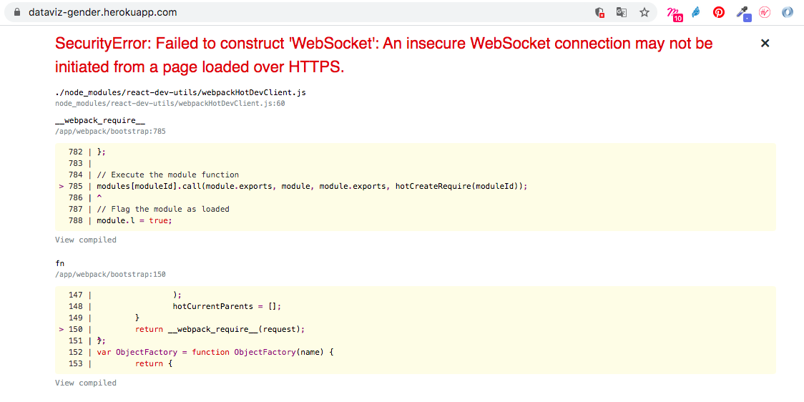

## Explanation
```bash
SecurityError: Failed to construct 'WebSocket': An insecure WebSocket connection may not be initiated from a page loaded over HTTPS.
```
Encountering a security error related to WebSocket connections. This error typically occurs when a WebSocket connection is attempted over an insecure protocol (HTTP) from a page that is loaded over a secure protocol (HTTPS).

> This happened when developing React App using cloud machine and forward the `localhost` like Github Codespace or Heroku.



## How to fix it
> [@Pratap Sharma](https://stackoverflow.com/users/10398005/pratap-sharma): add this line `protocol: window.location.protocol === 'https:' ? 'wss' : 'ws'`[^react-dev-utils]

[^react-dev-utils]: [React app error: Failed to construct 'WebSocket': An insecure WebSocket connection may not be initiated from a page loaded over HTTPS](https://stackoverflow.com/questions/59359280/react-app-error-failed-to-construct-websocket-an-insecure-websocket-connecti)

In NextJS you need to go to `@next-devtools/core` in `packages/core/src/provider/frame.tsx` and adjust the line 15. You can use the below code.
```js
// frame.tsx
// line 14, 15

const _protocol = window.location.protocol === 'https:' ? 'wss' : 'ws';
const wsClient = createWSClient({ url: `${_protocol}://${ip || _ip}:${RPC_SERVER_PORT}` });
```
I've also contributed the solution (source code) to the repo for `@next-devtools`. You can check out [here](https://github.com/chienhsiang-hung/next-devtools).