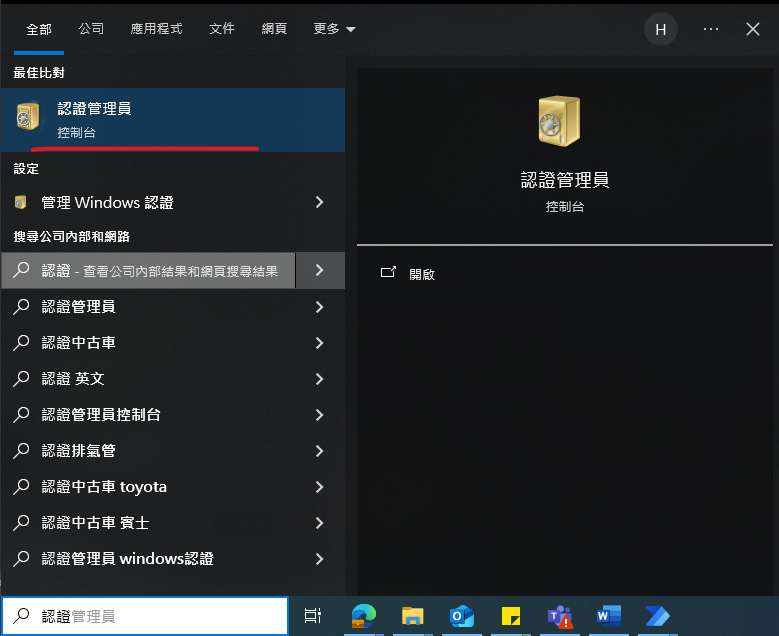
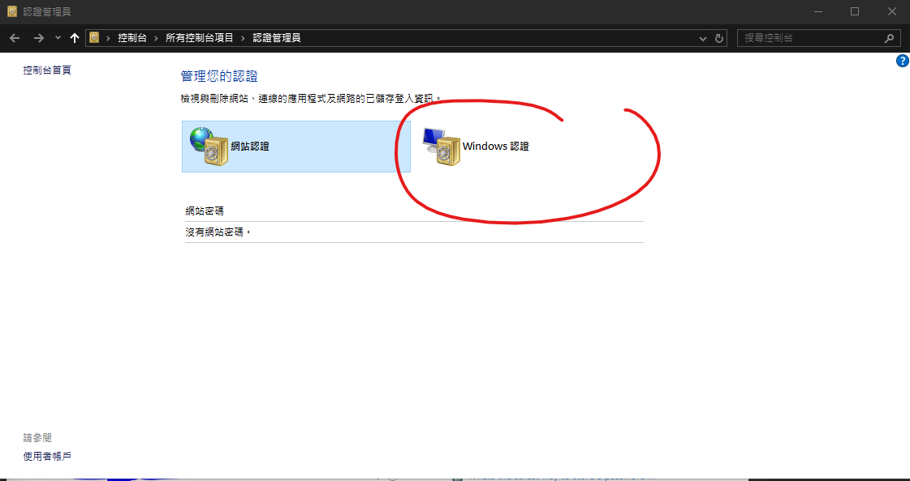
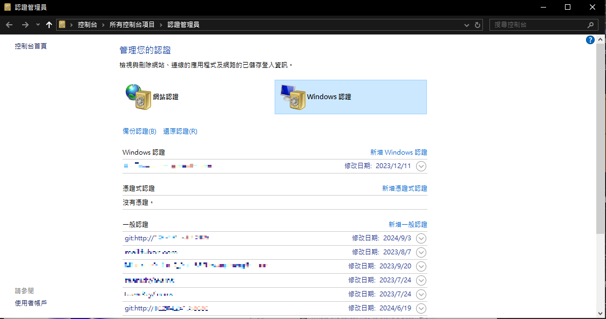
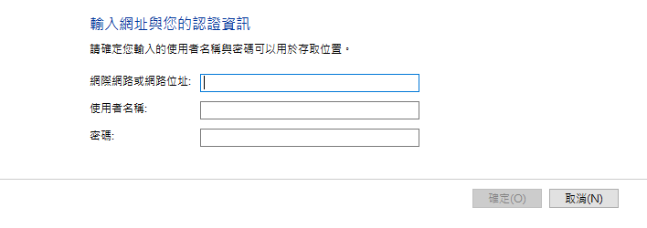

## Solution 1
[git - Github - TLS certificate verification has been disabled! on Windows - Stack Overflow](https://stackoverflow.com/questions/66552941/github-tls-certificate-verification-has-been-disabled-on-windows) from [user16382594](https://stackoverflow.com/users/16382594/user16382594)

This helped me:

1 Re-enable

<pre><code>git config --global http.sslVerify true
</code></pre>

to get rid of the "TLS certificate verification has been disabled."

2 Create a personal access token on GitHub: <a href="https://docs.github.com/en/github/authenticating-to-github/keeping-your-account-and-data-secure/creating-a-personal-access-token" rel="noreferrer">https://docs.github.com/en/github/authenticating-to-github/keeping-your-account-and-data-secure/creating-a-personal-access-token</a>

3 When prompted to enter credentials, used my email as user and the personal access token as password

4 To delete a wrong credential follow <a href="https://stackoverflow.com/questions/58263306/where-is-github-authentication-token-stored-on-windows">Where is github authentication token stored on Windows?</a>

    

## Solution 2
Work like a charm!

- IP/Address: `git:http://<YourIP>`
- User Name: `Your user name`
- PWD: `Your Password`

### RCs
[windows - git clone: Authentication failed for <URL> - Stack Overflow](https://stackoverflow.com/questions/51424051/git-clone-authentication-failed-for-url) from [RBT](https://stackoverflow.com/users/465053/rbt).

I faced same error on my development machine. I was trying to clone a repository. My machine had a newly installed Windows Server operating system. I was using Git bash as my Git client. When I ran Git's command to clone a repository it was <em>not</em> prompting me for user id and password which will be used for authentication. It was a new PC so no credentials were cached by Windows credential manager.

As a last resort, I manually added my credentials in credentials manager following below steps:

<ol>
<li>Press <kbd>Window</kbd> + <kbd>R</kbd> to open <strong>Run</strong> prompt.</li>
<li>Type <strong>Control</strong> and press <kbd>OK</kbd></li>
<li>Click <kbd>User Accounts</kbd> on <strong>Control Panel</strong> window.</li>
<li>Click <kbd>Credential Manager</kbd> on <strong>User Accounts</strong> window.</li>
<li>Click <kbd>Windows Credentials</kbd> on <strong>Credential Manager</strong> window.</li>
</ol>

Now, click <kbd>Add a Windows credential</kbd> in <strong>Windows Credentials</strong> section (refer yellow highlighting in screenshot below):

Now, enter the details as shown in the form below and click <kbd>OK</kbd>:

I had put the details as below:

<pre><code>Internet or network address: &lt;gitRepoServerNameOrIPAddress&gt;
User Name: &lt;DomainName\MyUserName&gt;
Password: &lt;MyPassword&gt;
</code></pre>

Next time when you run any Git command targeting a repository set up on above address, this manually cached credential will be used.

<strong>Note</strong>:

<ol>
<li>Close and relaunch any open Git bash, Powershell or command shell for the credential caching to take effect.</li>
<li>From now on, whenever your domain account password changes then you'll have to update it on this screen as well. In corporate environment this happens regularly due to password rotation policy.</li>
</ol>

<strong>Update(12-Jun-2022)</strong>: If adding a Windows credentials doesn't work for you then you can try <kbd>Add a generic credential</kbd> instead (refer screenshot below). Please note that while adding a generic credentials, Internet or network address of your TFS server is of the format:

<pre><code>git:https://YourTfsServerAddress
</code></pre>

    

