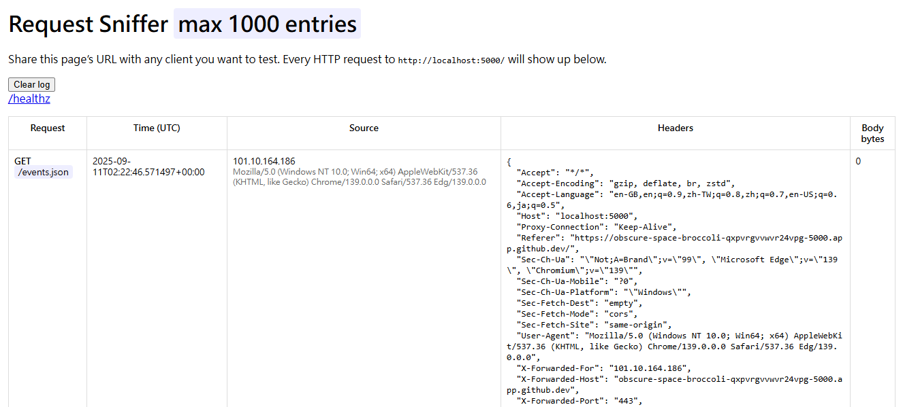

Have you ever wondered whether a tool or service actually makes an HTTP request when you give it a URL? Maybe you’re testing a webhook, debugging an integration, or—like me—curious if an AI assistant fetches links you share. Here’s a simple solution: a **Flask-based request sniffer** you can run in **GitHub Codespaces**, complete with a live dashboard.

---

## ✅ Why This Project?

- **Verify URL fetches**: Paste your public URL into any client (Copilot, webhook sender, etc.) and see if it hits your endpoint.
- **Inspect details**: Capture method, path, query, headers, IP, and body preview.
- **Zero setup**: Runs entirely in Codespaces—no local environment headaches.

---

## 🔍 What It Does

- Logs every HTTP request (GET, POST, PUT, PATCH, DELETE, OPTIONS).
- Displays:
  - **Timestamp (UTC)**
  - **Client IP** (with `X-Forwarded-For` support)
  - **User-Agent**
  - **Headers**
  - **Body size** and **preview** (pretty-printed JSON if applicable)
- Live-updating dashboard at `/`.
- JSON feed at `/events.json`.
- Catch-all route for arbitrary paths (so POSTs to `/hook` or `/test` succeed).
- Utility endpoints: `/healthz` and `/clear`.

---

## 🚀 Quickstart in GitHub Codespaces

1. **Create a new repo** and add:
   - `requirements.txt`:
     ```txt
     flask==3.0.3
     ```
   - `app.py` (see full code in the repo).

2. **Open in Codespaces**:
   - On GitHub: **Code → Create codespace on main**.

3. **Install & run**:
   ```bash
   python3 -m venv .venv
   source .venv/bin/activate
   pip install -r requirements.txt
   python app.py
   ```

4. **Expose the app**:
   - In the **PORTS** panel, set port `5000` to **Public**.
   - Copy the public URL (e.g., `https://5000-<id>.app.github.dev/`).

---

## 🧪 Test It

Open the dashboard at `/`—you’ll see your own GET request logged.  
Try some POSTs:

```bash
# JSON POST
curl -X POST "$PUBLIC_URL/hook" \
  -H "Content-Type: application/json" \
  -d '{"hello":"world"}'

# Form POST
curl -X POST "$PUBLIC_URL/form-test" \
  -H "Content-Type: application/x-www-form-urlencoded" \
  -d "a=1&b=two"
```

Watch them appear in real time.

---

## 🔒 Security Notes

- Public means **anyone with the URL can send requests**.
- Logs are in-memory only; restart clears them.
- Don’t share sensitive data.

---

## 🕵️ Use Case: Does Copilot Fetch URLs?

Paste your Codespaces URL into the assistant you’re testing. If it fetches, you’ll see:
- **User-Agent** (often reveals the service)
- **IP** (usually a proxy or cloud region)
- **Timestamp**

If nothing shows up, that client likely doesn’t make external requests.

---

## 🌟 Why Codespaces?

- No local setup.
- Public URL in seconds.
- Perfect for quick experiments and demos.

---

### 👉 View the Repo on GitHub
https://github.com/chienhsiang-hung/copilot-request-detector
